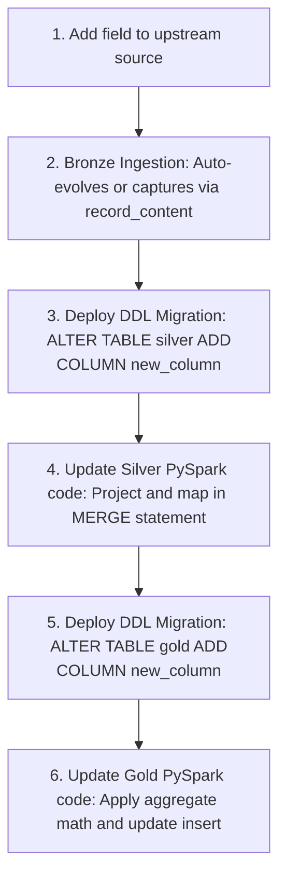

# Agent Guidelines: Schema Evolution in Medallion Architecture

When modifying, extending, or refactoring data structures in the Medallion Architecture (Bronze, Silver, and Gold), the AI agent **MUST** strictly adhere to the following schema evolution principles and migration guidelines to prevent pipeline crashes and data corruption.

---

## 1. Bronze Layer Guidelines (Ingestion: Zero-Data-Loss)
*   **Rule:** The Bronze layer **MUST NEVER** fail due to upstream schema drift (added, removed, or changed fields).
*   **Directives:**
    *   **Schema Rescue:** **ALWAYS** implement a schema-rescue mechanism when parsing raw JSON/CSV streams (e.g., using Autoloader's `rescuedDataColumn` option, or capturing the entire raw JSON payload as a `record_content` string).
    *   **Auto-Evolution:** **MUST** enable schema merging for writing to Delta Lake by setting `.option("mergeSchema", "true")` or letting the writing engine append new columns automatically.
    *   **Strict Constraints:** **NEVER** apply business data quality checks or drop records at the Bronze level. All structural changes must pass through to allow investigation.

---

## 2. Silver Layer Guidelines (Cleanse & Conformance: Schema Locking)
*   **Rule:** The Silver layer **MUST** enforce schema conformance and protect downstream consumers from unexpected column alterations or data type changes.
*   **Directives:**
    *   **Explicit Mapping:** **MUST** explicitly project and cast all columns inside the PySpark `transform_silver` logic. Do **NOT** use `SELECT *` from Bronze.
    *   **Incompatible Type Drift:** If an upstream column type changes incompatibly (e.g., `String` to `Double` or renaming a column):
        *   **MUST NOT** let the pipeline auto-evolve the target table.
        *   **MUST** cast or clean the column back to the defined Silver schema within the PySpark transformer, or route invalid rows to the DLQ table.
    *   **Adding Columns:** When adding a new column to Silver:
        1.  The agent **MUST** run an `ALTER TABLE <table_name> ADD COLUMN <col_name> <type>` statement.
        2.  **MUST** update the PySpark select schema projection and the `MERGE INTO` statement.

---

## 3. Gold Layer Guidelines (Aggregates: Strict Semantic Contracts)
*   **Rule:** The Gold layer represents public-facing models. Schema changes in Gold **MUST** be treated as breaking changes.
*   **Directives:**
    *   **No Auto-Evolution:** **NEVER** enable `mergeSchema` or auto-schema evolution on Gold tables.
    *   **DDL Ownership:** Gold schemas **MUST** be locked down using DDL scripts or Terraform.
    *   **Compatibility Gating:** If a semantic model needs to drop or rename columns, the agent **MUST** verify downstream BI dashboard dependencies or create a versioned table (e.g., `gold.sales_daily_summary_v2`) to prevent breaking reports.

---

## 4. Summary: Schema Change Workflow

When tasked with adding a new field (`new_column`) to the pipeline:



### DDL Migration Commands Example:
```sql
-- Always run explicit schema modifications prior to deploying PySpark updates
ALTER TABLE catalog.silver.sales_orders ADD COLUMN discount_code STRING;
ALTER TABLE catalog.gold.sales_daily_summary ADD COLUMN total_discounts_applied BIGINT;
```

---

## 5. Schema Change Monitoring & Alerting
*   **Rule:** The agent **MUST** deploy proactive monitoring and alerting to capture schema drift and metadata anomalies.
*   **Directives:**
    *   **Alert on Rescued Ingestion Data:** Configure hourly checks to count records containing unmapped elements rescued at ingestion.
        ```sql
        -- Alert when count > 0 (Action: Data Engineer updates downstream schemas)
        SELECT COUNT(*) AS anomalous_count 
        FROM catalog.bronze.sales_orders 
        WHERE _rescued_data IS NOT NULL 
          AND _ingested_at >= CURRENT_TIMESTAMP - INTERVAL 1 HOUR;
        ```
    *   **Audit DDL Modifications:** Monitor the Delta transaction log (`DESCRIBE HISTORY`) to audit schema operations performed in the last 24 hours.
        ```sql
        -- Audit log check for manual/auto DDL changes
        SELECT version, timestamp, userName, operation 
        FROM (DESCRIBE HISTORY catalog.silver.sales_orders)
        WHERE operation IN ('ADD COLUMNS', 'CHANGE COLUMN', 'RENAME COLUMN')
          AND timestamp >= CURRENT_TIMESTAMP - INTERVAL 24 HOURS;
        ```
    *   **Alert on DLQ Reject Rates:** Check the percentage of records routed to the Dead Letter Queue (DLQ) in the last hour. Trigger a critical incident if the rate exceeds 1%.
        ```sql
        -- Alert when percentage > 1.0% (Action: Investigate schema type mismatch)
        SELECT 
          (SUM(CASE WHEN _dq_failure_reason IS NOT NULL THEN 1 ELSE 0 END) * 100.0) / COUNT(*) AS dlq_percentage
        FROM catalog.silver.sales_orders_dlq
        WHERE _ingested_at >= CURRENT_TIMESTAMP - INTERVAL 1 HOUR;
        ```

