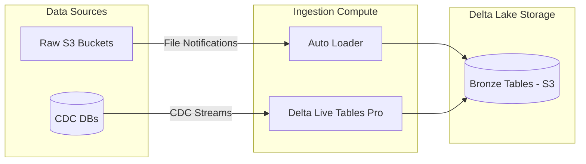
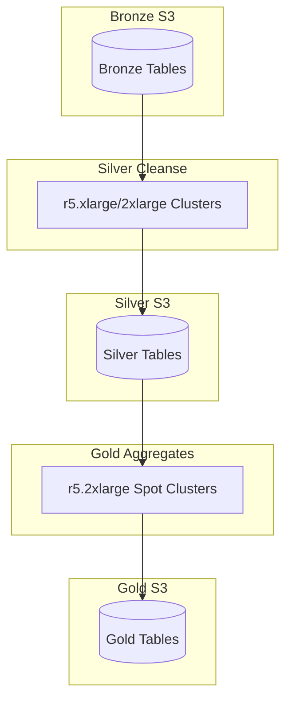

# AWS Data Warehouse Architecture with Databricks: Quantitative Sizing & FinOps Blueprint

## 1. Executive Summary

This document establishes the quantitative resource sizing and cloud economics framework for building an enterprise Data Warehouse on AWS using the **Databricks Data Intelligence Platform**. 

Decoupling compute from storage is a core architectural tenet of the Lakehouse, but doing so without rigid sizing constraints often leads to either **resource starvation** (slow queries, spills to disk, OOMs) or **financial waste** (overprovisioned VM nodes, idle cluster runtimes). 

To enforce financial discipline and operational predictability, this document provides:
1. A **mathematical sizing model** for three standardized data tiers (Small, Medium, and Large).
2. **Instance-level cluster profiles** across Ingestion (Bronze), Transformation (Silver/Gold), and Serving (Databricks SQL Serverless).
3. **Storage performance metrics** (IOPS, throughput, API request limits, and compaction coefficients).
4. **End-to-end Cost Estimation Formulas** aligning Databricks Units (DBUs) with AWS Infrastructure costs.

---

## 2. Standardized Ingestion Tiers

To eliminate arbitrary sizing guesses, we classify all enterprise workloads into three distinct profiles based on daily volume, record throughput, and user concurrency:

| Metric | Small Tier (Low-Volume Batch) | Medium Tier (Enterprise Scale) | Large Tier (High-Volume Streaming) |
| :--- | :--- | :--- | :--- |
| **Daily Ingestion Volume** | 100 GB/day | 1.0 TB/day | 10.0 TB/day |
| **Average Throughput** | ~1.15 MB/sec | ~11.57 MB/sec | ~115.74 MB/sec |
| **Record Rate** (assumes ~1 KB/event) | ~1,150 events/sec | ~11,570 events/sec | ~115,740 events/sec |
| **CDC Source Databases** | 1 Database | 3–5 Databases | 10+ Databases |
| **File Sources (S3/Auto Loader)**| 5 Paths | 20 Paths | 100+ Paths |
| **Active Concurrent Analysts** | 5 Users | 25 Users | 100+ Users |

---

## 3. Quantitative Sizing Formulas

We calculate our compute footprint using two primary metrics: **Databricks Units (DBU)** and **AWS EC2 Instance Hours**.

### 3.1 DBU Consumption & Cost Formula

$$\text{Daily DBUs} = \sum_{c=1}^{C} \left( N_c \times R_{node} \times H_c \right)$$
$$\text{Daily DBU Cost} = \text{Daily DBUs} \times F_{SKU}$$

Where:
*   $C$: Number of clusters active in the workload.
*   $N_c$: Total number of nodes in cluster $c$ (Workers + 1 Driver).
*   $R_{node}$: DBU rate per hour for the instance family (e.g., $1.0\text{ DBU/hr}$ for `m5.xlarge`, $2.0\text{ DBU/hr}$ for `m5.2xlarge`).
*   $H_c$: Total running hours per day for cluster $c$.
*   $F_{SKU}$: DBU price multiplier based on the Databricks workload SKU. We standardize on **Enterprise Tier** pricing:
    *   **Jobs Light SKU**: $0.15 / DBU
    *   **Jobs (Photon Enabled) SKU**: $0.20 / DBU
    *   **Delta Live Tables (DLT) Pro SKU** (CDC, continuous): $0.36 / DBU
    *   **Delta Live Tables (DLT) Advanced SKU** (Photon + CDC): $0.54 / DBU
    *   **Serverless SQL SKU**: $0.70 / DBU
    *   **All-Purpose Compute SKU** (Interactive): $0.55 / DBU

### 3.2 AWS EC2 Compute & Storage Cost Formula

$$\text{Daily EC2 Cost} = \sum_{c=1}^{C} \left( (N_{worker} \times P_{spot}) + (1 \times P_{ondemand}) \right) \times H_c$$
$$\text{Daily EBS Cost} = \sum_{c=1}^{C} \left( N_{total} \times V_{size} \times P_{ebs} \times \frac{H_c}{24} \right) / 30$$

Where:
*   $N_{worker}$: Number of worker nodes in cluster $c$.
*   $N_{total}$: Total nodes in cluster (Workers + 1 Driver).
*   $P_{spot}$: Hourly AWS Spot Instance price for the selected instance type.
*   $P_{ondemand}$: Hourly AWS On-Demand Instance price for the Driver node.
*   $H_c$: Running hours per day.
*   $V_{size}$: EBS volume size per node (default: 100 GB `gp3`).
*   $P_{ebs}$: Monthly price per GB for EBS (e.g., $0.08/GB-month).
*   $H_c / 24$: Proration factor. EBS volumes on Job Clusters exist only during runtime, not 24/7.

---

## 4. Ingestion (Bronze Layer) Sizing

The Bronze layer ingests raw payloads. Sizing is governed by **I/O performance** rather than CPU cycles.

### 4.1 Compute Node Allocations

1.  **Small Tier (100 GB/day)**:
    *   **Pattern**: Scheduled Micro-batching using `Trigger.AvailableNow`. Runs once per hour.
    *   **Cluster**: Single-node or small cluster. We configure 1 Driver + 1 Worker: `m5.xlarge` (4 vCPU, 16 GB RAM).
    *   **Daily Runtime**: 10 minutes per run × 24 runs/day = 4 hours/day.
    *   **DBU Allocation**: 2 nodes × 1.0 DBU/hr × 4 hours = **8.0 DBUs/day**.
2.  **Medium Tier (1 TB/day)**:
    *   **Pattern**: Continuous streaming ingestion via Delta Live Tables (DLT) Pro.
    *   **Cluster**: Auto-scaling cluster. Min workers: 1, Max workers: 3. Average active: 2 workers + 1 Driver: `m5.2xlarge` (8 vCPU, 32 GB RAM).
    *   **Daily Runtime**: 24 hours/day (always-on).
    *   **DBU Allocation**: 3 nodes × 2.0 DBU/hr × 24 hours = **144.0 DBUs/day**.
3.  **Large Tier (10 TB/day)**:
    *   **Pattern**: Continuous streaming ingestion via DLT Advanced with Photon engine enabled.
    *   **Cluster**: Auto-scaling cluster. Min workers: 4, Max workers: 12. Average active: 8 workers + 1 Driver: `c5.2xlarge` (8 vCPU, 16 GB RAM - optimized for high-throughput network compression).
    *   **Daily Runtime**: 24 hours/day (always-on).
    *   **DBU Allocation**: 9 nodes × 2.0 DBU/hr × 24 hours = **432.0 DBUs/day**.

### 4.2 Storage & I/O Sizing (S3 Performance)

Delta Lake tables sitting on AWS S3 must deal with S3 request limits: **3,500 PUT/COPY/POST/DELETE** and **5,500 GET/HEAD** requests per second per prefix.

*   **Write Amplification Factor (WAF)**: Ingestion of small, frequent files causes request overhead. We model a $WAF = 1.35$ (for every raw write, Delta creates transaction log JSONs and checkpoint files).
*   **Target File Size**: Bronze tables must target **256 MB to 512 MB** file sizes. Liquid Clustering (`delta.clusterBy`) must be configured on primary join/filter keys (e.g., `event_date`, `tenant_id`) to avoid directory scanning.
*   **Compaction Frequency**: Auto-compaction must be enabled (`spark.databricks.delta.autoCompact.enabled = true`) to prevent S3 API request throttling.

---

## 5. Transformation (Silver & Gold Layers) Sizing

Transformation operations (cleaning, parsing, joining, and aggregating) are highly **CPU- and Memory-intensive**.

### 5.1 Compute Node Allocations

1.  **Small Tier (100 GB/day)**:
    *   **Pattern**: Batch workflow job running once per hour.
    *   **Cluster**: Job Cluster. 2 Workers + 1 Driver: `r5.xlarge` (4 vCPU, 32 GB RAM - memory-optimized for joins).
    *   **Daily Runtime**: 10 minutes per run × 24 runs/day = 4 hours/day.
    *   **DBU Allocation**: 3 nodes × 1.0 DBU/hr × 4 hours = **12.0 DBUs/day**.
2.  **Medium Tier (1 TB/day)**:
    *   **Pattern**: Batch workflow job running every 15 minutes.
    *   **Cluster**: Job Cluster. 4 Workers + 1 Driver: `r5.2xlarge` (8 vCPU, 64 GB RAM).
    *   **Daily Runtime**: 5 minutes per run × 96 runs/day = 8 hours/day.
    *   **DBU Allocation**: 5 nodes × 2.0 DBU/hr × 8 hours = **80.0 DBUs/day**.
3.  **Large Tier (10 TB/day)**:
    *   **Pattern**: Continuous streaming transformation via DLT Advanced (Photon enabled).
    *   **Cluster**: 8 Workers + 1 Driver: `r5.2xlarge` (8 vCPU, 64 GB RAM).
    *   **Daily Runtime**: 24 hours/day.
    *   **DBU Allocation**: 9 nodes × 2.0 DBU/hr × 24 hours = **432.0 DBUs/day**.

### 5.2 Compaction & Clustering Specifications

*   **Partitioning**: Standard Hive partitioning is replaced with **Liquid Clustering** to optimize indexing costs.
*   **Optimize & Vacuum Schedules**:
    *   **Small Tier**: Run `OPTIMIZE` and `VACUUM` weekly.
    *   **Medium Tier**: Run `OPTIMIZE` daily during low-activity windows; `VACUUM` weekly (default retention: 7 days).
    *   **Large Tier**: Run continuous auto-optimize. Execute `VACUUM` daily using a workflow to prevent storage costs from accumulating.

---

## 6. Serving Layer (Databricks SQL Serverless) Sizing

Serving queries uses **Databricks SQL Serverless**, which handles query scaling automatically, starting clusters in under 2 seconds.

### 6.1 Warehouse T-Shirt Sizing Matrix

We configure Serverless warehouses based on concurrency requirements.

| Size | Cluster Workers (EC2 equivalent) | Max Query Concurrency | Recommended Tier Profile |
| :--- | :--- | :--- | :--- |
| **2X-Small** | 1 | 8 | Small Tier - Dev/Test |
| **X-Small** | 1 | 10 | Small Tier - BI Users |
| **Small** | 2 | 20 | Medium Tier - Dashboards |
| **Medium** | 4 | 40 | Medium Tier - Departments |
| **Large** | 8 | 80 | Large Tier - Enterprise BI |
| **X-Large** | 16 | 160 | Large Tier - Heavy Concurrency |

### 6.2 Scaling & Cost Calculations

*   **Serverless Pricing DBU Rate**: $0.70 / DBU (includes AWS VM infrastructure charges; no separate EC2 bill).
*   **Small Tier (5 users)**:
    *   **Warehouse Size**: 1 × **X-Small** (4.0 DBUs/hr).
    *   **Auto-Stop Timeout**: 10 minutes.
    *   **Daily Query Activity**: 6 hours/day (accumulated run-time).
    *   **Daily DBUs**: 4.0 DBU/hr × 6 hours = **24.0 DBUs/day**.
*   **Medium Tier (25 users)**:
    *   **Warehouse Size**: 1 × **Small** (8.0 DBUs/hr), Auto-scaling Max Clusters = 2. Average active clusters = 1.5.
    *   **Auto-Stop Timeout**: 10 minutes.
    *   **Daily Query Activity**: 8 hours/day.
    *   **Daily DBUs**: 1.5 clusters × 8.0 DBU/hr/cluster × 8 hours = **96.0 DBUs/day**.
*   **Large Tier (100 users)**:
    *   **Warehouse Size**: 1 × **Medium** (16.0 DBUs/hr), Auto-scaling Max Clusters = 4. Average active clusters = 2.5.
    *   **Auto-Stop Timeout**: 10 minutes.
    *   **Daily Query Activity**: 12 hours/day.
    *   **Daily DBUs**: 2.5 clusters × 16.0 DBU/hr/cluster × 12 hours = **480.0 DBUs/day**.

---

## 7. Cost Matrices & Cloud Infrastructure Modeling

All calculations assume standard AWS US-East-1 list pricing. Databricks DBUs are priced at standard Enterprise rates.

### 7.1 Unit Costs Reference
*   **AWS EC2 `m5.xlarge` (On-Demand)**: $0.192 / hour
*   **AWS EC2 `m5.xlarge` (Spot average)**: $0.058 / hour (70% savings)
*   **AWS EC2 `m5.2xlarge` (On-Demand)**: $0.384 / hour
*   **AWS EC2 `m5.2xlarge` (Spot average)**: $0.115 / hour
*   **AWS EC2 `r5.xlarge` (On-Demand)**: $0.252 / hour
*   **AWS EC2 `r5.xlarge` (Spot average)**: $0.076 / hour
*   **AWS EC2 `r5.2xlarge` (On-Demand)**: $0.504 / hour
*   **AWS EC2 `r5.2xlarge` (Spot average)**: $0.151 / hour
*   **AWS EC2 `c5.2xlarge` (On-Demand)**: $0.340 / hour
*   **AWS EC2 `c5.2xlarge` (Spot average)**: $0.102 / hour
*   **AWS EBS `gp3` Root Volume**: $0.08 / GB / month
*   **AWS S3 Standard Storage**: $0.023 / GB / month
*   **AWS S3 VPC Gateway Endpoint**: Free ($0.00 / GB)
*   **AWS NAT Gateway Data Processed**: $0.045 / GB (Used only for external API egress/ingress, not internal S3 traffic)

---

### 7.2 Small Tier (100 GB/day) - Cost Matrix

**Data Volume Assumptions**:
*   100 GB raw ingestion/day.
*   Delta compression ratio (Parquet): 5:1 (reduces storage footprint to 20 GB/day = 600 GB/month).
*   Active data retention: 5 TB stored average (including historical snapshots).

| Cost Center | Compute / Resource Details | Daily Usage | Daily Cost | Monthly Cost (30 Days) |
| :--- | :--- | :--- | :--- | :--- |
| **DB Ingestion** | Databricks Job: 2 × `m5.xlarge` | 8.0 DBU | $1.20 | $36.00 |
| **DB Transformation** | Databricks Job: 3 × `r5.xlarge` | 12.0 DBU | $2.40 | $72.00 |
| **DB Serving (SQL)** | Serverless SQL: 1 × `X-Small` | 24.0 DBU | $16.80 | $504.00 |
| **AWS EC2 (Ingestion)** | 1 On-Demand Driver + 1 Spot Worker | 4 hours | $1.00 | $30.00 |
| **AWS EC2 (Transform)** | 1 On-Demand Driver + 2 Spot Workers | 4 hours | $1.62 | $48.60 |
| **AWS EBS Storage** | 5 nodes × 100 GB gp3 (prorated 4h/day) | — | $0.22 | $6.67 |
| **AWS S3 Storage** | 5 TB standard tier capacity | — | $3.83 | $115.00 |
| **AWS S3 API / Ops** | ~500,000 requests/month | — | $0.08 | $2.50 |
| **AWS NAT GW Hourly** | 1 Gateway × $0.045/hr (always-on) | 24 hours | $1.08 | $32.40 |
| **AWS NAT GW Data** | 5 GB (External API Egress/Ingress) | 5 GB | $0.23 | $6.75 |
| **Total Model Cost** | — | — | **$28.46** | **$853.92** |

---

### 7.3 Medium Tier (1 TB/day) - Cost Matrix

**Data Volume Assumptions**:
*   1 TB raw ingestion/day.
*   Parquet storage: 200 GB/day = 6 TB/month.
*   Active data retention: 50 TB stored average.

| Cost Center | Compute / Resource Details | Daily Usage | Daily Cost | Monthly Cost (30 Days) |
| :--- | :--- | :--- | :--- | :--- |
| **DB Ingestion** | DLT Pro: 3 × `m5.2xlarge` (Avg) | 144.0 DBU | $51.84 | $1,555.20 |
| **DB Transformation** | Databricks Job: 5 × `r5.2xlarge` | 80.0 DBU | $16.00 | $480.00 |
| **DB Serving (SQL)** | Serverless SQL: 1.5 × `Small` clusters | 96.0 DBU | $67.20 | $2,016.00 |
| **AWS EC2 (Ingestion)** | 1 On-Demand Driver + 2 Spot Workers | 24 hours | $14.74 | $442.20 |
| **AWS EC2 (Transform)** | 1 On-Demand Driver + 4 Spot Workers | 8 hours | $8.86 | $265.80 |
| **AWS EBS Storage** | 3 nodes 24h + 5 nodes 8h × 100 GB gp3 | — | $1.24 | $37.33 |
| **AWS S3 Storage** | 50 TB standard tier capacity | — | $38.33 | $1,150.00 |
| **AWS S3 API / Ops** | ~5,000,000 requests/month | — | $0.83 | $25.00 |
| **AWS NAT GW Hourly** | 1 Gateway × $0.045/hr (always-on) | 24 hours | $1.08 | $32.40 |
| **AWS NAT GW Data** | 50 GB (External API Egress/Ingress) | 50 GB | $2.25 | $67.50 |
| **Total Model Cost** | — | — | **$202.37** | **$6,071.43** |

---

### 7.4 Large Tier (10 TB/day) - Cost Matrix

**Data Volume Assumptions**:
*   10 TB raw ingestion/day.
*   Parquet storage: 2 TB/day = 60 TB/month.
*   Active data retention: 300 TB stored average.

| Cost Center | Compute / Resource Details | Daily Usage | Daily Cost | Monthly Cost (30 Days) |
| :--- | :--- | :--- | :--- | :--- |
| **DB Ingestion** | DLT Advanced: 9 × `c5.2xlarge` (Avg) | 432.0 DBU | $233.28 | $6,998.40 |
| **DB Transformation** | DLT Advanced: 9 × `r5.2xlarge` (Avg) | 432.0 DBU | $233.28 | $6,998.40 |
| **DB Serving (SQL)** | Serverless SQL: 2.5 × `Medium` clusters | 480.0 DBU | $336.00 | $10,080.00 |
| **AWS EC2 (Ingestion)** | 1 On-Demand Driver + 8 Spot Workers | 24 hours | $27.74 | $832.20 |
| **AWS EC2 (Transform)** | 1 On-Demand Driver + 8 Spot Workers | 24 hours | $41.09 | $1,232.70 |
| **AWS EBS Storage** | 18 nodes × 100 GB gp3 (24/7) | — | $4.80 | $144.00 |
| **AWS S3 Storage** | 300 TB (flat $0.023/GB; tiered actual ~$6,650) | — | $230.00 | $6,900.00 |
| **AWS S3 API / Ops** | ~50,000,000 requests/month | — | $8.33 | $250.00 |
| **AWS NAT GW Hourly** | 1 Gateway × $0.045/hr (always-on) | 24 hours | $1.08 | $32.40 |
| **AWS NAT GW Data** | 500 GB (External API Egress/Ingress) | 500 GB | $22.50 | $675.00 |
| **Total Model Cost** | — | — | **$1,138.10** | **$34,143.10** |

---

## 8. Summary of Quantitative Best Practices (FinOps Rules)

1.  **Deploy S3 VPC Gateway Endpoints**: Databricks reads and writes massive amounts of data to S3. To avoid exorbitant AWS NAT Gateway data processing fees ($0.045/GB), you must attach an S3 Gateway Endpoint to the Databricks VPC. This makes S3 data transit **100% free**, reducing massive infrastructure bills on the Large Tier.
2.  **Deploy STS VPC Interface Endpoints**: Databricks requires private access to AWS STS for IAM role assumption. Without a dedicated STS Interface Endpoint, STS API calls route through the NAT Gateway, adding latency and data transfer cost. Cost: ~$14.40/month across 2 AZs ($0.01/hr/AZ × 2 AZs × 720 hours).
3.  **Enforce Auto-Stop timeouts strictly**: Interactive All-Purpose clusters must have auto-stop set to **15 minutes**. BI SQL warehouses must have auto-stop set to **10 minutes**.
4.  **Maximize Spot Instances**: Production pipelines must use `SPOT_WITH_FALLBACK` for all worker nodes, leaving only the driver node on On-Demand compute to guarantee master availability.
5.  **Beware of Cross-AZ Data Transfer**: Auto-scaling Spot instances can span multiple Availability Zones (AZs). Heavy Spark shuffles (joins/aggregations) between AZs incur a $0.01/GB transfer fee. Monitor cross-AZ traffic and restrict clusters to a single AZ if shuffle fees exceed Spot savings.
6.  **Leverage AvailableNow for Non-Realtime Data**: If the business SLA allows data to update hourly, do not run continuous streaming pipelines. Scheduled micro-batching consumes up to 85% fewer DBUs/day.
7.  **Use S3 lifecycle configurations**: Move cold Delta files/snapshots older than 30 days to **S3 Standard-Infrequent Access (Standard-IA)** or archive to Glacier via Delta Lake's deep clone features.
8.  **Enable Liquid Clustering**: For large datasets, Liquid Clustering significantly cuts down storage index sizes and file reading times, lowering S3 API costs and overall query execution runtimes.

> **Scope Note:** This cost model covers the Databricks compute, AWS storage, and networking layers only. Upstream ingestion infrastructure costs (e.g., Amazon MSK broker instances, MSK Connect MCUs) are out of scope and should be estimated separately using the [Unified Source to MSK Architecture](./unified_source_to_msk_architecture.md).
