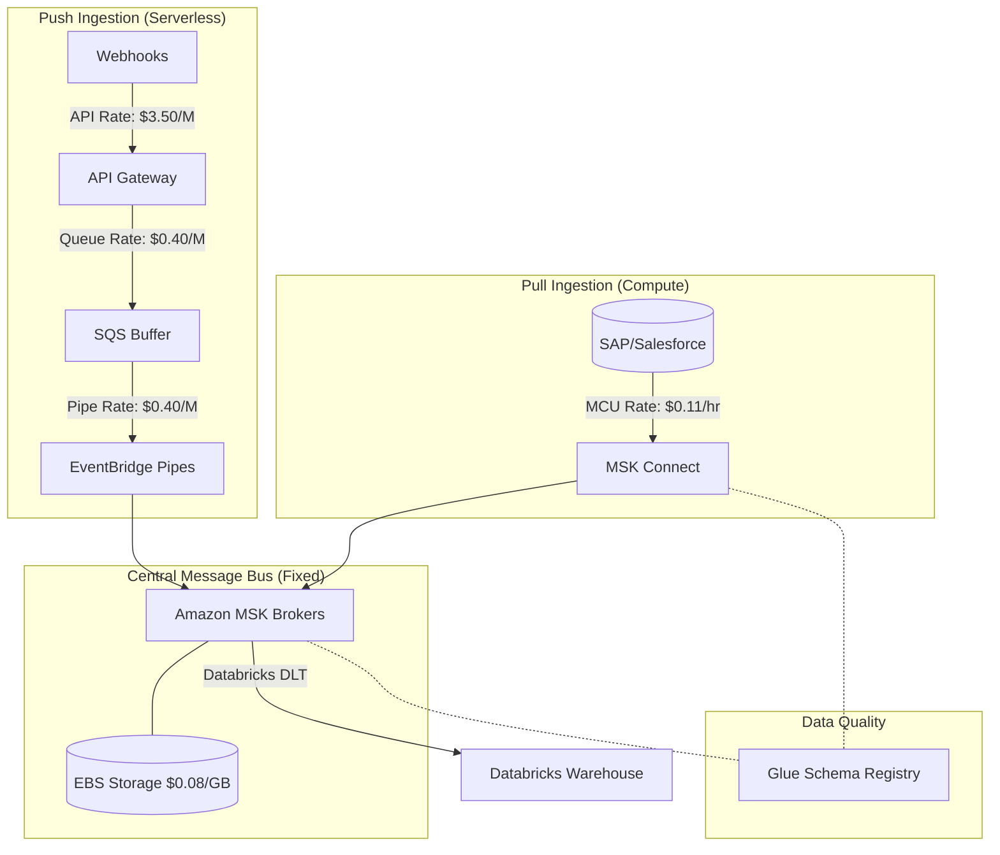

# Quantitative Design: AWS Centralized Message Bus (Amazon MSK)

## 1. Executive Summary

This document establishes the quantitative resource sizing and cloud economics framework for building an enterprise Centralized Message Bus on AWS using **Amazon Managed Streaming for Apache Kafka (MSK)**.

It serves as the upstream companion to the [Databricks Quantitative Architecture](./databricks_dw_quantitative_architecture.md) and quantifies the architectural patterns defined in the [Unified Source to MSK Architecture](./unified_source_to_msk_architecture.md).

The MSK ecosystem has a fundamentally different cost profile compared to Databricks:
1. **MSK Brokers**: A fixed hourly infrastructure cost (always-on).
2. **MSK Connect**: A variable cost layer that auto-scales based on MCU (MSK Connect Unit) hours.
3. **Webhook Path (API Gateway + SQS + Pipes)**: A pure pay-per-request serverless model.

This framework details how to configure every resource to maximize throughput, guarantee zero data loss, and control costs.

---

## 2. Standardized Throughput Tiers

To ensure an accurate end-to-end cost model, we align the ingestion tiers exactly with the downstream Databricks Data Warehouse model:

| Metric | Small Tier (Batch/Low-Volume) | Medium Tier (Enterprise Scale) | Large Tier (High-Volume Streaming) |
| :--- | :--- | :--- | :--- |
| **Daily Ingestion Volume** | 100 GB/day | 1.0 TB/day | 10.0 TB/day |
| **Average Throughput** | ~1.15 MB/sec | ~11.57 MB/sec | ~115.74 MB/sec |
| **Record Rate** (~1 KB/event) | ~1,150 events/sec | ~11,570 events/sec | ~115,740 events/sec |
| **Total Topics** | 10 Topics | 50 Topics | 500+ Topics |
| **Total Partitions** | 30 Partitions | 300 Partitions | 3,000+ Partitions |
| **Replication Factor** | 3 (Standard) | 3 (Standard) | 3 (Standard) |

---

## 3. MSK Broker Sizing (The Fixed Cost Layer)

MSK is provisioned as an always-on cluster. Brokers must be sized for peak throughput, not average throughput.

### 3.1 Broker Instance Selection and Scaling

The number of brokers is driven by the **number of partitions** and the **network throughput** per broker. 

*   **Formula**: `Brokers = max(3, ceil(Total Partitions / Partitions per Broker limit))`
*   *Note: We deploy across 3 Availability Zones, so broker count must be a multiple of 3.*

**Tier Configurations:**
1.  **Small Tier (100 GB/day)**:
    *   **Instance**: `kafka.m5.large` (2 vCPU, 8 GB RAM)
    *   **Cluster Size**: 3 Brokers (1 per AZ)
    *   **Partition Limit**: 1,000 partitions per broker (3,000 total)
    *   **Cost**: 3 × $0.246/hr = **$531.36 / month**

2.  **Medium Tier (1.0 TB/day)**:
    *   **Instance**: `kafka.m5.2xlarge` (8 vCPU, 32 GB RAM)
    *   **Cluster Size**: 3 Brokers (1 per AZ)
    *   **Partition Limit**: 2,000 partitions per broker (6,000 total)
    *   **Cost**: 3 × $0.984/hr = **$2,125.44 / month**

3.  **Large Tier (10.0 TB/day)**:
    *   **Instance**: `kafka.m5.4xlarge` (16 vCPU, 64 GB RAM)
    *   **Cluster Size**: 6 Brokers (2 per AZ)
    *   **Partition Limit**: 4,000 partitions per broker (24,000 total)
    *   **Cost**: 6 × $1.968/hr = **$8,501.76 / month**

### 3.2 EBS Storage Sizing

*   **Formula**: `Total Storage = Daily Volume × Retention Days × Replication Factor × Overhead (1.1)`
*   **Retention**: Configured to **7 days** (allows time for downstream consumers to recover from outages).
*   **EBS Type**: Standard `gp3` ($0.08 / GB / month). Provisioned throughput limits are sufficient for standard Kafka workloads.

**Tier Storage Costs:**
*   **Small Tier**: 100 GB × 7 × 3 × 1.1 = 2,310 GB = **$184.80 / month**
*   **Medium Tier**: 1,000 GB × 7 × 3 × 1.1 = 23,100 GB = **$1,848.00 / month**
*   **Large Tier**: 10,000 GB × 7 × 3 × 1.1 = 231,000 GB = **$18,480.00 / month**

---

## 4. MSK Connect Sizing (The Variable Cost Layer)

AWS MSK Connect runs Kafka Connect workers as serverless endpoints. Costs are based on **MSK Connect Units (MCUs)**. One MCU is 1 vCPU and 4 GB RAM.

*   **Pricing**: $0.11 per MCU-hour.
*   **Auto-scaling Policy** (from Terraform): Scale out at 80% CPU; Scale in at 20% CPU.

### 4.1 Connector Resource Profiles

1.  **Small Tier (e.g., Salesforce CDC - Low Volume)**:
    *   **Config**: 1 Connector, Min Workers = 1, Max Workers = 3, `tasks.max` = 1.
    *   **Average Active MCUs**: 1
    *   **Cost**: 1 MCU × $0.11/hr × 720 hrs = **$79.20 / month**

2.  **Medium Tier (e.g., SAP JDBC - Medium Volume)**:
    *   **Config**: 1 Connector, Min Workers = 1, Max Workers = 4, `tasks.max` = 2.
    *   **Average Active MCUs**: 2
    *   **Cost**: 2 MCUs × $0.11/hr × 720 hrs = **$158.40 / month**

3.  **Large Tier (Enterprise Aggregation - High Volume CDC)**:
    *   **Config**: 5 Heavy Connectors, Auto-scaling.
    *   **Average Active MCUs**: 20 (across all connectors)
    *   **Cost**: 20 MCUs × $0.11/hr × 720 hrs = **$1,584.00 / month**

---

## 5. Webhook Push Path Sizing (Serverless Ingestion)

The webhook ingestion path (API Gateway → SQS → EventBridge Pipes → MSK) is a pure serverless path. You only pay for what you use, based on the **Record Rate**.

### 5.1 Request Pricing

*   **API Gateway (REST)**: $3.50 per 1 million requests.
*   **Amazon SQS**: $0.40 per 1 million requests (Standard Queue).
*   **EventBridge Pipes**: $0.40 per 1 million requests (Standard).

*Note: The EventBridge Pipe is configured with an SQS batch size of 10 (`batch_size = 10`), meaning Pipes and MSK are only invoked once for every 10 API requests, saving massive compute costs.*

### 5.2 Serverless Tier Costs

1.  **Small Tier (~99.3M events/month)**:
    *   **API Gateway**: 99.3M × $3.50/M = **$347.55**
    *   **SQS**: (99.3M writes + 9.9M reads) × $0.40/M = **$43.68**
    *   **EventBridge Pipes**: 99.3M × $0.40/M = **$39.72**
    *   **Total**: **$430.95 / month**

2.  **Medium Tier (~1 Billion events/month)**:
    *   **API Gateway**: 1,000M × $3.50/M = **$3,500.00**
    *   **SQS**: (1,000M writes + 100M reads) × $0.40/M = **$440.00**
    *   **EventBridge Pipes**: 1,000M × $0.40/M = **$400.00**
    *   **Total**: **$4,340.00 / month**

3.  **Large Tier (~10 Billion events/month)**:
    *   **API Gateway**: 10,000M × $3.50/M = **$35,000.00**
    *   *(At this scale, a REST API Gateway becomes prohibitively expensive. You MUST switch to API Gateway HTTP APIs at $0.90/M, or provision an Application Load Balancer.)*
    *   **Cost Using HTTP APIs**: 10,000M × $0.90/M = **$9,000.00**
    *   **SQS**: (10,000M + 1,000M) × $0.40/M = **$4,400.00**
    *   **EventBridge Pipes**: 10,000M × $0.40/M = **$4,000.00**
    *   **Total (with HTTP API)**: **$17,400.00 / month**

---

## 6. Observability & Data Quality Sizing

1.  **AWS Glue Schema Registry**:
    *   The registry acts as the enforcement engine for AVRO schemas on MSK Connect and API Gateway.
    *   **Pricing**: 1 million requests free, then $1.00 per million. 
    *   **Impact**: Kafka clients cache schemas heavily. The schema registry API is hit very infrequently. Estimated cost: **<$5.00 / month** across all tiers.
2.  **CloudWatch Logs & Metrics**:
    *   MSK Broker logging, API Gateway execution logs, and MSK Connect worker logs.
    *   Estimated costs: Small: **$50**, Medium: **$250**, Large: **$1,000** (Month).

---

## 7. End-to-End Cost Matrices

*Note: These matrices assume a hybrid ingestion model where 50% of the volume comes from MSK Connect (Pull) and 50% comes from Webhooks (Push).*

### 7.1 Small Tier (100 GB/day)
| Resource | Details | Monthly Cost |
| :--- | :--- | :--- |
| **MSK Brokers** | 3 × `kafka.m5.large` | $531.36 |
| **EBS Storage** | 2,310 GB | $184.80 |
| **MSK Connect** | 1 MCU Average | $79.20 |
| **Serverless Push (50%)** | 50M API/SQS/Pipe events | $215.48 |
| **Observability** | CloudWatch | $50.00 |
| **Total Model Cost** | — | **$1,060.84** |

### 7.2 Medium Tier (1.0 TB/day)
| Resource | Details | Monthly Cost |
| :--- | :--- | :--- |
| **MSK Brokers** | 3 × `kafka.m5.2xlarge` | $2,125.44 |
| **EBS Storage** | 23,100 GB | $1,848.00 |
| **MSK Connect** | 5 MCUs Average | $396.00 |
| **Serverless Push (50%)** | 500M API/SQS/Pipe events | $2,170.00 |
| **Observability** | CloudWatch | $250.00 |
| **Total Model Cost** | — | **$6,789.44** |

### 7.3 Large Tier (10.0 TB/day)
| Resource | Details | Monthly Cost |
| :--- | :--- | :--- |
| **MSK Brokers** | 6 × `kafka.m5.4xlarge` | $8,501.76 |
| **EBS Storage** | 231,000 GB | $18,480.00 |
| **MSK Connect** | 20 MCUs Average | $1,584.00 |
| **Serverless Push (50%)** | 5B HTTP API/SQS/Pipe events | $8,700.00 |
| **Observability** | CloudWatch | $1,000.00 |
| **Total Model Cost** | — | **$38,265.76** |

---

## 8. Total End-to-End Pipeline Cost (MSK + Databricks)

Combining this model with the downstream Databricks model provides the true Total Cost of Ownership (TCO) for the data platform:

| Tier | Central Message Bus (MSK) | Data Warehouse (Databricks) | **Total Platform TCO / Month** |
| :--- | :--- | :--- | :--- |
| **Small (100 GB)** | $1,060.84 | $853.92 | **$1,914.76** |
| **Medium (1 TB)** | $6,789.44 | $6,071.43 | **$12,860.87** |
| **Large (10 TB)** | $38,265.76 | $34,143.10 | **$72,408.86** |

---

## 9. MSK Architecture & Cost Map

---

## 10. Summary of Quantitative Best Practices (FinOps Rules)

1. **Avoid API Gateway REST APIs at High Volume**: In the Large Tier, a REST API Gateway costs $35,000/month. You must transition to API Gateway **HTTP APIs** ($0.90/million) or provision an Application Load Balancer (ALB).
2. **Right-size Replication**: A replication factor of 3 is standard for production. Do not use replication factor 4, as it drastically inflates cross-AZ network traffic and EBS storage costs without meaningful availability gains.
3. **Batch Everything**: The EventBridge Pipe must use an SQS batch size of at least 10 (as configured in the Terraform `batch_size = 10`). This reduces Pipe invocations by 90% and optimizes MSK disk writes.
4. **Tune MSK Connect CPU Scaling**: The Terraform scales out when CPU hits 80% and scales in at 20%. For bursty CDC workloads, consider lowering the scale-out threshold to 60% to prevent message lag during rapid spikes, at the cost of slightly higher MCU-hours.
5. **Implement Tiered Storage for MSK**: If data retention needs to exceed 7 days, enable MSK Tiered Storage. This automatically offloads older Kafka segments to Amazon S3, allowing you to retain data for months without provisioning expensive EBS `gp3` volumes.
