# AWS Centralized Message Bus: SAP Ingestion Architecture

## 1. Executive Summary

This document defines the enterprise architecture for real-time data ingestion from an **SAP HANA** ERP system into the Centralized Message Bus (**Amazon MSK**) hosted on AWS. 

This architecture acts as the foundational backbone for all downstream analytics and real-time operational applications. It strictly adheres to our Data Engineering Rules:
- **Rule 10:** Centralized Message Bus Architecture
- **Rule 11:** Observability and Alerting Standards

---

## 2. Architecture Diagram

The following diagram illustrates the flow of data from the on-premises or EC2-hosted SAP environment securely into the AWS environment using native AWS services.

```mermaid
flowchart TD
    %% SAP Environment
    subgraph SAPEnv [SAP Environment &#40;On-Prem / External VPC&#41;]
        SAPHana[("SAP HANA Database")]
    end

    %% Security & Network Boundary
    subgraph CustomerVPC [AWS Customer VPC &#40;Data Plane&#41;]
        direction TB
        
        subgraph Networking [Networking]
            TGW["AWS Transit Gateway <br>&#40;or VPC Peering&#41;"]
        end

        subgraph IngestionTier [Ingestion Compute]
            AWSDMS["AWS Database Migration Service <br>&#40;DMS Replication Instance&#41;"]
            Secrets["AWS Secrets Manager <br>&#40;SAP Credentials&#41;"]
        end

        subgraph MessageBus [Centralized Message Bus]
            MSK["Amazon MSK <br>&#40;Apache Kafka Brokers&#41;"]
            GlueRegistry["AWS Glue Schema Registry <br>&#40;Avro&#41;"]
            DLQ[("Dead Letter Queue Topic <br>&#40;Serialization Failures&#41;")]
        end
        
        subgraph Downstream [Data Warehouse Consumers]
            Databricks["Databricks / Snowflake <br>&#40;Structured Streaming / Snowpipe&#41;"]
        end
    end

    %% Control Plane & Monitoring
    subgraph ControlPlane [AWS Control Plane]
        CloudWatch["Amazon CloudWatch"]
        Lambda["AWS Lambda <br>&#40;Alert Router&#41;"]
    end

    %% Notification Target
    Notification["Slack / PagerDuty"]

    %% Data Flow
    SAPHana -.->|TCP via Private Routing| TGW
    TGW -.-> AWSDMS
    Secrets -.->|Injects DB Credentials| AWSDMS
    
    AWSDMS --> GlueRegistry
    GlueRegistry -->|Validated Avro Payload| MSK
    GlueRegistry -.->|Validation / Parse Error| DLQ
    
    MSK --> Databricks

    %% Monitoring Flow
    AWSDMS -.->|Task FAILED / CDC Latency| CloudWatch
    MSK -.->|Broker Health / Consumer Lag| CloudWatch
    DLQ -.->|Message Count > 0| CloudWatch
    
    CloudWatch -->|Alarm Triggered| Lambda
    Lambda -->|Webhook| Notification

    %% Styling
    classDef storage fill:#e2f0d9,stroke:#385723,stroke-width:1px,color:#000;
    classDef process fill:#dae8fc,stroke:#6c8ebf,stroke-width:1px,color:#000;
    classDef bad fill:#f8cecc,stroke:#b85450,stroke-width:1px,color:#000;
    classDef monitor fill:#fff2cc,stroke:#d6b656,stroke-width:1px,color:#000,stroke-dasharray: 5 5;
    classDef network fill:#f9f9f9,stroke:#666,stroke-width:2px,color:#000,stroke-dasharray: 5 5;
    classDef alert fill:#ffe6cc,stroke:#d79b00,stroke-width:1px,color:#000;
    
    class SAPHana,MSK,DLQ storage;
    class MSKConnect,GlueRegistry,Databricks,Secrets process;
    class DLQ bad;
    class CloudWatch,Lambda monitor;
    class CustomerVPC,SAPEnv,Networking,ControlPlane network;
    class Notification alert;
```

---

## 3. Component Details & Security

### 3.1 Network Isolation
To ensure strict security compliance, data must never traverse the public internet. The SAP Environment is securely connected to the AWS VPC using **AWS Transit Gateway** (or VPC Peering if SAP is hosted on AWS EC2). All data plane traffic remains within private subnets.

### 3.2 Ingestion Compute (AWS DMS)
Following **Rule 10**, no custom producer code is allowed. We standardize on **AWS Database Migration Service (AWS DMS)** for true Change Data Capture (CDC).
*   **The Instance:** A fully managed DMS Replication Instance reads the database transaction logs (redo logs) directly. This guarantees that all physical changes (inserts, updates, and hard deletes) are streamed continuously without placing polling loads on the source database.
*   **Credential Management:** The DMS Source Endpoint retrieves the SAP connection string and authentication credentials dynamically from **AWS Secrets Manager** at runtime.

### 3.3 The Centralized Message Bus (Amazon MSK)
**Amazon MSK** acts as the highly available streaming backbone, acting as the Target Endpoint for AWS DMS. 
*   **Durability:** The cluster spans 3 Availability Zones with a replication factor of 3.
*   **Zero Data Loss:** MSK Connect is configured with `acks=all` and `enable.idempotence=true` to guarantee that SAP records are fully committed across MSK brokers before acknowledging the read.
*   **Security:** MSK enforces **mTLS** or **SASL/SCRAM** for all client connections and encrypts data at rest using AWS KMS.

---

## 4. Schema Contracts & Data Quality (Rule 10)

### 4.1 AWS Glue Schema Registry
Every topic enforcing an SAP entity uses **AWS Glue Schema Registry**. 
*   **Wire Format:** Data is serialized into **Avro** format. Plain JSON is strictly prohibited to ensure schema enforcement at the broker boundary.
*   **Evolution:** Compatibility is set to `BACKWARD`. If an SAP admin adds a column, the payload is accepted. If they remove a column, MSK Connect crashes, and the pipeline halts rather than corrupting downstream warehouses.

### 4.2 Topic Naming & Error Handling
*   **Topic Naming:** Topics follow the `sap.{entity}.{version}` pattern (e.g., `sap.sales_orders.v1`).
*   **Dead Letter Queue & Error Handling:** The DMS task `ErrorBehavior` policy is configured to `LOG_ERROR`. If a completely malformed row is read from SAP that cannot be mapped, it is safely logged and/or routed to a DLQ so that the overall replication task remains healthy.

---

## 5. Observability & Alerting (Rule 11)

In compliance with our alerting rules, we must actively monitor the health of the streaming ingestion and the behavior of the consumer applications.

### 5.1 Amazon CloudWatch Metrics
We leverage Amazon CloudWatch to monitor critical pipeline dimensions:
1. **DMS Task Health:** Monitors `ReplicationTaskStatus`. If the task fails or stops, an alert is triggered immediately.
2. **CDC Latency:** Monitors `CDCLatencyTarget`. If the latency between SAP and MSK exceeds the defined SLA (e.g., 5 minutes), engineering is notified.
3. **Consumer Lag (Critical):** Monitors `MaxOffsetLag` for the downstream consumers (e.g., Databricks Structured Streaming). This dictates our real-time SLAs.

### 5.2 Alert Routing Matrix
When CloudWatch Alarms are triggered, they invoke an **AWS Lambda Alert Router**, which formats the payload and pushes it to Slack and PagerDuty based on severity.

| Alert Condition | Metric / Source | Severity | SLA Expectation |
| :--- | :--- | :--- | :--- |
| **DMS Task FAILED** | DMS `ReplicationTaskStatus` | **P1** | Immediate Response |
| **CDC Latency High** | DMS `CDCLatencyTarget` > 5m | **P2** | Investigate Replication Instance |
| **Consumer Lag Growing** | `MaxOffsetLag` increases > 5 min | **P2** | Check Consumer Cluster Size |
| **Throughput Drop** | `MessagesInPerSec` = 0 | **P2** | Check SAP Source System |
| **Broker Storage High** | MSK `KafkaDataLogsDiskUsed` > 80% | **P3** | Scale Storage Volume |
