# AWS Centralized Message Bus: Unified Ingestion Architecture

## 1. Executive Summary

This document defines the enterprise architecture for real-time data ingestion from both internal databases (**SAP HANA**) and external SaaS applications (**Salesforce**) into a Centralized Message Bus (**Amazon MSK**) hosted on AWS. 

To prevent operational fragmentation and adhere strictly to **Rule 10 (Centralized Message Bus Standards)**, this architecture standardizes on **Amazon MSK Connect (Kafka Connect)** as the single, universal compute ingestion engine.

---

## 2. Architecture Diagram

The following diagram illustrates how MSK Connect handles both database CDC and SaaS Event Pub/Sub simultaneously.

```mermaid
flowchart TD
    %% Sources
    subgraph InternalEnv [On-Premises / Internal VPC]
        SAPHana[("SAP HANA Database <br>&#40;Pull/JDBC&#41;")]
        SAPEventMesh["SAP Event Mesh <br>&#40;Push/Webhook&#41;"]
    end

    subgraph SaaSEnv [Public SaaS]
        Salesforce["Salesforce Cloud <br>&#40;Pull/PubSub API&#41;"]
        SFDCOutbound["Salesforce Outbound <br>&#40;Push/Webhook&#41;"]
    end

    %% Customer VPC
    subgraph CustomerVPC [AWS Customer VPC &#40;Data Plane&#41;]
        direction TB
        
        subgraph EdgeTier [AWS Edge]
            WAF["AWS WAF <br>&#40;Firewall&#41;"]
        end
        
        subgraph Networking [Networking Routes]
            TGW["AWS Transit Gateway <br>&#40;Internal Routing&#41;"]
            NATGW["NAT Gateway <br>&#40;Outbound External&#41;"]
        end

        subgraph IngestionTier [Unified Compute & API Tier]
            MSKConnect["Amazon MSK Connect <br>&#40;Pull/Subscribe Workers&#41;"]
            APIGateway["Amazon API Gateway <br>&#40;Push/Webhook Receiver&#41;"]
            BulkProcessor["AWS Glue / Lambda <br>&#40;Backfill Processor&#41;"]
            Secrets["AWS Secrets Manager <br>&#40;Credentials&#41;"]
        end

        subgraph StorageTier [AWS Storage Services]
            S3Bulk[("Amazon S3 <br>&#40;Historical Bulk Drop&#41;")]
        end

        subgraph MessageBus [Centralized Message Bus]
            MSK["Amazon MSK <br>&#40;Apache Kafka Brokers&#41;"]
            GlueRegistry["AWS Glue Schema Registry <br>&#40;Avro&#41;"]
            DLQ[("Dead Letter Queues <br>&#40;*.dlq&#41;")]
        end
        
        subgraph Downstream [Data Warehouse Consumers]
            Databricks["Databricks / Snowflake <br>&#40;Structured Streaming&#41;"]
        end
    end

    %% Control Plane & Monitoring
    subgraph ControlPlane [AWS Control Plane]
        CloudWatch["Amazon CloudWatch"]
        Lambda["AWS Lambda <br>&#40;Alert Router&#41;"]
    end

    %% Notification Target
    Notification["Slack / PagerDuty"]

    %% Data Flow (Pull Approach via MSK Connect)
    SAPHana -.->|TCP via Private Routing| TGW
    TGW -.->|JDBC Stream| MSKConnect
    
    MSKConnect -.->|HTTPS Auth Request| NATGW
    NATGW -.-> Salesforce
    Salesforce -.->|Streams CDC Events| NATGW
    NATGW -.->|Inbound Stream| MSKConnect

    Secrets -.->|Injects Credentials| MSKConnect
    
    %% Data Flow (Push Approach via API Gateway)
    SAPEventMesh -.->|HTTPS POST| WAF
    SFDCOutbound -.->|HTTPS POST| WAF
    WAF --> APIGateway
    
    %% Data Flow (Hybrid / Historical Backfill)
    SAPEventMesh -.->|Secure File Transfer| S3Bulk
    SFDCOutbound -.->|Bulk Data Export| S3Bulk
    S3Bulk -->|S3 Event Trigger| BulkProcessor
    BulkProcessor --> GlueRegistry
    BulkProcessor -->|Validated Avro| MSK

    %% Aggregation into Message Bus
    MSKConnect --> GlueRegistry
    GlueRegistry -->|Validated Avro| MSK
    GlueRegistry -.->|Validation Error| DLQ
    
    APIGateway -->|AWS Service Proxy Integration| MSK

    MSK --> Databricks

    %% Monitoring Flow
    MSKConnect -.->|Task FAILED| CloudWatch
    APIGateway -.->|4XX/5XX Errors| CloudWatch
    BulkProcessor -.->|Job FAILED| CloudWatch
    MSK -.->|Broker Health / Consumer Lag| CloudWatch
    DLQ -.->|Message Count > 0| CloudWatch
    
    CloudWatch -->|Alarm Triggered| Lambda
    Lambda -->|Webhook| Notification

    %% Styling
    classDef storage fill:#e2f0d9,stroke:#385723,stroke-width:1px,color:#000;
    classDef process fill:#dae8fc,stroke:#6c8ebf,stroke-width:1px,color:#000;
    classDef bad fill:#f8cecc,stroke:#b85450,stroke-width:1px,color:#000;
    classDef monitor fill:#fff2cc,stroke:#d6b656,stroke-width:1px,color:#000,stroke-dasharray: 5 5;
    classDef network fill:#f9f9f9,stroke:#666,stroke-width:2px,color:#000,stroke-dasharray: 5 5;
    classDef edge fill:#f8cecc,stroke:#b85450,stroke-width:1px,color:#000;
    classDef alert fill:#ffe6cc,stroke:#d79b00,stroke-width:1px,color:#000;
    
    class SAPHana,MSK,DLQ,S3Bulk storage;
    class Salesforce,MSKConnect,APIGateway,BulkProcessor,GlueRegistry,Databricks,Secrets process;
    class WAF edge;
    class DLQ bad;
    class CloudWatch,Lambda monitor;
    class CustomerVPC,InternalEnv,SaaSEnv,Networking,ControlPlane network;
    class Notification alert;
```

---

## 3. The Unified Compute Layer (Amazon MSK Connect)

Instead of managing AWS DMS for databases and custom code for APIs, we utilize **Amazon MSK Connect** as the universal abstraction layer. AWS provisions serverless MSK Connect Units (MCUs) that run standard Apache Kafka Connect plugins.

### 3.1 SAP Ingestion Workflow
*   **The Connector:** MSK Connect loads an SAP plugin (e.g., Confluent SAP JDBC or SAP CDC). 
*   **Network:** MSK Connect is deployed in private subnets and reaches the SAP database through an internal AWS Transit Gateway.
*   **Authentication:** Database usernames and passwords are retrieved from AWS Secrets Manager.

### 3.2 Salesforce Ingestion Workflow
*   **The Connector:** MSK Connect loads the Salesforce Source Connector (PushTopic/PubSub).
*   **Network:** MSK Connect reaches out to the public Salesforce API via a NAT Gateway. Inbound connections to MSK remain fully blocked.
*   **Authentication:** OAuth JWT keys are retrieved from AWS Secrets Manager.

---

## 4. Rule 10 Compliance: Data Quality & Consistency

Because both sources use the Kafka Connect framework, they inherit identical data quality guarantees:
1.  **AWS Glue Schema Registry:** All data is parsed and serialized into **Avro**. The registry guarantees that if SAP or Salesforce changes an upstream data type incompatibly, the message is intercepted before landing in the warehouse.
2.  **Zero Data Loss (DLQ):** Both connectors are configured with `errors.tolerance = all`. If a payload fails schema validation or Avro serialization, the worker does not crash. It routes the bad record to a mirrored Dead Letter Queue (e.g., `sap.sales_orders.dlq` or `sfdc.account.dlq`).
3.  **Durability:** Both connectors use `acks=all` ensuring the MSK Broker securely writes to all 3 Availability Zones before acknowledging the source.

---

## 5. Observability & Alerting (Rule 11)

By unifying on MSK Connect, we also unify our observability stack. We do not have to build separate monitoring logic for DMS and Salesforce.

### 5.1 Universal CloudWatch Metrics
1. **MSK Connect Task Health (`FailedTaskCount`):** A failure here indicates network timeout or expired credentials for *either* SAP or Salesforce.
2. **DLQ Message Spikes:** CloudWatch monitors the `*.dlq` topics.
3. **Producer Throughput:** Monitors `MessagesInPerSec` on the MSK brokers per topic.
4. **Consumer Lag:** Monitors downstream Databricks ingestion latency.

### 5.2 Alert Routing Matrix
| Alert Condition | Metric / Source | Severity | SLA Expectation |
| :--- | :--- | :--- | :--- |
| **Connector FAILED** | MSK Connect Task State | **P1** | Immediate Response |
| **DLQ Contains Messages** | MSK Topic: `*.dlq` (Count > 0) | **P1** | Investigate Source Payload |
| **Consumer Lag Growing** | `MaxOffsetLag` increases > 5 min | **P2** | Check Databricks / Snowflake |
| **Throughput Drop** | `MessagesInPerSec` = 0 | **P2** | Check Upstream Source |

---

## 6. Alternative Pattern: Push-Based Webhook Ingestion

In enterprise scenarios where direct inbound access to a source system (like a third-party managed SAP instance) or API credential sharing is strictly prohibited by security policies, the standard "Pull/Subscribe" model cannot be used.

For these strict environments, we deploy a **Push-Based (Webhook)** architecture. The data owners are responsible for pushing events outwards, and we provide a highly secure "front door" to receive them and drop them directly onto the MSK bus.

### 6.1 Unified Front Door Logic

As shown in the main architecture diagram, the architecture supports both methods simultaneously to reach the Central Message Bus:
*   **Pull/Subscribe:** Using MSK Connect.
*   **Push/Webhook:** Using API Gateway.

### 6.2 Edge Schema Enforcement
When using MSK Connect, we rely on the AWS Glue Schema Registry for data quality. In the Push-Based pattern, we push schema validation to the very edge using **Amazon API Gateway Request Validators**.
*   We define the expected payload format (e.g., Salesforce Account JSON) using an OpenAPI 3.0 schema directly in API Gateway.
*   If the third-party system pushes a malformed payload (missing a required field), API Gateway immediately rejects the request with a `400 Bad Request`.
*   This prevents "garbage" data from ever crossing into the AWS VPC or landing on the Kafka topic, enforcing Data Contract guarantees without needing custom code.

### 6.3 Observability Adaptations
When relying on external parties to push data, our monitoring must shift to track *their* success rate. We add specific API Gateway metrics to our CloudWatch alarms:
*   **`4XXError` (Client Errors):** A spike in 400 errors indicates the source system has changed its payload schema and API Gateway is rejecting it.
*   **`5XXError` (Server Errors):** Indicates API Gateway cannot reach the MSK Brokers (e.g., VPC endpoint issues).
*   **`Count` (Throughput):** A drop to zero indicates the source system's trigger has silently failed and is no longer pushing data.

---

## 7. Hybrid Architecture: Backfilling Historical Data

To complement the Push-Based approach, a **Hybrid Backfill Mechanism** handles the ingestion of historical data, which webhooks cannot natively retrieve. The push architecture ensures low-latency real-time streams, while the hybrid pipeline manages large bulk historical data loads.

### 7.1 Historical Bulk Drop (Amazon S3)
The source system administrator triggers a bulk export of historical data (e.g., CSV or JSON payloads) and securely transfers it into an **Amazon S3** bucket (`S3Bulk`) within the AWS Customer VPC.

### 7.2 Bulk Processor (AWS Glue / Lambda)
An S3 Event Notification triggers an **AWS Glue Job** (for massive datasets) or an **AWS Lambda function** (for smaller files). This processor parses the data, applies necessary transformations to match the webhook schema, and publishes the records to the AWS Glue Schema Registry for Avro serialization.

### 7.3 Unification at the Message Bus
Once serialized, the historical data is written to the exact same **Amazon MSK** topic as the real-time webhook events. This ensures that downstream consumers (e.g., Databricks) can process both historical backfill and real-time streams without knowing where the data originated.
