# AWS Centralized Message Bus: Unified Ingestion Architecture

## 1. Executive Summary

This document defines the enterprise architecture for real-time data ingestion from both internal databases (**SAP HANA**) and external SaaS applications (**Salesforce**) into a Centralized Message Bus (**Amazon MSK**) hosted on AWS. 

To prevent operational fragmentation and adhere strictly to **Rule 10 (Centralized Message Bus Standards)**, this architecture standardizes on **Amazon MSK Connect (Kafka Connect)** as the single, universal compute ingestion engine.

---

## 2. Architecture Diagram

The following diagram illustrates how MSK Connect handles both database CDC and SaaS Event Pub/Sub simultaneously.

```mermaid
flowchart TD
    %% Sources
    subgraph InternalEnv [On-Premises / Internal VPC]
        SAPHana[("SAP HANA Database")]
    end

    subgraph SaaSEnv [Public SaaS]
        Salesforce["Salesforce Cloud <br>&#40;Pub/Sub API&#41;"]
    end

    %% Customer VPC
    subgraph CustomerVPC [AWS Customer VPC &#40;Data Plane&#41;]
        direction TB
        
        subgraph Networking [Networking Routes]
            TGW["AWS Transit Gateway <br>&#40;Inbound Internal&#41;"]
            NATGW["NAT Gateway <br>&#40;Outbound External&#41;"]
        end

        subgraph IngestionTier [Unified Compute Tier]
            MSKConnect["Amazon MSK Connect <br>&#40;Serverless Workers&#41;"]
            Secrets["AWS Secrets Manager <br>&#40;SAP & SFDC Credentials&#41;"]
        end

        subgraph MessageBus [Centralized Message Bus]
            MSK["Amazon MSK <br>&#40;Apache Kafka Brokers&#41;"]
            GlueRegistry["AWS Glue Schema Registry <br>&#40;Avro&#41;"]
            DLQ[("Dead Letter Queues <br>&#40;*.dlq&#41;")]
        end
        
        subgraph Downstream [Data Warehouse Consumers]
            Databricks["Databricks / Snowflake <br>&#40;Structured Streaming&#41;"]
        end
    end

    %% Control Plane & Monitoring
    subgraph ControlPlane [AWS Control Plane]
        CloudWatch["Amazon CloudWatch"]
        Lambda["AWS Lambda <br>&#40;Alert Router&#41;"]
    end

    %% Notification Target
    Notification["Slack / PagerDuty"]

    %% Data Flow (SAP)
    SAPHana -.->|TCP via Private Routing| TGW
    TGW -.->|JDBC / CDC Stream| MSKConnect
    
    %% Data Flow (Salesforce)
    MSKConnect -.->|HTTPS Auth Request| NATGW
    NATGW -.-> Salesforce
    Salesforce -.->|Streams CDC Events| NATGW
    NATGW -.->|Inbound Stream| MSKConnect

    Secrets -.->|Injects Credentials| MSKConnect
    
    MSKConnect --> GlueRegistry
    GlueRegistry -->|Validated Avro Payload| MSK
    GlueRegistry -.->|Validation Error| DLQ
    
    MSK --> Databricks

    %% Monitoring Flow
    MSKConnect -.->|Task FAILED| CloudWatch
    MSK -.->|Broker Health / Consumer Lag| CloudWatch
    DLQ -.->|Message Count > 0| CloudWatch
    
    CloudWatch -->|Alarm Triggered| Lambda
    Lambda -->|Webhook| Notification

    %% Styling
    classDef storage fill:#e2f0d9,stroke:#385723,stroke-width:1px,color:#000;
    classDef process fill:#dae8fc,stroke:#6c8ebf,stroke-width:1px,color:#000;
    classDef bad fill:#f8cecc,stroke:#b85450,stroke-width:1px,color:#000;
    classDef monitor fill:#fff2cc,stroke:#d6b656,stroke-width:1px,color:#000,stroke-dasharray: 5 5;
    classDef network fill:#f9f9f9,stroke:#666,stroke-width:2px,color:#000,stroke-dasharray: 5 5;
    classDef alert fill:#ffe6cc,stroke:#d79b00,stroke-width:1px,color:#000;
    
    class SAPHana,MSK,DLQ storage;
    class Salesforce,MSKConnect,GlueRegistry,Databricks,Secrets process;
    class DLQ bad;
    class CloudWatch,Lambda monitor;
    class CustomerVPC,InternalEnv,SaaSEnv,Networking,ControlPlane network;
    class Notification alert;
```

---

## 3. The Unified Compute Layer (Amazon MSK Connect)

Instead of managing AWS DMS for databases and custom code for APIs, we utilize **Amazon MSK Connect** as the universal abstraction layer. AWS provisions serverless MSK Connect Units (MCUs) that run standard Apache Kafka Connect plugins.

### 3.1 SAP Ingestion Workflow
*   **The Connector:** MSK Connect loads an SAP plugin (e.g., Confluent SAP JDBC or SAP CDC). 
*   **Network:** MSK Connect is deployed in private subnets and reaches the SAP database through an internal AWS Transit Gateway.
*   **Authentication:** Database usernames and passwords are retrieved from AWS Secrets Manager.

### 3.2 Salesforce Ingestion Workflow
*   **The Connector:** MSK Connect loads the Salesforce Source Connector (PushTopic/PubSub).
*   **Network:** MSK Connect reaches out to the public Salesforce API via a NAT Gateway. Inbound connections to MSK remain fully blocked.
*   **Authentication:** OAuth JWT keys are retrieved from AWS Secrets Manager.

---

## 4. Rule 10 Compliance: Data Quality & Consistency

Because both sources use the Kafka Connect framework, they inherit identical data quality guarantees:
1.  **AWS Glue Schema Registry:** All data is parsed and serialized into **Avro**. The registry guarantees that if SAP or Salesforce changes an upstream data type incompatibly, the message is intercepted before landing in the warehouse.
2.  **Zero Data Loss (DLQ):** Both connectors are configured with `errors.tolerance = all`. If a payload fails schema validation or Avro serialization, the worker does not crash. It routes the bad record to a mirrored Dead Letter Queue (e.g., `sap.sales_orders.dlq` or `sfdc.account.dlq`).
3.  **Durability:** Both connectors use `acks=all` ensuring the MSK Broker securely writes to all 3 Availability Zones before acknowledging the source.

---

## 5. Observability & Alerting (Rule 11)

By unifying on MSK Connect, we also unify our observability stack. We do not have to build separate monitoring logic for DMS and Salesforce.

### 5.1 Universal CloudWatch Metrics
1. **MSK Connect Task Health (`FailedTaskCount`):** A failure here indicates network timeout or expired credentials for *either* SAP or Salesforce.
2. **DLQ Message Spikes:** CloudWatch monitors the `*.dlq` topics.
3. **Producer Throughput:** Monitors `MessagesInPerSec` on the MSK brokers per topic.
4. **Consumer Lag:** Monitors downstream Databricks ingestion latency.

### 5.2 Alert Routing Matrix
| Alert Condition | Metric / Source | Severity | SLA Expectation |
| :--- | :--- | :--- | :--- |
| **Connector FAILED** | MSK Connect Task State | **P1** | Immediate Response |
| **DLQ Contains Messages** | MSK Topic: `*.dlq` (Count > 0) | **P1** | Investigate Source Payload |
| **Consumer Lag Growing** | `MaxOffsetLag` increases > 5 min | **P2** | Check Databricks / Snowflake |
| **Throughput Drop** | `MessagesInPerSec` = 0 | **P2** | Check Upstream Source |
