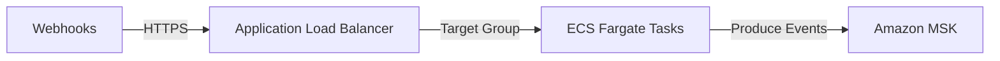
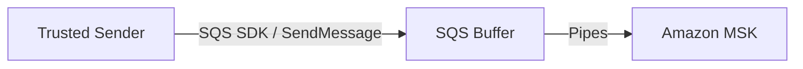
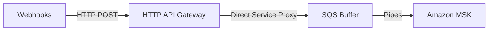

# Architecture Comparison: Cost-Effective Webhook Ingestion Alternatives

## 1. Context & The Challenge

Our current serverless push path (**API Gateway (REST) → SQS → EventBridge Pipes → MSK**) relies on pay-per-request pricing:
*   **REST API Gateway**: $3.50 per 1 million requests.
*   **SQS**: $0.40 per 1 million requests.
*   **EventBridge Pipes**: $0.40 per 1 million requests.

Because this path is billed per transaction, costs scale linearly with message volume. For high-volume streaming ingest, this becomes a major cost driver:
*   **Small Tier** (1.5B events/mo): **$5,970.00 / month**
*   **Medium Tier** (15B events/mo): **$59,700.00 / month**
*   **Large Tier** (150B events/mo): **$207,000.00 / month** (using HTTP APIs)

Below are three alternative architectures designed to decouple ingestion costs from request volume.

---

## 2. Alternative 1: ALB + ECS Fargate Ingestion Layer (Recommended)

Instead of serverless API Gateway and SQS buffers, we run a lightweight containerized web server (written in Go, Rust, or Node.js) on ECS Fargate behind an Application Load Balancer (ALB). The container accepts webhook payloads, performs schema validation, and writes them directly to MSK.

### 2.1 Sizing & Resource Cost Model

1.  **ALB Cost**:
    *   Base hourly cost: $0.0225/hr (~$16.20/month)
    *   LCU (Load Balancer Capacity Unit) charge: $0.008/LCU-hour. 
    *   *Sizing*: 1 LCU handles 25 new connections/sec or 1,000 active connections. Even at 10 TB/day peak, LCU charges average **$25 - $100 / month**.
2.  **ECS Fargate Compute Cost**:
    *   Pricing: $0.04048 per vCPU-hour, $0.004445 per GB-hour.
    *   **Small Tier** (~578 events/sec): Requires 2 small tasks (0.25 vCPU, 0.5 GB RAM each) for high availability (HA).
        *   Cost: 2 tasks × 720 hrs × ((0.25 × $0.04048) + (0.5 × $0.004445)) = **$17.77 / month**
    *   **Medium Tier** (~5,780 events/sec): Requires 4 medium tasks (0.5 vCPU, 1 GB RAM each) for HA and capacity.
        *   Cost: 4 tasks × 720 hrs × ((0.5 × $0.04048) + (1 × $0.004445)) = **$71.10 / month**
    *   **Large Tier** (~57,800 events/sec): Requires 8 large tasks (2 vCPU, 4 GB RAM each).
        *   Cost: 8 tasks × 720 hrs × ((2 × $0.04048) + (4 × $0.004445)) = **$568.79 / month**

### 2.2 Cost Summary (ALB + ECS Fargate)

| Tier | ALB Cost | ECS Fargate Cost | Total Ingestion Cost / Month | Savings vs. Original REST |
| :--- | :--- | :--- | :--- | :--- |
| **Small (1.5B)** | $25.00 | $17.77 | **$42.77** | **99.3%** ($5,927.23 saved) |
| **Medium (15B)** | $50.00 | $71.10 | **$121.10** | **99.8%** ($59,578.90 saved) |
| **Large (150B)** | $150.00 | $568.79 | **$718.79** | **99.7%** ($206,281.21 saved) |

### 2.3 Pros & Cons
*   **Pros**: 
    *   Decouples costs from request volume. Charges are compute-based.
    *   Eliminates API Gateway, SQS, and EventBridge Pipes completely.
    *   Extremely high throughput performance with low latency (bypasses cold starts and queue polling).
*   **Cons**:
    *   Requires writing, testing, and maintaining container code (e.g. Go backend).
    *   Requires managing ECS Fargate autoscaling policies.

---

## 3. Alternative 2: Direct-to-SQS Ingestion (Bypassing API Gateway)

If the webhook client is an internal system or a partner system that supports AWS SDK integration or IAM credentials, it can bypass the API Gateway entirely and call the SQS HTTPS endpoint (`SendMessage`) directly.

### 3.1 Cost Model
This completely eliminates the API Gateway charge. Ingestion is charged only for SQS requests and EventBridge Pipes execution.

*   **Small Tier** (1.5B events): SQS ($660.00) + Pipes ($60.00) = **$720.00 / month** (Saves $5,250.00)
*   **Medium Tier** (15B events): SQS ($6,600.00) + Pipes ($600.00) = **$7,200.00 / month** (Saves $52,500.00)
*   **Large Tier** (150B events): SQS ($66,000.00) + Pipes ($6,000.00) = **$72,000.00 / month** (Saves $135,000.00)

### 3.2 Pros & Cons
*   **Pros**:
    *   100% serverless, zero infrastructure management.
    *   High cost savings compared to REST API Gateway.
*   **Cons**:
    *   **Incompatible with Standard Webhooks**: External SaaS webhook publishers (e.g. Stripe, Salesforce, GitHub) do not support the AWS SQS SDK; they require a standard public HTTP POST endpoint.

---

## 4. Alternative 3: HTTP API Gateway (Low-Cost Serverless)

If you must use a serverless public endpoint for standard webhooks (no custom container maintenance), replace the expensive **REST API Gateway** with **HTTP API Gateway**.

### 4.1 Cost Model
HTTP API Gateway costs **$0.90 per million requests** (first 300 million is $1.00/M), whereas REST API Gateway costs **$3.50 per million**.

*   **Small Tier** (1.5B events): HTTP API ($1,380.00) + SQS ($660.00) + Pipes ($60.00) = **$2,100.00 / month** (Saves $3,870.00)
*   **Medium Tier** (15B events): HTTP API ($13,530.00) + SQS ($6,600.00) + Pipes ($600.00) = **$20,730.00 / month** (Saves $38,970.00)
*   **Large Tier** (150B events): HTTP API ($135,000.00) + SQS ($66,000.00) + Pipes ($6,000.00) = **$207,000.00 / month**

### 4.2 Pros & Cons
*   **Pros**:
    *   100% serverless and natively integrated.
    *   Direct drop-in replacement in Terraform.
*   **Cons**:
    *   Still transaction-based. At Large Tier volume, $207k/month is still highly expensive compared to the ALB + Fargate compute model ($718/month).

---

## 5. Summary Recommendation Matrix

| Feature | Current Model (REST APIGW) | Alt 1: ALB + Fargate | Alt 2: SQS Direct | Alt 3: HTTP APIGW |
| :--- | :--- | :--- | :--- | :--- |
| **Small Tier Cost** | $5,970.00 | **$42.77** | $720.00 | $2,100.00 |
| **Medium Tier Cost**| $59,700.00 | **$121.10** | $7,200.00 | $20,730.00 |
| **Large Tier Cost** | $239,941.60 | **$718.79** | $72,000.00 | $207,000.00 |
| **Infrastructure Mgmt**| None (Serverless) | Low (ECS Tasks) | None (Serverless) | None (Serverless) |
| **3rd-Party Compatible**| Yes | Yes | **No (Requires SDK)** | Yes |
| **Code Maintenance**| None | Custom Go/Node App | None | None |

> [!TIP]
> **Our Recommendation**: 
> Deploy **Alternative 1 (ALB + ECS Fargate Ingestion Layer)**. The Fargate tasks can be configured to write directly to your Amazon MSK brokers using the Kafka producer protocol, saving you up to **99.8%** of the transaction costs at high scale, while remaining compatible with standard HTTP webhooks from external providers.
