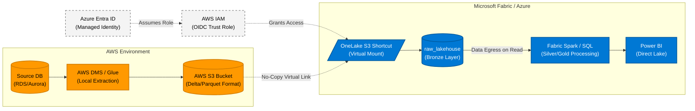

# AWS to Microsoft Fabric: Virtual Lakehouse Architecture

## 1. Executive Summary

This document defines the architectural pattern for seamlessly and securely onboarding data from **Amazon Web Services (AWS)** into **Microsoft Fabric (Azure)**. 

To mitigate the high network egress costs and operational complexity of cross-cloud ETL pipelines, this design employs the **Fabric OneLake Shortcut (Virtual Lakehouse)** pattern. Data is extracted locally within AWS, stored in open table formats (Delta/Parquet), and virtualized into Fabric. Data transfer only occurs dynamically during downstream read operations.

## 2. Architecture Diagram

## 3. Step-by-Step Implementation Flow

### 3.1 Step 1: Local Data Landing (AWS)
*   **Action:** Extract raw transactional data from AWS databases (e.g., Aurora, RDS, DynamoDB) using AWS-native tools like **AWS DMS (Data Migration Service)** or **AWS Glue**.
*   **Format:** The data must be written locally to an **AWS S3 Bucket** in an open format, strictly **Delta Lake** or **Parquet**. 
*   **Benefit:** Keeps the heavy lifting and initial extraction within the AWS network, preventing massive outbound data transfer costs.

### 3.2 Step 2: Cross-Cloud Security (OIDC Trust)
*   **Action:** Establish a federated trust relationship. Configure an **AWS IAM Role** that trusts an **Azure Entra ID (Active Directory)** App Registration or Managed Identity via OpenID Connect (OIDC).
*   **Benefit:** Eliminates the need to generate, share, and rotate static AWS Access Keys. Fabric accesses S3 using short-lived, dynamically generated tokens, satisfying stringent enterprise security requirements.

### 3.3 Step 3: Virtualization (Fabric Shortcuts)
*   **Action:** Within the Fabric `raw_lakehouse` (Bronze layer), create a new **Amazon S3 Shortcut**. Input the target S3 URI and the trusted AWS IAM Role ARN.
*   **Result:** The AWS S3 bucket instantly appears as a local folder inside OneLake. If the data is in Delta format, Fabric automatically recognizes it as a managed Bronze table. **Zero bytes are copied during this setup phase.**

### 3.4 Step 4: Downstream Processing (Fabric Spark)
*   **Action:** Fabric Data Engineering workloads (PySpark or T-SQL) query the virtual Bronze table to perform deduplication, cleansing, and Kimball Star Schema modeling into the Silver and Gold layers.
*   **Result:** Data is only pulled across the internet (triggering AWS egress fees) exactly when the Spark engine executes a read. Because Spark queries against Delta Lake utilize partition pruning, only the specific required files are downloaded, minimizing egress costs.

## 4. Architectural Principles Addressed

1.  **Cost Optimization (Egress Minimization):** By storing data locally in AWS and utilizing partition-aware queries from Fabric, you avoid "lift-and-shift" batch pipelines that copy terabytes of redundant historical data daily.
2.  **Open Formats / No Vendor Lock-in:** By mandating Delta Lake or Parquet on AWS S3, the data remains accessible to AWS-native tools (like Athena or SageMaker) while simultaneously powering Fabric analytics.
3.  **Operational Simplicity:** You do not need to schedule, monitor, or debug cross-cloud data movement pipelines (e.g., Azure Data Factory copy activities). The infrastructure acts as the pipeline.
