# AWS to Microsoft Fabric: Bi-Modal (Hybrid) Data Architecture

## 1. Executive Summary

This document defines a **Bi-Modal (Hybrid) Architecture** for integrating data from **Amazon Web Services (AWS)** into **Microsoft Fabric (Azure)**. 

To balance the conflicting goals of "easy, frictionless onboarding" and "low-latency real-time processing," this architecture provides two distinct cross-cloud ingestion paths:
*   **Path A (The Default - 80% of data):** A zero-ETL virtual lakehouse approach using Fabric S3 Shortcuts. This is optimized for massive scale, minimal engineering overhead, and instantaneous cross-cloud onboarding.
*   **Path B (The Exception - 20% of data):** A Centralized Message Bus approach using Azure Event Hubs. This is optimized for strict sub-minute latency and high-throughput operational event streams.

## 2. Architecture Diagram

```mermaid
flowchart TD
    %% Styles
    classDef aws fill:#ff9900,stroke:#d07b00,stroke-width:2px,color:#000;
    classDef azure fill:#0078d4,stroke:#005a9e,stroke-width:2px,color:#fff;
    classDef transit fill:#f4f4f4,stroke:#333,stroke-width:1px,color:#000,stroke-dasharray: 5 5;

    subgraph AWS [AWS Environment]
        direction TB
        SourceDB[("Source Database<br>&#40;RDS/Aurora/Dynamo&#41;")]
        
        %% Path A Extraction
        Glue["AWS Glue / DMS<br>&#40;Batch Export&#41;"]
        S3[("AWS S3 Bucket<br>&#40;Delta/Parquet&#41;")]
        
        %% Path B Extraction
        CDC["CDC Publisher<br>&#40;Debezium&#41;"]

        SourceDB -->|Hourly/Daily| Glue --> S3
        SourceDB -->|Continuous Binlog| CDC
    end

    subgraph Fabric [Microsoft Fabric / Azure]
        direction TB
        
        %% Path A Integration
        Shortcut[/"OneLake S3 Shortcut<br>&#40;Virtual Mount&#41;"/]
        
        %% Path B Integration
        EventHubs[("Azure Event Hubs<br>&#40;Central Message Bus&#41;")]
        SparkStream["Fabric Spark<br>Structured Streaming"]

        %% Bronze
        Bronze[("raw_lakehouse<br>&#40;Bronze Delta Tables&#41;")]
        SparkBatch["Fabric Spark SQL<br>&#40;Silver/Gold Transform&#41;"]
        PowerBI["Power BI<br>&#40;Direct Lake&#41;"]
        
        %% Connections
        Shortcut --> Bronze
        EventHubs --> SparkStream --> Bronze
        Bronze --> SparkBatch --> PowerBI
    end

    %% Cross-Cloud Transit
    S3 -.->|Path A: Zero-Copy Virtual Link<br>&#40;OIDC Auth&#41;| Shortcut
    CDC -.->|Path B: SASL/TLS Push<br>&#40;Real-Time Transit&#41;| EventHubs

    class SourceDB,Glue,S3,CDC aws;
    class Shortcut,EventHubs,SparkStream,Bronze,SparkBatch,PowerBI azure;
```

## 3. The Onboarding Matrix (When to use which?)

To prevent over-engineering, Data Architects must enforce the following decision matrix when onboarding a new AWS data source:

| Criteria | Path A: S3 Shortcuts (Virtual Lakehouse) | Path B: Azure Event Hubs (Message Bus) |
| :--- | :--- | :--- |
| **Primary Goal** | **Easy, frictionless onboarding.** | **Sub-minute, real-time latency.** |
| **Data Volume** | Petabytes of historical batch data. | Continuous, high-velocity small payloads. |
| **Latency SLA** | Hourly or Daily (T+1). | Real-Time (Seconds to Minutes). |
| **Engineering Effort** | **Very Low.** (Click-to-mount UI). | **High.** (Requires CDC setup, Avro schemas, Spark code). |
| **Egress Costs** | Optimized (Only pulled when queried). | Optimized (Highly compressed binary streams). |
| **Resilience** | High (S3 is the system of record). | High (Broker buffering & Dead Letter Queues). |

## 4. Implementation Details

### 4.1 Path A: The Easy Onboarding Flow (S3 Shortcuts)
This is the default path for analytical workloads, historical reporting, and machine learning training datasets.
1.  **Extract Locally:** AWS natively dumps table data or system logs into an AWS S3 bucket formatted strictly as Delta Lake or Parquet.
2.  **Virtual Mount:** A Data Analyst or Engineer navigates to the Fabric Bronze Lakehouse, selects "New Shortcut -> Amazon S3", and inputs the S3 URI.
3.  **Result:** The table is instantly available for querying in Fabric. No cross-cloud ETL pipelines are built, scheduled, or monitored.

### 4.2 Path B: The Real-Time Flow (Event Hubs)
This is strictly reserved for operational dashboards and event-driven automation (e.g., live inventory tracking, fraud detection).
1.  **CDC Extraction:** AWS Debezium captures database row changes in real-time from the transaction log.
2.  **Cross-Cloud Push:** Debezium pushes Avro-serialized events directly to the Azure Event Hubs Kafka endpoint over the internet.
3.  **Streaming Ingestion:** A Fabric Spark Structured Streaming job runs continuously, pulling the events from Event Hubs and appending them to the Bronze Delta tables.

## 5. Unified Cross-Cloud Security
Regardless of the ingestion path chosen, **hardcoded AWS Access Keys are strictly forbidden.**
*   **OIDC Federation:** Both paths rely on OpenID Connect (OIDC). Azure Entra ID (Managed Identities) exchanges short-lived tokens with AWS IAM.
*   *Path A:* Fabric uses OIDC to securely read the S3 bucket using temporary credentials.
*   *Path B:* The AWS CDC publisher uses OIDC/OAuth to authenticate to the Azure Event Hubs endpoint securely over TLS.
