# Real-Time Data Warehouse Architecture: Azure Databricks

## 1. Executive Summary
This document outlines the Enterprise **Real-Time Data Warehouse Architecture** tailored specifically for **Azure Databricks**. It strictly adheres to the Medallion Architecture data modeling rules, leveraging Delta Live Tables (DLT) for real-time processing, Unity Catalog for governance, and native Azure infrastructure (Event Hubs, ADLS Gen2, VNet) for scalable and secure streaming ingestion.

---

## 2. Real-Time Streaming Flow (Azure Native)

The following diagram illustrates the flow of data from external sources through Azure Event Hubs into the Medallion architecture using Azure Databricks DLT.

```mermaid
flowchart TD
    %% Sources
    subgraph ExternalSources [External Sources]
        App[("Operational DB / App")]
        SaaS["SaaS Applications API"]
    end

    %% Security Boundary: Azure VNet
    subgraph AzureVNet [Azure Virtual Network &#40;VNet&#41;]
        direction TB
        
        %% Ingestion Layer
        subgraph Ingestion [Azure Integration Layer]
            direction TB
            ADF["Azure Data Factory <br>&#40;Batch/Micro-batch&#41;"]
            EventHubs["Azure Event Hubs <br>&#40;Real-Time Streaming&#41;"]
        end

        %% Compute Layer
        subgraph Compute [Azure Databricks Compute]
            Spark["Structured Streaming <br>&#40;Event Hubs Connector&#41;"]
            DLT["Delta Live Tables <br>&#40;Medallion Pipeline&#41;"]
        end

        %% Storage Layer
        subgraph Storage [Azure Data Lake Storage Gen2]
            Bronze[("Bronze <br>&#40;Raw JSON/Avro&#41;")]
            Silver[("Silver <br>&#40;Cleansed & Deduplicated&#41;")]
            Gold[("Gold <br>&#40;Star Schema / MV&#41;")]
        end
    end

    %% Databricks Control Plane
    subgraph ControlPlane [Databricks Control Plane]
        Unity["Unity Catalog <br>&#40;Governance & RBAC&#41;"]
        SQLAlert["Databricks SQL Alerts"]
    end

    %% Flow
    App -->|CDC / Push| EventHubs
    SaaS -.->|Pull| ADF
    ADF --> EventHubs
    
    EventHubs -->|Kafka Protocol| Spark
    Spark -->|Append Only| Bronze
    
    %% DLT Processing
    Bronze -->|vw_silver_clean| Silver
    Silver -->|Incremental Aggregation via CDF| Gold

    %% Governance & Monitoring
    DLT -.->|Pipeline Metadata| Unity
    Bronze -.-> Unity
    Silver -.-> Unity
    Gold -.-> Unity
    
    DLT -.->|DQ Warnings| SQLAlert

    %% Styling
    classDef storage fill:#e2f0d9,stroke:#385723,stroke-width:1px,color:#000;
    classDef process fill:#dae8fc,stroke:#6c8ebf,stroke-width:1px,color:#000;
    classDef bad fill:#f8cecc,stroke:#b85450,stroke-width:1px,color:#000;
    classDef monitor fill:#fff2cc,stroke:#d6b656,stroke-width:1px,color:#000,stroke-dasharray: 5 5;
    classDef network fill:#f9f9f9,stroke:#666,stroke-width:2px,color:#000,stroke-dasharray: 5 5;
    classDef alert fill:#ffe6cc,stroke:#d79b00,stroke-width:1px,color:#000;
    
    class App,Bronze,Silver,Gold storage;
    class SaaS,ADF,EventHubs,Spark,DLT process;
    class Unity,SQLAlert monitor;
    class AzureVNet,ControlPlane network;
```

---

## 3. Real-Time Ingestion (Azure Event Hubs to Bronze)

To ensure high-throughput, low-latency ingestion, we utilize **Azure Event Hubs** as the central message broker instead of self-hosting Apache Kafka. 

### 3.1 Event Hubs Kafka Endpoint & Schema Registry
Databricks Structured Streaming connects to Azure Event Hubs seamlessly using the **Kafka compatibility endpoint**. 
*   **Authentication:** The `read_kafka` function connects using Azure Active Directory (Entra ID) Managed Identities or SASL/PLAIN natively over Azure.
*   **Schema Enforcement:** All events MUST be validated against a centralized **Schema Registry** (Azure Schema Registry or Confluent). Payloads use Avro or Protobuf.
*   **DLQ & Exactly-Once:** Producers are configured with `acks=all` and `enable.idempotence=true`. Unparseable messages on the Databricks ingestion side are routed to a Dead Letter Queue (DLQ) topic for alerting.

### 3.2 Bronze Layer Responsibilities (Raw)
*   **DLT Type:** `CREATE OR REFRESH STREAMING TABLE`
*   **Pattern:** Append-only ingestion. 
*   **Zero Data Loss:** We extract the payload as a string (`CAST(value AS STRING) AS record_content`) to prevent crashes during unexpected upstream schema drift.
*   **Data Quality:** Restricted strictly to structural checks (`ON VIOLATION WARN`) on Kafka metadata (e.g., offsets and timestamps). No business logic is applied here.
*   **Optimization:** `delta.enableChangeDataFeed` is set to `false`, as the stream tails the Delta transaction log directly.

---

## 4. Medallion Transformation (DLT)

Delta Live Tables orchestrates the transformation from raw events into business-ready star schemas.

### 4.1 Silver Layer (Cleansed & Conformed)
The Silver layer acts as the single source of truth for enterprise entities.
*   **Two-Step DLT Pattern:** 
    1.  `STREAMING LIVE VIEW`: Cleanses data, type-casts the JSON payload, standardizes formats, and enforces syntactic Data Quality (`ON VIOLATION DROP` for missing primary keys).
    2.  `APPLY CHANGES INTO`: Deduplicates the stream using SCD Type 1, sequenced by the source system's `updated_at` timestamp.
*   **Idempotency:** Because it relies on RocksDB state stores and CDC matching, accidental re-runs or rapid restarts guarantee zero duplicate records.
*   **Optimization:** `delta.enableChangeDataFeed` is set to `true` to allow Gold layer models to compute aggregations incrementally.

### 4.2 Gold Layer (Star Schema / Consumption)
The Gold layer is reserved for Kimball Star Schema models and business aggregations.
*   **DLT Type:** `CREATE OR REFRESH MATERIALIZED VIEW`. 
*   **Incremental Processing:** Because the upstream Silver table has CDF enabled, Databricks automatically computes metrics (like daily total revenue) incrementally, avoiding expensive full table scans.
*   **Business Validation:** Semantic business constraints are applied here (`ON VIOLATION WARN`). For example, `CONSTRAINT valid_revenue EXPECT (total_amount >= 0)`.

---

## 5. Storage Optimization (Liquid Clustering)

In alignment with our architectural standards, traditional Hive-style partitioning (`PARTITIONED BY`) is **strictly forbidden**.

All Delta tables across the Medallion architecture utilize **Liquid Clustering** (`CLUSTER BY`). 
*   **Why:** It dynamically adapts data layout over time, preventing over-partitioning and the "small file problem" inherent to streaming workloads on ADLS Gen2. 
*   **Usage:** Bronze clusters by ingestion date; Silver and Gold cluster by logical access patterns (e.g., `CLUSTER BY (order_date, store_id)`).

---

## 6. Azure Security, Network, & Governance

### 6.1 Azure VNet Injection & Private Link
The architecture relies on **VNet Injection**. The Databricks Data Plane (compute clusters) resides entirely within the customer's Azure Virtual Network.
*   **Private Link:** We utilize Azure Private Link for all communication between the VNet and Azure Event Hubs, as well as the VNet and ADLS Gen2. No traffic traverses the public internet.

### 6.2 Identity & Access Management (Managed Identities)
In strict adherence to the IAM rules, **long-lived static credentials (like Shared Access Policies or Storage Account Keys) are forbidden**.
*   **Managed Identities:** Databricks clusters and pipelines authenticate to ADLS Gen2 and Azure Event Hubs using **Azure Managed Identities** (Entra ID).
*   **Azure Key Vault:** Any legacy external source passwords (e.g., JDBC databases) that cannot use Managed Identities are stored in Azure Key Vault and injected dynamically at runtime via Databricks Secret Scopes.

### 6.3 Encryption (In-Transit & At-Rest)
*   **In-Transit:** All data moving between the VNet, Event Hubs, and ADLS is encrypted using **TLS 1.2+**.
*   **At-Rest:** All data residing in ADLS Gen2 Bronze, Silver, and Gold layers is encrypted at rest using **Customer Managed Encryption Keys (CMEK)** stored in Azure Key Vault.

### 6.4 Unity Catalog RBAC & Governance
Governance is enforced by Unity Catalog across all workspaces. All DLT models output to fully qualified namespaces (`catalog.schema.table`).
*   **Bronze (`catalog.bronze.*`)**: Accessible only by Data Engineering (`RAW_ROLE`).
*   **Silver (`catalog.silver.*`)**: Accessible by Data Engineering (`TRANSFORM_ROLE`).
*   **Gold (`catalog.gold.*`)**: Exposes read-only access via Secure Views and Column-Masking to Analysts, PowerBI service principals, and ML Feature Stores (`BI_READ_ROLE`). Base tables are never directly exposed.
