# AI & ML Platform Architecture: Microsoft Fabric + Azure

## 1. Executive Summary

This document defines the architectural blueprint for an enterprise Data Platform designed explicitly to enable **Machine Learning (MLOps)** and **Generative AI Agent** production. 

By utilizing **Microsoft Fabric** as the unified data foundation (OneLake) and **Azure AI** for advanced intelligence, this architecture eliminates data silos, ensures consistent model context, and provides the serverless infrastructure necessary for autonomous AI agents to reason, retrieve context, and execute actions securely.

## 2. Architecture Diagram

```mermaid
flowchart TD
    %% Styles
    classDef storage fill:#e2f0d9,stroke:#385723,stroke-width:1px,color:#000;
    classDef compute fill:#dae8fc,stroke:#6c8ebf,stroke-width:1px,color:#000;
    classDef ai fill:#ffe6cc,stroke:#d79b00,stroke-width:2px,color:#000;
    classDef agent fill:#e1d5e7,stroke:#9673a6,stroke-width:2px,color:#000;

    subgraph FabricData [Microsoft Fabric: Data & Feature Foundation]
        direction TB
        OneLake[("OneLake<br>&#40;Bronze/Silver/Gold&#41;")]
        Spark["Fabric Spark<br>&#40;Feature Engineering&#41;"]
        FeatureStore[("Feature Store<br>&#40;Curated ML Features&#41;")]
        MLflow["Fabric MLflow<br>&#40;Model Registry & MLOps&#41;"]

        OneLake --> Spark --> FeatureStore
        Spark -.->|"Logs Experiments"| MLflow
    end

    subgraph AIPlatform [Azure AI & ML Services]
        direction TB
        AML["Azure Machine Learning<br>&#40;Distributed Training&#41;"]
        VectorDB[("Azure AI Search<br>&#40;Vector DB for RAG&#41;")]
        OpenAI["Azure OpenAI<br>&#40;LLM / Foundation Models&#41;"]

        FeatureStore -->|"Batch Training Data"| AML
        OneLake -->|"Text / Doc Embedding"| VectorDB
    end

    subgraph AgentPlane [AI Agent Production Layer]
        direction TB
        Orchestrator["Agent Orchestrator<br>&#40;LangChain / Autogen on ACA&#41;"]
        API[("External APIs & Tools")]

        Orchestrator <-->|"1. Reasoning & Planning"| OpenAI
        Orchestrator <-->|"2. Semantic Context"| VectorDB
        Orchestrator <-->|"3. Live User Context"| FeatureStore
        Orchestrator <-->|"4. Action Execution"| API
    end

    class OneLake,FeatureStore,VectorDB storage;
    class Spark,AML,API compute;
    class MLflow,OpenAI ai;
    class Orchestrator agent;
```

## 3. Design Principles: The "Why"

To successfully deploy AI Agents and ML models into production, the data architecture must solve specific intelligence bottlenecks. Here is why this design succeeds:

### 3.1 Microsoft Fabric (OneLake & MLflow): The Unified Foundation
*   **Why it enables ML:** Traditional ML struggles with "data movement"—Data Scientists copy data out of the warehouse to train models, creating staleness and security risks. Fabric's **OneLake** ensures that Data Engineers (building Silver/Gold tables) and Data Scientists (training models in PySpark) access the exact same underlying Delta Lake files with zero data copy.
*   **Built-in MLOps:** Fabric natively integrates with **MLflow**. As data scientists train models, parameters, metrics, and models are automatically versioned and registered without deploying separate MLOps infrastructure.

### 3.2 The Feature Store: Context Consistency
*   **Why it enables AI/ML:** An AI Agent helping a customer needs to know the customer's "churn risk score" *instantly*. A **Feature Store** pre-calculates and caches these complex business metrics. 
*   **The Benefit:** It guarantees training-serving skew is eliminated. The data used to train the ML model historically is identical in logic to the data fed to the AI Agent in real-time.

### 3.3 Azure AI Search (Vector Database): The Agent's Memory
*   **Why it enables AI Agents:** Large Language Models (LLMs) like GPT-4 possess general knowledge but have zero context regarding your private corporate data.
*   **The Benefit:** By embedding company documents and Fabric data into **Azure AI Search**, you enable **RAG (Retrieval-Augmented Generation)**. When a user asks an Agent a question, the Agent queries the Vector DB first to retrieve factual company context, preventing the LLM from "hallucinating" incorrect answers.

### 3.4 Azure OpenAI + Orchestrator: The Agent's Brain & Hands
*   **Why it enables Autonomous Agents:** An AI Agent is not just a chatbot; it requires reasoning loops (e.g., "Think, Act, Observe"). 
*   **The Benefit:** **Azure OpenAI** acts as the reasoning engine. The **Agent Orchestrator** (e.g., LangChain deployed securely on Azure Container Apps) controls the loop. It asks the LLM for a plan, queries the Vector DB for knowledge, checks the Feature Store for live customer metrics, and finally executes functions against external APIs (like issuing a refund in NetSuite).

## 4. Operationalization Summary
To summarize, this architecture allows:
1.  **Data Engineers** to prep data in Fabric.
2.  **Data Scientists** to engineer features and train predictive models natively in Fabric/AML.
3.  **AI Engineers** to build autonomous Agents that sit on top of both the predictive models (Feature Store) and unstructured knowledge (Vector DB) to execute intelligent actions safely within the Azure boundary.
