# Microsoft Fabric Real-Time Intelligence: Unified Ingestion Architecture

## 1. Executive Summary

This document defines the enterprise architecture for real-time data ingestion
from both internal databases (**SAP HANA**) and external SaaS applications
(**Salesforce**) into **Microsoft Fabric Eventstream** (part of Real-Time Intelligence).

To prevent operational fragmentation, this architecture standardizes on two main ingestion patterns:
1. **Pull (JDBC/PubSub):** **Azure Container Apps (ACA)** running **Kafka Connect workers** as the universal compute ingestion engine, pushing into Eventstream's Kafka-compatible endpoint.
2. **Push (Webhook):** Direct integration from **Azure API Management** into Eventstream's native HTTP Custom App endpoint.

This architecture eliminates the need for standalone message buses (like Azure Event Hubs) and intermediate buffer layers, routing all real-time data directly into the Fabric ecosystem.

---

## 2. Architecture Diagram

The following diagram illustrates how data flows from external sources into Microsoft Fabric Real-Time Intelligence.

```mermaid
flowchart TD
    %% Sources
    subgraph InternalEnv [On-Premises / Internal VNet]
        SAPHana[("SAP HANA Database <br>&#40;Pull/JDBC&#41;")]
        SAPEventMesh["SAP Event Mesh <br>&#40;Push/Webhook&#41;"]
    end

    subgraph SaaSEnv [Public SaaS]
        Salesforce["Salesforce Cloud <br>&#40;Pull/PubSub API&#41;"]
        SFDCOutbound["Salesforce Outbound <br>&#40;Push/Webhook&#41;"]
    end

    %% Azure VNet & Ingestion Edge
    subgraph AzureEdge [Azure Integration Edge]
        direction TB
        
        subgraph Networking [Networking & Security]
            ExpressRoute["ExpressRoute <br>&#40;Private Routing&#41;"]
            NATGW["NAT Gateway <br>&#40;Outbound External&#41;"]
            AppGateway["App Gateway + WAF <br>&#40;Firewall&#41;"]
            KeyVault["Azure Key Vault <br>&#40;Credentials&#41;"]
        end

        subgraph IngestionTier [Compute & API Tier]
            ACA["Azure Container Apps <br>&#40;Kafka Connect Workers&#41;"]
            APIM["Azure API Management <br>&#40;Push/Webhook Receiver&#41;"]
        end
    end

    %% Microsoft Fabric
    subgraph Fabric [Microsoft Fabric Real-Time Intelligence]
        Eventstream["Fabric Eventstream <br>&#40;Central Ingestion&#41;"]
        
        subgraph Destinations [Fabric Destinations]
            Eventhouse[("Eventhouse <br>&#40;KQL Database&#41;")]
            Lakehouse[("OneLake / Lakehouse <br>&#40;Bronze Layer&#41;")]
            DataActivator["Data Activator <br>&#40;Real-Time Alerts&#41;"]
            FabricSpark["Fabric Spark <br>&#40;Structured Streaming&#41;"]
        end
    end

    %% Control Plane & Monitoring
    subgraph ControlPlane [Observability]
        AzureMonitor["Azure Monitor / Fabric Metrics"]
    end

    %% Notification Target
    Notification["Slack / Teams"]

    %% Data Flow (Pull Approach via Kafka Connect on ACA)
    SAPHana -.->|TCP via Private Routing| ExpressRoute
    ExpressRoute -.->|JDBC Stream| ACA
    
    ACA -.->|HTTPS Auth Request| NATGW
    NATGW -.-> Salesforce
    Salesforce -.->|Streams CDC Events| NATGW
    NATGW -.->|Inbound Stream| ACA

    KeyVault -.->|Managed Identity Injects Secrets| ACA
    
    %% Data Flow (Push Approach via APIM)
    SAPEventMesh -.->|HTTPS POST| AppGateway
    SFDCOutbound -.->|HTTPS POST| AppGateway
    AppGateway --> APIM
    
    %% Aggregation into Fabric
    ACA -->|Kafka Protocol Endpoint| Eventstream
    APIM -->|HTTP Custom Endpoint| Eventstream
    
    %% Routing in Fabric
    Eventstream --> Eventhouse
    Eventstream --> Lakehouse
    Eventstream --> DataActivator
    Eventstream --> FabricSpark

    %% Monitoring Flow
    ACA -.->|Task FAILED| AzureMonitor
    APIM -.->|4XX/5XX Errors| AzureMonitor
    Eventstream -.->|Data Dropped / Lag| AzureMonitor
    
    AzureMonitor -->|Alert Triggered| Notification

    %% Styling
    classDef storage fill:#e2f0d9,stroke:#385723,stroke-width:1px,color:#000;
    classDef process fill:#dae8fc,stroke:#6c8ebf,stroke-width:1px,color:#000;
    classDef monitor fill:#fff2cc,stroke:#d6b656,stroke-width:1px,color:#000,stroke-dasharray: 5 5;
    classDef network fill:#f9f9f9,stroke:#666,stroke-width:2px,color:#000,stroke-dasharray: 5 5;
    classDef edge fill:#f8cecc,stroke:#b85450,stroke-width:1px,color:#000;
    classDef alert fill:#ffe6cc,stroke:#d79b00,stroke-width:1px,color:#000;
    classDef fabric fill:#e3f2fd,stroke:#1565c0,stroke-width:2px,color:#000;
    
    class SAPHana,Eventhouse,Lakehouse storage;
    class Salesforce,ACA,APIM,KeyVault,FabricSpark process;
    class AppGateway edge;
    class AzureMonitor monitor;
    class AzureEdge,InternalEnv,SaaSEnv,Networking,ControlPlane network;
    class Notification alert;
    class Eventstream,Fabric,Destinations,DataActivator fabric;
```

---

## 3. The Unified Compute Layer (Azure Container Apps)

For sources that require pulling data (JDBC, specific SaaS APIs), we deploy **Kafka Connect** on **Azure Container Apps (ACA)**. 

Azure Container Apps hosts serverless Docker containers that autoscale based on utilization. These workers connect directly to **Fabric Eventstream** using its standard **Kafka Protocol Custom App Endpoint**.

### 3.1 SAP Ingestion Workflow (Pull)
*   **The Connector:** ACA loads the Confluent SAP JDBC or SAP CDC plugin.
*   **Network:** Tasks are deployed in private subnets, reaching the on-premises SAP HANA database over **Azure ExpressRoute**.
*   **Authentication:** Username/password credentials are loaded dynamically from **Azure Key Vault** using a System-Assigned Managed Identity.

### 3.2 Salesforce Ingestion Workflow (Pull)
*   **The Connector:** ACA loads the Confluent Salesforce Source Connector.
*   **Network:** Connectors route outbound API calls to Salesforce over a NAT Gateway. Inbound traffic remains entirely blocked.

---

## 4. Push-Based Webhook Ingestion

In scenarios where on-premises firewalls or SaaS security guidelines prevent direct API key sharing or outbound polling (e.g., Salesforce Outbound Messages, SAP Event Mesh webhooks), the architecture supports a **Push-Based (Webhook)** model.

By migrating to Microsoft Fabric, the webhook architecture is significantly simplified:
*   **Azure API Management (APIM):** External systems push JSON events via HTTPS POST to APIM (protected by App Gateway and WAF).
*   **Fabric Eventstream HTTP Endpoint:** APIM uses its outbound policies to push payloads directly into the Fabric Eventstream HTTP Custom App endpoint.
*   **Eliminated Components:** Azure Storage Queues and Azure Functions are no longer required to buffer and transport webhook events, reducing latency and operational overhead.

### Edge Schema Enforcement
Validation is handled at the network edge inside **Azure API Management (APIM)** using **Validate-Content** policies. 
*   If an incoming payload fails OpenAPI schema validation, APIM rejects it at the edge with a `400 Bad Request`, ensuring dirty data never enters Fabric.

---

## 5. Fabric Eventstream Transformations & Routing

Once data arrives in **Fabric Eventstream**, we utilize its no-code/low-code transformation capabilities before routing to destinations:
1.  **Filtering & Enrichment:** Remove PII or unused fields in real-time.
2.  **Routing:**
    *   **Lakehouse (Bronze Layer):** Appends raw events into Delta tables in OneLake.
    *   **Eventhouse:** High-throughput time-series storage for operational reporting (KQL).
    *   **Data Activator:** Triggers immediate alerts (e.g., fraudulent transaction detected).
    *   **Fabric Spark:** For complex, stateful deduplication (Silver Layer).

---

## 6. Observability & Alerting

Observability spans both Azure (Edge/Compute) and Microsoft Fabric (Ingestion/Storage).

### Key Metrics Monitored
1.  **Connector Health:** Triggers if an ACA task crashes or restarts (Azure Monitor).
2.  **Eventstream Ingestion Drop:** Triggers if incoming message volume to Eventstream drops abruptly (Fabric Metrics).
3.  **Spark Processing Lag:** Triggers if downstream Fabric Spark Structured Streaming offset lag grows beyond SLAs.

### Alert Routing Matrix
| Alert Condition | Metric / Source | Severity | SLA Response |
| :--- | :--- | :--- | :--- |
| **Connector FAILED** | Container App Task State | **P1** | Immediate Response |
| **Ingestion Drop** | Fabric Eventstream `IncomingMessages` = 0 | **P2** | Check Source Status |
| **Consumer Lag Growing** | Fabric Spark Offset Lag > 5m | **P2** | Check Fabric Capacity |
| **APIM 5XX Errors** | API Management `FailedRequests` | **P2** | Investigate Webhooks |
