# Azure Real-Time Ingestion Architecture: Event Hubs + Fabric Spark

## 1. Executive Summary

This document defines the enterprise architecture for real-time data ingestion
from both internal databases (**SAP HANA**) and external SaaS applications
(**Salesforce**) into **Azure Event Hubs** as the Centralized Message Bus,
consumed directly by **Fabric Spark Structured Streaming** jobs.

**Fabric Eventstream is not used.** Fabric Spark connects directly to Event Hubs
via the Kafka-compatible endpoint (SASL/TLS), giving full DDL control, schema rescue,
and audit column management at a lower CU cost.

Azure Event Hubs is chosen as the central message bus because it provides a
**native Schema Registry** with Avro enforcement at the broker level — guaranteeing
that malformed payloads are rejected before they are committed to any topic.

This architecture standardizes on two source ingestion patterns:
1. **Pull (JDBC/PubSub):** **Azure Container Apps (ACA)** running **Kafka Connect workers** publish Avro-serialized events to Event Hubs via its Kafka-compatible endpoint.
2. **Push (Webhook):** **Azure API Management (APIM)** receives webhook events, validates them at the edge via OpenAPI policy, and forwards them to Event Hubs.

---

## 2. Architecture Diagram

```mermaid
flowchart TD
    %% Sources
    subgraph InternalEnv [On-Premises / Internal VNet]
        SAPHana[("SAP HANA Database <br>&#40;Pull/JDBC&#41;")]
        SAPEventMesh["SAP Event Mesh <br>&#40;Push/Webhook&#41;"]
    end

    subgraph SaaSEnv [Public SaaS]
        Salesforce["Salesforce Cloud <br>&#40;Pull/PubSub API&#41;"]
        SFDCOutbound["Salesforce Outbound <br>&#40;Push/Webhook&#41;"]
    end

    %% Azure VNet & Ingestion Edge
    subgraph AzureVNet [Azure Virtual Network]
        direction TB

        subgraph Networking [Networking & Security]
            ExpressRoute["ExpressRoute <br>&#40;Private Routing&#41;"]
            NATGW["NAT Gateway <br>&#40;Outbound External&#41;"]
            AppGateway["App Gateway + WAF <br>&#40;Firewall&#41;"]
            KeyVault["Azure Key Vault <br>&#40;Credentials / CMEK&#41;"]
        end

        subgraph IngestionTier [Compute & API Tier]
            ACA["Azure Container Apps <br>&#40;Kafka Connect Workers&#41;"]
            APIM["Azure API Management <br>&#40;Webhook Receiver&#41;"]
        end

        subgraph MessageBus [Centralized Message Bus]
            EventHubs["Azure Event Hubs <br>&#40;Kafka-Compatible&#41;"]
            SchemaRegistry["Event Hubs Schema Registry <br>&#40;Avro / BACKWARD compat&#41;"]
            DLQHub[("Dead Letter Hubs <br>&#40;*.dlq&#41;")]
        end
    end

    %% Microsoft Fabric — Spark Streaming Only
    subgraph Fabric [Microsoft Fabric — Spark Streaming]
        BronzeJob["Fabric Spark: Bronze Job <br>&#40;fabric_bronze_sales.py&#41;"]

        subgraph OneLake [OneLake Medallion]
            Bronze[("raw_lakehouse <br>&#40;bronze_sales_orders&#41;")]
            BronzeDLQ[("raw_lakehouse <br>&#40;bronze_sales_orders_dlq&#41;")]
            Silver[("silver_lakehouse <br>&#40;silver_sales_orders&#41;")]
            Gold[("gold_lakehouse <br>&#40;gold_daily_sales&#41;")]
        end

        SQLEndpoint["Fabric SQL Endpoint"]
        PowerBI["Power BI Direct Lake"]
    end

    %% Observability
    subgraph ControlPlane [Observability]
        AzureMonitor["Azure Monitor / Fabric Metrics"]
        LogicApp["Azure Logic App <br>&#40;Alert Router&#41;"]
    end

    Notification["Slack / PagerDuty"]

    %% Pull Flow: ACA → Schema Registry → Event Hubs
    SAPHana -.->|TCP via ExpressRoute| ExpressRoute
    ExpressRoute -.->|JDBC Stream| ACA
    ACA -.->|HTTPS via NAT| NATGW
    NATGW -.-> Salesforce
    Salesforce -.->|CDC Events| NATGW
    NATGW -.->|Inbound Stream| ACA
    KeyVault -.->|Managed Identity Injects Secrets| ACA

    ACA -->|Avro Serialized <br>Kafka Endpoint| SchemaRegistry
    SchemaRegistry -->|Validated Avro| EventHubs
    SchemaRegistry -.->|Schema Violation| DLQHub

    %% Push Flow: APIM → Event Hubs
    SAPEventMesh -.->|HTTPS POST| AppGateway
    SFDCOutbound -.->|HTTPS POST| AppGateway
    AppGateway --> APIM
    APIM -->|OpenAPI Validated <br>Event Hubs SDK| EventHubs
    EventHubs -.->|DLQ Topic| DLQHub

    %% Fabric Spark reads directly from Event Hubs Kafka endpoint
    EventHubs -->|Kafka Endpoint <br>SASL/TLS| BronzeJob
    BronzeJob -->|Append-Only + Audit Cols| Bronze
    BronzeJob -.->|Schema Error| BronzeDLQ

    %% Downstream Medallion (see realtime_lakehouse_architecture.md)
    Bronze -.->|→ Silver → Gold| Silver
    Silver -.-> Gold
    Gold -.->|Auto-Exposed| SQLEndpoint
    SQLEndpoint --> PowerBI

    %% Monitoring
    ACA -.->|Task FAILED| AzureMonitor
    APIM -.->|4XX/5XX Errors| AzureMonitor
    EventHubs -.->|Throughput Drop = 0| AzureMonitor
    BronzeJob -.->|Consumer Lag > 5m| AzureMonitor
    DLQHub -.->|Count > 0| AzureMonitor
    BronzeDLQ -.->|Count > 0| AzureMonitor

    AzureMonitor --> LogicApp
    LogicApp -->|Webhook| Notification

    %% Styling
    classDef storage fill:#e2f0d9,stroke:#385723,stroke-width:1px,color:#000;
    classDef process fill:#dae8fc,stroke:#6c8ebf,stroke-width:1px,color:#000;
    classDef bad fill:#f8cecc,stroke:#b85450,stroke-width:1px,color:#000;
    classDef monitor fill:#fff2cc,stroke:#d6b656,stroke-width:1px,color:#000,stroke-dasharray: 5 5;
    classDef network fill:#f9f9f9,stroke:#666,stroke-width:2px,color:#000,stroke-dasharray: 5 5;
    classDef edge fill:#f8cecc,stroke:#b85450,stroke-width:1px,color:#000;
    classDef alert fill:#ffe6cc,stroke:#d79b00,stroke-width:1px,color:#000;
    classDef fabric fill:#e3f2fd,stroke:#1565c0,stroke-width:2px,color:#000;

    class SAPHana,EventHubs,Bronze,Silver,Gold,SchemaRegistry storage;
    class Salesforce,ACA,APIM,KeyVault,BronzeJob,SQLEndpoint process;
    class DLQHub,BronzeDLQ bad;
    class AppGateway edge;
    class AzureMonitor,LogicApp monitor;
    class AzureVNet,InternalEnv,SaaSEnv,Networking,ControlPlane network;
    class Notification alert;
    class Fabric fabric;
```



---

## 3. Source Ingestion Patterns

### 3.1 Pull Pattern — Kafka Connect on ACA

For sources requiring active polling (SAP HANA via JDBC, Salesforce via PubSub API):

*   **Compute:** Azure Container Apps running Confluent Kafka Connect workers
*   **Network:** SAP HANA over ExpressRoute (private); Salesforce over NAT Gateway (outbound only)
*   **Authentication:** Credentials retrieved from Azure Key Vault via System-Assigned Managed Identity — **zero hardcoded credentials**

**Mandatory Producer Config:**
```properties
acks=all
enable.idempotence=true
errors.tolerance=all
errors.deadletterqueue.topic.name={source}.{entity}.dlq
```

### 3.2 Push Pattern — APIM Webhook Receiver

For sources that push events (SAP Event Mesh, Salesforce Outbound Messages):

*   **Edge:** App Gateway + WAF terminates TLS and filters IP allowlists
*   **Validation:** APIM's `Validate-Content` policy enforces OpenAPI schema. Invalid payloads are rejected with `400 Bad Request` at the edge
*   **Forwarding:** APIM publishes accepted payloads to Event Hubs via the Event Hubs SDK

---

## 4. Data Quality & Schema Contracts

### 4.1 Event Hubs Schema Registry (Avro — Broker-Level Enforcement)

The Schema Registry validates Avro schemas **at the broker** — payloads are rejected before they are committed to any topic:

*   **Compatibility Mode:** `BACKWARD` — only additive changes allowed
*   **Breaking Changes:** New topic version required (`crm.sales_orders.v1` → `crm.sales_orders.v2`)
*   **Violation Routing:** Invalid records → Dead Letter Hub (`*.dlq`) → **P1 Alert**

### 4.2 Dead Letter Hubs (DLQ per Topic)

| Source Topic | DLQ Topic |
| :--- | :--- |
| `sap.sales_orders.v1` | `sap.sales_orders.dlq` |
| `crm.accounts.v1` | `crm.accounts.dlq` |

---

## 5. Fabric Spark: Direct Event Hubs Connection

Fabric Spark connects to Event Hubs via the **Kafka-compatible endpoint** (port 9093). No Eventstream is involved — Spark is the sole reader and writer for the Medallion layers.

```python
spark.readStream
    .format("kafka")
    .option("kafka.bootstrap.servers", "evh-prod.servicebus.windows.net:9093")
    .option("subscribe", "sap.sales_orders.v1")
    .option("kafka.security.protocol", "SASL_SSL")
    .option("kafka.sasl.mechanism", "PLAIN")
    .option("kafka.sasl.jaas.config", jaas_config)   # from Key Vault
    .option("maxOffsetsPerTrigger", "50000")
    .load()
```

For full Medallion processing (Bronze → Silver → Gold), see:
[realtime_lakehouse_architecture.md](./realtime_lakehouse_architecture.md)

---

## 6. Security & Encryption

### 6.1 Data in Transit
*   ACA → Event Hubs: **TLS 1.2+** with **SASL/PLAIN** (Kafka endpoint)
*   APIM → Event Hubs: **HTTPS/TLS 1.2+** via Event Hubs SDK
*   Fabric Spark → Event Hubs: **SASL_SSL** (port 9093)

### 6.2 Data at Rest (CMEK)
*   OneLake storage encrypted at rest with **Customer Managed Encryption Keys (CMEK)** via Azure Key Vault for compliance environments (PCI-DSS, banking).

### 6.3 Audit Logging
*   Event Hubs diagnostic logs + Fabric workspace access audit trails exported to **Azure Monitor / Log Analytics** for SIEM integration.

---

## 7. Observability & Alerting

### Alert Routing Matrix
| Alert Condition | Metric / Source | Severity | Responsible Team |
| :--- | :--- | :--- | :--- |
| **Connector FAILED** | Container App Task State | **P1** | Platform Engineering |
| **DLQ Message Received** | Event Hubs `*.dlq` Count > 0 | **P1** | Platform Engineering |
| **Bronze DLQ Count > 0** | `bronze_sales_orders_dlq` Count | **P1** | Platform Engineering |
| **Consumer Lag Growing** | Fabric Spark Offset Lag > 5m | **P2** | Data Engineering |
| **Throughput Drop** | Event Hubs `IncomingMessages` = 0 | **P2** | Data Engineering |
| **Bronze Staleness > 2min** | `_ingested_at` - `event_timestamp` > 2m | **P2** | Data Engineering |
| **Volume Anomaly** | Row count < 50% of 7-day average | **P2** | Data Engineering |
| **APIM 5XX Errors** | API Management `FailedRequests` | **P2** | Platform Engineering |

---

## 8. Operational Best Practices

*   **IaC:** All Event Hubs namespaces, topics, Schema Registry schemas, ACA workers provisioned via **Terraform**. No manual UI creation.
*   **Retention:** All Event Hubs topics MUST have minimum **7 days** retention for pipeline replay.
*   **Consumer Group Isolation:** Each Fabric Spark job MUST use a **unique consumer group ID**.
*   **Topic Naming:** `{source}.{entity}.{version}` (e.g., `sap.sales_orders.v1`), partitioned by primary entity key.
*   **Schema Evolution:** Breaking changes require a new topic version. Original topic never altered in place.
