# Microsoft Fabric Real-Time Intelligence: Unified Ingestion Architecture

## 1. Executive Summary

This document defines the enterprise architecture for real-time data ingestion
from both internal databases (**SAP HANA**) and external SaaS applications
(**Salesforce**) into a unified pipeline backed by **Azure Event Hubs** as the
Centralized Message Bus and **Microsoft Fabric Eventstream** as the Fabric-native
ingestion router.

Azure Event Hubs is chosen as the central message bus specifically because it
provides a **native Schema Registry** with Avro enforcement at the broker level —
guaranteeing that malformed or schema-violating payloads are rejected before
they are committed to any topic, and before they can corrupt downstream pipelines.

This architecture standardizes on two ingestion patterns:
1. **Pull (JDBC/PubSub):** **Azure Container Apps (ACA)** running **Kafka Connect workers** publish Avro-serialized events directly to Event Hubs topics via its Kafka-compatible endpoint.
2. **Push (Webhook):** **Azure API Management (APIM)** receives webhook events, validates them at the edge via OpenAPI policy, and forwards them to Event Hubs.

Fabric Eventstream then connects to Event Hubs as a **native source** and routes
data into Fabric destinations (Lakehouse, Eventhouse, Data Activator).

---

## 2. Architecture Diagram

```mermaid
flowchart TD
    %% Sources
    subgraph InternalEnv [On-Premises / Internal VNet]
        SAPHana[("SAP HANA Database <br>&#40;Pull/JDBC&#41;")]
        SAPEventMesh["SAP Event Mesh <br>&#40;Push/Webhook&#41;"]
    end

    subgraph SaaSEnv [Public SaaS]
        Salesforce["Salesforce Cloud <br>&#40;Pull/PubSub API&#41;"]
        SFDCOutbound["Salesforce Outbound <br>&#40;Push/Webhook&#41;"]
    end

    %% Azure VNet & Ingestion Edge
    subgraph AzureVNet [Azure Virtual Network]
        direction TB

        subgraph Networking [Networking & Security]
            ExpressRoute["ExpressRoute <br>&#40;Private Routing&#41;"]
            NATGW["NAT Gateway <br>&#40;Outbound External&#41;"]
            AppGateway["App Gateway + WAF <br>&#40;Firewall&#41;"]
            KeyVault["Azure Key Vault <br>&#40;Credentials / CMEK&#41;"]
        end

        subgraph IngestionTier [Compute & API Tier]
            ACA["Azure Container Apps <br>&#40;Kafka Connect Workers&#41;"]
            APIM["Azure API Management <br>&#40;Webhook Receiver&#41;"]
        end

        subgraph MessageBus [Centralized Message Bus]
            EventHubs["Azure Event Hubs <br>&#40;Kafka-Compatible&#41;"]
            SchemaRegistry["Event Hubs Schema Registry <br>&#40;Avro / BACKWARD compat&#41;"]
            DLQHub[("Dead Letter Hubs <br>&#40;*.dlq&#41;")]
        end
    end

    %% Microsoft Fabric
    subgraph Fabric [Microsoft Fabric Real-Time Intelligence]
        Eventstream["Fabric Eventstream <br>&#40;Native Event Hubs Source&#41;"]

        subgraph Destinations [Fabric Destinations]
            Eventhouse[("Eventhouse <br>&#40;KQL Database&#41;")]
            Lakehouse[("OneLake / Lakehouse <br>&#40;Bronze: raw_lakehouse&#41;")]
            DataActivator["Data Activator <br>&#40;Real-Time Alerts&#41;"]
            FabricSpark["Fabric Spark <br>&#40;Structured Streaming&#41;"]
            DLQTable[("DLQ Table <br>&#40;Unparseable&#41;")]
        end
    end

    %% Observability
    subgraph ControlPlane [Observability]
        AzureMonitor["Azure Monitor / Fabric Metrics"]
        LogicApp["Azure Logic App <br>&#40;Alert Router&#41;"]
    end

    Notification["Slack / PagerDuty"]

    %% Pull Flow: ACA → Event Hubs
    SAPHana -.->|TCP via ExpressRoute| ExpressRoute
    ExpressRoute -.->|JDBC Stream| ACA
    ACA -.->|HTTPS via NAT| NATGW
    NATGW -.-> Salesforce
    Salesforce -.->|CDC Events| NATGW
    NATGW -.->|Inbound Stream| ACA
    KeyVault -.->|Managed Identity Injects Secrets| ACA

    %% ACA → Schema Registry → Event Hubs
    ACA -->|Avro Serialized <br>Kafka Endpoint| SchemaRegistry
    SchemaRegistry -->|Validated Avro| EventHubs
    SchemaRegistry -.->|Schema Violation| DLQHub

    %% Push Flow: APIM → Event Hubs
    SAPEventMesh -.->|HTTPS POST| AppGateway
    SFDCOutbound -.->|HTTPS POST| AppGateway
    AppGateway --> APIM
    APIM -->|OpenAPI Validated <br>Event Hubs SDK| EventHubs

    %% Event Hubs → Fabric Eventstream (native connector)
    EventHubs -->|Native Source Connector| Eventstream
    EventHubs -.->|DLQ Topic| DLQHub

    %% Routing inside Fabric
    Eventstream -->|Append-Only + _ingested_at| Lakehouse
    Eventstream --> Eventhouse
    Eventstream --> DataActivator
    Eventstream --> FabricSpark
    Eventstream -.->|Routing Failures| DLQTable

    %% Monitoring
    ACA -.->|Task FAILED| AzureMonitor
    APIM -.->|4XX/5XX Errors| AzureMonitor
    EventHubs -.->|Throughput Drop = 0| AzureMonitor
    FabricSpark -.->|Consumer Lag > 5m| AzureMonitor
    DLQHub -.->|Count > 0| AzureMonitor
    Lakehouse -.->|Staleness > 2min| AzureMonitor

    AzureMonitor --> LogicApp
    LogicApp -->|Webhook| Notification

    %% Styling
    classDef storage fill:#e2f0d9,stroke:#385723,stroke-width:1px,color:#000;
    classDef process fill:#dae8fc,stroke:#6c8ebf,stroke-width:1px,color:#000;
    classDef monitor fill:#fff2cc,stroke:#d6b656,stroke-width:1px,color:#000,stroke-dasharray: 5 5;
    classDef network fill:#f9f9f9,stroke:#666,stroke-width:2px,color:#000,stroke-dasharray: 5 5;
    classDef edge fill:#f8cecc,stroke:#b85450,stroke-width:1px,color:#000;
    classDef alert fill:#ffe6cc,stroke:#d79b00,stroke-width:1px,color:#000;
    classDef fabric fill:#e3f2fd,stroke:#1565c0,stroke-width:2px,color:#000;
    classDef bad fill:#f8cecc,stroke:#b85450,stroke-width:1px,color:#000;

    class SAPHana,Eventhouse,Lakehouse,EventHubs storage;
    class Salesforce,ACA,APIM,KeyVault,FabricSpark,SchemaRegistry process;
    class DLQHub,DLQTable bad;
    class AppGateway edge;
    class AzureMonitor,LogicApp monitor;
    class AzureVNet,InternalEnv,SaaSEnv,Networking,ControlPlane network;
    class Notification alert;
    class Eventstream,Fabric,Destinations,DataActivator fabric;
```



---

## 3. The Unified Compute Layer (Azure Container Apps)

For sources that require pulling data (JDBC, specific SaaS APIs), we deploy
**Kafka Connect** on **Azure Container Apps (ACA)**. Workers publish directly to
**Azure Event Hubs** using its Kafka-compatible endpoint (port 9093, TLS 1.2+
with SASL authentication).

### 3.1 SAP Ingestion Workflow (Pull)
*   **The Connector:** ACA loads the Confluent SAP JDBC or SAP CDC plugin.
*   **Network:** Tasks are deployed in private subnets, reaching the on-premises SAP HANA database over **Azure ExpressRoute**.
*   **Authentication:** Credentials are loaded dynamically from **Azure Key Vault** using a System-Assigned Managed Identity. **No static credentials are ever hardcoded.**
*   **Mandatory Producer Config:**
    ```properties
    acks=all
    enable.idempotence=true
    errors.tolerance=all
    errors.deadletterqueue.topic.name={source}.{entity}.dlq
    ```

### 3.2 Salesforce Ingestion Workflow (Pull)
*   **The Connector:** ACA loads the Confluent Salesforce Source Connector.
*   **Network:** Connectors route outbound API calls over a NAT Gateway. Inbound traffic is entirely blocked.
*   **Authentication:** Salesforce OAuth JWT keys are retrieved from **Azure Key Vault**.

---

## 4. Data Quality & Schema Contracts

### 4.1 Azure Event Hubs Schema Registry (Avro — Native Broker Enforcement)

Event Hubs Schema Registry provides **broker-level** Avro schema validation. This is the key advantage over an external Schema Registry: invalid payloads are **rejected before they are committed** to any topic, so no downstream pipeline ever sees a bad record.

*   **Registry Compatibility Mode:** Set to `BACKWARD`. Producers may only add optional fields. Removing fields or changing types is a breaking change.
*   **Breaking Schema Changes:** Create a new topic version (e.g., `crm.sales_orders.v1` → `crm.sales_orders.v2`). Original topic is never altered in place. Both versions are consumed in parallel during a migration window.
*   **Serialization Format:** **Avro** is mandatory for all Kafka Connect (Pull) producers. JSON is only acceptable for the APIM Webhook path, where OpenAPI policy enforces the schema at the edge.
*   **Schema Violation Routing:** Incompatible payloads are routed to the topic's corresponding Dead Letter Hub (e.g., `crm.sales_orders.dlq`), triggering a **P1 alert**.

### 4.2 Dead Letter Hubs (DLQ per Topic)

Every source topic MUST have a corresponding Dead Letter Hub:

| Source Topic | DLQ Topic |
| :--- | :--- |
| `sap.sales_orders.v1` | `sap.sales_orders.dlq` |
| `crm.accounts.v1` | `crm.accounts.dlq` |

All connectors are configured with `errors.tolerance = all` to route unparseable payloads to the DLQ without halting the ingestion task.

### 4.3 Edge Schema Enforcement (Webhook / Push Path)

For push-based webhooks routed through APIM:
*   APIM uses **Validate-Content** policies against a strict OpenAPI schema per entity.
*   Invalid payloads are rejected at the edge with `400 Bad Request` before entering the VNet.

---

## 5. Fabric Eventstream: Native Event Hubs Integration

Fabric Eventstream connects to Azure Event Hubs using its **native Event Hubs source connector** (no custom code required). This simplifies the integration and removes any dependency on external Kafka consumers.

### Routing & Forking Rules
1.  **Zero Data Loss (Bronze Rule):** Eventstream does *not* filter business anomalies for the Lakehouse route. All events are appended as-is to the Bronze Delta table with audit stamps.
2.  **Routing destinations:**
    *   **Lakehouse (`raw_lakehouse.bronze_sales_orders`):** Append-Only. Each row automatically receives `_ingested_at TIMESTAMP` and `_ingested_date DATE` audit columns.
    *   **Eventhouse (KQL):** For sub-second operational reporting and ad-hoc queries on live data.
    *   **Data Activator:** For threshold-based real-time alerting (e.g., order amount anomaly).
    *   **Fabric Spark:** For continuous stateful Silver processing (`foreachBatch` + `MERGE`).
    *   **DLQ Table (`raw_lakehouse.bronze_sales_orders_dlq`):** For any Eventstream-level routing failures.

---

## 6. Table Naming, Audit Columns & RBAC Standards

### 6.1 Fabric Table Naming Convention

All Lakehouse tables MUST follow the fully qualified naming pattern:
`{workspace}.{lakehouse}.{layer}_{entity}`

| Layer | Example Table | DLQ Table |
| :--- | :--- | :--- |
| **Bronze** | `fabric_ws.raw_lakehouse.bronze_sales_orders` | `fabric_ws.raw_lakehouse.bronze_sales_orders_dlq` |
| **Silver** | `fabric_ws.silver_lakehouse.silver_sales_orders` | `fabric_ws.silver_lakehouse.silver_sales_orders_dlq` |
| **Gold** | `fabric_ws.gold_lakehouse.gold_daily_sales` | N/A |

### 6.2 Mandatory Audit Columns

| Layer | Required Audit Columns |
| :--- | :--- |
| **Bronze** | `_ingested_at TIMESTAMP`, `_ingested_date DATE` |
| **Silver** | `_bronze_ingested_at TIMESTAMP`, `_silver_processed_at TIMESTAMP` |
| **Gold** | `_gold_updated_at TIMESTAMP` |

### 6.3 Fabric Workspace RBAC by Medallion Layer

| Layer | Role | Principals Granted |
| :--- | :--- | :--- |
| **Bronze** (`RAW_ROLE`) | Contributor (Lakehouse) | Data Engineering service principals only |
| **Silver** (`TRANSFORM_ROLE`) | Contributor (Lakehouse) | Data Engineering pipeline authors only |
| **Gold** (`BI_READ_ROLE`) | Viewer (SQL Endpoint) | Analysts, Power BI service account, ML Feature Stores |

*   BI tools MUST only access the **Gold SQL Endpoint**. Direct access to Bronze or Silver is blocked.
*   Human access to the Fabric workspace UI MUST be governed by **Microsoft Entra ID** with MFA enforced.

---

## 7. Security & Encryption Standards

### 7.1 Data in Transit
*   ACA → Event Hubs: **TLS 1.2+** with **SASL/SCRAM** authentication on the Kafka endpoint (port 9093).
*   APIM → Event Hubs: **HTTPS/TLS 1.2+** via Event Hubs SDK.
*   Event Hubs → Fabric Eventstream: Private Link / managed VNet integration.

### 7.2 Data at Rest (CMEK)
*   All data in **OneLake** (Bronze, Silver, Gold Delta tables) is encrypted at rest.
*   For compliance environments, **Customer Managed Encryption Keys (CMEK)** via **Azure Key Vault** MUST be configured.

### 7.3 Audit Logging
*   Event Hubs diagnostic logs and Fabric workspace access audit trails are exported to **Azure Monitor / Log Analytics** for SIEM integration.
*   **Microsoft Purview** captures end-to-end data lineage from Event Hubs topics to Power BI.

---

## 8. Observability & Alerting

### Key Metrics Monitored
1.  **Connector Health:** ACA task state — alert if `FAILED`.
2.  **Throughput Drop:** Event Hubs `IncomingMessages` drops to zero during business hours.
3.  **Consumer Lag:** Fabric Spark offset lag grows continuously > 5 minutes.
4.  **DLQ Message Count:** Any record lands in a `*.dlq` Dead Letter Hub (Count > 0).
5.  **Bronze Staleness:** `_ingested_at` vs. source `event_timestamp` > 2 minutes.
6.  **Volume Anomaly:** Bronze row count < 50% of 7-day rolling average.

### Alert Routing Matrix
| Alert Condition | Metric / Source | Severity | Responsible Team |
| :--- | :--- | :--- | :--- |
| **Connector FAILED** | Container App Task State | **P1** | Platform Engineering |
| **DLQ Message Received** | Event Hubs `*.dlq` Count > 0 | **P1** | Platform Engineering |
| **Consumer Lag Growing** | Fabric Spark Offset Lag > 5m | **P2** | Data Engineering |
| **Throughput Drop** | Event Hubs `IncomingMessages` = 0 | **P2** | Data Engineering |
| **Bronze Staleness > 2min** | `_ingested_at` - `event_timestamp` > 2m | **P2** | Data Engineering |
| **Volume Anomaly** | Row count < 50% of 7-day average | **P2** | Data Engineering |
| **APIM 5XX Errors** | API Management `FailedRequests` | **P2** | Platform Engineering |

---

## 9. Operational Best Practices

*   **Infrastructure as Code (IaC):** All Event Hubs namespaces, topics, Schema Registry schemas, Fabric Eventstreams, and ACA workers MUST be provisioned using **Terraform**. Manual UI creation is strictly forbidden.
*   **Retention Policy:** All Event Hubs topics MUST be set to a minimum of **7 days** retention.
*   **Consumer Group Isolation:** Each Fabric Spark pipeline MUST use a **unique consumer group ID**. Never share consumer groups across pipelines.
*   **Topic Naming:** Topics MUST follow `{source}.{entity}.{version}` (e.g., `sap.sales_orders.v1`) and be partitioned by the primary entity key (e.g., `order_id`).
*   **Schema Evolution:** Breaking changes MUST create a new topic version. The original topic is never altered in place. Both versions are consumed in parallel during a migration window before the old version is decommissioned.
