# Microsoft Fabric Real-Time Intelligence: Unified Ingestion Architecture

## 1. Executive Summary

This document defines the enterprise architecture for real-time data ingestion
from both internal databases (**SAP HANA**) and external SaaS applications
(**Salesforce**) into **Microsoft Fabric Eventstream** (part of Real-Time Intelligence).

To prevent operational fragmentation, this architecture standardizes on two main ingestion patterns:
1. **Pull (JDBC/PubSub):** **Azure Container Apps (ACA)** running **Kafka Connect workers** as the universal compute ingestion engine, pushing Avro-serialized events through a **Schema Registry** into Eventstream's Kafka-compatible endpoint.
2. **Push (Webhook):** Direct integration from **Azure API Management** (OpenAPI schema-validated) into Eventstream's native HTTP Custom App endpoint.

This architecture eliminates the need for standalone message buses (like Azure Event Hubs) and intermediate buffer layers, routing all real-time data directly into the Fabric ecosystem.

---

## 2. Architecture Diagram

The following diagram illustrates how data flows from external sources into Microsoft Fabric Real-Time Intelligence.

```mermaid
flowchart TD
    %% Sources
    subgraph InternalEnv [On-Premises / Internal VNet]
        SAPHana[("SAP HANA Database <br>&#40;Pull/JDBC&#41;")]
        SAPEventMesh["SAP Event Mesh <br>&#40;Push/Webhook&#41;"]
    end

    subgraph SaaSEnv [Public SaaS]
        Salesforce["Salesforce Cloud <br>&#40;Pull/PubSub API&#41;"]
        SFDCOutbound["Salesforce Outbound <br>&#40;Push/Webhook&#41;"]
    end

    %% Azure VNet & Ingestion Edge
    subgraph AzureEdge [Azure Integration Edge]
        direction TB
        
        subgraph Networking [Networking & Security]
            ExpressRoute["ExpressRoute <br>&#40;Private Routing&#41;"]
            NATGW["NAT Gateway <br>&#40;Outbound External&#41;"]
            AppGateway["App Gateway + WAF <br>&#40;Firewall&#41;"]
            KeyVault["Azure Key Vault <br>&#40;Credentials / CMEK&#41;"]
        end

        subgraph IngestionTier [Compute & API Tier]
            ACA["Azure Container Apps <br>&#40;Kafka Connect Workers&#41;"]
            SchemaRegistry["Schema Registry <br>&#40;Avro / BACKWARD compat&#41;"]
            APIM["Azure API Management <br>&#40;Push/Webhook Receiver&#41;"]
        end
    end

    %% Microsoft Fabric
    subgraph Fabric [Microsoft Fabric Real-Time Intelligence]
        Eventstream["Fabric Eventstream <br>&#40;Central Ingestion&#41;"]
        
        subgraph Destinations [Fabric Destinations]
            Eventhouse[("Eventhouse <br>&#40;KQL Database&#41;")]
            Lakehouse[("OneLake / Lakehouse <br>&#40;Bronze: raw_lakehouse&#41;")]
            DataActivator["Data Activator <br>&#40;Real-Time Alerts&#41;"]
            FabricSpark["Fabric Spark <br>&#40;Structured Streaming&#41;"]
            DLQ[("DLQ Table <br>&#40;Unparseable&#41;")]
        end
    end

    %% Control Plane & Monitoring
    subgraph ControlPlane [Observability]
        AzureMonitor["Azure Monitor / Fabric Metrics"]
    end

    %% Notification Target
    Notification["Slack / PagerDuty"]

    %% Data Flow (Pull Approach via Kafka Connect on ACA)
    SAPHana -.->|TCP via Private Routing| ExpressRoute
    ExpressRoute -.->|JDBC Stream| ACA
    
    ACA -.->|HTTPS Auth Request| NATGW
    NATGW -.-> Salesforce
    Salesforce -.->|Streams CDC Events| NATGW
    NATGW -.->|Inbound Stream| ACA

    KeyVault -.->|Managed Identity Injects Secrets| ACA
    
    %% Schema Registry Validation
    ACA -->|Avro Serialized| SchemaRegistry
    SchemaRegistry -->|Validated Schema| Eventstream
    SchemaRegistry -.->|Schema Violation| DLQ

    %% Data Flow (Push Approach via APIM)
    SAPEventMesh -.->|HTTPS POST| AppGateway
    SFDCOutbound -.->|HTTPS POST| AppGateway
    AppGateway --> APIM
    APIM -->|OpenAPI Validated <br>HTTP Custom Endpoint| Eventstream
    
    %% Routing in Fabric
    Eventstream --> Eventhouse
    Eventstream -->|Append-Only + _ingested_at| Lakehouse
    Eventstream --> DataActivator
    Eventstream --> FabricSpark
    Eventstream -.->|Validation Error| DLQ

    %% Monitoring Flow
    ACA -.->|Task FAILED| AzureMonitor
    APIM -.->|4XX/5XX Errors| AzureMonitor
    Eventstream -.->|Throughput Drop = 0| AzureMonitor
    FabricSpark -.->|Consumer Lag > 5m| AzureMonitor
    DLQ -.->|Count > 0| AzureMonitor
    Lakehouse -.->|Staleness > 2min| AzureMonitor
    
    AzureMonitor -->|Alert Triggered| Notification

    %% Styling
    classDef storage fill:#e2f0d9,stroke:#385723,stroke-width:1px,color:#000;
    classDef process fill:#dae8fc,stroke:#6c8ebf,stroke-width:1px,color:#000;
    classDef monitor fill:#fff2cc,stroke:#d6b656,stroke-width:1px,color:#000,stroke-dasharray: 5 5;
    classDef network fill:#f9f9f9,stroke:#666,stroke-width:2px,color:#000,stroke-dasharray: 5 5;
    classDef edge fill:#f8cecc,stroke:#b85450,stroke-width:1px,color:#000;
    classDef alert fill:#ffe6cc,stroke:#d79b00,stroke-width:1px,color:#000;
    classDef fabric fill:#e3f2fd,stroke:#1565c0,stroke-width:2px,color:#000;
    classDef bad fill:#f8cecc,stroke:#b85450,stroke-width:1px,color:#000;
    
    class SAPHana,Eventhouse,Lakehouse storage;
    class Salesforce,ACA,APIM,KeyVault,FabricSpark,SchemaRegistry process;
    class DLQ bad;
    class AppGateway edge;
    class AzureMonitor monitor;
    class AzureEdge,InternalEnv,SaaSEnv,Networking,ControlPlane network;
    class Notification alert;
    class Eventstream,Fabric,Destinations,DataActivator fabric;
```



---

## 3. The Unified Compute Layer (Azure Container Apps)

For sources that require pulling data (JDBC, specific SaaS APIs), we deploy **Kafka Connect** on **Azure Container Apps (ACA)**.

Azure Container Apps hosts serverless Docker containers that autoscale based on utilization. These workers connect directly to **Fabric Eventstream** using its standard **Kafka Protocol Custom App Endpoint**.

### 3.1 SAP Ingestion Workflow (Pull)
*   **The Connector:** ACA loads the Confluent SAP JDBC or SAP CDC plugin.
*   **Network:** Tasks are deployed in private subnets, reaching the on-premises SAP HANA database over **Azure ExpressRoute**.
*   **Authentication:** Username/password credentials are loaded dynamically from **Azure Key Vault** using a System-Assigned Managed Identity. **No static credentials are ever hardcoded.**
*   **Producer Reliability Config:** All Kafka Connect workers MUST be configured with:
    ```properties
    acks=all
    enable.idempotence=true
    errors.tolerance=all
    errors.deadletterqueue.topic.name={source}.{entity}.dlq
    ```
    This guarantees zero data loss (`acks=all`), exactly-once publish semantics (`enable.idempotence=true`), and DLQ routing for unparseable payloads.

### 3.2 Salesforce Ingestion Workflow (Pull)
*   **The Connector:** ACA loads the Confluent Salesforce Source Connector.
*   **Network:** Connectors route outbound API calls to Salesforce over a NAT Gateway. Inbound traffic remains entirely blocked.
*   **Authentication:** Salesforce OAuth JWT keys are retrieved dynamically from **Azure Key Vault**.

---

## 4. Data Quality & Schema Contracts (G1, G2)

Streaming data is notorious for unexpected schema drift. All ingestion channels are governed by strict data contracts to ensure pipelines never crash silently.

### 4.1 Schema Registry (Pull / Kafka Path)
All data published by Kafka Connect workers on ACA MUST be serialized using **Avro** format and validated against a **Schema Registry** (Confluent Schema Registry or Azure Schema Registry):
*   **Registry Compatibility Mode:** Set to `BACKWARD` or `FULL`. This means producers can only add optional fields — removing fields or changing types is forbidden.
*   **Breaking Schema Changes:** If a source produces an incompatible schema change, a **new stream version** MUST be created (e.g., `crm.sales_orders.v1` → `crm.sales_orders.v2`). The original topic is never altered in-place. Both versions are consumed in parallel during a migration window.
*   **Schema Violation Routing:** If the Schema Registry rejects a payload (incompatible schema), the record is routed to the DLQ table (`raw_lakehouse.{entity}_dlq`), triggering a P1 alert.

### 4.2 Edge Schema Enforcement (Push / Webhook Path)
For the webhook path, schema validation is handled at the network edge inside **Azure API Management (APIM)** using **Validate-Content** policies:
*   If an incoming payload fails OpenAPI schema validation, APIM rejects it at the edge with a `400 Bad Request`, ensuring dirty data never enters Fabric.
*   Accepted content type is enforced as `application/json` with a strict OpenAPI contract per entity.

---

## 5. Fabric Eventstream Transformations & Routing

Once data arrives in **Fabric Eventstream**, we utilize its routing capabilities while strictly adhering to real-time processing rules:

1.  **Zero Data Loss (Bronze Layer Rule):** Eventstream does *not* filter business anomalies or drop bad payloads for the Lakehouse route. To maintain auditability, it captures everything in an append-only stream. Any PII masking or logical filtering is deferred to the Medallion Silver layer.
2.  **Routing & Forking:**
    *   **Lakehouse (Bronze Layer):** Appends raw events into Delta tables in OneLake (Append-Only, Zero Data Loss). Audit columns `_ingested_at` and `_ingested_date` are automatically stamped on each row.
    *   **Eventhouse:** High-throughput time-series storage for operational reporting (KQL).
    *   **Data Activator:** Triggers immediate alerts (e.g., fraudulent transaction detected).
    *   **Fabric Spark:** Real-time pipelines run in continuous streaming mode to process Silver layer data, performing idempotent deduplication (e.g., `MERGE` via `foreachBatch`).
    *   **Dead Letter Queue (DLQ):** Unparseable payloads or events failing strict schema validation are routed immediately to a dedicated DLQ Lakehouse table (e.g., `raw_lakehouse.sales_orders_dlq`). Eventstream is configured with `errors.tolerance = all` to ensure structural anomalies never halt ingestion.

---

## 6. Table Naming, Audit Columns & RBAC Standards (G4, G5, G6)

### 6.1 Fabric Table Naming Convention
All Lakehouse tables MUST follow the fully qualified naming pattern:

```
{workspace}.{lakehouse}.{layer}_{entity}
```

| Layer | Example Table Name | Example DLQ Table |
| :--- | :--- | :--- |
| **Bronze** | `fabric_ws.raw_lakehouse.bronze_sales_orders` | `fabric_ws.raw_lakehouse.bronze_sales_orders_dlq` |
| **Silver** | `fabric_ws.silver_lakehouse.silver_sales_orders` | `fabric_ws.silver_lakehouse.silver_sales_orders_dlq` |
| **Gold** | `fabric_ws.gold_lakehouse.gold_daily_sales` | N/A |

### 6.2 Mandatory Audit Columns
Every table in every layer MUST contain pipeline lineage columns to enable end-to-end traceability:

| Layer | Required Audit Columns |
| :--- | :--- |
| **Bronze** | `_ingested_at TIMESTAMP` — when the record arrived in Fabric <br>`_ingested_date DATE` — partition-friendly date version |
| **Silver** | `_bronze_ingested_at TIMESTAMP` — inherited from Bronze <br>`_silver_processed_at TIMESTAMP` — when Silver MERGE ran |
| **Gold** | `_gold_updated_at TIMESTAMP` — when the Gold aggregate was last refreshed |

### 6.3 Fabric Workspace RBAC by Medallion Layer
Access control maps strictly to Medallion layers using Fabric Workspace roles and OneLake RBAC policies:

| Layer | Role | Principals Granted |
| :--- | :--- | :--- |
| **Bronze** (`RAW_ROLE`) | Contributor (Lakehouse) | Data Engineering service principals only |
| **Silver** (`TRANSFORM_ROLE`) | Contributor (Lakehouse) | Data Engineering pipeline authors only |
| **Gold** (`BI_READ_ROLE`) | Viewer (SQL Endpoint) | Analysts, Power BI service account, ML Feature Stores |

*   BI tools and Analysts MUST only access the **Gold SQL Endpoint**. Direct read access to Bronze or Silver Lakehouse tables is blocked.
*   Human access to the Fabric workspace UI MUST be governed by **Microsoft Entra ID** (Azure AD) with MFA enforced.

---

## 7. Security & Encryption Standards (G9)

### 7.1 Data in Transit
*   All connections between Kafka Connect workers (ACA) and the Fabric Eventstream Kafka endpoint MUST use **TLS 1.2+** with **SASL/SCRAM** authentication.
*   APIM → Eventstream HTTP connections use **HTTPS/TLS 1.2+** exclusively.

### 7.2 Data at Rest (CMEK)
*   All data stored in **OneLake** (Bronze, Silver, Gold Delta tables) MUST be encrypted at rest.
*   For compliance environments (PCI-DSS, banking regulations), **Customer Managed Encryption Keys (CMEK)** via **Azure Key Vault** MUST be configured instead of Microsoft-managed keys.
*   Key Vault access is restricted to designated service principals only, governed by Managed Identity.

### 7.3 Audit Logging
*   Fabric workspace diagnostic logs and OneLake access audit trails MUST be exported to **Azure Monitor / Log Analytics** for SIEM integration and immutable audit retention.
*   Microsoft Purview is integrated to capture end-to-end data lineage from Eventstream sources to Power BI dashboards.

---

## 8. Observability & Alerting (G7, G8)

Observability spans both Azure (Edge/Compute) and Microsoft Fabric (Ingestion/Storage).

### Key Metrics Monitored
1.  **Connector Health:** Triggers if an ACA task crashes or restarts (Azure Monitor).
2.  **Throughput Drop:** Triggers if incoming message volume (`messages/sec`) to Eventstream drops abruptly to zero during business hours (Fabric Metrics).
3.  **Spark Processing Lag:** Triggers if downstream Fabric Spark Structured Streaming consumer lag grows continuously for more than 5 minutes.
4.  **DLQ Message Count:** Triggers if any unparseable message lands in the DLQ Lakehouse table (Count > 0).
5.  **Bronze Staleness:** Compares `_ingested_at` against the record's source `event_timestamp`. Triggers if staleness exceeds **2 minutes**, indicating a silent upstream delay rather than a pipeline failure.
6.  **Volume Anomaly:** Triggers if a Bronze table load ingests **< 50% of its 7-day rolling average row count**. This detects partial source system failures that don't crash the connector.

### Alert Routing Matrix
| Alert Condition | Metric / Source | Severity | Responsible Team |
| :--- | :--- | :--- | :--- |
| **Connector FAILED** | Container App Task State | **P1** | Platform Engineering |
| **DLQ Message Received** | Eventstream DLQ Output Count > 0 | **P1** | Platform Engineering |
| **Consumer Lag Growing** | Fabric Spark Offset Lag > 5m | **P2** | Data Engineering |
| **Throughput Drop** | Fabric Eventstream `IncomingMessages` = 0 | **P2** | Data Engineering |
| **Bronze Staleness > 2min** | `_ingested_at` - `event_timestamp` > 2m | **P2** | Data Engineering |
| **Volume Anomaly** | Row count < 50% of 7-day average | **P2** | Data Engineering |
| **APIM 5XX Errors** | API Management `FailedRequests` | **P2** | Platform Engineering |

---

## 9. Operational Best Practices (Message Bus Standards)

To ensure the ingestion layer operates as a reliable enterprise backbone, the following standards are enforced:

*   **Infrastructure as Code (IaC):** All Fabric Eventstreams, ACA Kafka Connect workers, Schema Registry schemas, and Key Vault configurations MUST be provisioned using **Terraform** or Fabric/Azure Asset Bundles. Manual creation in the UI is strictly forbidden.
*   **Retention Policy:** Fabric Eventstream retention MUST be set to a minimum of **7 days** to allow pipeline replay and incident recovery without data loss.
*   **Consumer Group Isolation:** Each Fabric Spark pipeline consuming from the Eventstream or Bronze layer MUST use a **unique consumer group ID**. Never share a consumer group across different pipelines.
*   **Topic Naming & Partitioning:** Eventstream custom app sources MUST follow the pattern `{source}.{entity}.{version}` (e.g., `crm.sales_orders.v1`) and be partitioned by the primary entity key (e.g., `order_id`) to guarantee ordered delivery per entity.
*   **Schema Evolution:** Breaking schema changes MUST create a new stream version (e.g., `crm.sales_orders.v2`). The original stream version is never altered in place. Both versions are consumed in parallel during a migration window before the old version is decommissioned.
