# Microsoft Fabric: Real-Time Lakehouse Architecture

## 1. Executive Summary

This document defines the **Real-Time Lakehouse Architecture** on **Microsoft Fabric**,
covering the complete data journey from Azure Event Hubs (the centralized message bus)
into the Medallion layers (Bronze → Silver → Gold) inside **OneLake**, culminating in
real-time **Power BI Direct Lake** dashboards.

The architecture uses **Fabric Eventstream** as the Fabric-native ingestion bridge from
Event Hubs, **Fabric Spark Structured Streaming** for Medallion processing, and the
**Fabric SQL Endpoint** for consumption — all governed by a unified workspace RBAC model
and observed through the **Fabric Monitoring Hub** and **Azure Monitor**.

---

## 2. End-to-End Architecture Diagram

```mermaid
flowchart TD
    %% External Message Bus (see fabric_unified_realtime_ingestion_architecture.md)
    subgraph MessageBus [Azure Event Hubs — Centralized Message Bus]
        EH[("Event Hubs Topics <br>&#40;Avro / Schema Validated&#41;")]
        DLQHub[("Dead Letter Hubs <br>&#40;*.dlq&#41;")]
    end

    %% Microsoft Fabric
    subgraph FabricPlatform [Microsoft Fabric]

        subgraph RTI [Real-Time Intelligence]
            Eventstream["Fabric Eventstream <br>&#40;Native Event Hubs Connector&#41;"]
            Eventhouse[("Eventhouse <br>&#40;KQL / Hot Path&#41;")]
            DataActivator["Data Activator <br>&#40;Threshold Alerts&#41;"]
        end

        subgraph OneLake [OneLake — Unified Medallion Storage]
            direction TB
            Bronze[("raw_lakehouse <br>&#40;bronze_sales_orders&#41;")]
            BronzeDLQ[("raw_lakehouse <br>&#40;bronze_sales_orders_dlq&#41;")]
            Silver[("silver_lakehouse <br>&#40;silver_sales_orders&#41;")]
            SilverDLQ[("silver_lakehouse <br>&#40;silver_sales_orders_dlq&#41;")]
            Gold[("gold_lakehouse <br>&#40;gold_daily_sales&#41;")]
        end

        subgraph Compute [Fabric Spark — Streaming Jobs]
            BronzeJob["Bronze Job <br>&#40;fabric_bronze_sales.py&#41;"]
            SilverJob["Silver Job <br>&#40;fabric_silver_sales.py&#41;"]
            GoldJob["Gold Job <br>&#40;Incremental MERGE via CDF&#41;"]
        end

        subgraph Consumption [Consumption Layer]
            SQLEndpoint["Fabric SQL Endpoint <br>&#40;Serverless T-SQL&#41;"]
            PowerBI["Power BI <br>&#40;Direct Lake Mode&#41;"]
        end

        subgraph Governance [Governance & Security]
            RBAC["Fabric Workspace RBAC"]
            Purview["Microsoft Purview <br>&#40;Lineage & Catalog&#41;"]
            KeyVault["Azure Key Vault <br>&#40;CMEK&#41;"]
        end

        subgraph Observability [Fabric Observability]
            MonitorHub["Fabric Monitoring Hub <br>&#40;Job Run Status&#41;"]
            CapacityApp["Fabric Capacity App <br>&#40;CU Consumption&#41;"]
        end
    end

    %% Shared Monitoring
    AzMonitor["Azure Monitor / Log Analytics"]
    LogicApp["Azure Logic App <br>&#40;Alert Router&#41;"]
    Notification["Slack / PagerDuty"]

    %% Ingestion: Event Hubs → Fabric
    EH -->|Native Connector| Eventstream
    DLQHub -.->|Count > 0| AzMonitor

    %% Eventstream → Hot Path ONLY (NOT Bronze — Spark owns Bronze write)
    Eventstream -->|Raw Events| Eventhouse
    Eventstream -->|Threshold Triggers| DataActivator

    %% Spark Bronze Job reads DIRECTLY from Event Hubs Kafka endpoint
    EH -->|Kafka Endpoint <br>&#40;SASL/TLS&#41;| BronzeJob
    BronzeJob -.->|Missing order_id| BronzeDLQ
    BronzeJob -->|Append-Only + Audit Cols| Bronze

    %% Medallion Processing via Spark
    Bronze -->|readStream delta| SilverJob
    SilverJob -.->|DQ Failure| SilverDLQ
    SilverJob -->|Idempotent MERGE| Silver
    Silver -->|CDF readStream| GoldJob
    GoldJob -->|Incremental MERGE| Gold

    %% Consumption
    Gold -.->|Auto-Exposed| SQLEndpoint
    SQLEndpoint --> PowerBI

    %% Governance
    RBAC -.->|Controls Access| OneLake
    Purview -.->|Scans Lineage| OneLake
    KeyVault -.->|CMEK| OneLake

    %% Observability
    Eventstream -.->|Ingestion Drop| AzMonitor
    BronzeJob -.->|Staleness > 2min| AzMonitor
    SilverJob -.->|Consumer Lag > 5m| AzMonitor
    BronzeDLQ -.->|Count > 0| AzMonitor
    SilverDLQ -.->|Count > 0| AzMonitor
    MonitorHub -.->|Job FAILED| AzMonitor
    CapacityApp -.->|CU > Threshold| AzMonitor
    AzMonitor --> LogicApp
    LogicApp --> Notification

    %% Styling
    classDef storage fill:#e2f0d9,stroke:#385723,stroke-width:1px,color:#000;
    classDef process fill:#dae8fc,stroke:#6c8ebf,stroke-width:1px,color:#000;
    classDef bad fill:#f8cecc,stroke:#b85450,stroke-width:1px,color:#000;
    classDef monitor fill:#fff2cc,stroke:#d6b656,stroke-width:1px,color:#000,stroke-dasharray: 5 5;
    classDef fabric fill:#e3f2fd,stroke:#1565c0,stroke-width:2px,color:#000;
    classDef security fill:#e1d5e7,stroke:#9673a6,stroke-width:1px,color:#000;
    classDef alert fill:#ffe6cc,stroke:#d79b00,stroke-width:1px,color:#000;

    class EH,Bronze,Silver,Gold,Eventhouse storage;
    class BronzeJob,SilverJob,GoldJob,SQLEndpoint process;
    class BronzeDLQ,SilverDLQ,DLQHub bad;
    class AzMonitor,MonitorHub,CapacityApp,LogicApp monitor;
    class Eventstream,DataActivator,RTI,FabricPlatform fabric;
    class RBAC,Purview,KeyVault security;
    class Notification alert;
```



---

## 3. Ingestion: Event Hubs → Two Parallel Paths

Data from Event Hubs flows into Fabric via **two parallel, non-overlapping paths**. This separation is intentional: the hot path prioritizes sub-second availability, while the cold path prioritizes schema control and auditability.

> [!IMPORTANT]
> **Fabric Eventstream does NOT write to the Bronze Lakehouse.** The Spark Bronze Job is the sole writer to Bronze. Writing from both would cause duplicate records.

### Path 1 — Hot Path: Eventstream → Eventhouse / Data Activator
**Fabric Eventstream** connects to Event Hubs using its native source connector and routes events to real-time destinations only:

| Destination | Purpose |
| :--- | :--- |
| **Eventhouse (KQL)** | Sub-second operational queries on live events |
| **Data Activator** | Threshold-based real-time alerting (e.g., fraud, anomaly) |

### Path 2 — Cold Path: Spark Bronze Job → Bronze Lakehouse
**`fabric_bronze_sales.py`** reads directly from the Event Hubs Kafka endpoint (SASL/TLS) with full PySpark control:

| Capability | Reason needed |
| :--- | :--- |
| `_rescued_data` schema rescue column | Handles unexpected new source fields without crashing the stream |
| Custom audit columns (`_ingested_at`, `_ingested_date`) | Rule 08 §1.4 compliance |
| Full DDL control (`CLUSTER BY`, `TBLPROPERTIES`) | Liquid Clustering + V-Order enforcement |
| `kafka_offset`, `kafka_partition` metadata | Required by Silver for deduplication ordering |

---

## 4. Bronze Layer — Raw Ingestion

**Purpose:** Immutable, append-only archive. Capture everything, zero data loss.

*   **Table:** `fabric_ws.raw_lakehouse.bronze_sales_orders`
*   **Job:** [fabric_bronze_sales.py](./fabric_bronze_sales.py) — Fabric Spark Structured Streaming
*   **Write Mode:** Append-only (`outputMode="append"`)
*   **CDF:** Disabled (`delta.enableChangeDataFeed = false`) — Bronze is append-only; Silver reads the raw stream, not CDF.

### Bronze Table Design
```sql
CREATE TABLE IF NOT EXISTS bronze_sales_orders (
    -- Parsed payload columns
    order_id         STRING,
    customer_id      STRING,
    store_id         STRING,
    channel          STRING,
    order_status     STRING,
    currency         STRING,
    total_amount     DOUBLE,
    updated_at       TIMESTAMP,

    -- Schema evolution rescue column
    _rescued_data    STRING,      -- Catches any unrecognised new source columns

    -- Raw payload preservation
    record_content   STRING,      -- Full raw JSON string for replayability

    -- Kafka metadata
    kafka_topic      STRING,
    kafka_partition  INT,
    kafka_offset     LONG,
    kafka_timestamp  TIMESTAMP,

    -- Mandatory audit columns
    _ingested_at     TIMESTAMP,   -- When the record arrived in Fabric
    _ingested_date   DATE         -- Partition-friendly date for Liquid Clustering
)
USING DELTA
TBLPROPERTIES (
    "quality"                              = "bronze",
    "delta.enableChangeDataFeed"           = "false",   -- Append-only; not needed
    "delta.autoOptimize.optimizeWrite"     = "true"
)
CLUSTER BY (_ingested_date);   -- Liquid Clustering — never PARTITIONED BY
```

### Bronze DQ Rules
| Check | Constraint | Action |
| :--- | :--- | :--- |
| Kafka offset present | `kafka_offset IS NOT NULL` | `WARN` — structural metadata check only |
| No business filtering | N/A | No business logic applied in Bronze |

---

## 5. Silver Layer — Cleansed & Deduplicated

**Purpose:** Single source of truth — typed, standardized, and deduplicated entity records.

*   **Table:** `fabric_ws.silver_lakehouse.silver_sales_orders`
*   **DLQ Table:** `fabric_ws.silver_lakehouse.silver_sales_orders_dlq`
*   **Job:** [fabric_silver_sales.py](./fabric_silver_sales.py) — Fabric Spark Structured Streaming + `foreachBatch`
*   **CDF:** Enabled (`delta.enableChangeDataFeed = true`) — required so Gold can read incremental changes without full scans.

### Silver Table Design
```sql
CREATE TABLE IF NOT EXISTS silver_sales_orders (
    order_id          STRING,
    customer_id       STRING,
    store_id          STRING,
    channel           STRING,       -- UPPER(TRIM(...))
    order_status      STRING,       -- UPPER(TRIM(...))
    currency          STRING,       -- ISO 4217 code
    total_amount      DECIMAL(18,2),
    updated_at        TIMESTAMP,
    order_date        DATE,

    -- Audit lineage columns
    _source_kafka_offset   LONG,
    _bronze_ingested_at    TIMESTAMP,
    _silver_processed_at   TIMESTAMP,

    -- Data quality flag column
    _dq_flags         ARRAY<STRING>  -- e.g., ['WARN_MISSING_CUSTOMER']
)
USING DELTA
TBLPROPERTIES (
    "quality"                           = "silver",
    "delta.enableChangeDataFeed"        = "true",   -- REQUIRED for Gold CDF reads
    "delta.enableRowTracking"           = "true",   -- Optimises incremental MV updates
    "delta.autoOptimize.optimizeWrite"  = "true"
)
CLUSTER BY (order_date, store_id);
```

### Silver Idempotency Pattern (`foreachBatch` + `MERGE`)

The Silver job uses `foreachBatch` to execute a SQL `MERGE` per micro-batch. This gives us:
- **Idempotency:** Re-running the job on the same checkpoint produces the same result.
- **Out-of-order handling:** `ROW_NUMBER() OVER (PARTITION BY order_id ORDER BY updated_at DESC, kafka_offset DESC)` picks the latest state per entity within a batch.

```python
def process_micro_batch(batch_df, batch_id):
    # Route records missing primary key to DLQ
    invalid = batch_df.filter("order_id IS NULL OR order_id = ''")
    valid   = batch_df.filter("order_id IS NOT NULL AND order_id != ''")

    if invalid.count() > 0:
        invalid.select(..., lit("ERROR: Missing order_id").alias("_dq_failure_reason")) \
               .write.format("delta").mode("append").saveAsTable("silver_sales_orders_dlq")

    if valid.count() > 0:
        valid.createOrReplaceTempView("ranked_updates")
        spark.sql("""
            MERGE INTO silver_sales_orders AS target
            USING (
              SELECT * EXCEPT (rn)
              FROM (
                SELECT *, ROW_NUMBER() OVER (
                    PARTITION BY order_id
                    ORDER BY updated_at DESC, _source_kafka_offset DESC
                ) AS rn
                FROM ranked_updates
              ) WHERE rn = 1
            ) AS source
            ON target.order_id = source.order_id
            WHEN MATCHED AND source.updated_at > target.updated_at
                THEN UPDATE SET *
            WHEN NOT MATCHED
                THEN INSERT *
        """)
```

### Silver DQ Rules
| Check | Action |
| :--- | :--- |
| `order_id IS NULL` | `DROP` → route to `silver_sales_orders_dlq` |
| `customer_id IS NULL` | `WARN` → set `_dq_flags = ['WARN_MISSING_CUSTOMER']` |
| `total_amount < 0` | `WARN` → set `_dq_flags = ['WARN_NEGATIVE_AMOUNT']` |

---

## 6. Gold Layer — Business Aggregations

**Purpose:** Kimball Star Schema aggregations for BI, reporting, and ML.

*   **Table:** `fabric_ws.gold_lakehouse.gold_daily_sales`
*   **Trigger:** Incremental reads from Silver via **Change Data Feed (CDF)**
*   **CDF:** Enabled on Gold tables (`delta.enableChangeDataFeed = true`)

### Gold Incremental MERGE Pattern

Gold reads only the changed rows from Silver using CDF — no full table scans.

```python
# Read only new changes from Silver using CDF
silver_changes = (
    spark.readStream
    .format("delta")
    .option("readChangeFeed", "true")
    .option("startingVersion", 0)
    .table("silver_sales_orders")
)

def merge_into_gold(batch_df, batch_id):
    batch_df.createOrReplaceTempView("silver_changes")
    spark.sql("""
        MERGE INTO gold_daily_sales AS target
        USING (
            SELECT
                order_date,
                store_id,
                SUM(total_amount)          AS total_revenue,
                COUNT(DISTINCT order_id)   AS total_orders,
                current_timestamp()        AS _gold_updated_at
            FROM silver_changes
            WHERE _change_type IN ('insert', 'update_postimage')
            GROUP BY order_date, store_id
        ) AS source
        ON  target.order_date = source.order_date
        AND target.store_id   = source.store_id
        WHEN MATCHED THEN UPDATE SET *
        WHEN NOT MATCHED THEN INSERT *
    """)
```

### Gold Table Design Rules
*   **Star Schema:** Fact + Dimension tables only. Snowflake schema (dimension-to-dimension joins) is **strictly forbidden**.
*   **Semantic DQ:** Apply `ON VIOLATION WARN` for business constraints (e.g., `total_revenue >= 0`). Only `FAIL UPDATE` for catastrophic violations that would corrupt dashboards.
*   **Audit Column:** Every Gold table MUST include `_gold_updated_at TIMESTAMP`.

---

## 7. Performance Optimization

### 7.1 Liquid Clustering
All Delta tables use **Liquid Clustering** (`CLUSTER BY`) as the default layout strategy:
*   **Bronze:** `CLUSTER BY (_ingested_date)` — for time-range pruning on raw replay.
*   **Silver:** `CLUSTER BY (order_date, store_id)` — for BI query patterns.
*   **Gold:** `CLUSTER BY (order_date)` — for daily aggregation scans.

> **Rule:** `PARTITIONED BY` is strictly forbidden on all Fabric Delta tables unless explicitly required for legacy compatibility.

### 7.2 V-Order Write Optimization
All Fabric Spark writes automatically apply **V-Order** — a Fabric-proprietary Delta write optimization that applies sorting, row group distribution, and compression to produce read-optimized Parquet files for the SQL Endpoint and Power BI.

### 7.3 Power BI Direct Lake Mode
Power BI reads Delta Parquet files directly from OneLake (no data copy, no import). This delivers:
*   **Import Mode speed** — data is pre-read from V-Order optimized files.
*   **DirectQuery freshness** — always reflects the latest committed Delta version.

---

## 8. RBAC & Access Control

| Layer | Role | Principals |
| :--- | :--- | :--- |
| **Bronze** (`RAW_ROLE`) | Contributor on `raw_lakehouse` | Data Engineering service principals only |
| **Silver** (`TRANSFORM_ROLE`) | Contributor on `silver_lakehouse` | Data Engineering pipeline authors only |
| **Gold** (`BI_READ_ROLE`) | Viewer on `gold_lakehouse` SQL Endpoint | Analysts, Power BI service account, ML Feature Store |

*   **BI tools MUST access Gold exclusively via the SQL Endpoint.** Direct Lakehouse file access is blocked.
*   Human workspace access is governed by **Microsoft Entra ID** with MFA enforced.
*   **Microsoft Purview** automatically captures column-level lineage across all layers:
    ```
    Event Hubs topic → bronze_sales_orders.order_id
                     → silver_sales_orders.order_id
                     → gold_daily_sales.total_revenue
                     → Power BI: Revenue Dashboard
    ```

---

## 9. Observability & Alerting

### Alert Matrix
| Alert | Source | Severity | Team |
| :--- | :--- | :--- | :--- |
| **Connector FAILED** | ACA Container App State | **P1** | Platform Engineering |
| **DLQ Message Received** | `*.dlq` or `*_dlq` Count > 0 | **P1** | Platform Engineering |
| **Spark Job FAILED** | Fabric Monitoring Hub | **P1** | Data Engineering |
| **Bronze Staleness > 2min** | `_ingested_at` vs `event_timestamp` | **P2** | Data Engineering |
| **Consumer Lag > 5min** | Silver Spark Offset Lag | **P2** | Data Engineering |
| **Volume Anomaly** | Bronze row count < 50% of 7-day avg | **P2** | Data Engineering |
| **Silver DQ Violation > 1%** | `_dq_flags` violation rate | **P2** | Data Engineering |
| **CU Throttling** | Fabric Capacity App CU > threshold | **P3** | Platform Engineering |

### Observability Stack
*   **Fabric Monitoring Hub:** Primary source for Spark Structured Streaming run status, batch durations, and failure traces.
*   **Fabric Capacity Metrics App:** Monitors CU consumption per workspace to prevent throttling.
*   **Azure Monitor / Log Analytics:** Central sink for all Fabric diagnostic logs, alert rules, and audit trails for SIEM integration.
*   **Microsoft Purview:** End-to-end data lineage from Event Hubs → Bronze → Silver → Gold → Power BI.
