# Microsoft Fabric: Real-Time Lakehouse Architecture

## 1. Executive Summary

This document defines the **Real-Time Lakehouse Architecture** on **Microsoft Fabric**
using **Fabric Spark Structured Streaming exclusively** for all ingestion and Medallion
processing layers.

By connecting Fabric Spark directly to **Azure Event Hubs** via the Kafka-compatible
endpoint, we eliminate the Eventstream service and the CU overhead it introduces
(~$150–300/month). All data flows — Bronze ingestion, Silver cleansing/deduplication,
and Gold aggregation — are managed by Spark Structured Streaming jobs with full DDL
control, `_rescued_data` schema drift support, Liquid Clustering, and idempotent
`foreachBatch` MERGE patterns.

---

## 2. End-to-End Architecture Diagram

```mermaid
flowchart TD
    %% External Message Bus
    subgraph MessageBus [Azure Event Hubs — Centralized Message Bus]
        EH[("Event Hubs Topics <br>&#40;Avro / Schema Validated&#41;")]
        DLQHub[("Dead Letter Hubs <br>&#40;*.dlq&#41;")]
    end

    %% Microsoft Fabric
    subgraph FabricPlatform [Microsoft Fabric]

        subgraph Compute [Fabric Spark — Streaming Jobs]
            BronzeJob["Bronze Spark Job <br>&#40;fabric_bronze_sales.py&#41;"]
            SilverJob["Silver Spark Job <br>&#40;fabric_silver_sales.py&#41;"]
            GoldJob["Gold Spark Job <br>&#40;Incremental MERGE via CDF&#41;"]
        end

        subgraph OneLake [OneLake — Unified Medallion Storage]
            direction TB
            Bronze[("raw_lakehouse <br>&#40;bronze_sales_orders&#41;")]
            BronzeDLQ[("raw_lakehouse <br>&#40;bronze_sales_orders_dlq&#41;")]
            Silver[("silver_lakehouse <br>&#40;silver_sales_orders&#41;")]
            SilverDLQ[("silver_lakehouse <br>&#40;silver_sales_orders_dlq&#41;")]
            Gold[("gold_lakehouse <br>&#40;gold_daily_sales&#41;")]
        end

        subgraph Consumption [Consumption Layer]
            SQLEndpoint["Fabric SQL Endpoint <br>&#40;Serverless T-SQL&#41;"]
            PowerBI["Power BI <br>&#40;Direct Lake Mode&#41;"]
        end

        subgraph Governance [Governance & Security]
            RBAC["Fabric Workspace RBAC"]
            Purview["Microsoft Purview <br>&#40;Lineage & Catalog&#41;"]
            KeyVault["Azure Key Vault <br>&#40;Secrets / CMEK&#41;"]
        end

        subgraph Observability [Fabric Observability]
            MonitorHub["Fabric Monitoring Hub <br>&#40;Job Run Status&#41;"]
            CapacityApp["Fabric Capacity App <br>&#40;CU Consumption&#41;"]
        end
    end

    %% Shared Monitoring
    AzMonitor["Azure Monitor / Log Analytics"]
    LogicApp["Azure Logic App <br>&#40;Alert Router&#41;"]
    Notification["Slack / PagerDuty"]

    %% Bronze: Direct Event Hubs → Spark → Bronze
    EH -->|Kafka Endpoint <br>&#40;SASL/TLS&#41;| BronzeJob
    DLQHub -.->|Count > 0| AzMonitor

    BronzeJob -->|Append-Only <br>+ Audit Cols| Bronze
    BronzeJob -.->|Schema / Struct Error| BronzeDLQ

    %% Silver: Bronze → Spark → Silver
    Bronze -->|readStream delta| SilverJob
    SilverJob -->|foreachBatch MERGE <br>&#40;Idempotent&#41;| Silver
    SilverJob -.->|Missing order_id| SilverDLQ

    %% Gold: Silver CDF → Spark → Gold
    Silver -->|CDF readStream| GoldJob
    GoldJob -->|Incremental MERGE| Gold

    %% Consumption
    Gold -.->|Auto-Exposed| SQLEndpoint
    SQLEndpoint --> PowerBI

    %% Governance
    RBAC -.->|Controls Access| OneLake
    Purview -.->|Scans Lineage| OneLake
    KeyVault -.->|Injects Secrets + CMEK| BronzeJob

    %% Observability
    BronzeJob -.->|Staleness > 2min| AzMonitor
    SilverJob -.->|Consumer Lag > 5m| AzMonitor
    BronzeDLQ -.->|Count > 0| AzMonitor
    SilverDLQ -.->|Count > 0| AzMonitor
    MonitorHub -.->|Job FAILED| AzMonitor
    CapacityApp -.->|CU > Threshold| AzMonitor
    AzMonitor --> LogicApp
    LogicApp --> Notification

    %% Styling
    classDef storage fill:#e2f0d9,stroke:#385723,stroke-width:1px,color:#000;
    classDef process fill:#dae8fc,stroke:#6c8ebf,stroke-width:1px,color:#000;
    classDef bad fill:#f8cecc,stroke:#b85450,stroke-width:1px,color:#000;
    classDef monitor fill:#fff2cc,stroke:#d6b656,stroke-width:1px,color:#000,stroke-dasharray: 5 5;
    classDef security fill:#e1d5e7,stroke:#9673a6,stroke-width:1px,color:#000;
    classDef alert fill:#ffe6cc,stroke:#d79b00,stroke-width:1px,color:#000;

    class EH,Bronze,Silver,Gold storage;
    class BronzeJob,SilverJob,GoldJob,SQLEndpoint process;
    class BronzeDLQ,SilverDLQ,DLQHub bad;
    class AzMonitor,MonitorHub,CapacityApp,LogicApp monitor;
    class RBAC,Purview,KeyVault security;
    class Notification alert;
```



---

## 3. Ingestion: Event Hubs → Spark Bronze Job

**Fabric Spark** connects directly to **Azure Event Hubs** via the Kafka-compatible
endpoint (port 9093, SASL_SSL). This is a direct connection — no Eventstream intermediary.

**Job:** [fabric_bronze_sales.py](./fabric_bronze_sales.py)

### Why Spark Direct (not Eventstream)
| Capability | Eventstream | Spark Direct |
| :--- | :--- | :--- |
| `_rescued_data` schema rescue | ❌ | ✅ |
| Kafka offset / partition metadata | ⚠️ Manual mapping | ✅ Native |
| `CLUSTER BY` DDL control | ❌ | ✅ |
| `TBLPROPERTIES` | ❌ | ✅ |
| CDF control | ❌ | ✅ |
| Monthly cost (24/7) | ~$150–300/stream | ~$65/job (Autoscale) |

### Connection Config
```python
EH_NAMESPACE  = "evh-central-prod.servicebus.windows.net:9093"
TOPIC_NAME    = "sap.sales_orders.v1"       # {source}.{entity}.{version}

spark.readStream
    .format("kafka")
    .option("kafka.bootstrap.servers", EH_NAMESPACE)
    .option("subscribe", TOPIC_NAME)
    .option("kafka.security.protocol", "SASL_SSL")
    .option("kafka.sasl.mechanism", "PLAIN")
    .option("kafka.sasl.jaas.config", jaas_config)   # from Key Vault
    .option("maxOffsetsPerTrigger", "50000")
    .load()
```

---

## 4. Bronze Layer — Raw Ingestion

**Purpose:** Immutable, append-only archive. Capture everything, zero data loss.

- **Table:** `fabric_ws.raw_lakehouse.bronze_sales_orders`
- **Job:** [fabric_bronze_sales.py](./fabric_bronze_sales.py)
- **Write Mode:** `outputMode="append"` — strictly append, never overwrite
- **CDF:** Disabled (`delta.enableChangeDataFeed = false`)

### Bronze Table Design
```sql
CREATE TABLE IF NOT EXISTS bronze_sales_orders (
    -- Parsed payload columns
    order_id         STRING,
    customer_id      STRING,
    store_id         STRING,
    order_status     STRING,
    currency         STRING,
    total_amount     DOUBLE,
    updated_at       TIMESTAMP,

    -- Schema evolution rescue — catches unexpected new source fields
    _rescued_data    STRING,

    -- Full raw payload preserved for replayability
    record_content   STRING,

    -- Kafka provenance metadata
    kafka_topic      STRING,
    kafka_partition  INT,
    kafka_offset     LONG,
    kafka_timestamp  TIMESTAMP,

    -- Mandatory audit columns (Rule 08 §1.4)
    _ingested_at     TIMESTAMP,
    _ingested_date   DATE
)
USING DELTA
TBLPROPERTIES (
    "quality"                           = "bronze",
    "delta.enableChangeDataFeed"        = "false",
    "delta.autoOptimize.optimizeWrite"  = "true"
)
CLUSTER BY (_ingested_date);   -- Liquid Clustering: NEVER use PARTITIONED BY
```

### Bronze DQ Rules (Structural Only)
| Check | Action |
| :--- | :--- |
| `kafka_offset IS NOT NULL` | `WARN` — structural metadata check |
| No business filtering | ❌ Never apply business logic in Bronze |

---

## 5. Silver Layer — Cleansed & Deduplicated

**Purpose:** Single source of truth — typed, deduplicated, and standardized records.

- **Table:** `fabric_ws.silver_lakehouse.silver_sales_orders`
- **DLQ Table:** `fabric_ws.silver_lakehouse.silver_sales_orders_dlq`
- **Job:** [fabric_silver_sales.py](./fabric_silver_sales.py)
- **CDF:** Enabled (`delta.enableChangeDataFeed = true`) — required for Gold incremental reads

### Silver Idempotency Pattern (`foreachBatch` + `MERGE`)

```python
def process_micro_batch(batch_df, batch_id):
    # Route missing primary key records to DLQ
    invalid = batch_df.filter("order_id IS NULL OR order_id = ''")
    valid   = batch_df.filter("order_id IS NOT NULL AND order_id != ''")

    if invalid.count() > 0:
        invalid.select(..., lit("ERROR: Missing order_id").alias("_dq_failure_reason")) \
               .write.format("delta").mode("append").saveAsTable("silver_sales_orders_dlq")

    if valid.count() > 0:
        valid.createOrReplaceTempView("ranked_updates")
        spark.sql("""
            MERGE INTO silver_sales_orders AS target
            USING (
              SELECT * EXCEPT (rn)
              FROM (
                SELECT *,
                  ROW_NUMBER() OVER (
                    PARTITION BY order_id
                    ORDER BY updated_at DESC, _source_kafka_offset DESC
                  ) AS rn
                FROM ranked_updates
              ) WHERE rn = 1
            ) AS source
            ON target.order_id = source.order_id
            WHEN MATCHED AND source.updated_at > target.updated_at
                THEN UPDATE SET *
            WHEN NOT MATCHED
                THEN INSERT *
        """)
```

### Silver DQ Rules
| Check | Action |
| :--- | :--- |
| `order_id IS NULL` | `DROP` → route to `silver_sales_orders_dlq` |
| `customer_id IS NULL` | `WARN` → set `_dq_flags = ['WARN_MISSING_CUSTOMER']` |
| `total_amount < 0` | `WARN` → set `_dq_flags = ['WARN_NEGATIVE_AMOUNT']` |

---

## 6. Gold Layer — Business Aggregations

**Purpose:** Kimball Star Schema aggregations for BI, reporting, and ML.

- **Table:** `fabric_ws.gold_lakehouse.gold_daily_sales`
- **Source:** Silver via **Change Data Feed** (`readChangeFeed = true`)
- **CDF + Row Tracking:** Enabled on all Gold tables

### Gold Incremental MERGE via CDF
```python
silver_changes = (
    spark.readStream
    .format("delta")
    .option("readChangeFeed", "true")
    .option("startingVersion", 0)
    .table("silver_sales_orders")
)

def merge_into_gold(batch_df, batch_id):
    batch_df.createOrReplaceTempView("silver_changes")
    spark.sql("""
        MERGE INTO gold_daily_sales AS target
        USING (
            SELECT
                order_date,
                store_id,
                SUM(total_amount)        AS total_revenue,
                COUNT(DISTINCT order_id) AS total_orders,
                current_timestamp()      AS _gold_updated_at
            FROM silver_changes
            WHERE _change_type IN ('insert', 'update_postimage')
            GROUP BY order_date, store_id
        ) AS source
        ON  target.order_date = source.order_date
        AND target.store_id   = source.store_id
        WHEN MATCHED THEN UPDATE SET *
        WHEN NOT MATCHED THEN INSERT *
    """)
```

---

## 7. Performance Optimization

### Liquid Clustering (All Layers)
| Layer | Clustering Keys | Rationale |
| :--- | :--- | :--- |
| **Bronze** | `(_ingested_date)` | Time-range pruning for raw replay queries |
| **Silver** | `(order_date, store_id)` | Matches BI query filter patterns |
| **Gold** | `(order_date)` | Daily aggregation scan optimization |

> **Rule:** `PARTITIONED BY` is strictly forbidden on all Fabric Delta tables.

### V-Order
All Fabric Spark writes automatically apply **V-Order** optimization — sorting, row group distribution, and compression — producing read-optimized Parquet files for the SQL Endpoint and Power BI Direct Lake mode.

---

## 8. RBAC & Access Control

| Layer | Role | Principals |
| :--- | :--- | :--- |
| **Bronze** (`RAW_ROLE`) | Contributor on `raw_lakehouse` | Data Engineering service principals only |
| **Silver** (`TRANSFORM_ROLE`) | Contributor on `silver_lakehouse` | Data Engineering pipeline authors only |
| **Gold** (`BI_READ_ROLE`) | Viewer on `gold_lakehouse` SQL Endpoint | Analysts, Power BI SA, ML Feature Store |

- BI tools access **Gold exclusively via the SQL Endpoint**. Direct Lakehouse access is blocked.
- Human workspace access governed by **Microsoft Entra ID** with MFA.
- **Microsoft Purview** traces column-level lineage:
  ```
  Event Hubs: sap.sales_orders.v1 → bronze_sales_orders.order_id
                                   → silver_sales_orders.order_id
                                   → gold_daily_sales.total_revenue
                                   → Power BI: Revenue Dashboard
  ```

---

## 9. Observability & Alerting

### Alert Matrix
| Alert | Source | Severity | Team |
| :--- | :--- | :--- | :--- |
| **DLQ Message Received** | `*.dlq` or `*_dlq` Count > 0 | **P1** | Platform Engineering |
| **Spark Job FAILED** | Fabric Monitoring Hub | **P1** | Data Engineering |
| **Bronze Staleness > 2min** | `_ingested_at` vs `event_timestamp` | **P2** | Data Engineering |
| **Consumer Lag > 5min** | Silver Spark Offset Lag | **P2** | Data Engineering |
| **Volume Anomaly** | Bronze row count < 50% of 7-day avg | **P2** | Data Engineering |
| **Silver DQ Violation > 1%** | `_dq_flags` violation rate | **P2** | Data Engineering |
| **CU Throttling** | Fabric Capacity App CU > threshold | **P3** | Platform Engineering |

### Observability Stack
| Tool | Purpose |
| :--- | :--- |
| **Fabric Monitoring Hub** | Primary Spark job run status, batch durations, failure traces |
| **Fabric Capacity Metrics App** | CU consumption per workspace — prevents throttling |
| **Azure Monitor / Log Analytics** | Central telemetry sink, alert rules, audit trail for SIEM |
| **Microsoft Purview** | End-to-end data lineage from Event Hubs → Bronze → Silver → Gold → Power BI |

---

## 10. Scheduling & Orchestration

Microsoft Fabric orchestrates workloads using **Fabric Data Factory Pipelines** (the equivalent to Databricks Workflows) and **Spark Job Definitions**. Because this architecture relies heavily on real-time streaming, the scheduling strategy is split into two modes: **Continuous** and **Scheduled (Batch)**.

### 10.1 Streaming Jobs (Continuous)

**Bronze** and **Silver** ingestion layers are continuous, long-running processes. They are NOT scheduled to run at specific intervals.

*   **Mechanism:** Fabric Spark Job Definition configured with `Retry policy = Infinite` and running in a dedicated Spark session.
*   **Behavior:** The job is manually started once. It runs indefinitely, continuously polling Event Hubs (Bronze) or the Delta Change Data Feed (Silver) for new micro-batches.
*   **Resilience:** If the Spark node crashes, Fabric automatically restarts the job. The Spark Structured Streaming checkpoint ensures it resumes from the exact last offset without data loss or duplication.

### 10.2 Scheduled Jobs (Batch / Pipeline)

The **Gold** aggregation layer and maintenance tasks are orchestrated using **Fabric Data Factory Pipelines** on a standard cron schedule.

*   **Mechanism:** A Fabric Pipeline with a `Schedule` trigger executing a Fabric Notebook activity.
*   **Gold Aggregation:** Runs every 15 minutes. It reads the Silver Change Data Feed to incrementally update the Gold star schema.
*   **Data Quality Reporting:** Runs daily. Executes a Great Expectations suite against the Silver/Gold tables to generate a data quality scorecard.
*   **Table Maintenance:** Runs weekly. Executes `OPTIMIZE` (V-Order compaction) and `VACUUM` (stale file cleanup) on all Delta tables.

### 10.3 Orchestration Summary Table

| Pipeline Layer | Orchestration Mechanism | Trigger / Schedule | Compute Mode |
| :--- | :--- | :--- | :--- |
| **Bronze Ingestion** | Spark Job Definition | Continuous (Always On) | Serverless Autoscale (0.5 CU/hr) |
| **Silver Processing** | Spark Job Definition | Continuous (Always On) | Serverless Autoscale (0.5 CU/hr) |
| **Gold Aggregation** | Data Factory Pipeline | Scheduled (e.g., */15 * * * *) | Shared Capacity Pool |
| **DQ Validation** | Data Factory Pipeline | Scheduled (e.g., Daily at 02:00) | Shared Capacity Pool |
| **Table Maintenance** | Data Factory Pipeline | Scheduled (e.g., Weekly Sunday) | Shared Capacity Pool |

---

## 11. Cost Optimization Strategy

This architecture has been specifically designed to minimize **Capacity Unit (CU)** consumption in Microsoft Fabric, achieving near real-time latency while keeping monthly costs dramatically lower than default configurations.

### 11.1 Elimination of Fabric Eventstream
*   **The Saving:** ~$150 – $300 per month.
*   **How:** By natively connecting the Fabric Spark Bronze job directly to the Azure Event Hubs Kafka endpoint (port 9093), we bypass the need for Fabric Eventstream. Eventstream charges continuously for an active stream (0.222 CU/hr) plus data traffic and processor compute. Removing it eliminates this entire billing layer without sacrificing any ingestion capability.

### 11.2 Serverless Autoscale Billing for Streaming
*   **The Saving:** Prevents expensive F-SKU capacity upgrades.
*   **How:** Spark Streaming jobs (Bronze and Silver) run 24/7. If they ran on the shared capacity pool, they would constantly drain CUs, potentially throttling BI users. By opting the streaming jobs into **Autoscale Billing**, they run on dedicated, serverless nodes billed at a flat **0.5 CU/hr** (~$65/month per job), protecting the main capacity pool.

### 11.3 Micro-Batching the Gold Layer
*   **The Saving:** ~$65 per month (compared to streaming).
*   **How:** Instead of running the Gold aggregation as a 24/7 streaming job, it is orchestrated via a Data Factory Pipeline on a **15-minute cron schedule**. This means it only consumes shared capacity for a few seconds, 4 times an hour, rather than burning 0.5 CU/hr continuously.

### 11.4 Delta Change Data Feed (CDF) for Incremental Reads
*   **The Saving:** Massive reduction in query compute time and OneLake read operations.
*   **How:** Because CDF is enabled on the Silver tables, the 15-minute Gold aggregation job does not perform a full table scan. It only reads the specific rows (`_change_type IN ('insert', 'update_postimage')`) that arrived in the last 15 minutes. This keeps the Gold processing time to under 10 seconds per run.

### 11.5 Liquid Clustering vs. Partitioning
*   **The Saving:** Reduced compute overhead during queries and maintenance.
*   **How:** Traditional `PARTITIONED BY` creates thousands of small files (especially for continuous streaming), forcing Spark to spend heavy compute overhead managing file metadata. **Liquid Clustering** groups data dynamically, preventing the small file problem, optimizing V-Order compression, and making `OPTIMIZE` maintenance operations significantly cheaper and faster.

### 11.6 Reserved Capacity (F-SKU)
*   **The Saving:** ~41% discount on baseline compute.
*   **How:** For the shared capacity pool used by Power BI, SQL Endpoints, and scheduled pipelines, committing to a **1-year or 3-year Microsoft Fabric Capacity Reservation** reduces the baseline $0.18/CU/hour pay-as-you-go rate by over 40%.
