# Microsoft Fabric Real-Time Lakehouse Ingestion & Processing Architecture

## 1. Executive Summary

This document defines the Enterprise **Real-Time Lakehouse Architecture** on
Microsoft Azure using **Microsoft Fabric**. It provides an end-to-end design
starting from source data ingestion directly into Microsoft Fabric using 
Fabric Eventstream (Real-Time Intelligence) and Fabric Spark.

The architecture unites real-time message brokering with database and SaaS data
polling, webhooks, structured streaming pipelines, and serverless SQL query
endpoints. It strictly implements the Medallion data quality standard, Fabric
workspace-level RBAC, private network routing, and unified observability.

---

## 2. End-to-End Architecture Diagram

The diagram below details the ingestion paths through Fabric Eventstream
into the Medallion layers inside Microsoft Fabric OneLake.

```mermaid
flowchart TD
    %% Ingest Sources
    subgraph Sources [Data Sources]
        SAP[("SAP HANA <br>&#40;On-Premises JDBC&#41;")]
        SF["Salesforce <br>&#40;SaaS CDC/PubSub&#41;"]
        Webhooks["External Webhooks <br>&#40;HTTPS Push&#41;"]
    end

    %% Network & Edge
    subgraph EdgeNetworking [Network Routing & Edge]
        ExpressRoute["Azure ExpressRoute / VPN"]
        NAT["NAT Gateway"]
        APIM["Azure APIM + App Gateway"]
        ACA["Kafka Connect on ACA <br>&#40;Pull Edge&#41;"]
    end

    %% Microsoft Fabric
    subgraph FabricLakehouse [Microsoft Fabric]
        subgraph RealTime [Real-Time Intelligence]
            Eventstream["Fabric Eventstream <br>&#40;Central Ingestion&#41;"]
            Eventhouse[("Eventhouse <br>&#40;KQL Database&#41;")]
            DataActivator["Data Activator <br>&#40;Alerts&#41;"]
        end
        
        subgraph OneLake [OneLake Unified Storage]
            Bronze[("Bronze Delta Table <br>&#40;Raw Ingestion&#41;")]
            Silver[("Silver Delta Table <br>&#40;Cleansed & Dedupped&#41;")]
            Gold[("Gold Delta Table <br>&#40;Star Schema / MV&#41;")]
        end
        
        subgraph Compute [Fabric Compute Engines]
            Spark["Fabric Spark Streaming <br>&#40;Notebooks / Jobs&#41;"]
            SQLEndpoint["Fabric SQL Endpoint <br>&#40;Serverless T-SQL&#41;"]
        end
    end

    %% Governance & Security
    subgraph Governance [Governance & Access]
        Workspace["Fabric Workspace RBAC"]
        KeyVault["Azure Key Vault <br>&#40;Secrets / CMEK&#41;"]
        Purview["Microsoft Purview"]
    end

    %% Monitoring
    subgraph Monitoring [Unified Observability]
        CapacityApp["Fabric Capacity App <br>&#40;CU Consumption&#41;"]
        MonitorHub["Fabric Monitoring Hub <br>&#40;Run Status&#41;"]
        AzMonitor["Azure Monitor / Log Analytics"]
        LogicApp["Azure Logic App <br>&#40;Alert Routing&#41;"]
    end

    %% Data Flow Routing
    SAP -->|ExpressRoute| ACA
    SF -->|NAT Gateway| ACA
    Webhooks --> APIM

    ACA -->|Kafka Endpoint| Eventstream
    APIM -->|HTTP Endpoint| Eventstream

    %% Routing inside Fabric Eventstream
    Eventstream -->|Raw Events| Eventhouse
    Eventstream -->|Append-Only| Bronze
    Eventstream -->|Triggers| DataActivator
    
    %% Medallion Flows via Spark
    Bronze -->|Spark ReadStream| Spark
    Spark -->|Write V-Order Delta| Silver
    Silver -->|Incremental Aggregates| Spark
    Spark -->|Write V-Order Delta| Gold

    %% Consumers
    Gold -.->|Auto-Exposed| SQLEndpoint
    SQLEndpoint --> BI["Power BI Direct Lake Mode"]

    %% Security & Governance
    KeyVault -.->|Injects Secrets| ACA
    KeyVault -.->|CMEK| OneLake
    Workspace -.->|Secures| OneLake
    Purview -.->|Scan Metadata| OneLake

    %% Telemetry Paths
    Eventstream -.->|Ingestion Metrics| AzMonitor
    Spark -.->|Job Status / Failures| MonitorHub
    MonitorHub -.-> AzMonitor
    CapacityApp -.->|CU Throttling Alerts| AzMonitor
    AzMonitor --> LogicApp
    LogicApp --> Slack["Slack / PagerDuty Alert"]

    %% Styling
    classDef storage fill:#e2f0d9,stroke:#385723,color:#000;
    classDef process fill:#dae8fc,stroke:#6c8ebf,color:#000;
    classDef monitor fill:#fff2cc,stroke:#d6b656,color:#000;
    classDef security fill:#e1d5e7,stroke:#9673a6,color:#000;

    class Bronze,Silver,Gold,Eventhouse storage;
    class SAP,SF,Webhooks,APIM,ACA process;
    class Eventstream,Spark,SQLEndpoint,DataActivator process;
    class AzMonitor,CapacityApp,MonitorHub,LogicApp monitor;
    class Workspace,KeyVault,Purview security;
```



---

## 3. Ingestion Integration via Fabric Eventstream

To consolidate infrastructure and leverage native capabilities, all real-time ingestion is unified through **Fabric Eventstream**:

1.  **Ingestion Computes (Pull-Based):**
    *   **Kafka Connect on Azure Container Apps (ACA)** executes JDBC and PubSub
        CDC connectors pulling from SAP HANA and Salesforce.
    *   Instead of standalone message buses, ACA connects directly to the Eventstream's standard Kafka Protocol Custom App Endpoint.
2.  **Push-Based Webhooks:**
    *   Ingests events securely via **Azure API Management (APIM)** + **App
        Gateway (WAF)**.
    *   APIM pushes validated payloads directly into Eventstream's HTTP Custom App endpoint, removing the need for Azure Storage Queues and Azure Functions.
3.  **Fabric Eventstream Transformations:**
    *   Fabric Eventstream acts as the central router. Before data lands, Eventstream's no-code processor can filter anomalies, drop PII, and duplicate streams.
    *   Eventstream routes incoming events simultaneously to the Lakehouse **Bronze Delta** table (for Medallion processing), **Eventhouse** (for KQL ad-hoc queries), and **Data Activator** (for real-time alerting).

---

## 4. Medallion Processing & Fabric Spark

Data is processed incrementally in **Microsoft Fabric** using **Fabric Spark**
(PySpark & Spark SQL structured streaming jobs):

### 4.1 Bronze Layer (Raw Storage)
The Bronze layer is an append-only archive of raw message payloads driven directly by Eventstream.
*   **Table Type:** Delta Table (OneLake)
*   **Schema Policy:** Evolution is enabled to capture columns dynamically
    in a `_rescued_data_` column without failing the ingestion stream.

### 4.2 Silver Layer (Cleansed & Deduplicated)
The Silver layer cleanses raw payloads, enforces schemas, and deduplicates records.
*   **Processing Pattern:**
    1.  A PySpark structured stream reads from `bronze_sales` table in OneLake.
    2.  The job parses raw JSON, filters records using Data Quality constraints.
    3.  A `foreachBatch` function merges updates into the target `silver_sales`
        Delta table to execute SCD Type 1 deduplication.
*   **Code Example (PySpark):**
    ```python
    # 1. Read stream from Bronze Delta table
    bronze_stream = (
        spark.readStream
        .format("delta")
        .table("bronze_sales")
    )

    # 2. Parse JSON and enforce schema
    from pyspark.sql.functions import from_json, col
    schema = "order_id STRING, amount DOUBLE, updated_at TIMESTAMP"

    parsed_stream = (
        bronze_stream
        .select(from_json(col("payload"), schema).alias("data"))
        .select("data.*")
        .filter("order_id IS NOT NULL")
    )

    # 3. Write stream using foreachBatch MERGE for idempotency
    def merge_into_silver(batch_df, batch_id):
        batch_df.createOrReplaceTempView("updates")
        batch_df.sparkSession.sql("""
            MERGE INTO silver_sales AS target
            USING updates AS source
            ON target.order_id = source.order_id
            WHEN MATCHED AND source.updated_at > target.updated_at
                THEN UPDATE SET *
            WHEN NOT MATCHED
                THEN INSERT *
        """)

    query = (
        parsed_stream.writeStream
        .format("delta")
        .foreachBatch(merge_into_silver)
        .outputMode("update")
        .option("checkpointLocation", "Files/checkpoints/silver")
        .start()
    )
    ```

### 4.3 Gold Layer (Business Aggregations)
The Gold layer represents highly optimized star schemas and aggregate models.
*   **Processing Pattern:** Computes aggregates incrementally using the Silver
    table's Change Data Feed (CDF).
*   **Syntax Example (Spark SQL):**
    ```sql
    CREATE TABLE IF NOT EXISTS gold_daily_sales (
      order_date DATE,
      total_revenue DOUBLE,
      total_orders LONG
    ) USING DELTA;

    -- Merge aggregates incrementally
    MERGE INTO gold_daily_sales AS target
    USING (
      SELECT
        CAST(updated_at AS DATE) as order_date,
        sum(amount) as total_revenue,
        count(distinct order_id) as total_orders
      FROM silver_sales
      GROUP BY CAST(updated_at AS DATE)
    ) AS source
    ON target.order_date = source.order_date
    WHEN MATCHED THEN UPDATE SET *
    WHEN NOT MATCHED THEN INSERT *;
    ```

---

## 5. Performance Optimization & Storage

Fabric-specific performance features are leveraged to accelerate queries:

*   **V-Order Delta Optimization:** All Fabric engines write Delta files using
    **V-Order**. This proprietary write optimization applies sorting, row group
    distribution, and compression to make Delta tables read-optimized for
    Fabric SQL Endpoints and Power BI.
*   **Power BI Direct Lake Mode:** Power BI datasets read Delta parquet files
    directly from OneLake without running SQL queries or copying data. This
    combines Import Mode speeds with DirectQuery real-time data freshness.
*   **Serverless SQL Endpoint:** Every Fabric Lakehouse automatically exposes a
    read-only serverless T-SQL endpoint. This allows users and BI tools to
    query Delta tables directly using standard SQL syntax.

---

## 6. Governance, Security, & Private Networking

SaaS governance boundaries are maintained via native Microsoft Fabric systems:

*   **Logical OneLake & Workspaces:** All resources are housed in logical Fabric
    Workspaces. Workspace-level Roles-Based Access Control (RBAC) governs
    access to items.
*   **OneLake Shortcuts:** External storage resources (e.g., ADLS Gen2 or S3) are
    linked logically using shortcuts, avoiding data movement.
*   **Network Routing:** Connections utilize **Fabric Capacity Private Endpoints**
    to secure ingress and egress traffic.
*   **Managed Identities:** Ingestion connections (ACA to Eventstream) run
    passwordless using Azure Managed Identities.
*   **Microsoft Purview integration:** Fabric automatically integrates with
    Purview to capture end-to-end data lineage from Eventstream to Power BI.

---

## 7. Observability & Telemetry

Pipeline operations are monitored at two separate tiers:

### 7.1 Ingestion Observability (Eventstream Metrics)
*   **Ingestion Drop:** Triggers a **P2** warning if incoming message volume drops
    abruptly, indicating source issues.
*   **Data Processed/Dropped:** Triggers a **P1** alert if Eventstream registers dropped events due to schema or parsing errors.

### 7.2 Fabric Operations Observability (Monitoring Hub)
*   **Fabric Monitoring Hub:** All Spark streaming runs are monitored. Any run
    crashes or failures trigger a **P1** PagerDuty incident.
*   **Fabric Capacity Metrics App:** Monitors capacity unit (CU) consumption.
    Triggers alerts if CU usage approaches limits to prevent throttling.
*   **Log Analytics:** Diagnostic settings stream Fabric workspace logs to
    Azure Monitor for long-term audit trail and custom alerting.
