# Azure Centralized Message Bus: Unified Ingestion Architecture

## 1. Executive Summary

This document defines the enterprise architecture for real-time data ingestion
from both internal databases (**SAP HANA**) and external SaaS applications
(**Salesforce**) into a Centralized Message Bus (**Azure Event Hubs**) hosted on
Microsoft Azure.

To prevent operational fragmentation and adhere strictly to centralized message
bus standards, this architecture standardizes on **Azure Container Apps (ACA)**
running **Kafka Connect workers** as the universal compute ingestion engine.
This enables serverless, cloud-native deployments of standard Apache Kafka
connectors (utilizing Event Hubs' native Kafka-compatible endpoint) without the
need to maintain heavy AKS clusters.

---

## 2. Architecture Diagram

The following diagram illustrates how Kafka Connect on Azure Container Apps
handles both database JDBC extraction and SaaS Event Pub/Sub streaming, alongside
a push-based webhook API front door.

```mermaid
flowchart TD
    %% Sources
    subgraph InternalEnv [On-Premises / Internal VNet]
        SAPHana[("SAP HANA Database <br>&#40;Pull/JDBC&#41;")]
        SAPEventMesh["SAP Event Mesh <br>&#40;Push/Webhook&#41;"]
    end

    subgraph SaaSEnv [Public SaaS]
        Salesforce["Salesforce Cloud <br>&#40;Pull/PubSub API&#41;"]
        SFDCOutbound["Salesforce Outbound <br>&#40;Push/Webhook&#41;"]
    end

    %% Azure VNet
    subgraph AzureVNet [Azure Virtual Network &#40;Data Plane&#41;]
        direction TB
        
        subgraph EdgeTier [Azure Edge]
            AppGateway["App Gateway + WAF <br>&#40;Firewall&#41;"]
        end
        
        subgraph Networking [Networking Routes]
            ExpressRoute["ExpressRoute <br>&#40;Private Routing&#41;"]
            NATGW["NAT Gateway <br>&#40;Outbound External&#41;"]
        end

        subgraph IngestionTier [Unified Compute & API Tier]
            ACA["Azure Container Apps <br>&#40;Kafka Connect Workers&#41;"]
            APIM["Azure API Management <br>&#40;Push/Webhook Receiver&#41;"]
            StorageQueue[("Azure Queue Storage <br>&#40;Webhook Buffer&#41;")]
            Function["Azure Functions <br>&#40;Zero-Code SQS-to-EH Pipe&#41;"]
            KeyVault["Azure Key Vault <br>&#40;Credentials&#41;"]
            APIM -->|Service Integration| StorageQueue
            StorageQueue --> Function
        end

        subgraph MessageBus [Centralized Message Bus]
            EventHubs["Azure Event Hubs <br>&#40;Kafka-Compatible&#41;"]
            SchemaRegistry["Event Hubs Schema Registry <br>&#40;Avro&#41;"]
            DLQ[("Dead Letter Hubs <br>&#40;*.dlq&#41;")]
        end
        
        subgraph Downstream [Data Warehouse Consumers]
            Databricks["Azure Databricks <br>&#40;Structured Streaming&#41;"]
        end
    end

    %% Control Plane & Monitoring
    subgraph ControlPlane [Azure Control Plane]
        AzureMonitor["Azure Monitor / Log Analytics"]
        LogicApp["Azure Logic Apps <br>&#40;Alert Router&#41;"]
    end

    %% Notification Target
    Notification["Slack / PagerDuty"]

    %% Data Flow (Pull Approach via Kafka Connect on ACA)
    SAPHana -.->|TCP via Private Routing| ExpressRoute
    ExpressRoute -.->|JDBC Stream| ACA
    
    ACA -.->|HTTPS Auth Request| NATGW
    NATGW -.-> Salesforce
    Salesforce -.->|Streams CDC Events| NATGW
    NATGW -.->|Inbound Stream| ACA

    KeyVault -.->|Managed Identity Injects Secrets| ACA
    
    %% Data Flow (Push Approach via APIM)
    SAPEventMesh -.->|HTTPS POST| AppGateway
    SFDCOutbound -.->|HTTPS POST| AppGateway
    AppGateway --> APIM
    
    %% Aggregation into Message Bus
    ACA --> SchemaRegistry
    SchemaRegistry -->|Validated Avro| EventHubs
    SchemaRegistry -.->|Validation Error| DLQ
    
    Function --> EventHubs

    EventHubs --> Databricks

    %% Monitoring Flow
    ACA -.->|Task FAILED| AzureMonitor
    APIM -.->|4XX/5XX Errors| AzureMonitor
    EventHubs -.->|Throughput / Consumer Lag| AzureMonitor
    DLQ -.->|Message Count > 0| AzureMonitor
    
    AzureMonitor -->|Alert Rule Triggered| LogicApp
    LogicApp -->|Webhook| Notification

    %% Styling
    classDef storage fill:#e2f0d9,stroke:#385723,stroke-width:1px,color:#000;
    classDef process fill:#dae8fc,stroke:#6c8ebf,stroke-width:1px,color:#000;
    classDef bad fill:#f8cecc,stroke:#b85450,stroke-width:1px,color:#000;
    classDef monitor fill:#fff2cc,stroke:#d6b656,stroke-width:1px,color:#000,stroke-dasharray: 5 5;
    classDef network fill:#f9f9f9,stroke:#666,stroke-width:2px,color:#000,stroke-dasharray: 5 5;
    classDef edge fill:#f8cecc,stroke:#b85450,stroke-width:1px,color:#000;
    classDef alert fill:#ffe6cc,stroke:#d79b00,stroke-width:1px,color:#000;
    
    class SAPHana,EventHubs,DLQ,StorageQueue storage;
    class Salesforce,ACA,APIM,SchemaRegistry,Databricks,KeyVault,Function process;
    class AppGateway edge;
    class DLQ bad;
    class AzureMonitor,LogicApp monitor;
    class AzureVNet,InternalEnv,SaaSEnv,Networking,ControlPlane network;
    class Notification alert;
```

---

## 3. The Unified Compute Layer (Azure Container Apps)

Rather than running heavy, manually managed Kubernetes clusters (AKS) or
fragmenting the compute tier into multiple Azure Data Factory pipelines, we
deploy **Kafka Connect** on **Azure Container Apps (ACA)**. 

Azure Container Apps hosts serverless Docker containers, autoscaling based on
CPU/Memory utilization and scaling down to zero when inactive. These workers connect
directly to Azure Event Hubs using its standard **Kafka Protocol Endpoint** (port 9093).

### 3.1 SAP Ingestion Workflow (Pull)
*   **The Connector:** ACA loads the Confluent SAP JDBC or SAP CDC plugin.
*   **Network:** Tasks are deployed in private subnets, reaching the on-premises
    SAP HANA database over **Azure ExpressRoute** or **VPN Gateway**.
*   **Authentication:** Username/password credentials are loaded dynamically
    from **Azure Key Vault** using a System-Assigned Managed Identity.

### 3.2 Salesforce Ingestion Workflow (Pull)
*   **The Connector:** ACA loads the Confluent Salesforce Source Connector.
*   **Network:** Connectors route outbound API calls to Salesforce over a NAT
    Gateway. Inbound traffic remains entirely blocked.
*   **Authentication:** Salesforce OAuth JWT keys are retrieved dynamically
    from **Azure Key Vault**.

---

## 4. Data Quality, Schema Enforcement & Security

To guarantee ingestion consistency, both ingestion channels are bound by common
governance rules:

1.  **Azure Event Hubs Schema Registry:** All data payloads are serialized into
    **Avro** format. The Schema Registry enforces data contract validation. If
    a source updates a column schema incompatibly, the record is flagged at the
    compute edge.
2.  **Zero Data Loss (DLQ):** Connectors run with `errors.tolerance = all`. If a
    payload fails schema validation, the worker does not crash; it writes the
    offending record to a mirrored Dead Letter Hub (e.g. `sap.sales-orders.dlq`).
3.  **Passwordless Infrastructure:** Compute instances use **Azure Managed
    Identities** (role-based credentials) to authenticate against Key Vault
    and Event Hubs, eliminating static passwords in configuration files.

---

## 5. Observability & Alerting (Azure Monitor)

Observability is unified under **Azure Monitor** and routed to a shared **Log
Analytics Workspace**.

### 5.1 Key Metrics Monitored
1.  **Connector Health:** Triggers if an ACA task crashes or restarts.
2.  **DLQ Message Count:** Monitors message counts on `*.dlq` Event Hubs.
3.  **Throughput Drop:** Triggers if incoming message volume per topic drops
    abruptly.
4.  **Consumer Lag:** Triggers if downstream Azure Databricks processing lag
    grows.

### 5.2 Alert Routing Matrix
| Alert Condition | Metric / Source | Severity | SLA Response |
| :--- | :--- | :--- | :--- |
| **Connector FAILED** | Container App Task State | **P1** | Immediate Response |
| **DLQ Message Count > 0** | Event Hubs `*.dlq` | **P1** | Investigate Payload |
| **Consumer Lag Growing** | Databricks Offset Lag > 5m | **P2** | Check Databricks |
| **Throughput Drop** | `IncomingMessages` = 0 | **P2** | Check Source Status |

---

## 6. Alternative Pattern: Push-Based Webhook Ingestion

In scenarios where on-premises firewalls or SaaS security guidelines prevent
direct API key sharing or outbound polling, the architecture supports a
**Push-Based (Webhook)** model.

### 6.1 Webhook Routing Flow
*   **API Management (APIM):** External systems push JSON events via HTTPS POST to
    Azure API Management (protected by App Gateway and WAF).
*   **Storage Queue:** APIM immediately validates and buffers payloads in an
    **Azure Storage Queue** (decoupling the webhook to protect against traffic
    surges).
*   **Azure Function:** A serverless Azure Function (triggered by the queue)
    reads message payloads and streams them directly into the Event Hubs topic
    using standard Event Hubs bindings.

### 6.2 Edge Schema Enforcement
In the webhook pattern, schema validation is handled at the network edge inside
**Azure API Management (APIM)** using **Validate-Content** policies. 
*   If an incoming payload fails OpenAPI schema validation, APIM rejects it at
    the edge with a `400 Bad Request`.
*   This prevents malformed payloads from ever entering the VNet or hitting the
    Event Hubs topics.
