# Real-Time Integration Architecture: Salesforce to NetSuite

## 1. Executive Summary
This document defines the architectural design for a real-time integration between **Salesforce (CRM)** and **Oracle NetSuite (ERP)** using **Dell Boomi** as the Integration Platform as a Service (iPaaS).

The primary objective is to synchronize **Accounts and Orders** from Salesforce into NetSuite as **Customers and Sales Orders** instantaneously upon a "Closed Won" event. This ensures downstream fulfillment, invoicing, and financial reporting teams operate on highly accurate, up-to-the-second data without waiting for nightly batch syncs.

---

## 2. Event-Driven Architectural Pattern

To achieve real-time synchronization, we abandon traditional batch polling (e.g., Boomi querying Salesforce every hour for new records). Instead, we utilize a strict **Push-Based Event-Driven Architecture**.

1.  **The Trigger:** A Salesforce Flow is configured to fire when an Opportunity/Order is marked as `Closed Won`.
2.  **The Push:** Salesforce pushes a payload (via Outbound Messages or Platform Events) instantly to a secure Boomi API endpoint.
3.  **The Decoupling:** Boomi receives the payload and immediately writes it to an internal message queue (Atom Queue) before returning a `200 OK` to Salesforce. This decouples the systems, preventing NetSuite downtime from causing Salesforce to time out.
4.  **The Processing:** A secondary Boomi listener picks the message off the queue, performs the data transformation, and executes the sequence of NetSuite API calls.

---

## 3. System Context & Sequencing Flow

When an Order is closed, the integration must ensure the associated Account (Customer) exists in NetSuite *before* attempting to create the Sales Order to prevent foreign-key failures.

```mermaid
flowchart TD
    subgraph Salesforce [Salesforce CRM]
        Event["Flow Trigger: Order Closed Won"]
        Payload["Push Event Payload <br>&#40;Account + Order Data&#41;"]
        Event --> Payload
    end

    subgraph Boomi [Dell Boomi iPaaS]
        API["API Gateway Listener <br>&#40;Shared Web Server&#41;"]
        Queue[("Atom Message Queue <br>&#40;Pub/Sub Decoupling&#41;")]
        
        Process["Main Integration Process"]
        AcctMap["1. Upsert Customer Profile"]
        OrderMap["2. Create Sales Order"]
        
        API -->|Enqueue| Queue
        Queue -->|Dequeue| Process
        Process --> AcctMap
        AcctMap --> OrderMap
    end

    subgraph NetSuite [Oracle NetSuite ERP]
        NSCust[("Customer Record")]
        NSOrd[("Sales Order Record")]
    end

    %% Mappings
    Payload -->|HTTPS POST| API
    AcctMap -->|NetSuite Connector: UPSERT| NSCust
    OrderMap -->|NetSuite Connector: CREATE| NSOrd

    %% Error Handling
    DLQ[("Dead Letter Queue <br>&#40;Boomi Exception Shape&#41;")]
    Process -.- |On Error| DLQ

    %% Style classes
    classDef sfdc fill:#1798c1,stroke:#fff,stroke-width:1px,color:#fff;
    classDef boomi fill:#12284c,stroke:#fff,stroke-width:1px,color:#fff;
    classDef ns fill:#c1c6c8,stroke:#000,stroke-width:1px,color:#000;
    classDef error fill:#f8cecc,stroke:#b85450,stroke-width:1px,color:#000;

    class Event,Payload sfdc;
    class API,Queue,Process,AcctMap,OrderMap boomi;
    class NSCust,NSOrd ns;
    class DLQ error;
```

---

## 4. Data Entities & Mapping Strategy

The integration processes a composite payload to minimize API calls. 

### 4.1 Step 1: Account -> Customer Upsert
Before creating an order, Boomi checks if the Customer exists in NetSuite.
*   **Action:** `UPSERT`
*   **Key Mapping:** 
    *   `SFDC Account.Id` -> `NetSuite Customer.ExternalId` (Critical for correlation)
    *   `SFDC Account.Name` -> `NetSuite Customer.CompanyName`
    *   `SFDC Account.BillingAddress` -> `NetSuite Customer.BillingAddress`
*   **Output:** NetSuite returns the `InternalId` of the Customer, which Boomi caches in a Document Property to use in the next step.

### 4.2 Step 2: Order -> Sales Order Creation
Once the Customer is confirmed/created, Boomi processes the transaction.
*   **Action:** `CREATE`
*   **Key Mapping:**
    *   `SFDC Order.OrderNumber` -> `NetSuite SalesOrder.TranId`
    *   `Boomi Document Property (Customer InternalId)` -> `NetSuite SalesOrder.Entity`
    *   `SFDC OrderItem.ProductCode` -> `NetSuite SalesOrder.ItemList.Item`
    *   `SFDC OrderItem.Quantity` -> `NetSuite SalesOrder.ItemList.Quantity`

---

## 5. Resiliency & Error Handling

To ensure financial transactions are never lost, the architecture implements enterprise-grade resiliency using standard Boomi shapes.

### 5.1 Try/Catch Execution
Every NetSuite Connector call is wrapped in a **Try/Catch Shape**. 
*   If NetSuite throws a transient error (e.g., API rate limit exceeded), Boomi will catch the error and execute a predefined retry loop (e.g., wait 5 seconds, try 3 times).

### 5.2 The Dead Letter Queue (DLQ)
If a transaction fails permanently (e.g., a data mapping error where Salesforce sends a State code that NetSuite doesn't recognize):
1.  The Try/Catch routes the document to the Catch path.
2.  The payload is sent to an **Exception Shape**.
3.  The payload is parked in a Boomi Dead Letter Queue (a dedicated local directory or S3 bucket) so the raw event is not lost.
4.  An automated alert is fired to the Boomi Notification framework (or Slack/Email) for support engineers to inspect, fix the data in Salesforce, and re-trigger.

---

## 6. Security & Deployment Topology

Because both Salesforce and NetSuite are 100% cloud-based SaaS platforms, no on-premises infrastructure is required.

*   **Deployment Topology:** The integration processes will be deployed to the **Boomi Atom Cloud**. This provides out-of-the-box high availability, zero maintenance overhead, and massive scalability for high-volume sales days.
*   **Salesforce Auth:** Salesforce authenticates to the Boomi API Gateway using an **API Token** embedded in the HTTP Header of the Outbound Message or Webhook.
*   **NetSuite Auth:** Boomi authenticates to NetSuite utilizing **Token-Based Authentication (TBA)**. TBA is strictly enforced over basic username/password as it does not expire and complies with strict financial security audits.

---

## 7. Data Quality & Integration Principles

To ensure the integration does not corrupt financial systems or create infinite loops, the architecture strictly adheres to the following Data Quality principles:

### 7.1 Strict System of Record (SoR) Authority
To avoid "split-brain" data corruption, each system is assigned authoritative ownership over specific data domains.
*   **Salesforce is the SoR for Pre-Sales:** Account names, contact details, and original Opportunity pricing. NetSuite **never** overwrites these fields in Salesforce.
*   **NetSuite is the SoR for Post-Sales:** Invoicing status, fulfillment status, and final order taxation.
*   **Unidirectional Syncing:** We avoid bidirectional syncs on the exact same fields. Data flows one way to prevent infinite update loops.

### 7.2 Edge Data Validation (Business Rules)
Before Boomi attempts to insert data into NetSuite, it must pass a **Boomi Business Rule Shape** to validate data quality.
*   **Mandatory Checks:** Ensure `BillingState` and `BillingCountry` match ISO standards.
*   **Data Type Validation:** Ensure `Amount` fields are numeric and do not contain currency symbols.
*   **Outcome:** If a payload fails the Business Rule check, it is immediately routed to the DLQ, protecting NetSuite from database constraints and bad data pollution.

### 7.3 Guaranteed Idempotency
Because network retries can cause Salesforce to push the exact same `Closed Won` event twice, the integration must be idempotent (safe to run multiple times).
*   **Upsert Logic:** Boomi uses an `UPSERT` on the Customer record (keyed on `ExternalId`), ensuring a second event simply updates the record rather than creating a duplicate.
*   **Order Deduplication:** Boomi queries NetSuite for the `TranId` (Salesforce Order Number) before creating the Sales Order. If it already exists, Boomi skips creation and gracefully exits to prevent duplicate billing.
