# Databricks Batch Ingestion Architecture (via Centralized Message Bus)

## 1. Executive Summary

This document outlines the architectural design for a **Batch Pull Ingestion Pipeline** bringing data from enterprise applications like **SAP (ERP)** and **Salesforce (CRM)** into a Data Warehouse built on the **Databricks Data Intelligence Platform**.

Data flows through the **Centralized Message Bus (Amazon MSK)** as the single integration backbone — the same bus used by real-time webhook and CDC connectors. The Spark Extraction Job acts as a **batch Kafka producer**, ensuring all data — historical or real-time — passes through a unified, governed pipeline before landing in the Medallion Lakehouse.

---

## 2. Architecture Diagram

```mermaid
flowchart TD
    subgraph EnterpriseSources [Enterprise Source Systems]
        SAP[("SAP ERP <br>&#40;JDBC / OData&#41;")]
        SFDC[("Salesforce CRM <br>&#40;Bulk API 2.0 / SOQL&#41;")]
    end

    subgraph DatabricksIngestion [Databricks - Extraction Layer]
        Workflows["Databricks Workflows <br>&#40;Scheduler / Retry&#41;"]
        Extraction["Spark Extraction Job <br>&#40;Batch Kafka Producer&#41;"]
        ErrorTable[("Error Table <br>&#40;_errors / DLQ&#41;")]
        Workflows -->|Triggers Schedule| Extraction
    end

    subgraph CentralBus [Centralized Message Bus &#40;AWS&#41;]
        GlueRegistry["AWS Glue Schema Registry <br>&#40;Avro Serialization&#41;"]
        MSK[("Amazon MSK <br>&#40;Apache Kafka Brokers&#41;")]
        DLQ[("Dead Letter Queue <br>&#40;*.dlq&#41;")]
        GlueRegistry -->|Validated Avro| MSK
        GlueRegistry -.->|Schema Error| DLQ
    end

    subgraph DatabricksMedallion [Databricks - Medallion Lakehouse]
        Bronze[("Bronze Streaming Table <br>&#40;Raw + Idempotent&#41;")]
        Silver[("Silver Layer <br>&#40;Deduped / Upsert&#41;")]
        Gold[("Gold Layer <br>&#40;Star Schema DW&#41;")]
    end

    subgraph Governance [Unity Catalog]
        AccessControl["Data Lineage & Access Control"]
    end

    subgraph Consumption [Consumption Tier]
        DBSQL["Databricks SQL <br>&#40;Serverless Compute&#41;"]
        BI["BI Tools <br>&#40;PowerBI / Tableau&#41;"]
    end

    %% Extraction Flow
    Extraction -->|1. Executes Query| SAP
    Extraction -->|1. Executes Query| SFDC
    SAP -.->|2. Returns Data &#40;JSON/CSV&#41;| Extraction
    SFDC -.->|2. Returns Data &#40;JSON/CSV&#41;| Extraction

    %% Produce to MSK
    Extraction -->|3. Avro Serialization| GlueRegistry
    Extraction -.->|Failed Records| ErrorTable

    %% MSK to Databricks Streaming
    MSK -->|4. Structured Streaming Subscribe| Bronze

    %% Medallion Processing
    Bronze -->|5. Dedup then MERGE INTO| Silver
    Silver -->|6. Aggregate & Join| Gold

    Gold -.-> AccessControl
    Gold --> DBSQL
    DBSQL --> BI

    %% Styling
    classDef source fill:#fce4d6,stroke:#d99694,stroke-width:1px,color:#000;
    classDef process fill:#dae8fc,stroke:#6c8ebf,stroke-width:1px,color:#000;
    classDef storage fill:#e2f0d9,stroke:#385723,stroke-width:1px,color:#000;
    classDef bus fill:#fff2cc,stroke:#d6b656,stroke-width:2px,color:#000;
    classDef error fill:#f8cecc,stroke:#b85450,stroke-width:1px,color:#000;
    classDef gov fill:#e1d5e7,stroke:#9673a6,stroke-width:1px,color:#000,stroke-dasharray: 5 5;
    classDef consume fill:#ffe6cc,stroke:#d79b00,stroke-width:1px,color:#000;

    class SAP,SFDC source;
    class Extraction,Workflows process;
    class Bronze,Silver,Gold storage;
    class MSK,GlueRegistry bus;
    class ErrorTable,DLQ error;
    class AccessControl gov;
    class DBSQL,BI consume;
```



---

## 3. Core Components & Responsibilities

### 3.1. Databricks Workflows (Orchestrator)
Manages the batch extraction schedule (e.g., nightly, every 4 hours) and dependency chains. Handles automatic retries on transient failures such as source system downtime or network timeouts. Raises a P1 alert via CloudWatch if the job exceeds its SLA window.

### 3.2. Spark Extraction Job (Batch Kafka Producer)
A Databricks Job Cluster runs PySpark notebooks that:
1. Pull data from source systems (SAP via JDBC/OData, Salesforce via Bulk API 2.0).
2. Serialize each record as **Avro** and register / validate against the **AWS Glue Schema Registry**.
3. Publish validated records directly to the target **MSK topic** (e.g., `sap.sales_orders`, `sfdc.account`).

```python
# Pull from SAP via JDBC
df_batch = spark.read.format("jdbc") \
    .option("url", "jdbc:sap://host:port") \
    .option("dbtable", "sales_orders") \
    .option("user", dbutils.secrets.get("scope", "sap-user")) \
    .option("password", dbutils.secrets.get("scope", "sap-pass")) \
    .load()

# Serialize to Avro and publish to MSK
df_batch \
    .select(to_json(struct("*")).alias("value")) \
    .write \
    .format("kafka") \
    .option("kafka.bootstrap.servers", dbutils.secrets.get("scope", "msk-brokers")) \
    .option("topic", "sap.sales_orders") \
    .option("kafka.security.protocol", "SSL") \
    .save()
```

### 3.3. Ingestion Patterns

| Pattern | Use Case | Mechanism |
| :--- | :--- | :--- |
| **Full Load** | Initial historical backfill, small dimension tables | `SELECT * FROM table` |
| **Incremental** | Ongoing daily/hourly deltas | `WHERE last_modified_date > :watermark` |

---

## 4. Centralized Message Bus (Amazon MSK)

The Spark batch job is a **first-class Kafka producer** — identical in behaviour to the MSK Connect real-time connectors. This means:

*   **Schema enforcement:** All batch records pass through the **AWS Glue Schema Registry**. If a SAP schema change introduces an incompatible field, the batch record is intercepted and routed to the **Dead Letter Queue** (`sap.sales_orders.dlq`) before it can corrupt the Bronze layer.
*   **Unified topic:** Historical batch data lands on the **same MSK topic** as real-time CDC events. Downstream consumers (including the Bronze Structured Streaming job) do not need to know how the data was produced.
*   **Durability:** `acks=all` ensures every batch message is written to all 3 MSK Availability Zone replicas before the Spark job acknowledges success.

---

## 5. Medallion Architecture Processing

### 5.1. Bronze Layer — Raw Streaming Table
*   **Table Type:** `STREAMING TABLE` — subscribes to the MSK topic using Spark Structured Streaming.
*   **Trigger:** `.trigger(availableNow=True)` for scheduled batch consumption, or continuous streaming if real-time Bronze is required.
*   **Idempotency:** Kafka offsets are committed only after a successful Delta write, preventing duplicates on restart.
*   **Metadata columns appended:** `_kafka_offset`, `_kafka_partition`, `_ingest_timestamp`, `_source_system`.

### 5.2. Silver Layer — Cleansed & Conformed
*   **Pre-Merge Deduplication:** Deduplicate within each micro-batch before upserting, since the same record key may appear multiple times across Kafka partitions:
    ```sql
    SELECT * FROM (
      SELECT *, ROW_NUMBER() OVER (
        PARTITION BY Id ORDER BY last_modified_date DESC
      ) AS rn FROM bronze_batch
    ) WHERE rn = 1
    ```
*   **Action:** `MERGE INTO silver USING deduplicated_batch ON silver.id = batch.id WHEN MATCHED THEN UPDATE ... WHEN NOT MATCHED THEN INSERT ...`

### 5.3. Gold Layer — Star Schema Data Warehouse
*   **Purpose:** Business-ready, denormalized Fact and Dimension tables (e.g., `fact_revenue`, `dim_customer`).
*   **Action:** Databricks SQL joins SAP financial data with Salesforce account data to produce reporting-ready aggregations.

---

## 6. Error Handling

| Failure Mode | Response | Destination |
| :--- | :--- | :--- |
| JDBC timeout / partial result | Workflow retries up to N times; no data published to MSK | CloudWatch alert |
| Schema mismatch &#40;Avro incompatible&#41; | Record intercepted by Glue Registry | MSK Dead Letter Queue |
| Malformed record &#40;bad type&#41; | Record skipped, logged | `_errors` Delta table |
| Schema evolution &#40;new column from SAP&#41; | Registry schema updated; Bronze absorbs via `mergeSchema = true` | Bronze |
| MSK broker unavailable | Spark retries with exponential backoff | CloudWatch alert on timeout |

---

## 7. Security & Governance

1.  **Credentials:** All JDBC passwords, OAuth tokens, and MSK broker addresses stored in **Databricks Secrets** (backed by AWS Secrets Manager) — injected at runtime, never hardcoded.
2.  **Network:** Databricks clusters reach on-premises SAP via **PrivateLink / Transit Gateway**. MSK is accessed via a private VPC endpoint — no public internet exposure.
3.  **Data Lineage:** **Unity Catalog** tracks column-level lineage from the SAP/Salesforce source table → MSK topic → Bronze → Silver → Gold → BI dashboard field.
