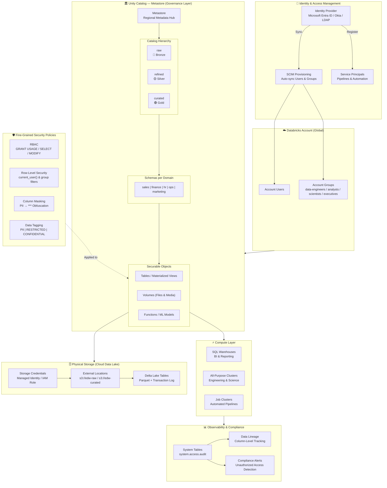
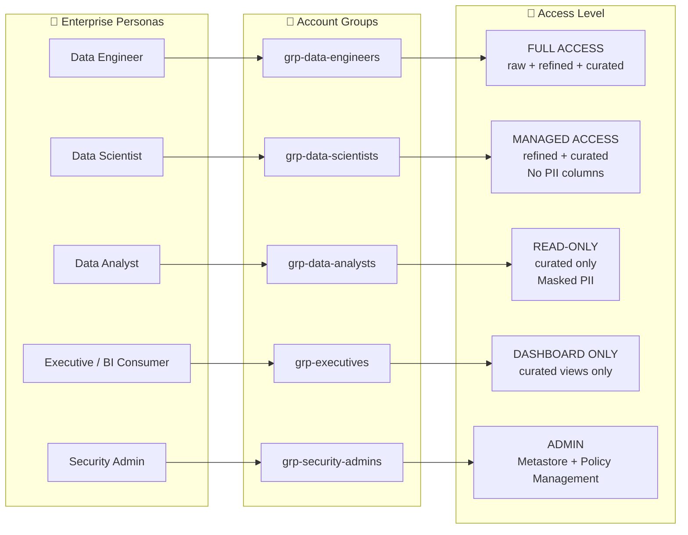
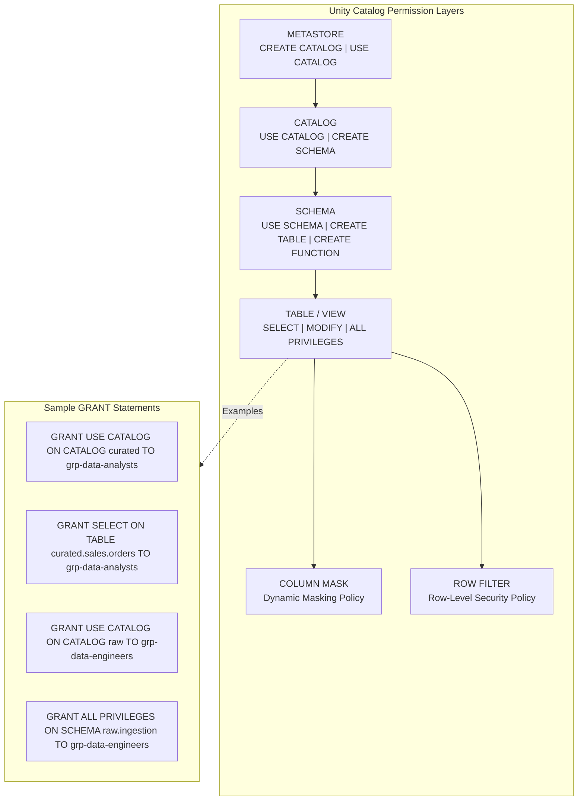
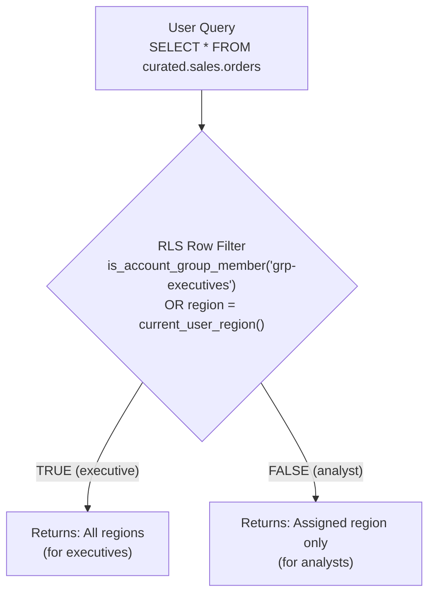
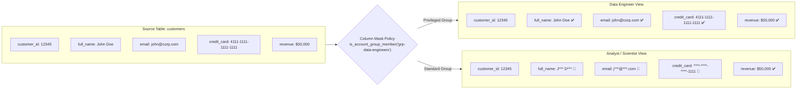
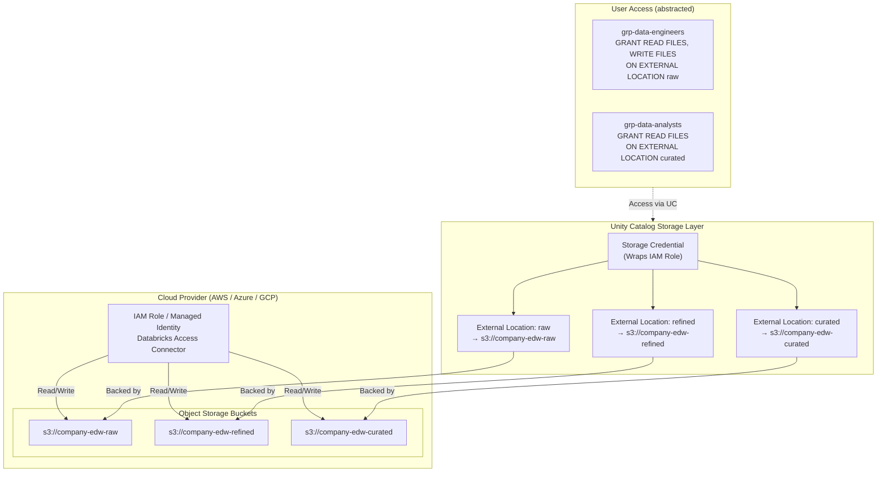
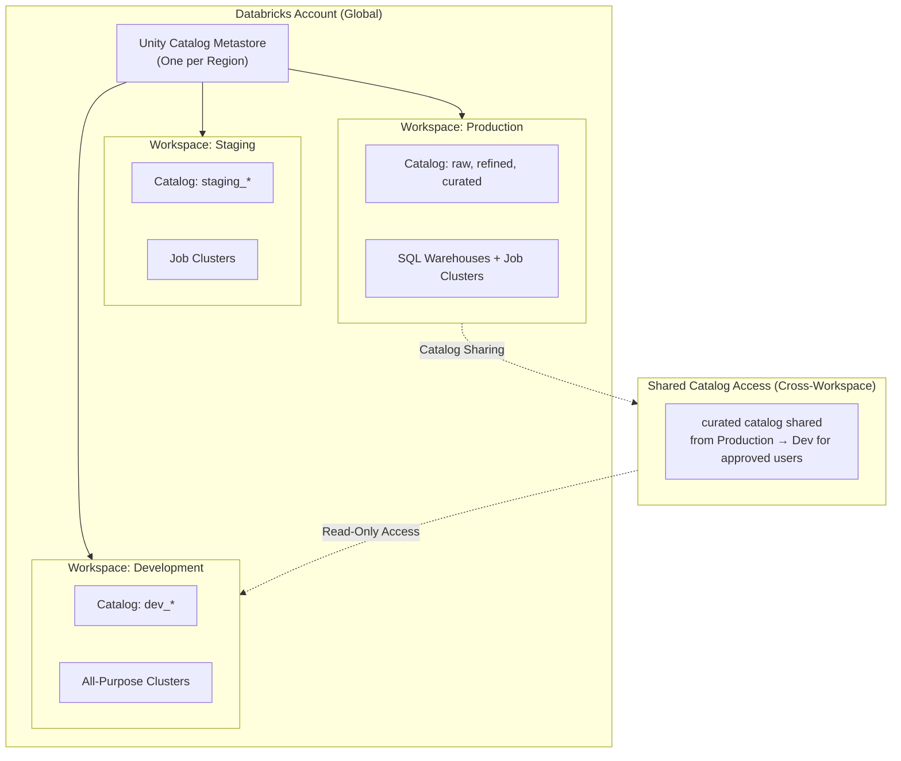
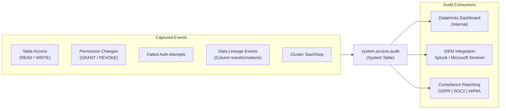
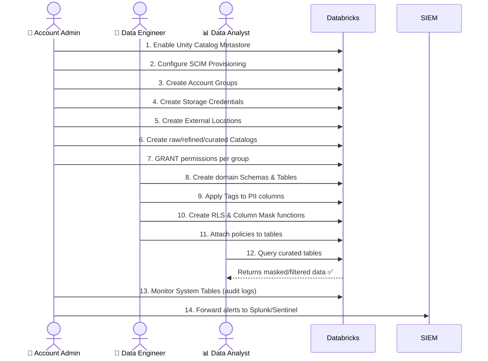

# Enterprise Data Access Control Architecture in Databricks

> **Platform**: Databricks with Unity Catalog  
> **Scope**: Enterprise Data Warehouse (EDW)  
> **Audience**: Solution Architects, Data Architects, Security Engineers

---

## 1. Overview

This document defines the **Data Access Control (DAC)** architecture for an Enterprise Data Warehouse running on Databricks. It leverages **Unity Catalog** as the central governance layer, combining **RBAC**, **ABAC**, and **fine-grained security** policies (Row-Level Security, Column Masking) to enforce least-privilege access across all data personas.

---

## 2. High-Level Architecture



---

## 3. Identity & Access Model

### 3.1 Persona-to-Group Mapping



---

## 4. Unity Catalog Permission Hierarchy



---

## 5. Data Security Policies

### 5.1 Row-Level Security (RLS)



**Implementation:**
```sql
-- Create row filter function
CREATE FUNCTION sales.row_filter_by_region(region_col STRING)
  RETURN is_account_group_member('grp-executives')
    OR region_col = session_context('user.region');

-- Apply to table
ALTER TABLE curated.sales.orders
  SET ROW FILTER sales.row_filter_by_region ON (region);
```

---

### 5.2 Column-Level Masking (PII Protection)



**Implementation:**
```sql
-- Create masking function for email
CREATE FUNCTION governance.mask_email(email STRING)
  RETURN CASE
    WHEN is_account_group_member('grp-data-engineers') THEN email
    ELSE regexp_replace(email, '(^[^@]{1})([^@]*)(@.*)', '$1***$3')
  END;

-- Apply to column
ALTER TABLE curated.customers
  ALTER COLUMN email
  SET MASK governance.mask_email;
```

---

## 6. Storage Security Architecture



---

## 7. Multi-Workspace Governance Model



---

## 8. Audit & Compliance



**Key Audit Queries:**
```sql
-- Find all SELECT events on PII tables in the last 7 days
SELECT
  user_identity.email,
  request_params.table_full_name,
  event_time,
  source_ip_address
FROM system.access.audit
WHERE action_name = 'SELECT'
  AND request_params.table_full_name LIKE '%.customers'
  AND event_time >= current_date() - INTERVAL 7 DAYS
ORDER BY event_time DESC;
```

---

## 9. Security Architecture Summary

| Layer                  | Mechanism                           | Enforced By         |
|------------------------|-------------------------------------|---------------------|
| Authentication         | OAuth2 / SCIM / Service Principals  | Identity Provider   |
| Authorization (Coarse) | RBAC Grants on Catalogs/Schemas     | Unity Catalog       |
| Authorization (Fine)   | Row Filters & Column Masks          | Unity Catalog       |
| Network Security       | Private Link / VPC Peering          | Cloud Provider      |
| Storage Security       | External Locations + Storage Creds  | Unity Catalog       |
| Data Classification    | Tags (PII / RESTRICTED)             | Unity Catalog Tags  |
| Audit & Monitoring     | System Tables + SIEM integration    | Databricks + SIEM   |
| Encryption             | AES-256 at-rest, TLS 1.3 in-transit | Cloud Provider      |

---

## 10. Key Architectural Principles

1.  **Zero Trust**: Every request is authenticated and authorized at the metadata level, regardless of which compute it originates from.
2.  **Least Privilege**: Users receive only the minimum permissions required for their role, enforced at the most granular level possible (column/row).
3.  **Centralized Governance**: Unity Catalog is the single plane for defining and enforcing all security policies — no bypassing through direct cloud storage access.
4.  **Separation of Duties**: Data Engineers manage pipelines and raw data ingestion; Security Admins manage policies; Analysts consume governed data.
5.  **Auditable by Default**: Every data access event is automatically captured in System Tables with no additional configuration required.

---

---

# 🛠️ Implementation Guide

This section provides **step-by-step instructions** and complete code for implementing the architecture above from scratch.

---

## Step 1: Prerequisites & Workspace Setup

### 1.1 Requirements Checklist

| Requirement | Details |
|---|---|
| Databricks Account | Account-level admin access |
| Cloud Provider | AWS (with IAM), Azure (with Entra ID), or GCP |
| Unity Catalog Metastore | Must be enabled at account level |
| Identity Provider | Microsoft Entra ID / Okta configured for SCIM |
| Terraform (optional) | >= v1.5 for IaC deployment |
| Databricks CLI | >= v0.200 |

### 1.2 Enable Unity Catalog (Account Admin)

> **Portal**: Go to `accounts.azuredatabricks.net` (Azure) or `accounts.cloud.databricks.com` (AWS)

**Step-by-step:**
1. Log in to the Databricks Account Console.
2. Navigate to **Data** > **Unity Catalog**.
3. Click **Create Metastore**.
4. Choose the cloud region matching your workspace.
5. Specify a root storage location (S3/ADLS Gen2/GCS bucket).
6. Attach the metastore to your workspace(s).

```bash
# Using Databricks CLI to assign metastore to workspace
databricks metastores assign \
  --workspace-id <YOUR_WORKSPACE_ID> \
  --metastore-id <YOUR_METASTORE_ID> \
  --default-catalog-name main
```

---

## Step 2: Identity & Group Setup (SCIM + Account Groups)

### 2.1 Configure SCIM Provisioning (Entra ID Example)

1. In **Azure Entra ID**, go to **Enterprise Applications** > **Databricks SCIM Connector**.
2. Set the **Tenant URL** to: `https://accounts.azuredatabricks.net/api/2.0/accounts/<ACCOUNT_ID>/scim/v2`
3. Generate a **SCIM Token** in Databricks Account Console under **Settings > Service Principals**.
4. Map your AD groups to Databricks groups in the **Attribute Mapping** section.
5. Enable **Automatic Provisioning**.

### 2.2 Create Account-Level Groups (SQL / API)

> Run in the **Account Console SQL** or via the REST API.

```python
# Using Databricks Python SDK to create account groups
from databricks.sdk import AccountClient

client = AccountClient()

groups = [
    "grp-data-engineers",
    "grp-data-scientists",
    "grp-data-analysts",
    "grp-executives",
    "grp-security-admins",
]

for group_name in groups:
    client.groups.create(display_name=group_name)
    print(f"Created group: {group_name}")
```

### 2.3 Add Users to Groups

```python
# Add a user to a group by display name
def add_user_to_group(client, user_email, group_name):
    # Find user
    user = next(client.users.list(filter=f"userName eq '{user_email}'"))
    # Find group
    group = next(client.groups.list(filter=f"displayName eq '{group_name}'"))
    # Patch group membership
    client.groups.patch(
        id=group.id,
        operations=[{
            "op": "add",
            "path": "members",
            "value": [{"value": user.id}]
        }]
    )
    print(f"Added {user_email} to {group_name}")

add_user_to_group(client, "john.doe@company.com", "grp-data-engineers")
```

---

## Step 3: Storage Credentials & External Locations

### 3.1 Create Storage Credential (AWS IAM Role Example)

**Prerequisites:** Create an IAM Role in AWS with the following trust policy for Databricks:

```json
{
  "Version": "2012-10-17",
  "Statement": [
    {
      "Effect": "Allow",
      "Principal": {
        "AWS": "arn:aws:iam::414351767826:root"
      },
      "Action": "sts:AssumeRole",
      "Condition": {
        "StringEquals": {
          "sts:ExternalId": "<DATABRICKS_ACCOUNT_ID>"
        }
      }
    }
  ]
}
```

Then attach an inline policy granting S3 access:

```json
{
  "Version": "2012-10-17",
  "Statement": [
    {
      "Effect": "Allow",
      "Action": [
        "s3:GetObject", "s3:PutObject", "s3:DeleteObject",
        "s3:ListBucket", "s3:GetBucketLocation"
      ],
      "Resource": [
        "arn:aws:s3:::company-edw-raw",
        "arn:aws:s3:::company-edw-raw/*",
        "arn:aws:s3:::company-edw-refined",
        "arn:aws:s3:::company-edw-refined/*",
        "arn:aws:s3:::company-edw-curated",
        "arn:aws:s3:::company-edw-curated/*"
      ]
    }
  ]
}
```

```sql
-- Step 1: Create Storage Credential (run as Metastore Admin)
CREATE STORAGE CREDENTIAL edw_storage_cred
  WITH IAM_ROLE 'arn:aws:iam::123456789012:role/databricks-edw-role';

-- Step 2: Validate it works
VALIDATE STORAGE CREDENTIAL edw_storage_cred;
```

### 3.2 Create External Locations

```sql
-- Bronze / Raw layer
CREATE EXTERNAL LOCATION raw_location
  URL 's3://company-edw-raw'
  WITH (STORAGE CREDENTIAL edw_storage_cred)
  COMMENT 'Raw ingestion zone - Bronze';

-- Silver / Refined layer
CREATE EXTERNAL LOCATION refined_location
  URL 's3://company-edw-refined'
  WITH (STORAGE CREDENTIAL edw_storage_cred)
  COMMENT 'Refined / transformed zone - Silver';

-- Gold / Curated layer
CREATE EXTERNAL LOCATION curated_location
  URL 's3://company-edw-curated'
  WITH (STORAGE CREDENTIAL edw_storage_cred)
  COMMENT 'Curated business-ready zone - Gold';

-- Grant engineers access to raw and refined
GRANT READ FILES, WRITE FILES
  ON EXTERNAL LOCATION raw_location
  TO `grp-data-engineers`;

GRANT READ FILES, WRITE FILES
  ON EXTERNAL LOCATION refined_location
  TO `grp-data-engineers`;

-- Grant analysts read-only access to curated
GRANT READ FILES
  ON EXTERNAL LOCATION curated_location
  TO `grp-data-analysts`;
```

---

## Step 4: Catalog, Schema & Table Provisioning

### 4.1 Create the Medallion Catalogs

```sql
-- Bronze: Raw ingestion (Data Engineers only)
CREATE CATALOG IF NOT EXISTS raw
  COMMENT 'Bronze layer - raw ingested data';

-- Silver: Refined / cleansed (Engineers + Scientists)
CREATE CATALOG IF NOT EXISTS refined
  COMMENT 'Silver layer - cleansed and transformed data';

-- Gold: Curated / aggregated (All analysts, Executives)
CREATE CATALOG IF NOT EXISTS curated
  COMMENT 'Gold layer - business-ready aggregated data';
```

### 4.2 Grant Catalog-Level Permissions (RBAC)

```sql
-- ============================================================
-- RAW CATALOG: Data Engineers only
-- ============================================================
GRANT USE CATALOG ON CATALOG raw TO `grp-data-engineers`;
GRANT CREATE SCHEMA, CREATE TABLE, CREATE VOLUME
  ON CATALOG raw TO `grp-data-engineers`;

-- ============================================================
-- REFINED CATALOG: Engineers + Scientists
-- ============================================================
GRANT USE CATALOG ON CATALOG refined TO `grp-data-engineers`;
GRANT USE CATALOG ON CATALOG refined TO `grp-data-scientists`;

GRANT CREATE SCHEMA, CREATE TABLE ON CATALOG refined
  TO `grp-data-engineers`;
GRANT SELECT ON CATALOG refined TO `grp-data-scientists`;

-- ============================================================
-- CURATED CATALOG: All personas (read-only for analysts+)
-- ============================================================
GRANT USE CATALOG ON CATALOG curated TO `grp-data-analysts`;
GRANT USE CATALOG ON CATALOG curated TO `grp-data-scientists`;
GRANT USE CATALOG ON CATALOG curated TO `grp-executives`;

GRANT SELECT ON CATALOG curated TO `grp-data-analysts`;
GRANT SELECT ON CATALOG curated TO `grp-data-scientists`;
GRANT SELECT ON CATALOG curated TO `grp-executives`;
```

### 4.3 Create Domain Schemas

```sql
-- Create schemas per business domain in each catalog
USE CATALOG curated;

CREATE SCHEMA IF NOT EXISTS sales     COMMENT 'Sales domain data';
CREATE SCHEMA IF NOT EXISTS finance   COMMENT 'Finance domain data';
CREATE SCHEMA IF NOT EXISTS hr        COMMENT 'Human resources data - PII sensitive';
CREATE SCHEMA IF NOT EXISTS ops       COMMENT 'Operations data';
CREATE SCHEMA IF NOT EXISTS marketing COMMENT 'Marketing and campaign data';

-- Grant schema usage
GRANT USE SCHEMA ON SCHEMA curated.sales     TO `grp-data-analysts`;
GRANT USE SCHEMA ON SCHEMA curated.finance   TO `grp-data-analysts`;
GRANT USE SCHEMA ON SCHEMA curated.marketing TO `grp-data-analysts`;

-- HR schema: restricted to specific groups only
GRANT USE SCHEMA ON SCHEMA curated.hr TO `grp-data-engineers`;
REVOKE USE SCHEMA ON SCHEMA curated.hr FROM `grp-data-analysts`;
```

### 4.4 Create Sample Tables

```sql
USE CATALOG curated;
USE SCHEMA sales;

-- Orders table (non-PII)
CREATE TABLE IF NOT EXISTS orders (
  order_id     BIGINT      NOT NULL COMMENT 'Primary key',
  customer_id  BIGINT      NOT NULL COMMENT 'FK to customers',
  region       STRING      NOT NULL COMMENT 'Sales region',
  order_date   DATE        NOT NULL,
  amount       DECIMAL(15,2),
  status       STRING
)
USING DELTA
LOCATION 's3://company-edw-curated/sales/orders'
COMMENT 'Sales orders - non-PII';

-- Customers table (contains PII - will have masking applied)
CREATE TABLE IF NOT EXISTS customers (
  customer_id  BIGINT    NOT NULL COMMENT 'Primary key',
  full_name    STRING    NOT NULL COMMENT 'PII: customer full name',
  email        STRING    NOT NULL COMMENT 'PII: email address',
  phone        STRING             COMMENT 'PII: phone number',
  credit_card  STRING             COMMENT 'PII: credit card number',
  region       STRING,
  created_date DATE
)
USING DELTA
LOCATION 's3://company-edw-curated/sales/customers'
TBLPROPERTIES ('delta.enableChangeDataFeed' = 'true')
COMMENT 'Customer master - contains PII data';

-- Tag PII columns for governance
ALTER TABLE curated.sales.customers
  ALTER COLUMN full_name   SET TAGS ('pii' = 'true', 'classification' = 'RESTRICTED');
ALTER TABLE curated.sales.customers
  ALTER COLUMN email       SET TAGS ('pii' = 'true', 'classification' = 'RESTRICTED');
ALTER TABLE curated.sales.customers
  ALTER COLUMN phone       SET TAGS ('pii' = 'true', 'classification' = 'RESTRICTED');
ALTER TABLE curated.sales.customers
  ALTER COLUMN credit_card SET TAGS ('pii' = 'true', 'classification' = 'CONFIDENTIAL');
```

---

## Step 5: Row-Level Security & Column Masking

### 5.1 Create a Governance Schema for Policy Functions

```sql
USE CATALOG curated;

-- Dedicated schema for all security policy functions
CREATE SCHEMA IF NOT EXISTS governance
  COMMENT 'Reusable security policy functions (RLS + Column Masks)';
```

### 5.2 Row-Level Security — Regional Filter

```sql
USE SCHEMA curated.governance;

-- RLS: Filter orders by region based on group membership
-- Executives see everything; analysts see only their assigned region
CREATE OR REPLACE FUNCTION rls_region_filter(record_region STRING)
  RETURNS BOOLEAN
  RETURN
    is_account_group_member('grp-executives')
    OR is_account_group_member('grp-data-engineers')
    OR record_region = current_user();
    -- In production, replace current_user() with a user-attribute lookup
    -- e.g., a mapping table: SELECT region FROM user_region_map WHERE user = current_user()

-- Apply RLS to the orders table
ALTER TABLE curated.sales.orders
  SET ROW FILTER curated.governance.rls_region_filter ON (region);

-- Verify the filter is applied
DESCRIBE EXTENDED curated.sales.orders;
```

### 5.3 Row-Level Security — HR Data Department Filter

```sql
-- HR use case: employees see only their own department
CREATE OR REPLACE FUNCTION rls_hr_department_filter(dept_id INT)
  RETURNS BOOLEAN
  RETURN
    is_account_group_member('grp-data-engineers')
    OR is_account_group_member('grp-security-admins')
    OR dept_id IN (
      SELECT department_id
      FROM curated.hr.user_department_map
      WHERE user_email = current_user()
    );

ALTER TABLE curated.hr.employee_records
  SET ROW FILTER curated.governance.rls_hr_department_filter ON (department_id);
```

### 5.4 Column Masking Functions — Full PII Suite

```sql
USE SCHEMA curated.governance;

-- ─────────────────────────────────────────────
-- MASK: Email address
-- Engineers see full email; others see j***@***.com
-- ─────────────────────────────────────────────
CREATE OR REPLACE FUNCTION mask_email(email STRING)
  RETURNS STRING
  RETURN CASE
    WHEN is_account_group_member('grp-data-engineers') THEN email
    WHEN email IS NULL THEN NULL
    ELSE regexp_replace(email, '(^[^@]{1})([^@]*)(@[^.]+)(.*)', '$1***$3***')
  END;

-- ─────────────────────────────────────────────
-- MASK: Full name (show initials only)
-- ─────────────────────────────────────────────
CREATE OR REPLACE FUNCTION mask_full_name(full_name STRING)
  RETURNS STRING
  RETURN CASE
    WHEN is_account_group_member('grp-data-engineers') THEN full_name
    WHEN full_name IS NULL THEN NULL
    ELSE concat(left(full_name, 1), '*** ', split(full_name, ' ')[1][0], '***')
  END;

-- ─────────────────────────────────────────────
-- MASK: Phone number (show last 4 digits)
-- ─────────────────────────────────────────────
CREATE OR REPLACE FUNCTION mask_phone(phone STRING)
  RETURNS STRING
  RETURN CASE
    WHEN is_account_group_member('grp-data-engineers') THEN phone
    WHEN phone IS NULL THEN NULL
    ELSE concat('***-***-', right(regexp_replace(phone, '[^0-9]', ''), 4))
  END;

-- ─────────────────────────────────────────────
-- MASK: Credit card (show last 4 digits only)
-- ─────────────────────────────────────────────
CREATE OR REPLACE FUNCTION mask_credit_card(cc STRING)
  RETURNS STRING
  RETURN CASE
    WHEN is_account_group_member('grp-data-engineers') THEN cc
    WHEN cc IS NULL THEN NULL
    ELSE concat('****-****-****-', right(regexp_replace(cc, '[^0-9]', ''), 4))
  END;

-- ─────────────────────────────────────────────
-- Apply all masks to the customers table
-- ─────────────────────────────────────────────
ALTER TABLE curated.sales.customers
  ALTER COLUMN full_name   SET MASK curated.governance.mask_full_name;

ALTER TABLE curated.sales.customers
  ALTER COLUMN email       SET MASK curated.governance.mask_email;

ALTER TABLE curated.sales.customers
  ALTER COLUMN phone       SET MASK curated.governance.mask_phone;

ALTER TABLE curated.sales.customers
  ALTER COLUMN credit_card SET MASK curated.governance.mask_credit_card;
```

### 5.5 Verify Security Policies (Test as Analyst)

```sql
-- Switch context to simulate analyst user
-- In a real test: log in with an analyst account and run:
SELECT * FROM curated.sales.customers LIMIT 5;

-- Expected output for analyst (grp-data-analysts):
-- customer_id | full_name | email            | phone        | credit_card
-- 1001        | J*** D*** | j***@***.com     | ***-***-5678 | ****-****-****-1111
-- 1002        | A*** S*** | a***@***.com     | ***-***-9012 | ****-****-****-2222

-- Expected output for engineer (grp-data-engineers) — unmasked:
-- customer_id | full_name  | email           | phone         | credit_card
-- 1001        | John Doe   | john@corp.com   | 555-123-5678  | 4111-1111-1111-1111
```

---

## Step 6: Service Principal for Automated Pipelines

```sql
-- Create a service principal in the Account Console first, then:

-- Grant it access to ingest into the raw catalog
GRANT USE CATALOG ON CATALOG raw TO `sp-edw-ingestion-pipeline`;
GRANT CREATE TABLE, MODIFY ON SCHEMA raw.sales TO `sp-edw-ingestion-pipeline`;

-- Grant it access to write to refined
GRANT USE CATALOG ON CATALOG refined TO `sp-edw-ingestion-pipeline`;
GRANT CREATE TABLE, MODIFY ON CATALOG refined TO `sp-edw-ingestion-pipeline`;

-- DENY direct write to curated (transformation pipelines only read from refined)
REVOKE MODIFY ON CATALOG curated FROM `sp-edw-ingestion-pipeline`;
GRANT SELECT ON CATALOG curated TO `sp-edw-ingestion-pipeline`;
```

```python
# Python: Run a pipeline job using a Service Principal token
import requests

DATABRICKS_HOST = "https://<workspace>.azuredatabricks.net"
SP_TOKEN = "<service-principal-token>"  # from OAuth M2M flow

headers = {"Authorization": f"Bearer {SP_TOKEN}"}

# Trigger a Databricks Job
response = requests.post(
    f"{DATABRICKS_HOST}/api/2.1/jobs/run-now",
    headers=headers,
    json={"job_id": 12345}
)
print(response.json())
```

---

## Step 7: Terraform Infrastructure as Code (IaC)

> Automate catalog, schema, and permission provisioning using the **Databricks Terraform Provider**.

### 7.1 `main.tf` — Provider Setup

```hcl
terraform {
  required_providers {
    databricks = {
      source  = "databricks/databricks"
      version = "~> 1.40"
    }
  }
}

provider "databricks" {
  host  = var.databricks_host
  token = var.databricks_token
}
```

### 7.2 `catalogs.tf` — Medallion Catalogs

```hcl
resource "databricks_catalog" "raw" {
  name    = "raw"
  comment = "Bronze layer - raw ingested data"
}

resource "databricks_catalog" "refined" {
  name    = "refined"
  comment = "Silver layer - cleansed and transformed"
}

resource "databricks_catalog" "curated" {
  name    = "curated"
  comment = "Gold layer - business-ready data"
}
```

### 7.3 `schemas.tf` — Domain Schemas

```hcl
locals {
  domains = ["sales", "finance", "hr", "ops", "marketing"]
}

resource "databricks_schema" "curated_domains" {
  for_each     = toset(local.domains)
  catalog_name = databricks_catalog.curated.name
  name         = each.value
  comment      = "${each.value} domain data"
}
```

### 7.4 `grants.tf` — RBAC Permissions

```hcl
# Engineers get full access to raw
resource "databricks_grants" "raw_engineers" {
  catalog = databricks_catalog.raw.name
  grant {
    principal  = "grp-data-engineers"
    privileges = ["USE_CATALOG", "CREATE_SCHEMA", "CREATE_TABLE", "MODIFY", "SELECT"]
  }
}

# Analysts get read-only to curated
resource "databricks_grants" "curated_analysts" {
  catalog = databricks_catalog.curated.name
  grant {
    principal  = "grp-data-analysts"
    privileges = ["USE_CATALOG", "SELECT"]
  }
  grant {
    principal  = "grp-executives"
    privileges = ["USE_CATALOG", "SELECT"]
  }
  grant {
    principal  = "grp-data-scientists"
    privileges = ["USE_CATALOG", "SELECT"]
  }
}
```

### 7.5 `storage.tf` — Credentials & External Locations

```hcl
resource "databricks_storage_credential" "edw_cred" {
  name = "edw_storage_cred"
  aws_iam_role {
    role_arn = var.iam_role_arn
  }
  comment = "Storage credential for EDW S3 buckets"
}

resource "databricks_external_location" "raw" {
  name            = "raw_location"
  url             = "s3://${var.raw_bucket}"
  credential_name = databricks_storage_credential.edw_cred.name
  comment         = "Raw ingestion zone"
}

resource "databricks_grants" "raw_location_grants" {
  external_location = databricks_external_location.raw.name
  grant {
    principal  = "grp-data-engineers"
    privileges = ["READ_FILES", "WRITE_FILES"]
  }
}
```

### 7.6 Deploy Terraform

```bash
# Initialize and plan
terraform init
terraform plan -var-file="prod.tfvars"

# Apply
terraform apply -var-file="prod.tfvars" -auto-approve

# Verify state
terraform state list | grep databricks
```

---

## Step 8: Audit Monitoring & Compliance Queries

### 8.1 Enable System Tables

```sql
-- Enable the system catalog (run as Account Admin)
-- System tables are automatically available via Unity Catalog

-- Key system tables:
-- system.access.audit       - All audit events
-- system.access.column_lineage  - Column-level lineage
-- system.access.table_lineage   - Table-level lineage
-- system.billing.usage      - Cost and usage data
```

### 8.2 Useful Compliance Queries

```sql
-- ─────────────────────────────────────
-- 1. Top users accessing PII tables
-- ─────────────────────────────────────
SELECT
  user_identity.email                       AS user_email,
  request_params.table_full_name            AS table_name,
  COUNT(*)                                  AS access_count,
  MAX(event_time)                           AS last_accessed
FROM system.access.audit
WHERE action_name IN ('SELECT', 'describeDeltaHistory')
  AND request_params.table_full_name LIKE '%customers%'
  AND event_time >= current_date() - INTERVAL 30 DAYS
GROUP BY 1, 2
ORDER BY access_count DESC;

-- ─────────────────────────────────────
-- 2. Detect unauthorized access attempts
-- ─────────────────────────────────────
SELECT
  event_time,
  user_identity.email AS user_email,
  action_name,
  request_params,
  response.error_message
FROM system.access.audit
WHERE response.status_code IN (401, 403)
  AND event_time >= current_date() - INTERVAL 7 DAYS
ORDER BY event_time DESC;

-- ─────────────────────────────────────
-- 3. GRANT/REVOKE changes audit log
-- ─────────────────────────────────────
SELECT
  event_time,
  user_identity.email             AS changed_by,
  action_name,
  request_params.securable_type   AS object_type,
  request_params.securable_full_name AS object_name,
  request_params.changes
FROM system.access.audit
WHERE action_name IN ('updatePermissions', 'grantPrivilege', 'revokePrivilege')
  AND event_time >= current_date() - INTERVAL 30 DAYS
ORDER BY event_time DESC;

-- ─────────────────────────────────────
-- 4. Data lineage: trace column origin
-- ─────────────────────────────────────
SELECT
  source_table_full_name,
  source_column_name,
  target_table_full_name,
  target_column_name,
  event_time
FROM system.access.column_lineage
WHERE target_table_full_name = 'curated.sales.customers'
ORDER BY event_time DESC;

-- ─────────────────────────────────────
-- 5. Weekly active users per catalog
-- ─────────────────────────────────────
SELECT
  date_trunc('week', event_time)           AS week,
  split(request_params.table_full_name, '\.')[0] AS catalog,
  COUNT(DISTINCT user_identity.email)      AS unique_users,
  COUNT(*)                                 AS total_queries
FROM system.access.audit
WHERE action_name = 'SELECT'
  AND event_time >= current_date() - INTERVAL 90 DAYS
GROUP BY 1, 2
ORDER BY week DESC, catalog;
```

### 8.3 Set Up Databricks SQL Alert for Unauthorized Access

```sql
-- Create an alert query in Databricks SQL
-- Alert: Triggers when unauthorized_attempts > 0

SELECT COUNT(*) AS unauthorized_attempts
FROM system.access.audit
WHERE response.status_code = 403
  AND event_time >= now() - INTERVAL 1 HOUR;

-- Configure the alert:
-- 1. Go to Databricks SQL > Alerts > New Alert
-- 2. Set query above as the alert query
-- 3. Condition: Value > 0
-- 4. Refresh: Every 1 hour
-- 5. Notification: Slack webhook / Email / PagerDuty
```

---

## Step 9: End-to-End Validation Checklist

Run these checks after deployment to validate the full architecture:

```sql
-- ✅ 1. Verify catalogs exist
SHOW CATALOGS;

-- ✅ 2. Verify schemas exist
SHOW SCHEMAS IN curated;

-- ✅ 3. Verify external locations
SHOW EXTERNAL LOCATIONS;

-- ✅ 4. Verify governance functions exist
SHOW FUNCTIONS IN curated.governance;

-- ✅ 5. Verify RLS is applied to orders table
DESCRIBE EXTENDED curated.sales.orders;
-- Look for: Row Filter: curated.governance.rls_region_filter

-- ✅ 6. Verify column masks are applied
DESCRIBE EXTENDED curated.sales.customers;
-- Look for: Mask Function on email, full_name, phone, credit_card columns

-- ✅ 7. Check current user permissions
SHOW GRANTS ON CATALOG curated;
SHOW GRANTS ON TABLE curated.sales.customers;

-- ✅ 8. Verify audit logs are flowing
SELECT COUNT(*) FROM system.access.audit
WHERE event_time >= current_date() - INTERVAL 1 DAYS;

-- ✅ 9. Test access as analyst (switch user or use run-as)
-- As analyst: SELECT * FROM curated.sales.customers LIMIT 1
-- Confirm PII columns are masked

-- ✅ 10. Test access as engineer (switch user or use run-as)
-- As engineer: SELECT * FROM curated.sales.customers LIMIT 1
-- Confirm PII columns are NOT masked
```

---

## Implementation Summary



