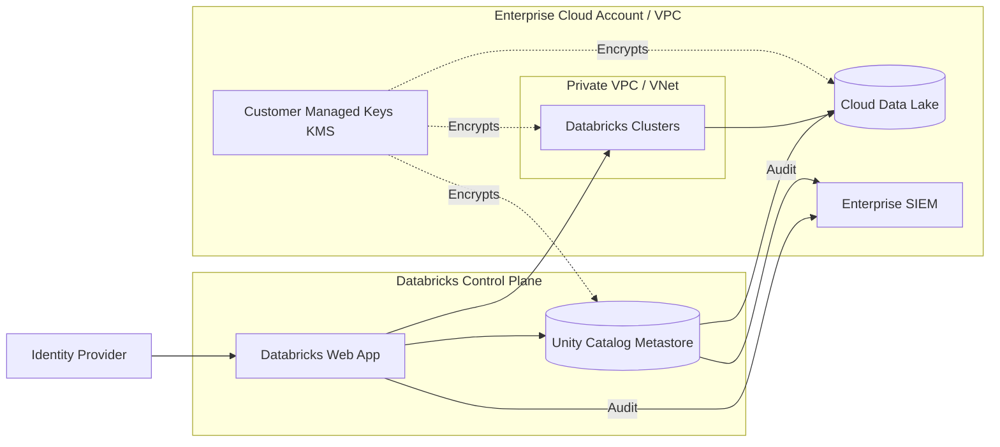
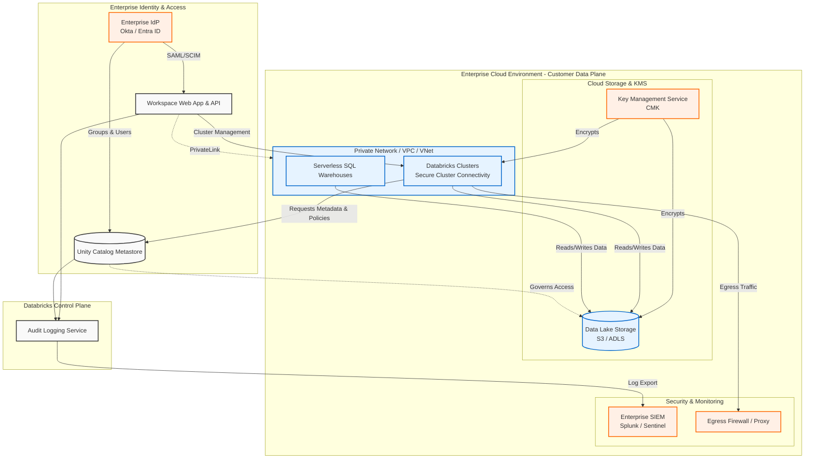

# Enterprise Databricks Governance & Security Architecture

## 1. Requirements for Governance & Security Architecture

To design a robust enterprise-grade solution in Databricks, the architecture must satisfy the following core requirements across governance, security, and compliance:

### 1.1 Data Governance & Discovery
* **Centralized Metadata Management**: A single, unified metastore across all workspaces (Dev, QA, Prod) to manage data assets, preventing data silos.
* **Data Lineage**: Automated tracking of table-level and column-level data lineage to understand data flow, dependencies, and impact analysis.
* **Data Discovery & Cataloging**: Ability to tag data assets (e.g., PII, PHI) and provide business context for data consumers.

### 1.2 Identity & Access Management (IAM)
* **Centralized Identity**: Integration with Enterprise Identity Provider (IdP) like Azure Entra ID, Okta, or Ping Identity via SAML 2.0 (SSO) and SCIM (automated user/group provisioning).
* **Fine-Grained Access Control (FGAC)**: Support for Row-Level Security (RLS) to restrict record visibility based on user attributes/regions, and Column-Level Security (CLS) or Dynamic Data Masking to protect sensitive fields.
* **Service Principals**: Use of non-human identities for automated CI/CD pipelines, orchestrators (e.g., Airflow, dbt), and scheduled jobs, adhering to the principle of least privilege.

### 1.3 Network Security
* **Network Isolation**: Databricks compute resources must reside within the enterprise's private Virtual Network (VNet) or Virtual Private Cloud (VPC) with no public IP addresses assigned to worker nodes (Secure Cluster Connectivity).
* **Private Connectivity**: Traffic between the Databricks Control Plane, Data Plane, and Cloud Storage must traverse private network backbones (e.g., AWS PrivateLink, Azure Private Link) without exposing data to the public internet.
* **Access Restrictions**: IP Access Lists configured to ensure users can only access the Databricks workspace from the corporate VPN or trusted network ranges.
* **Egress Control**: Strict firewall rules or network security groups to prevent data exfiltration to unauthorized external endpoints.

### 1.4 Data Protection & Encryption
* **Encryption at Rest**: All data stored in the cloud data lake (S3/ADLS/GCS), Databricks root storage, and EBS/Managed Disks must be encrypted using Customer-Managed Keys (CMK) managed via enterprise Key Management Service (AWS KMS / Azure Key Vault).
* **Encryption in Transit**: All data in transit between clients, the control plane, data plane, and storage must be encrypted using TLS 1.2 or higher.
* **Secret Management**: No hardcoded credentials. Passwords and API keys must be managed in a secure vault (Databricks Secrets or Azure Key Vault) and referenced securely in code.

### 1.5 Auditing & Monitoring
* **Audit Logging**: Comprehensive logging of all user activities, data access, cluster creations, and permission changes, routed to a centralized SIEM (e.g., Splunk, Microsoft Sentinel) for monitoring and alerting.
* **System Tables**: Leveraging Unity Catalog System Tables to monitor access patterns, storage usage, and data lineage natively.

---

## 2. Solution Architecture Design

The following diagrams illustrate the Enterprise Governance and Security Architecture in Databricks, highlighting the separation between the Control Plane and the Customer Data Plane, Unity Catalog integration, and security boundaries.

### Key Architectural Components

1. **Unity Catalog (Governance Layer)**:
   * Acts as the centralized governance layer across the enterprise.
   * Defines Catalogs, Schemas, Tables, and Views.
   * Enforces Row-Level Security (RLS) via Dynamic Views and Column-Level Security (CLS) via Data Masking.

2. **Network Security Boundary**:
   * The Customer Data Plane is deployed in a dedicated VPC/VNet.
   * **Secure Cluster Connectivity (No Public IPs)** ensures nodes only communicate privately with the Control Plane.
   * **PrivateLink / Private Endpoint** ensures users access the Web App privately, and the Data Plane communicates with the Control Plane over the cloud provider's backbone.

3. **Data Protection Boundary**:
   * **Customer-Managed Keys (CMK)** are used to encrypt Managed Disks attached to cluster nodes, data in the Unity Catalog Metastore, and data resting in the Cloud Data Lake.

4. **Auditing Boundary**:
   * Databricks audit logs are exported to the enterprise SIEM for continuous security monitoring, threat detection, and compliance reporting. Unity Catalog system tables are used for internal observability.
