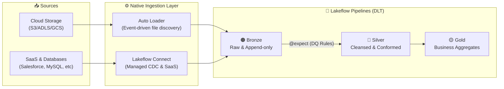
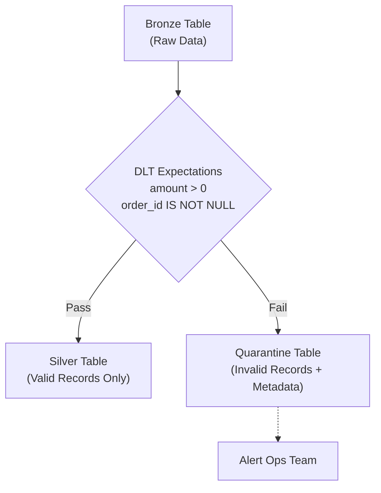

# Enterprise Ingestion Architecture in Databricks
*Standard Design & Operational Resilience*

> **Platform**: Databricks Lakehouse (Lakeflow + Unity Catalog)
> **Audience**: Solution Architects, Data Architects, Data Engineers

---

## 1. Core Architectural Standard

To prevent architectural fragmentation, we standardize on a unified **Lakeflow** ingestion pattern. This single "Happy Path" handles 90% of enterprise workloads without requiring third-party tools or complex custom streaming logic.

### 1.1 The "Happy Path" Blueprint



### 1.2 The Standard Tools

We define strict tool mappings based on the source data format:

| Source Type | Standard Tool | Why It's the Standard |
|---|---|---|
| **Files in Cloud Storage** | **Auto Loader** | Ingests millions of files continuously using event notifications. Automatically handles schema evolution. |
| **Databases & SaaS** | **Lakeflow Connect** | Fully managed log-based CDC and SaaS sync. Zero maintenance; data lands directly into Unity Catalog. |
| **Transformation / Pipeline** | **Lakeflow Pipelines (DLT)** | Declarative framework that natively handles dependencies, state, retries, and data quality routing. |
| **Orchestration** | **Lakeflow Jobs** | Manages the DAG, alerting, and schedules. |

---

## 2. Operational Resilience (The "Unhappy Path")

A production-grade architecture must anticipate and gracefully handle failures, bad data, and schema drift. The sections below define the standard operational patterns.

### 2.1 Fault Tolerance & State Recovery

**Challenge:** Clusters crash, network partitions occur, and APIs throttle. Pipelines must recover without duplicating data or dropping records.

**Standard Solution: Unified Checkpointing**
Our architecture relies exclusively on **Pipeline Checkpoints** rather than manual offsets or high-water marks.

*   **Auto Loader Checkpoints:** Auto Loader maintains an internal RocksDB state store tracking exactly which files have been processed. If the pipeline crashes midway, upon restart, it reads the checkpoint and resumes exactly where it left off.
*   **DLT Checkpoints:** DLT manages the state of the Silver/Gold micro-batch processing.

*Architectural Requirement:* Checkpoints must be stored in **Unity Catalog Volumes** (not DBFS) to ensure governance and cross-workspace portability.

```python
# Example: Setting resilient checkpoint locations
.option(
  "checkpointLocation", 
  "/Volumes/raw_catalog/ingestion/checkpoints/orders"
)
```

### 2.2 Retry Strategies vs. Auto-Recovery

**Challenge:** Distinguishing between transient failures (e.g., network timeout) and fatal logic errors (e.g., bad cast).

**Standard Solution:**
1.  **Pipeline-Level Auto-Recovery (DLT):** DLT handles transient cluster issues automatically. If an executor dies, DLT re-provisions and restarts the micro-batch. Do *not* write custom retry loops in your code.
2.  **Job-Level Retries (Lakeflow Jobs):** For tasks connecting to external systems (e.g., an API trigger task), configure retries at the Workflow level with exponential backoff.

```yaml
# Lakeflow Job YAML configuration for retries
tasks:
  - task_key: trigger_external_system
    max_retries: 3
    min_retry_interval_millis: 60000  # 1 minute backoff
    retry_on_timeout: true
```

### 2.3 Backfill & Historical Replay

**Challenge:** A bug is found in Silver, or historical data needs to be restated.

**Standard Solution: The "Drop and Recompute" Pattern**
Because our **Bronze layer is strictly append-only** (never updated/deleted), we can treat it as an immutable event log for replay.

1.  **Perform the Fix:** Update the DLT transformation logic in code.
2.  **Full Refresh:** Trigger a `Full Refresh` on the DLT pipeline from the Databricks UI/API.
    *   DLT will automatically drop the Silver and Gold tables, clear its processing state, and re-read the entire history from Bronze.
    *   No custom backfill scripts are required.

*For very large datasets (Petabytes):* Use DLT's `Refresh Selection` to target specific tables rather than dropping the entire downstream warehouse.

### 2.4 Data Quality & Quarantine (Dead Letter Queues)

**Challenge:** Upstream systems send malformed data (e.g., negative revenues, null IDs). Hard-failing the pipeline stops all data flow; silently dropping data hides the issue.

**Standard Solution: DLT Expectations & Quarantine**
We use `@dlt.expect` rules to enforce quality. Bad records are routed to a **Quarantine Table** (Dead Letter Queue) while good records continue flowing.



```python
# The Standard Quarantine Pattern
import dlt

# 1. Main Silver Table (Good data)
@dlt.table(name="orders_silver")
@dlt.expect_or_drop("valid_amount", "amount > 0")
def orders_silver():
    return dlt.read_stream("orders_raw")

# 2. Quarantine Table (Bad data captured for review)
@dlt.table(name="orders_quarantine")
@dlt.expect_all_or_drop({"invalid_amount": "amount <= 0"})
def orders_quarantine():
    return dlt.read_stream("orders_raw")
```

### 2.5 Schema Drift & Evolution

**Challenge:** Upstream systems add columns, rename fields, or change data types without notifying the data team.

**Standard Solution: Auto-Rescue & Schema Evolution**
We do not hard-code schemas in Bronze. We rely on Auto Loader / Lakeflow Connect to handle drift dynamically.

*   **addNewColumns:** We configure ingestion to automatically append new upstream columns to the Delta table schema without breaking the pipeline.
*   **Rescued Data:** If upstream sends an unexpected data type (e.g., a String in an Integer column), the pipeline does not crash. The un-castable data is moved to a `_rescued_data` JSON column.

```python
# Auto Loader configuration for schema drift
.option("cloudFiles.schemaEvolutionMode", "addNewColumns")
```

---

## 3. Advanced / Edge Case Patterns

The core architecture (Section 1 & 2) handles the vast majority of cases. The following tools should *only* be used when the standard path cannot be applied.

### 3.1 COPY INTO (Idempotent Batch)
*   **When to use:** One-time historical migrations, or very small, infrequent batch drops where the continuous monitoring of Auto Loader is overkill.
*   **Why it's not standard:** Does not handle complex schema evolution as elegantly as Auto Loader; struggles with directory scale exceeding thousands of files.

### 3.2 Manual Structured Streaming & MERGE INTO
*   **When to use:** Legacy Spark applications, or highly custom windowed aggregations that DLT does not yet support.
*   **Why it's not standard:** Requires manual checkpoint management, custom `foreachBatch` logic for upserts, and custom code to handle out-of-order data—all of which DLT handles natively.

---

## 4. Best Practices for Databricks Ingestion

To ensure pipelines remain performant and cost-effective as data volume scales, adhere to these Databricks-native best practices:

### 4.1 Use Liquid Clustering over Hive Partitioning
Historically, ingestion tables were partitioned by `date` to improve query performance. **Do not use Hive-style partitioning for new ingestion tables.**
*   **Best Practice:** Enable **Liquid Clustering** on your Delta tables. It automatically adapts to your data layout without suffering from the "small file problem" or over-partitioning that plagues traditional approaches.
*   **Implementation:** In DLT, simply add the table property: `table_properties={"delta.clusterBy": "event_date, source_id"}`

### 4.2 Use `Trigger.AvailableNow` for Cost Savings
Unless your business requirement explicitly dictates sub-minute latency, do not run Auto Loader or Structured Streaming in continuous mode.
*   **Best Practice:** Configure your pipelines to use `AvailableNow=True` (or trigger them on a schedule in Lakeflow Jobs). This spins up the cluster, processes all pending files/events, and then shuts down the compute, saving significant DBUs.

### 4.3 Compute Sizing for Ingestion
Ingestion is typically an I/O-bound operation, not a CPU-bound one. 
*   **Best Practice:** Do not overprovision clusters for Auto Loader or Lakeflow Connect jobs. Use smaller cluster sizes or, ideally, **Serverless Compute** for DLT pipelines. Serverless automatically scales the compute up to handle large data spikes and scales down instantly.

### 4.4 The Immutable Bronze Layer
*   **Best Practice:** Never run `DELETE` or `UPDATE` statements against a Bronze table. The Bronze layer must remain a pure, append-only historical log of everything received from the source. All deduplication, CDC merges, and error corrections must happen in the Silver layer. This guarantees you can always rebuild your downstream data from scratch.

---

## 5. Common Operational Issues & Troubleshooting

Even with a resilient architecture, operators frequently encounter these common ingestion issues. Here is how the architecture is designed to handle them:

### 5.1 Auto Loader Checkpoint Corruption or Mismatch
*   **The Issue:** The underlying cloud files are manually deleted or moved, but the Auto Loader checkpoint still expects them. The pipeline fails with "File not found" errors.
*   **The Fix:** Never manually alter the checkpoint directory. If corruption occurs, do not attempt to edit the RocksDB state. Instead, clear the checkpoint directory and trigger a DLT Full Refresh to rebuild the state cleanly from the remaining source files.

### 5.2 Schema Evolution Type Conflicts
*   **The Issue:** Upstream systems change a column's data type (e.g., from `INT` to `STRING`). While `addNewColumns` handles *new* columns perfectly, type conflicts will cause the pipeline to fail because Delta Lake enforces strict typing.
*   **The Fix:** Use the `_rescued_data` column. Auto Loader will place the un-castable string data into this JSON column rather than failing the pipeline. You can then parse this rescued data in the Silver layer using custom logic, or drop the target table column to let it recreate with the new type during a refresh.

### 5.3 The Small File Problem (Even with Liquid Clustering)
*   **The Issue:** Extremely high-frequency streaming (e.g., 1-second triggers) creates thousands of tiny Parquet files. Before Liquid Clustering or Auto Compaction can catch up, downstream read queries become unacceptably slow due to metadata overhead.
*   **The Fix:** Avoid continuous streaming for ingestion unless absolutely necessary. Switching to `Trigger.AvailableNow` (micro-batching) naturally batches writes into larger, optimal file sizes. For the remaining fragmentation, schedule a daily `OPTIMIZE` job on the Bronze tables.

### 5.4 Lakeflow Connect (CDC) Replication Lag
*   **The Issue:** The managed database connector falls behind the source database transaction log, especially during massive upstream bulk updates or long-running transactions.
*   **The Fix:** Monitor the replication lag metrics provided by Lakeflow Connect. Ensure the source database's transaction log (e.g., Postgres WAL) has sufficient retention configured so that Databricks doesn't lose events if the pipeline is temporarily paused. 

### 5.5 DLT "Full Refresh" Accidental Data Loss
*   **The Issue:** An operator runs a "Full Refresh" on a DLT pipeline to fix a bug in Silver. However, the raw files in cloud storage had a 30-day retention policy and were deleted. The Full Refresh drops the Silver table and can only rebuild the last 30 days of history, permanently losing older data.
*   **The Fix:** The Bronze layer must be treated as the ultimate source of truth. **Never configure automatic deletion/retention policies on the raw cloud storage buckets** unless you are absolutely certain that data will never need to be replayed. Cloud storage is cheap; losing historical events is expensive.

---

## 6. Architectural Summary Checklist

Before deploying a new ingestion pipeline, ensure it meets these criteria:

- [ ] Does it use Lakeflow Connect (for apps/DBs) or Auto Loader (for files)?
- [ ] Is the Bronze layer append-only?
- [ ] Are checkpoints saved to a Unity Catalog Volume?
- [ ] Are transient errors handled by DLT auto-recovery rather than custom code?
- [ ] Are bad records routed to a Quarantine table via Expectations?
- [ ] Can the pipeline be backfilled by simply doing a DLT "Full Refresh"?
- [ ] Is the pipeline using Liquid Clustering instead of traditional partitioning?
