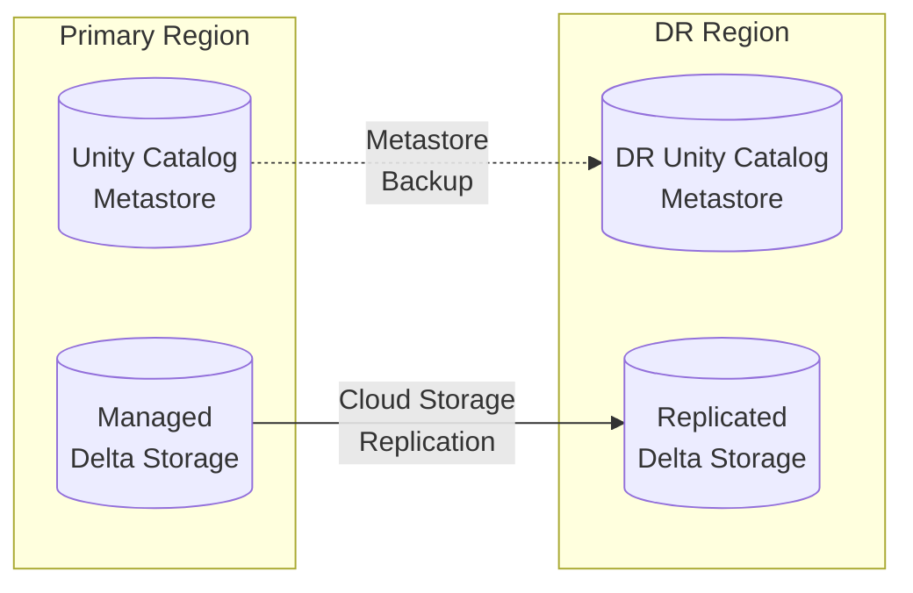
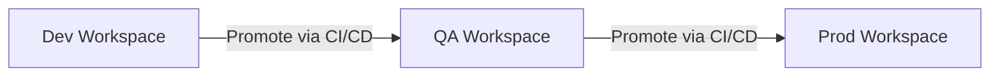
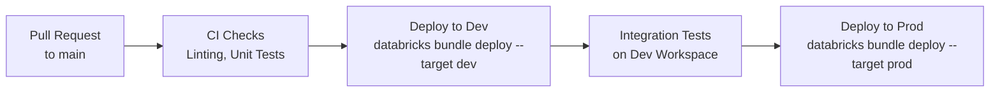

# Databricks Data Warehouse Operations Best Practices

## 1. Executive Summary

This document serves as the Standard Operating Procedure (SOP) for
data platform engineers, DBAs, and FinOps teams managing a
Databricks Lakehouse Data Warehouse. Following the architectural
blueprints for Ingestion (Auto Loader / Lakeflow Connect),
Transformation (Delta Live Tables), and Serving (Serverless SQL
Warehouses), this guide establishes the operational guardrails
required to keep the environment **secure, highly performant, and
cost-effective**.

### 1.1 The Serverless-First Paradigm

A critical operational mindset shift for teams migrating from
traditional databases or classic Spark clusters is that this
architecture uses **100% Serverless Compute**. The table below
maps traditional tasks to their Databricks-native equivalents:

| Traditional Task | Databricks Native Equivalent | Status |
|---|---|---|
| Cluster provisioning & tuning | Serverless auto-scaling | ✅ Fully Automatic |
| `VACUUM` / storage reclaim | `VACUUM` on Delta tables (schedule via Workflows) | ✅ Scheduled |
| `ANALYZE` / statistics | Delta statistics auto-collected on write | ✅ Fully Automatic |
| Index management | Liquid Clustering (adaptive, online) | ✅ Fully Automatic |
| Pipeline dependency management | DLT DAG resolution | ✅ Fully Automatic |
| Job scheduling & alerting | Lakeflow Jobs (Serverless) | ✅ Native |

Operator effort shifts to **monitoring, governance, and continuous
improvement** — not reactive infrastructure firefighting.

---

## 2. FinOps & Cost Management

Databricks uses a **DBU (Databricks Unit)** consumption model. Active
cost governance is required to prevent runaway spend across Serverless
SQL Warehouses, DLT pipelines, and Workflow Jobs.

### 2.1 Serverless SQL Warehouse Sizing Strategy

SQL Warehouses are the primary cost driver for analytical serving.
Apply these principles:

- **Size for Complexity, not Concurrency:** Increase warehouse size
  (e.g., `Small` → `Medium`) when queries spill to disk or run
  slowly due to complex joins over large datasets.
- **Use Separate Warehouses per Workload:** Isolate BI dashboards,
  ad-hoc analytics, and API workloads into dedicated warehouses to
  prevent workload interference and enable precise cost attribution.
- **Auto-Stop:** Configure an aggressive auto-stop idle timeout.
  - BI Warehouses: `10 minutes`
  - Ad-hoc / DS Warehouses: `30 minutes`
- **Auto-Scale (Serverless):** Serverless SQL Warehouses scale
  automatically. Do not provision classic clusters for SQL workloads.
- **Query Timeout:** Set a `statement_timeout` via the warehouse
  settings to auto-kill runaway queries:

```sql
-- Attach a warehouse-level query timeout
-- (Set in Warehouse > Edit > Advanced Options)
-- Recommended: 600 seconds for BI, 30 seconds for API warehouses
```

### 2.2 Budgets & Spending Alerts

Use the native **Databricks Budgets** feature to enforce spending
limits across workspaces and resource types:

- Navigate to: **Admin Console > Budgets**.
- Create budgets scoped to a **workspace**, **tag**, or **SKU type**
  (e.g., `SERVERLESS_SQL`).
- Configure **alert thresholds** at 80% (warning) and 100%
  (critical) to notify the platform team via email or webhook.

### 2.3 Resource Attribution via Tags

Custom tags are the primary mechanism for cost chargeback.

```python
# Apply tags to DLT pipelines via the Pipeline Settings UI
# or via the Pipelines API:
{
  "custom_tags": {
    "cost_center": "finance",
    "environment": "prod",
    "project": "revenue_reporting"
  }
}
```

Tags propagate to `system.billing.usage` for granular DBU
attribution per team, project, and environment.

### 2.4 Unity Catalog System Tables for FinOps

The `system` catalog is the source of truth for cost and usage data.
Build Lakeview dashboards on top of these tables:

| System Table | Purpose |
|---|---|
| `system.billing.usage` | Granular DBU consumption by workspace, tag, SKU |
| `system.compute.warehouses` | Warehouse uptime & scaling events |
| `system.query.history` | Query-level cost, duration, bytes scanned |
| `system.lakeflow.pipeline_events` | DLT pipeline run cost & status |
| `system.workflow.run_state` | Job run history and compute cost |

```sql
-- Example: Top 10 most expensive queries (last 7 days)
SELECT
  user_name,
  statement_text,
  total_task_duration_ms / 1000 AS duration_sec,
  bytes_scanned / 1e9           AS gb_scanned
FROM system.query.history
WHERE start_time >= CURRENT_TIMESTAMP - INTERVAL 7 DAYS
ORDER BY total_task_duration_ms DESC
LIMIT 10;
```

---

## 3. Performance Optimization

### 3.1 Liquid Clustering (Replacing Hive Partitioning)

**Do not use Hive-style partitioning on new Delta tables.** Use
**Liquid Clustering** instead.

| Concern | Hive Partitioning | Liquid Clustering |
|---|---|---|
| Small file problem | Severe | Mitigated automatically |
| Schema evolution | Hard — directory names must change | Transparent |
| Multi-column filter | One partition key only | Multiple columns supported |
| Maintenance | Manual `MSCK REPAIR` / re-partition | Automatic, online |

```sql
-- Enable Liquid Clustering on a new table
CREATE TABLE gold.sales_fact (
  order_id  BIGINT,
  order_date DATE,
  region    STRING,
  amount    DOUBLE
)
CLUSTER BY (order_date, region);

-- Add clustering to an existing table
ALTER TABLE gold.sales_fact
CLUSTER BY (order_date, region);
```

Schedule a weekly `OPTIMIZE` job to compact files and apply
clustering:

```sql
-- Run via a Serverless Workflow task on a weekly schedule
OPTIMIZE gold.sales_fact;
```

### 3.2 Delta Table Maintenance Schedule

| Operation | Frequency | Purpose |
|---|---|---|
| `OPTIMIZE` | Daily (large tables), Weekly (small) | Compact small files, apply clustering |
| `VACUUM` | Weekly | Remove files older than retention period |
| `ANALYZE TABLE` | After large backfills | Update Delta statistics for the optimizer |

```sql
-- Recommended VACUUM retention: 7 days minimum
-- (matches default Delta time travel retention)
VACUUM gold.sales_fact RETAIN 168 HOURS;
```

> **Warning:** Never run `VACUUM` with `RETAIN 0 HOURS` unless
> you have explicitly disabled time travel and are certain no
> concurrent reads are in progress. This permanently destroys
> historical data.

### 3.3 Photon Engine

The Photon engine is **automatically enabled** on all Serverless SQL
Warehouses. To maximise Photon acceleration:

- Prefer **SQL-based transformations** in DLT over Python UDFs.
  Photon accelerates SQL operators (joins, aggregations, scans) but
  does not accelerate arbitrary Python UDFs.
- Use **vectorized pandas UDFs** (`@pandas_udf`) when Python logic
  is required; Photon can optimize around these.

### 3.4 Result Caching

Databricks SQL Warehouses provide a **result cache** (24-hour TTL).
Identical queries on unchanged data are served instantly with zero
DBU cost. Leverage this for BI dashboards with fixed daily reports
by pinning date ranges rather than using `CURRENT_DATE`.

### 3.5 Query Profile Analysis

For slow or expensive queries, use the **Query Profile** in the
Databricks SQL UI:

1. Navigate to: **SQL Editor > Query History > [Query] > Query Profile**
2. Look for:
   - **Spill to Disk**: Indicates insufficient memory → scale up
     warehouse size.
   - **Large Broadcast Joins**: Consider converting to
     sort-merge joins or using hints.
   - **Filter Pushdown Missing**: Ensure filters are on
     clustered or Z-ordered columns.

---

## 4. Security & Governance

### 4.1 Unity Catalog: The Security Perimeter

All data assets must be registered in **Unity Catalog**. Do not
use legacy Hive Metastore for production workloads.

```
Unity Catalog Hierarchy:
Metastore (per cloud region)
  └── Catalog (per environment: prod, dev, qa)
       └── Schema (per domain: finance, logistics)
            └── Table / View / Volume
```

Apply the principle of least privilege at every layer:

```sql
-- Grant read-only access to an analyst group
GRANT USE CATALOG ON CATALOG prod TO `analysts`;
GRANT USE SCHEMA  ON SCHEMA prod.gold TO `analysts`;
GRANT SELECT      ON TABLE  prod.gold.sales_fact TO `analysts`;
```

### 4.2 Role-Based Access Control (RBAC)

**Never grant privileges directly to individual users.**
Use Unity Catalog **Groups** mapped to your IdP (Identity Provider).

| Group | Catalog Scope | Permissions |
|---|---|---|
| `data_engineers` | All | `CREATE`, `MODIFY`, `SELECT` |
| `analysts` | Gold only | `SELECT` |
| `data_scientists` | Bronze, Silver, Gold | `SELECT`, `MODIFY` (Silver) |
| `svc_dlt_pipeline` | Bronze, Silver, Gold | `MODIFY` on pipeline schemas |

### 4.3 Row & Column-Level Security

For PII and sensitive data, apply **Row Filters** and **Column Masks**
natively in Unity Catalog:

```sql
-- Column Mask: mask PII for non-HR users
CREATE FUNCTION mask_email(email STRING)
RETURNS STRING
RETURN IF(
  is_account_group_member('hr_analysts'),
  email,
  REGEXP_REPLACE(email, '(.).+(@)', '$1***$2')
);

ALTER TABLE silver.customers
ALTER COLUMN email
SET MASK mask_email;
```

```sql
-- Row Filter: analysts only see their assigned region
CREATE FUNCTION region_filter(region STRING)
RETURNS BOOLEAN
RETURN is_account_group_member('global_admins')
    OR region = current_user_region();

ALTER TABLE gold.sales_fact
ADD ROW FILTER region_filter ON (region);
```

### 4.4 Service Principal Authentication

All programmatic workloads (pipelines, CI/CD, external tools) must
authenticate using **Service Principals** — never user credentials.

```bash
# Authenticate Databricks CLI with a Service Principal
# (using OAuth M2M — the recommended standard)
databricks configure \
  --host  https://<workspace>.azuredatabricks.net \
  --client-id     <service_principal_client_id> \
  --client-secret <service_principal_secret>
```

- Store secrets in **Databricks Secrets** (backed by a cloud KMS
  vault like Azure Key Vault, AWS Secrets Manager, or GCP Secret
  Manager). Never hard-code credentials in notebooks or job configs.

```python
# Retrieve a secret safely in a notebook or job
db_password = dbutils.secrets.get(
  scope="prod-secrets",
  key="source_db_password"
)
```

### 4.5 Network Isolation

- Enable **Private Connectivity** (VNet injection / AWS VPC
  peering) so all compute traffic stays within your private network.
- Use **IP Access Lists** to restrict workspace access to corporate
  VPN and approved CIDR ranges only.
- Enable **Serverless Private Connectivity** to ensure Serverless
  SQL Warehouses route traffic through your VNet.

---

## 5. Monitoring & Alerting

### 5.1 Key System Tables Reference

| System Table | Purpose | Key Use Case |
|---|---|---|
| `system.query.history` | All SQL query executions | Identify slow, expensive, or failing queries |
| `system.billing.usage` | DBU consumption by resource | Cost anomaly detection & chargeback |
| `system.compute.warehouses` | Warehouse lifecycle events | Scaling, start/stop audit |
| `system.lakeflow.pipeline_events` | DLT pipeline run events | Detect failures and data quality violations |
| `system.lakeflow.pipeline_event_logs` | DLT data quality metrics | Track expectation pass/fail rates |
| `system.workflow.run_state` | Lakeflow Job run history | Detect job failures and retry storms |
| `system.access.audit` | All API & UI access events | Security auditing & compliance |

### 5.2 Native SQL Alerts

Configure **Databricks SQL Alerts** to push threshold-based
notifications to Slack, PagerDuty, or email:

```sql
-- Alert: DLT pipeline data quality drop rate > 5%
-- Schedule this query and alert when result > 0.05
SELECT
  pipeline_name,
  SUM(CASE WHEN status = 'FAILED' THEN 1 ELSE 0 END)
    / COUNT(*) AS fail_rate
FROM system.lakeflow.pipeline_event_logs
WHERE timestamp >= CURRENT_TIMESTAMP - INTERVAL 1 HOUR
GROUP BY pipeline_name
HAVING fail_rate > 0.05;
```

### 5.3 Lakeflow Job Alerting

Configure alert destinations directly on Lakeflow Jobs:

1. Open a Job in **Workflows > [Job Name] > Edit**.
2. Under **Notifications**, add email or webhook destinations.
3. Set alerts for: `On Start`, `On Success`, `On Failure`,
   `On Duration Exceeded` (the most important SLA guard).

### 5.4 Operational Runbook: Key Alerts

| Alert | Threshold | Recommended Action |
|---|---|---|
| Long-running query | > 10 minutes | Inspect Query Profile; check for missing clustering |
| DLT pipeline failure | Any failure | Check `pipeline_events` for root cause; trigger retry |
| Warehouse DBU spike | > 150% of daily baseline | Identify expensive query from `query.history` |
| Job run duration exceeded | > 2× baseline | Check for data skew or checkpoint corruption |
| Audit: Unusual login | Off-hours access | Review `system.access.audit`; escalate if needed |

---

## 6. Data Protection & Disaster Recovery

### 6.1 Delta Time Travel

Delta Lake's **Time Travel** allows restoring tables to a previous
state without backups:

```sql
-- View a table's transaction history
DESCRIBE HISTORY gold.sales_fact;

-- Query a table as of a specific version
SELECT * FROM gold.sales_fact VERSION AS OF 42;

-- Restore a table to a previous version
RESTORE TABLE gold.sales_fact TO VERSION AS OF 42;
```

**Retention configuration by Medallion layer:**

| Layer | Retention | Rationale |
|---|---|---|
| Bronze | 30 days | Source of truth; long retention for replay |
| Silver | 7 days | Can be rebuilt from Bronze via Full Refresh |
| Gold | 14 days | Business-critical; needs longer recovery window |

```sql
-- Set time travel retention on a table
ALTER TABLE gold.sales_fact
SET TBLPROPERTIES ('delta.logRetentionDuration' = 'interval 14 days');
```

### 6.2 Managed Storage & External Locations

- All Delta tables must be registered in **Unity Catalog** as
  **Managed Tables** (default). Managed tables inherit catalog-level
  storage credentials and Unity Catalog governance automatically.
- Use **External Locations** only for raw cloud storage buckets
  (Bronze source files) that exist outside the Unity Catalog managed
  storage root.

```sql
-- Declare an external location for raw source files
CREATE EXTERNAL LOCATION raw_landing
URL 's3://your-bucket/raw/'
WITH (STORAGE CREDENTIAL prod_s3_cred);
```

### 6.3 Cross-Region Disaster Recovery

For mission-critical deployments requiring cross-region HA:



- Use **cloud-native storage replication** (e.g., AWS S3 CRR, Azure
  GRS, GCS CRRS) to continuously replicate the managed Delta storage
  to the DR region.
- Periodically export and restore the **Unity Catalog metastore
  backup** to the DR metastore to keep schema definitions in sync.
- **RTO/RPO:** Storage replication is near-real-time. Metastore
  recovery from backup typically takes 15–30 minutes.

---

## 7. DevOps & Environment Strategy

### 7.1 Environment Topology

Maintain three isolated Databricks workspaces per region:



| Workspace | Purpose | Compute Policy |
|---|---|---|
| `dev` | Feature development, schema iteration | Serverless; low auto-stop |
| `qa` | Integration testing, data validation | Serverless; matches prod config |
| `prod` | Live workloads | Serverless; strict access controls |

### 7.2 Infrastructure as Code

**Never create tables, pipelines, or warehouses manually in
Production via the UI.** All infrastructure must be version-controlled
and deployed via CI/CD.

**Recommended toolchain:**

| Component | Tool |
|---|---|
| Workspace & cluster config | **Terraform** (Databricks provider) |
| DLT pipeline definitions | **Databricks Asset Bundles (DAB)** |
| SQL schema migrations | **Databricks Asset Bundles + SQL files** |
| Secrets management | **Terraform** + cloud KMS |

```yaml
# Example: Databricks Asset Bundle (databricks.yml)
bundle:
  name: revenue_pipeline

targets:
  dev:
    workspace:
      host: https://dev.azuredatabricks.net
  prod:
    workspace:
      host: https://prod.azuredatabricks.net

resources:
  pipelines:
    revenue_dlt:
      name: Revenue DLT Pipeline
      target: gold
      serverless: true
      libraries:
        - notebook:
            path: ./pipelines/revenue_pipeline.py
```

### 7.3 CI/CD Deployment Workflow



CI/CD pipeline steps:

1. **Lint & Unit Test:** Run `pytest` against pipeline logic using
   `databricks-connect` or local Delta Lake for mocking.
2. **Deploy to Dev:** `databricks bundle deploy --target dev`
3. **Integration Test:** Run a DLT full refresh on the Dev pipeline
   and validate Gold table row counts and data quality metrics.
4. **Deploy to Prod:** `databricks bundle deploy --target prod`
   (requires PR approval from a second engineer).

### 7.4 Notebook & Pipeline Versioning

- All notebooks and pipeline scripts must live in **Git-backed
  Databricks Repos** or directly in your SCM (GitHub / GitLab /
  Azure DevOps) and deployed via Asset Bundles.
- **Never use interactive notebooks as production pipelines.** Every
  production workload must be a scheduled Lakeflow Job with code
  sourced from a Git-backed repository.

---

## 8. Operational Checklist

### 8.1 New Pipeline Deployment Checklist

Before deploying a new DLT pipeline to Production, confirm:

- [ ] Code is reviewed and merged to `main` via Pull Request.
- [ ] Pipeline is deployed via Databricks Asset Bundle (not UI).
- [ ] DLT expectations (`@expect`) are defined for all key columns.
- [ ] Bad records are routed to a Quarantine table.
- [ ] Pipeline is tagged with `cost_center`, `environment`, `project`.
- [ ] A Lakeflow Job alert is configured for `On Failure`.
- [ ] The Bronze layer is append-only (no `DELETE`/`UPDATE`).
- [ ] Liquid Clustering is enabled on all Delta tables.
- [ ] Checkpoints are stored in a Unity Catalog Volume.
- [ ] A weekly `OPTIMIZE` + `VACUUM` job is scheduled.

### 8.2 Weekly Operational Review

Operators should review the following on a weekly cadence:

- [ ] DBU spend vs. budget across all workspaces.
- [ ] Failed or late Lakeflow Job runs from the past 7 days.
- [ ] Top 10 slowest or most expensive SQL queries.
- [ ] DLT data quality failure rates per pipeline.
- [ ] Warehouse auto-stop effectiveness (idle time ratio).
- [ ] Any unusual entries in `system.access.audit`.

### 8.3 Monthly Governance Review

- [ ] Review and rotate Service Principal secrets.
- [ ] Audit Unity Catalog group memberships vs. IdP source of truth.
- [ ] Review `VACUUM` logs to confirm no data is retained beyond SLA.
- [ ] Review and prune unused SQL Warehouses and idle Jobs.
- [ ] Generate and distribute chargeback report by `cost_center` tag.
