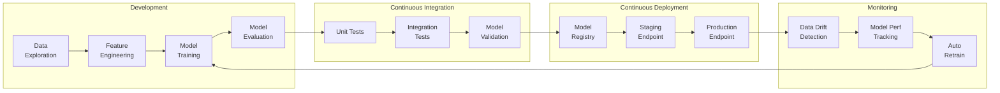

# Phase 5: AI & Machine Learning
*Databricks Data & Solution Architect Track*

***

## 5.1 MLflow & Experiment Tracking

### What is MLflow?

MLflow is an open-source platform for managing the end-to-end machine learning lifecycle. Databricks provides a **fully managed, integrated** MLflow service — no separate infrastructure required.

**Why MLflow Matters for Architects:**
* It provides **reproducibility** — every model training run is recorded with its code, data, parameters, and metrics.
* It provides **governance** — the Model Registry enforces a promotion workflow (Staging → Production) with approval gates.
* It integrates natively with Unity Catalog — all models are governed by the same access control policies as your data.
* It bridges the gap between Data Scientists (who build models) and ML Engineers (who deploy them).

**MLflow Components:**

```
┌──────────────────────────────────────────────────────────────┐
│                         MLflow                                │
│                                                               │
│  ┌──────────────┐  ┌──────────────┐  ┌───────────────────┐  │
│  │  Tracking     │  │  Model       │  │  Model Registry    │  │
│  │               │  │  Packaging   │  │                    │  │
│  │  Log params,  │  │  Save models │  │  Version control,  │  │
│  │  metrics,     │  │  in standard │  │  staging →         │  │
│  │  artifacts    │  │  formats     │  │  production flow   │  │
│  │  per run      │  │  (MLmodel)   │  │                    │  │
│  └──────────────┘  └──────────────┘  └───────────────────┘  │
│                                                               │
│  ┌──────────────┐  ┌──────────────────────────────────────┐  │
│  │  Projects     │  │  Model Serving                       │  │
│  │               │  │                                      │  │
│  │  Package code │  │  Deploy as REST endpoint             │  │
│  │  for          │  │  for real-time or batch inference    │  │
│  │  reproducible │  │                                      │  │
│  │  runs         │  │                                      │  │
│  └──────────────┘  └──────────────────────────────────────┘  │
└──────────────────────────────────────────────────────────────┘
```

### Tracking Experiments, Runs, and Metrics

An **Experiment** is a named collection of training runs. A **Run** is a single execution of model training code.

**Experiment Structure:**

```
Experiment: "Customer Churn Prediction"
├── Run 1 (2026-04-10)
│   ├── Parameters: {learning_rate: 0.01, max_depth: 5, n_estimators: 100}
│   ├── Metrics:    {accuracy: 0.84, f1_score: 0.78, auc: 0.89}
│   └── Artifacts:  model.pkl, confusion_matrix.png, feature_importance.csv
│
├── Run 2 (2026-04-11)
│   ├── Parameters: {learning_rate: 0.001, max_depth: 8, n_estimators: 200}
│   ├── Metrics:    {accuracy: 0.87, f1_score: 0.82, auc: 0.92}
│   └── Artifacts:  model.pkl, confusion_matrix.png
│
└── Run 3 (2026-04-12)    ← Best run, promoted to Model Registry
    ├── Parameters: {learning_rate: 0.005, max_depth: 6, n_estimators: 150}
    ├── Metrics:    {accuracy: 0.89, f1_score: 0.85, auc: 0.94}
    └── Artifacts:  model.pkl, confusion_matrix.png, shap_values.html
```

**Manual Tracking:**

```python
import mlflow
import mlflow.sklearn
from sklearn.ensemble import GradientBoostingClassifier
from sklearn.model_selection import train_test_split
from sklearn.metrics import accuracy_score, f1_score, roc_auc_score

# Set the experiment (creates if it doesn't exist)
mlflow.set_experiment("/Users/team/customer-churn-prediction")

# Load data
df = spark.table("curated.ml.customer_features").toPandas()
X = df.drop(columns=["churned"])
y = df["churned"]
X_train, X_test, y_train, y_test = train_test_split(X, y, test_size=0.2, random_state=42)

# Start a run
with mlflow.start_run(run_name="gbm-v3-tuned"):
    # Define hyperparameters
    params = {
        "learning_rate": 0.005,
        "max_depth": 6,
        "n_estimators": 150
    }

    # Log parameters
    mlflow.log_params(params)

    # Train model
    model = GradientBoostingClassifier(**params)
    model.fit(X_train, y_train)

    # Evaluate
    y_pred = model.predict(X_test)
    y_prob = model.predict_proba(X_test)[:, 1]

    accuracy = accuracy_score(y_test, y_pred)
    f1 = f1_score(y_test, y_pred)
    auc = roc_auc_score(y_test, y_prob)

    # Log metrics
    mlflow.log_metrics({
        "accuracy": accuracy,
        "f1_score": f1,
        "auc": auc
    })

    # Log the model
    mlflow.sklearn.log_model(
        model,
        artifact_path="model",
        registered_model_name="customer_churn_model"  # auto-registers
    )

    # Log extra artifacts
    mlflow.log_artifact("confusion_matrix.png")

    print(f"Run completed: acc={accuracy:.4f}, f1={f1:.4f}, auc={auc:.4f}")
```

**Key Functions:**

| Function | What It Does |
|---|---|
| `mlflow.set_experiment()` | Set or create an experiment by name |
| `mlflow.start_run()` | Begin logging a new run |
| `mlflow.log_param()` | Log a single hyperparameter |
| `mlflow.log_params()` | Log a dictionary of hyperparameters |
| `mlflow.log_metric()` | Log a single metric value |
| `mlflow.log_metrics()` | Log a dictionary of metrics |
| `mlflow.log_artifact()` | Log a file (image, CSV, HTML) |
| `mlflow.sklearn.log_model()` | Serialize and log a scikit-learn model |
| `mlflow.end_run()` | End the current run (auto if using `with`) |

### Autologging

Autologging automatically captures parameters, metrics, and models **without manual `log_*` calls**. Supported for all major ML frameworks.

```python
# Enable autologging for scikit-learn
mlflow.sklearn.autolog()

# Now just train normally — everything is logged automatically
with mlflow.start_run(run_name="auto-logged-run"):
    model = GradientBoostingClassifier(learning_rate=0.01, max_depth=5)
    model.fit(X_train, y_train)
    # MLflow automatically logs:
    # - All constructor parameters (learning_rate, max_depth, ...)
    # - Training metrics (accuracy, precision, recall, f1, ...)
    # - The serialized model artifact
    # - Feature importance plot
    # - Confusion matrix
```

**Supported Frameworks for Autologging:**

| Framework | Auto-logs |
|---|---|
| `scikit-learn` | Params, metrics, model, plots |
| `xgboost` | Params, metrics, model, feature importance |
| `lightgbm` | Params, metrics, model |
| `tensorflow/keras` | Params, epoch metrics, model, TensorBoard logs |
| `pytorch` | Params, metrics, model |
| `spark.ml` | Params, metrics, model |
| `huggingface` | Params, metrics, model, tokenizer |

```python
# Enable autologging for any/all supported frameworks
mlflow.autolog()

# Framework-specific autologging with options
mlflow.sklearn.autolog(
    log_input_examples=True,      # Log sample input data
    log_model_signatures=True,    # Log input/output schema
    log_models=True,              # Log the serialized model
    max_tuning_runs=10            # Max hyperparameter search runs to log
)
```

### Model Registry with Unity Catalog

The **Model Registry** is a centralized hub for managing model versions, lifecycle stages, and deployment approvals.

**Legacy vs. Unity Catalog Model Registry:**

| Feature | Legacy (workspace) | Unity Catalog |
|---|---|---|
| Scope | Single workspace | Cross-workspace |
| Governance | Workspace ACLs | UC GRANT/REVOKE |
| Naming | `model_name` | `catalog.schema.model_name` |
| Lineage | Limited | Full column-level |
| Recommended | ❌ Deprecated | ✅ Use this |

**Registering a Model in Unity Catalog:**

```python
# Set the registry to Unity Catalog (required once per session)
mlflow.set_registry_uri("databricks-uc")

# Register during training
with mlflow.start_run():
    model = GradientBoostingClassifier(learning_rate=0.005, max_depth=6)
    model.fit(X_train, y_train)

    mlflow.sklearn.log_model(
        model,
        artifact_path="model",
        registered_model_name="curated.ml_models.customer_churn"
        # Three-level namespace: catalog.schema.model_name
    )
```

**Model Versioning & Aliases:**

Every time you register a model with the same name, a new **version** is created. Use **aliases** to tag which version is active.

```python
from mlflow import MlflowClient

client = MlflowClient()

# Set an alias on a specific version
client.set_registered_model_alias(
    name="curated.ml_models.customer_churn",
    alias="champion",      # production-ready version
    version=3
)

client.set_registered_model_alias(
    name="curated.ml_models.customer_churn",
    alias="challenger",    # being tested against champion
    version=4
)

# Load a model by alias (for inference)
champion_model = mlflow.pyfunc.load_model(
    "models:/curated.ml_models.customer_churn@champion"
)

# Load a specific version
v3_model = mlflow.pyfunc.load_model(
    "models:/curated.ml_models.customer_churn/3"
)
```

**Model Lifecycle Flow:**

```
┌───────────┐    Register    ┌───────────┐    Validate    ┌───────────┐
│  Training  │──────────────►│  Version   │──────────────►│ "challenger│
│  Notebook  │               │  Created   │               │  " alias   │
└───────────┘               └───────────┘               └─────┬─────┘
                                                               │
                                                         A/B Test
                                                         & Approve
                                                               │
                                                               ▼
┌───────────┐    Serve       ┌───────────┐    Promote    ┌───────────┐
│  Endpoint  │◄──────────────│ "champion" │◄─────────────│ Approved   │
│  (REST)    │               │  alias     │              │ Version    │
└───────────┘               └───────────┘               └───────────┘
```

**Access Control on Models:**

```sql
-- Grant a team permission to read (load) models
GRANT EXECUTE ON FUNCTION curated.ml_models.customer_churn
  TO `grp-data-scientists`;

-- Grant permission to register new versions
GRANT CREATE FUNCTION ON SCHEMA curated.ml_models
  TO `grp-ml-engineers`;
```

***

## 5.2 Feature Engineering

### Databricks Feature Store (Feature Engineering in Unity Catalog)

A **Feature Store** is a centralized repository of curated, reusable features that can be shared across ML models and teams. In Databricks, the Feature Store is integrated directly into Unity Catalog.

**Why Feature Stores Matter:**

```
Without Feature Store:                 With Feature Store:
┌────────────────────┐                ┌────────────────────┐
│  Model A           │                │  Feature Store     │
│  ┌──────────────┐  │                │  (Unity Catalog)   │
│  │ Feature eng  │  │                │  ┌──────────────┐  │
│  │ code (copy1) │  │                │  │ customer_    │  │
│  └──────────────┘  │                │  │ features     │  │──► Model A
├────────────────────┤                │  ├──────────────┤  │──► Model B
│  Model B           │                │  │ transaction_ │  │──► Model C
│  ┌──────────────┐  │                │  │ features     │  │
│  │ Feature eng  │  │                │  └──────────────┘  │
│  │ code (copy2) │  │                │                    │
│  │ (diverged!)  │  │                │  • Single source   │
│  └──────────────┘  │                │  • Versioned       │
└────────────────────┘                │  • Discoverable    │
  Duplicated logic,                   │  • Lineage tracked │
  inconsistent results                └────────────────────┘
```

**Key Concepts:**

| Concept | Description |
|---|---|
| **Feature Table** | A Delta table in Unity Catalog with a defined primary key |
| **Primary Key** | Column(s) that uniquely identify each entity (e.g., `customer_id`) |
| **Timestamp Key** | Column used for point-in-time lookups (e.g., `event_date`) |
| **Online Store** | Low-latency serving layer for real-time inference |
| **Offline Store** | The Delta table itself — used for batch training |

### Creating and Publishing Features

```python
from databricks.feature_engineering import FeatureEngineeringClient

fe = FeatureEngineeringClient()

# Step 1: Compute features in a Spark DataFrame
customer_features_df = spark.sql("""
    SELECT
        customer_id,
        -- Behavioral features
        COUNT(*)                                    AS total_orders,
        SUM(amount)                                 AS lifetime_value,
        AVG(amount)                                 AS avg_order_value,
        DATEDIFF(current_date(), MAX(order_date))   AS days_since_last_order,
        COUNT(DISTINCT region)                      AS unique_regions,
        -- Temporal features
        COUNT(CASE WHEN order_date >= current_date() - INTERVAL 30 DAYS
              THEN 1 END)                           AS orders_last_30d,
        COUNT(CASE WHEN order_date >= current_date() - INTERVAL 90 DAYS
              THEN 1 END)                           AS orders_last_90d,
        -- Derived ratios
        ROUND(
            COUNT(CASE WHEN status = 'returned' THEN 1 END) * 100.0 / COUNT(*), 2
        )                                           AS return_rate_pct,
        current_timestamp()                         AS feature_timestamp
    FROM curated.sales.orders
    GROUP BY customer_id
""")

# Step 2: Create (or update) the feature table in Unity Catalog
fe.create_table(
    name="curated.ml_features.customer_features",
    primary_keys=["customer_id"],
    timestamp_keys=["feature_timestamp"],
    df=customer_features_df,
    description="Customer behavioral features for churn & LTV models"
)

# To update existing features (append or overwrite):
fe.write_table(
    name="curated.ml_features.customer_features",
    df=customer_features_df,
    mode="merge"   # "merge" = upsert by primary key; "overwrite" = full replace
)
```

### Training a Model with Feature Lookups

Instead of manually joining features, use `FeatureLookup` to automatically fetch features from the Feature Store during training.

```python
from databricks.feature_engineering import FeatureEngineeringClient, FeatureLookup

fe = FeatureEngineeringClient()

# Define which features to look up
feature_lookups = [
    FeatureLookup(
        table_name="curated.ml_features.customer_features",
        feature_names=[
            "total_orders",
            "lifetime_value",
            "avg_order_value",
            "days_since_last_order",
            "orders_last_30d",
            "return_rate_pct"
        ],
        lookup_key="customer_id"
    ),
    FeatureLookup(
        table_name="curated.ml_features.product_affinity",
        feature_names=["top_category", "category_diversity_score"],
        lookup_key="customer_id"
    )
]

# Training dataset: only needs the label + lookup keys
training_labels = spark.table("curated.ml.churn_labels")
# Schema: customer_id, churned (0 or 1)

# Create the training set (features auto-joined)
training_set = fe.create_training_set(
    df=training_labels,
    feature_lookups=feature_lookups,
    label="churned"
)

# Convert to Pandas for sklearn
training_df = training_set.load_df().toPandas()
X = training_df.drop(columns=["churned", "customer_id"])
y = training_df["churned"]

# Train the model
from sklearn.ensemble import GradientBoostingClassifier
model = GradientBoostingClassifier(n_estimators=150, max_depth=6)
model.fit(X, y)

# Log the model WITH feature store metadata
# This enables automatic feature lookup at serving time
fe.log_model(
    model=model,
    artifact_path="model",
    flavor=mlflow.sklearn,
    training_set=training_set,
    registered_model_name="curated.ml_models.customer_churn"
)
```

**Why this matters:** When you deploy this model for inference, Databricks automatically looks up feature values from the Feature Store — you only need to provide the `customer_id`.

### Offline vs. Online Feature Serving

**Offline serving** = Reading features from the Delta table for batch predictions (training and batch scoring).

**Online serving** = Reading features from a low-latency store for real-time predictions (model endpoints).

```
┌─────────────────────────────────────────────────────────────┐
│                     Feature Table                            │
│                (Delta Lake in Unity Catalog)                  │
│                                                              │
│      "curated.ml_features.customer_features"                │
│                                                              │
│  ┌────────────────────┐    ┌──────────────────────────────┐ │
│  │  Offline Store      │    │  Online Store                │ │
│  │  (Default)          │    │  (Publish for real-time)     │ │
│  │                     │    │                              │ │
│  │  • Delta Lake table │    │  • DynamoDB / Cosmos DB      │ │
│  │  • High throughput  │    │  • Sub-millisecond latency   │ │
│  │  • Batch training   │    │  • Real-time serving         │ │
│  │  • Batch scoring    │    │  • Model endpoints           │ │
│  └────────────────────┘    └──────────────────────────────┘ │
└─────────────────────────────────────────────────────────────┘
```

**Publishing to Online Store:**

```python
from databricks.feature_engineering.online_store_spec import (
    AmazonDynamoDBSpec,
    AzureCosmosDBSpec
)

# AWS - Publish features to DynamoDB
online_spec = AmazonDynamoDBSpec(
    region="us-east-1",
    table_name="customer_features_online",
    read_secret_prefix="feature-store/dynamodb",
    write_secret_prefix="feature-store/dynamodb"
)

# Azure - Publish features to Cosmos DB
# online_spec = AzureCosmosDBSpec(
#     account_uri="https://myaccount.documents.azure.com",
#     database_name="feature_store",
#     container_name="customer_features"
# )

fe.publish_table(
    name="curated.ml_features.customer_features",
    online_store=online_spec,
    mode="merge"
)
```

### Point-in-Time Correct Lookups

Point-in-time (PIT) correctness ensures that during training, features are joined based on **what was known at the time of the event** — preventing data leakage from the future.

**The Problem:**

```
Timeline:
───────────────────────────────────────────►
   Jan 1         Feb 1       Mar 1
   Customer      Customer    Customer
   had 5 orders  had 10      had 15
                 orders      orders

   Label event: Customer churned on Feb 15.

   Wrong: Use Mar 1 features (15 orders) ← Future data leakage!
   Right: Use Feb 1 features (10 orders) ← What was known at label time
```

**Implementation:**

```python
# Feature table with timestamp key
fe.create_table(
    name="curated.ml_features.customer_features",
    primary_keys=["customer_id"],
    timestamp_keys=["feature_timestamp"],  # ← this enables PIT joins
    df=customer_features_df
)

# Training labels with event timestamps
training_labels = spark.sql("""
    SELECT customer_id, churned, event_date AS label_timestamp
    FROM curated.ml.churn_labels
""")

# Feature lookup with PIT join
training_set = fe.create_training_set(
    df=training_labels,
    feature_lookups=[
        FeatureLookup(
            table_name="curated.ml_features.customer_features",
            lookup_key="customer_id",
            timestamp_lookup_key="label_timestamp"
            # Joins features where feature_timestamp <= label_timestamp
        )
    ],
    label="churned"
)
```

***

## 5.3 MLOps Pipelines

### MLOps Architecture Overview

MLOps applies DevOps principles to Machine Learning — automating the lifecycle from development through production with continuous training, testing, and monitoring.



### CI/CD for ML Model Promotion

**Environment Strategy:**

```
┌───────────────────────────────────────────────────────────────┐
│  Git Branch        Databricks Env       Model Registry        │
│                                                               │
│  feature/*    →    Dev Workspace    →   curated.ml_models.*   │
│                    (experimentation)     (new versions)        │
│                                                               │
│  main         →    Staging WS       →   Alias: "challenger"  │
│                    (validation)          (shadow scoring)      │
│                                                               │
│  release/*    →    Production WS    →   Alias: "champion"    │
│                    (serving)             (live traffic)        │
└───────────────────────────────────────────────────────────────┘
```

**Databricks Asset Bundles (DABs) for ML CI/CD:**

```yaml
# databricks.yml — ML project bundle
bundle:
  name: customer-churn-ml

workspace:
  host: https://adb-1234567890.1.azuredatabricks.net

resources:
  jobs:
    model-training:
      name: "Customer Churn Model Training"
      schedule:
        quartz_cron_expression: "0 0 6 * * ?"  # Daily at 6 AM
        timezone_id: "UTC"
      tasks:
        - task_key: feature-engineering
          notebook_task:
            notebook_path: ./notebooks/01_feature_engineering
          environment_key: ml-env

        - task_key: model-training
          depends_on:
            - task_key: feature-engineering
          notebook_task:
            notebook_path: ./notebooks/02_train_model
          environment_key: ml-env

        - task_key: model-validation
          depends_on:
            - task_key: model-training
          notebook_task:
            notebook_path: ./notebooks/03_validate_model
          environment_key: ml-env

        - task_key: promote-model
          depends_on:
            - task_key: model-validation
          notebook_task:
            notebook_path: ./notebooks/04_promote_to_champion
          environment_key: ml-env
          # Only runs if validation passes

  environments:
    ml-env:
      spec:
        client: "1"
        dependencies:
          - scikit-learn==1.4.0
          - xgboost==2.0.3
          - shap==0.44.0
```

**Model Validation Notebook (notebooks/03_validate_model.py):**

```python
import mlflow
from mlflow import MlflowClient

client = MlflowClient()

# Load the newly trained model (latest version)
model_name = "curated.ml_models.customer_churn"
latest_version = client.get_registered_model(model_name).latest_versions[-1]
new_model = mlflow.pyfunc.load_model(f"models:/{model_name}/{latest_version.version}")

# Load the current champion
try:
    champion_model = mlflow.pyfunc.load_model(f"models:/{model_name}@champion")
    has_champion = True
except Exception:
    has_champion = False

# Load validation dataset
val_df = spark.table("curated.ml.churn_validation_set").toPandas()
X_val = val_df.drop(columns=["churned", "customer_id"])
y_val = val_df["churned"]

# Score both models
from sklearn.metrics import roc_auc_score

new_auc = roc_auc_score(y_val, new_model.predict(X_val))
print(f"New model AUC: {new_auc:.4f}")

if has_champion:
    champion_auc = roc_auc_score(y_val, champion_model.predict(X_val))
    print(f"Champion AUC:  {champion_auc:.4f}")

    # Promotion gate: new model must beat champion by at least 0.5%
    if new_auc > champion_auc + 0.005:
        print("✅ New model beats champion — eligible for promotion.")
        dbutils.jobs.taskValues.set(key="promote", value="true")
    else:
        print("❌ New model does not beat champion — skipping promotion.")
        dbutils.jobs.taskValues.set(key="promote", value="false")
else:
    print("No existing champion — auto-promoting first model.")
    dbutils.jobs.taskValues.set(key="promote", value="true")
```

### Model Serving Endpoints (Real-Time Inference)

Model Serving deploys a model as a **REST API endpoint** that returns predictions in real time (typically <100ms latency).

**Creating a Serving Endpoint:**

```python
from databricks.sdk import WorkspaceClient
from databricks.sdk.service.serving import (
    EndpointCoreConfigInput,
    ServedEntityInput
)

w = WorkspaceClient()

# Create a model serving endpoint
w.serving_endpoints.create_and_wait(
    name="customer-churn-endpoint",
    config=EndpointCoreConfigInput(
        served_entities=[
            ServedEntityInput(
                entity_name="curated.ml_models.customer_churn",
                entity_version="3",           # or use alias
                workload_size="Small",         # Small / Medium / Large
                scale_to_zero_enabled=True,    # Save cost when idle
            )
        ]
    )
)
```

**Calling the Endpoint:**

```python
import requests
import json

ENDPOINT_URL = "https://adb-123456.1.azuredatabricks.net/serving-endpoints/customer-churn-endpoint/invocations"
TOKEN = "<personal-access-token>"

# Send a prediction request
payload = {
    "dataframe_records": [
        {
            "customer_id": 1001,
            "total_orders": 15,
            "lifetime_value": 4500.00,
            "avg_order_value": 300.00,
            "days_since_last_order": 45,
            "orders_last_30d": 0,
            "return_rate_pct": 12.5
        }
    ]
}

response = requests.post(
    ENDPOINT_URL,
    headers={
        "Authorization": f"Bearer {TOKEN}",
        "Content-Type": "application/json"
    },
    json=payload
)

prediction = response.json()
print(prediction)
# {"predictions": [1]}  ← 1 = will churn, 0 = will not churn
```

**Batch Scoring (Alternative to Real-Time):**

```python
# For batch predictions, use the model directly without a serving endpoint
import mlflow

model = mlflow.pyfunc.load_model("models:/curated.ml_models.customer_churn@champion")

# Score an entire table
features_df = spark.table("curated.ml_features.customer_features")
predictions_df = model.predict(features_df.toPandas())

# Or use Spark UDF for distributed scoring
predict_udf = mlflow.pyfunc.spark_udf(spark, "models:/curated.ml_models.customer_churn@champion")

scored_df = features_df.withColumn("churn_prediction", predict_udf())
scored_df.write.mode("overwrite").saveAsTable("curated.ml.churn_predictions")
```

### A/B Testing with Traffic Split

Deploy multiple model versions simultaneously and split traffic between them to measure real-world performance.

```python
# Create an endpoint with A/B traffic split
w.serving_endpoints.create_and_wait(
    name="customer-churn-endpoint",
    config=EndpointCoreConfigInput(
        served_entities=[
            ServedEntityInput(
                name="champion",
                entity_name="curated.ml_models.customer_churn",
                entity_version="3",
                workload_size="Small",
                scale_to_zero_enabled=False
            ),
            ServedEntityInput(
                name="challenger",
                entity_name="curated.ml_models.customer_churn",
                entity_version="4",
                workload_size="Small",
                scale_to_zero_enabled=False
            )
        ],
        traffic_config={
            "routes": [
                {"served_model_name": "champion",   "traffic_percentage": 90},
                {"served_model_name": "challenger",  "traffic_percentage": 10}
            ]
        }
    )
)
```

```
Traffic Flow:
                    ┌──────────────────────┐
                    │   /invocations       │
                    │   (REST endpoint)    │
                    └──────────┬───────────┘
                               │
                    ┌──────────┴───────────┐
                    │   Traffic Router      │
                    └──────────┬───────────┘
                       90%     │      10%
                    ┌──────────┴───────┐
                    ▼                  ▼
            ┌───────────┐      ┌───────────┐
            │ Champion   │      │ Challenger │
            │ (v3)       │      │ (v4)       │
            │ GBM model  │      │ XGB model  │
            └───────────┘      └───────────┘
```

### Monitoring Model Drift in Production

Model drift occurs when the statistical properties of the input data or the relationship between inputs and outputs change over time, degrading model performance.

**Types of Drift:**

```
┌─────────────────────────────────────────────────────────────┐
│  Data Drift (Feature Drift)                                  │
│  The distribution of input features changes.                 │
│  Example: avg_order_value shifts from $300 to $150           │
│           because of a new discount campaign.                │
│                                                              │
│  Concept Drift                                               │
│  The relationship between features and target changes.       │
│  Example: "days_since_last_order > 60" used to predict       │
│           churn, but post-COVID buying patterns changed.      │
│                                                              │
│  Prediction Drift                                            │
│  The distribution of model outputs changes.                  │
│  Example: Model suddenly predicts 80% churn rate instead     │
│           of the expected 15%.                               │
└─────────────────────────────────────────────────────────────┘
```

**Setting Up Monitoring with Lakehouse Monitoring:**

```python
from databricks.sdk import WorkspaceClient

w = WorkspaceClient()

# Create a monitor on the inference/scoring table
w.quality_monitors.create(
    table_name="curated.ml.churn_predictions",
    assets_dir="/monitors/churn_model",
    output_schema_name="curated.ml_monitoring",
    inference_log=w.quality_monitors.InferenceLog(
        model_id_col="model_version",
        prediction_col="churn_prediction",
        label_col="actual_churned",           # if ground truth is available
        timestamp_col="prediction_timestamp",
        problem_type="classification",
        granularities=["1 day"]
    )
)
```

**Manual Drift Detection Query:**

```sql
-- Compare feature distributions: training vs. production
WITH training_stats AS (
    SELECT
        AVG(total_orders)          AS avg_total_orders,
        STDDEV(total_orders)       AS std_total_orders,
        AVG(lifetime_value)        AS avg_ltv,
        STDDEV(lifetime_value)     AS std_ltv,
        AVG(days_since_last_order) AS avg_days_since
    FROM curated.ml.churn_training_data
),
production_stats AS (
    SELECT
        AVG(total_orders)          AS avg_total_orders,
        STDDEV(total_orders)       AS std_total_orders,
        AVG(lifetime_value)        AS avg_ltv,
        STDDEV(lifetime_value)     AS std_ltv,
        AVG(days_since_last_order) AS avg_days_since
    FROM curated.ml.churn_predictions
    WHERE prediction_timestamp >= current_date() - INTERVAL 7 DAYS
)
SELECT
    'total_orders' AS feature,
    t.avg_total_orders AS train_mean,
    p.avg_total_orders AS prod_mean,
    ABS(t.avg_total_orders - p.avg_total_orders) / t.std_total_orders AS z_score_drift
FROM training_stats t, production_stats p
UNION ALL
SELECT
    'lifetime_value',
    t.avg_ltv,
    p.avg_ltv,
    ABS(t.avg_ltv - p.avg_ltv) / t.std_ltv
FROM training_stats t, production_stats p;

-- Alert threshold: z_score_drift > 2.0 indicates significant drift
```

***

## 5.4 Generative AI & Mosaic AI

### Mosaic AI Platform Overview

Mosaic AI is Databricks' integrated platform for building production-grade AI applications, from simple prompting to fully custom fine-tuned models.

```
┌──────────────────────────────────────────────────────────────┐
│                      Mosaic AI Platform                        │
│                                                               │
│  ┌──────────────┐  ┌──────────────┐  ┌───────────────────┐  │
│  │ Foundation    │  │ Vector       │  │  AI Gateway        │  │
│  │ Model APIs   │  │ Search       │  │                    │  │
│  │              │  │              │  │  Rate limiting,     │  │
│  │ GPT / Llama  │  │ Embedding +  │  │  cost tracking,    │  │
│  │ DBRX / etc   │  │ Similarity   │  │  API key mgmt     │  │
│  │              │  │ Search       │  │                    │  │
│  └──────────────┘  └──────────────┘  └───────────────────┘  │
│                                                               │
│  ┌──────────────┐  ┌──────────────┐  ┌───────────────────┐  │
│  │ AI           │  │ Agent        │  │  Fine-Tuning       │  │
│  │ Playground   │  │ Framework    │  │                    │  │
│  │              │  │              │  │  Custom model       │  │
│  │ Prompt       │  │ Build AI     │  │  training on        │  │
│  │ engineering  │  │ agents with  │  │  your data          │  │
│  │ and testing  │  │ tools        │  │                    │  │
│  └──────────────┘  └──────────────┘  └───────────────────┘  │
└──────────────────────────────────────────────────────────────┘
```

### Foundation Model APIs

Databricks provides access to foundation models (LLMs) via simple API calls — either Databricks-hosted models or external models through AI Gateway.

**Pay-per-Token Serving:**

```python
# Using the Databricks Foundation Model API
from databricks.sdk import WorkspaceClient

w = WorkspaceClient()

response = w.serving_endpoints.query(
    name="databricks-meta-llama-3-1-70b-instruct",
    messages=[
        {"role": "system", "content": "You are a data quality expert."},
        {"role": "user", "content": """
            Analyze this data quality issue:
            Table: curated.sales.orders
            Problem: 15% of rows have NULL values in the 'region' column.
            What are the likely causes and recommended fixes?
        """}
    ],
    max_tokens=500,
    temperature=0.3  # Low temperature for factual responses
)

print(response.choices[0].message.content)
```

**External Model Gateway (OpenAI, Anthropic, etc.):**

```python
# Register an external model endpoint (e.g., OpenAI GPT-4)
from databricks.sdk.service.serving import (
    EndpointCoreConfigInput,
    ServedEntityInput,
    ExternalModel,
    OpenAIConfig
)

w.serving_endpoints.create(
    name="openai-gpt4-gateway",
    config=EndpointCoreConfigInput(
        served_entities=[
            ServedEntityInput(
                name="gpt4",
                external_model=ExternalModel(
                    name="gpt-4",
                    provider="openai",
                    task="llm/v1/chat",
                    openai_config=OpenAIConfig(
                        openai_api_key="{{secrets/ai-keys/openai-key}}"
                    )
                )
            )
        ]
    )
)

# Now all users call the Databricks endpoint instead of OpenAI directly.
# Benefits: centralized cost tracking, rate limiting, audit logging.
```

**AI Gateway Architecture:**

```
┌─────────────────────────────────────────────────────────────┐
│  Application Layer (Notebooks, Apps, Agents)                 │
│                                                              │
│  ┌─────────┐  ┌─────────┐  ┌─────────┐                    │
│  │ App 1   │  │ App 2   │  │ Agent   │                    │
│  └────┬────┘  └────┬────┘  └────┬────┘                    │
│       │            │            │                           │
│       └────────────┼────────────┘                           │
│                    ▼                                        │
│  ┌─────────────────────────────────────┐                   │
│  │          AI Gateway                  │                   │
│  │  • Unified API interface             │                   │
│  │  • Rate limiting per user/group      │                   │
│  │  • Cost tracking & chargebacks       │                   │
│  │  • Audit logging to system tables    │                   │
│  │  • Fallback routing                  │                   │
│  └─────────────────┬───────────────────┘                   │
│                    │                                        │
│       ┌────────────┼────────────┐                           │
│       ▼            ▼            ▼                           │
│  ┌─────────┐ ┌──────────┐ ┌──────────┐                   │
│  │ DBRX    │ │  Llama 3 │ │ OpenAI   │                   │
│  │ (hosted)│ │ (hosted) │ │ (external│                   │
│  └─────────┘ └──────────┘ └──────────┘                   │
└─────────────────────────────────────────────────────────────┘
```

### Vector Search for RAG Architectures

**Retrieval-Augmented Generation (RAG)** combines LLMs with your own data. Instead of fine-tuning a model, you retrieve relevant documents at query time and include them in the prompt.

**RAG Architecture:**

```
┌────────────────────────────────────────────────────────────────┐
│                        RAG Pipeline                             │
│                                                                 │
│  1. INDEXING (offline)                                          │
│  ┌─────────────┐    ┌──────────────┐    ┌───────────────────┐ │
│  │ Source Docs  │──►│  Chunking    │──►│  Embedding Model   │ │
│  │ (PDFs, docs, │    │  (split into │    │  (text → vector)  │ │
│  │  wiki pages) │    │  512-token   │    │  e.g., BGE, E5    │ │
│  └─────────────┘    │  chunks)     │    └────────┬──────────┘ │
│                      └──────────────┘             │            │
│                                                    ▼            │
│                                          ┌───────────────────┐ │
│                                          │  Vector Search     │ │
│                                          │  Index             │ │
│                                          │  (Databricks       │ │
│                                          │   managed)         │ │
│                                          └───────────────────┘ │
│                                                                 │
│  2. RETRIEVAL + GENERATION (online)                             │
│  ┌─────────────┐    ┌──────────────┐    ┌───────────────────┐ │
│  │ User Query  │──►│  Embed query │──►│  Vector Similarity │ │
│  │ "What is our│    │  (same model)│    │  Search (top-k)   │ │
│  │  refund     │    └──────────────┘    └────────┬──────────┘ │
│  │  policy?"   │                                  │            │
│  └─────────────┘                                  ▼            │
│                                          ┌───────────────────┐ │
│                      Context + Query ──► │  LLM              │ │
│                                          │  (Llama / GPT-4)  │ │
│                                          │                   │ │
│                                          │  "Based on your   │ │
│                                          │   policy doc..."  │ │
│                                          └───────────────────┘ │
└────────────────────────────────────────────────────────────────┘
```

**Step 1: Create a Vector Search Index:**

```python
from databricks.vector_search.client import VectorSearchClient

vsc = VectorSearchClient()

# Create a Vector Search endpoint (compute for serving search queries)
vsc.create_endpoint(
    name="rag-search-endpoint",
    endpoint_type="STANDARD"
)

# Create an index from a Delta table
# The table must have a text column and an embedding column
vsc.create_delta_sync_index(
    endpoint_name="rag-search-endpoint",
    index_name="curated.knowledge.docs_index",
    source_table_name="curated.knowledge.documents",
    primary_key="doc_id",
    pipeline_type="TRIGGERED",       # or "CONTINUOUS" for real-time
    embedding_source_column="content",
    embedding_model_endpoint_name="databricks-bge-large-en"  # hosted embedding model
)
```

**Step 2: Prepare the Document Table:**

```python
# Chunk and store documents in a Delta table
from langchain.text_splitter import RecursiveCharacterTextSplitter

splitter = RecursiveCharacterTextSplitter(
    chunk_size=512,
    chunk_overlap=50,
    separators=["\n\n", "\n", ". ", " "]
)

# Example: Load PDFs and split into chunks
import os
documents = []
doc_id = 0

for filename in os.listdir("/Volumes/curated/knowledge/raw_docs/"):
    with open(f"/Volumes/curated/knowledge/raw_docs/{filename}", "r") as f:
        text = f.read()
        chunks = splitter.split_text(text)
        for chunk in chunks:
            documents.append({
                "doc_id": doc_id,
                "source": filename,
                "content": chunk
            })
            doc_id += 1

# Save to Delta table
docs_df = spark.createDataFrame(documents)
docs_df.write.mode("overwrite").saveAsTable("curated.knowledge.documents")
```

**Step 3: Query with RAG:**

```python
# Search for relevant documents
results = vsc.get_index(
    endpoint_name="rag-search-endpoint",
    index_name="curated.knowledge.docs_index"
).similarity_search(
    query_text="What is the company refund policy?",
    columns=["content", "source"],
    num_results=3
)

# Build the prompt with retrieved context
context = "\n\n".join([r["content"] for r in results["result"]["data_array"]])

prompt = f"""Based on the following company documents, answer the question.
If the answer is not in the documents, say "I don't have enough information."

Context:
{context}

Question: What is the company refund policy?
Answer:"""

# Call the LLM
response = w.serving_endpoints.query(
    name="databricks-meta-llama-3-1-70b-instruct",
    messages=[{"role": "user", "content": prompt}],
    max_tokens=300,
    temperature=0.1
)
print(response.choices[0].message.content)
```

### AI Playground

The **AI Playground** is a web-based UI for experimenting with prompts, comparing models, and testing RAG configurations — no code required.

**Capabilities:**
* **Side-by-side model comparison**: Test the same prompt on multiple models to compare quality.
* **System prompt engineering**: Iterate on instructions without writing code.
* **Tool/function calling**: Test agent-style interactions with tools.
* **RAG integration**: Attach a Vector Search index to ground responses on your data.
* **Export to notebook**: One-click export of your prompt to a production-ready notebook.

**Access:** Databricks Workspace > **Playground** (sidebar).

### Compound AI Systems & Agent Framework

A **Compound AI System** combines multiple AI components (LLMs, retrievers, tools, code execution) into a cohesive application. Databricks provides the **Mosaic AI Agent Framework** for building these systems.

**Agent Architecture:**

```
┌────────────────────────────────────────────────────────────┐
│                   Mosaic AI Agent                            │
│                                                              │
│  ┌──────────────────────────────────────────────────────┐  │
│  │  Orchestrator (LLM-powered reasoning loop)            │  │
│  │  "Given the user query, decide which tool to call"    │  │
│  └─────────────────────┬────────────────────────────────┘  │
│                        │                                    │
│           ┌────────────┼──────────────┐                    │
│           ▼            ▼              ▼                    │
│  ┌──────────────┐ ┌─────────────┐ ┌──────────────┐       │
│  │ Tool: SQL     │ │ Tool: Vector│ │ Tool: Python  │       │
│  │ Query         │ │ Search      │ │ Execution     │       │
│  │               │ │             │ │               │       │
│  │ Run queries   │ │ Search docs │ │ Run analysis  │       │
│  │ on Unity      │ │ for RAG     │ │ code          │       │
│  │ Catalog       │ │ context     │ │               │       │
│  └──────────────┘ └─────────────┘ └──────────────┘       │
│                                                             │
│  ┌──────────────────────────────────────────────────────┐  │
│  │  Guardrails & Safety Layer                            │  │
│  │  • Input/output validation                            │  │
│  │  • PII detection and redaction                        │  │
│  │  • Toxicity filtering                                 │  │
│  └──────────────────────────────────────────────────────┘  │
└────────────────────────────────────────────────────────────┘
```

**Building an Agent:**

```python
from databricks.agents import Agent, tool

# Define tools the agent can use
@tool
def query_sales_data(query: str) -> str:
    """Run a SQL query against the curated sales tables.
    Use this when the user asks about sales data, revenue, or orders."""
    result = spark.sql(query).toPandas().to_string()
    return result

@tool
def search_documentation(question: str) -> str:
    """Search company documentation to answer policy or process questions."""
    results = vsc.get_index(
        endpoint_name="rag-search-endpoint",
        index_name="curated.knowledge.docs_index"
    ).similarity_search(query_text=question, num_results=3)
    return "\n".join([r["content"] for r in results["result"]["data_array"]])

# Create the agent
agent = Agent(
    model="databricks-meta-llama-3-1-70b-instruct",
    tools=[query_sales_data, search_documentation],
    system_prompt="""You are a helpful data assistant for the sales team.
    You can query sales data and search company documentation.
    Always cite your sources. Never make up data."""
)

# Deploy the agent as a serving endpoint
from databricks.agents import deploy

deploy(
    agent,
    model_name="curated.ml_models.sales_assistant_agent",
    endpoint_name="sales-assistant"
)
```

### Fine-Tuning with Mosaic AI Training

Fine-tuning adapts a pre-trained model to your specific domain using your own data.

**When to Fine-Tune vs. RAG:**

```
┌─ Use RAG when: ──────────────────────────────────────────────┐
│  • You need the model to cite specific documents.           │
│  • Your knowledge base changes frequently.                  │
│  • You need factual accuracy on specific topics.            │
│  • You want to avoid the cost and time of training.         │
│                                                              │
├─ Use Fine-Tuning when: ─────────────────────────────────────┤
│  • You need the model to adopt a specific style or tone.    │
│  • You need consistent structured output (JSON, code).      │
│  • You have highly specialized domain vocabulary.           │
│  • Latency is critical (RAG adds retrieval time).           │
│  • You want to distill a large model into a smaller one.    │
│                                                              │
├─ Use Both when: ─────────────────────────────────────────────┤
│  • Fine-tune for style/format + RAG for factual grounding.  │
└──────────────────────────────────────────────────────────────┘
```

**Fine-Tuning Workflow:**

```python
from databricks.model_training import foundation_model as fm

# Step 1: Prepare training data (JSONL format)
# Each line is a chat-style training example
training_data = [
    {
        "messages": [
            {"role": "system", "content": "You are a SQL expert."},
            {"role": "user", "content": "How many orders last month?"},
            {"role": "assistant", "content": """```sql
SELECT COUNT(*) AS order_count
FROM curated.sales.orders
WHERE order_date >= date_trunc('month', current_date() - INTERVAL 1 MONTH)
  AND order_date < date_trunc('month', current_date());
```"""}
        ]
    },
    # ... hundreds more examples
]

# Save as a Delta table
spark.createDataFrame(training_data).write.saveAsTable("curated.ml.fine_tuning_data")

# Step 2: Launch fine-tuning run
run = fm.create(
    model="meta-llama/Meta-Llama-3.1-8B-Instruct",
    train_data_path="dbfs:/curated/ml/fine_tuning_data",
    register_to="curated.ml_models.sql-assistant-ft",
    training_duration="5ep",     # 5 epochs
    learning_rate="1e-5"
)

# Step 3: Monitor training
print(f"Run ID: {run.name}")
print(f"Status: {run.status}")
# Check progress in the Experiments UI

# Step 4: Deploy the fine-tuned model
w.serving_endpoints.create_and_wait(
    name="sql-assistant-ft",
    config=EndpointCoreConfigInput(
        served_entities=[
            ServedEntityInput(
                entity_name="curated.ml_models.sql-assistant-ft",
                entity_version="1",
                workload_size="Small",
                workload_type="GPU_SMALL"
            )
        ]
    )
)
```

***

## 5.5 ML Architecture Patterns

### Pattern 1: Batch Prediction Pipeline

```
┌─────────────┐     ┌─────────────┐     ┌──────────────┐
│ Feature      │────►│ Load Model  │────►│ Score Table  │
│ Store Table  │     │ @champion   │     │ (predictions)│
│ (daily       │     │ alias       │     │              │
│  refresh)    │     └─────────────┘     └──────┬───────┘
└─────────────┘                                 │
                                                ▼
                                       ┌──────────────┐
                                       │ Gold Table   │
                                       │ or BI Tool   │
                                       └──────────────┘

Schedule: Databricks Workflow, daily at 6 AM
Compute: Serverless Job
```

### Pattern 2: Real-Time Prediction Service

```
┌─────────────┐     ┌─────────────────────┐     ┌──────────────┐
│ Application  │────►│ Model Serving        │────►│ Response     │
│ (API call)   │     │ Endpoint             │     │ (< 100ms)   │
│              │     │                      │     │              │
│ {customer_id:│     │ 1. Feature lookup    │     │ {churn: 0.85}│
│  1001}       │     │    (online store)    │     │              │
│              │     │ 2. Model inference   │     │              │
└─────────────┘     └─────────────────────┘     └──────────────┘

Compute: Model Serving (auto-scaled)
Latency: P50 < 50ms, P99 < 200ms
```

### Pattern 3: RAG-Powered Enterprise Assistant

```
┌─────────────┐     ┌──────────────┐     ┌──────────────┐
│ User Query   │────►│ Agent         │────►│ Response     │
│              │     │ Orchestrator  │     │ (grounded)   │
│ "What were   │     │               │     │              │
│  Q1 sales?"  │     │ ┌───────────┐│     │ "Based on    │
│              │     │ │SQL Tool   ││     │  the orders  │
│              │     │ │Vector     ││     │  table, Q1   │
│              │     │ │Search     ││     │  revenue     │
│              │     │ └───────────┘│     │  was $4.2M"  │
└─────────────┘     └──────────────┘     └──────────────┘

Components: AI Gateway + Vector Search + Unity Catalog SQL
Guardrails: PII redaction, hallucination grounding
```

***

## Phase 5 Summary

| Topic | Key Points |
|---|---|
| MLflow | Experiment tracking, autologging, UC Model Registry, aliases |
| Feature Store | Feature tables, lookup-based training, PIT correctness, online serving |
| MLOps | CI/CD with DABs, model validation gates, A/B testing |
| Model Serving | REST endpoints, batch scoring, traffic splitting |
| Monitoring | Data drift, concept drift, Lakehouse Monitoring |
| Foundation Models | Pay-per-token APIs, AI Gateway, external model routing |
| Vector Search & RAG | Embedding, indexing, retrieval-augmented generation |
| Agents | Compound AI systems, tool-using agents, deployment |
| Fine-Tuning | When to fine-tune vs. RAG, training workflow, deployment |

**Self-Assessment Checklist:**
* [ ] Can you track an ML experiment using MLflow with parameters, metrics, and model artifacts?
* [ ] Can you explain the difference between autologging and manual logging?
* [ ] Can you register a model in Unity Catalog and manage versions with aliases?
* [ ] Can you design a Feature Store table with correct primary keys and timestamp keys?
* [ ] Can you explain why point-in-time correct joins prevent data leakage?
* [ ] Can you design an MLOps pipeline with CI/CD promotion gates?
* [ ] Can you deploy a model as a REST serving endpoint?
* [ ] Can you set up A/B testing with traffic split between champion and challenger?
* [ ] Can you explain the three types of model drift and how to detect them?
* [ ] Can you build a RAG pipeline using Vector Search and a foundation model?
* [ ] Can you decide when to use RAG vs. fine-tuning for a given use case?
* [ ] Can you architect a compound AI agent with tools and guardrails?

***

## Resources

* Databricks Docs: `docs.databricks.com/mlflow`
* Databricks Docs: `docs.databricks.com/machine-learning/feature-store`
* Databricks Docs: `docs.databricks.com/generative-ai`
* Databricks Docs: `docs.databricks.com/machine-learning/model-serving`
* Databricks Academy: "Machine Learning on Databricks"
* Databricks Academy: "Generative AI Engineer Associate"
* MLflow Docs: `mlflow.org/docs/latest`
* Paper: "Retrieval-Augmented Generation for Knowledge-Intensive NLP Tasks" (Lewis et al.)
* Book: "Designing Machine Learning Systems" (O'Reilly) — Chip Huyen
