# Real-Time Ingestion Architecture: Databricks Lakehouse

## 1. Executive Summary
This document outlines the Enterprise **Real-Time Data Ingestion Architecture** designed specifically for the **Databricks Data Intelligence Platform**. 

The objective is to establish a unified, highly scalable streaming pipeline capable of ingesting data from multiple sources with sub-second latency. By leveraging Databricks-native streaming technologies—specifically **Structured Streaming** and **Delta Live Tables (DLT)**—we eliminate the need for complex, third-party orchestration tools while maintaining strict Data Quality and Schema Evolution controls.

---

## 2. Multi-Source Streaming Flow

The following diagram illustrates how data flows continuously from various sources through the Medallion Architecture (Bronze, Silver, Gold) using Delta Lake and Delta Live Tables.

```mermaid
flowchart TD
    %% External Sources
    subgraph PublicInternet [Public Internet]
        SaaS["External SaaS APIs <br>&#40;Salesforce, Stripe&#41;"]
    end
    
    subgraph PartnerVPC [Partner / External VPC]
        PartnerDB[("Partner Database")]
    end

    %% Security Boundary
    subgraph CustomerVPC [Customer VPC / Data Plane]
        direction TB
        
        subgraph AppTier [Internal App Tier]
            InternalDB[("Internal Database")]
        end
        
        subgraph NetworkEgress [Egress & Peering]
            NATGW["NAT Gateway <br>&#40;Outbound&#41;"]
            TG["VPC Peering"]
        end
        
        subgraph MessageBus [Kafka Platform &#40;incl. Kafka Connect&#41;]
            direction TB
            SaaSConn["SaaS Source Connector"]
            PartnerConn["JDBC Source Connector"]
            CDCConn["Debezium CDC Connector"]
            SchemaReg["Schema Registry <br>&#40;Avro / Protobuf&#41;"]
            Kafka["Apache Kafka"]
            KafkaDLQ[("Connect DLQ Topic <br>&#40;Serialization Errors&#41;")]
            CC["Confluent Control Center <br>&#40;Kafka Monitoring&#41;"]
        end

        subgraph Compute [Databricks Compute Clusters]
            Spark["Structured Streaming <br>&#40;Kafka Connector&#41;"]
        end

        subgraph Storage [Delta Lake]
            Bronze[("Bronze <br>&#40;Raw&#41;")]
            Silver[("Silver <br>&#40;Cleansed&#41;")]
            Gold[("Gold <br>&#40;Aggregates&#41;")]
        end
    end

    %% Databricks Control Plane: Observability & Alerting
    subgraph ControlPlane [Databricks Control Plane &#40;Observability&#41;]
        DLT["Delta Live Tables <br>&#40;Orchestration & DQ&#41;"]
        EventLog["DLT Event Log <br>&#40;System Tables&#41;"]
        SQLAlert["Databricks SQL Alerts"]
    end

    %% Governance Plane
    subgraph GovernancePlane [Unity Catalog &#40;Governance & Access Control&#41;]
        UC["Unity Catalog <br>&#40;Metastore&#41;"]
        Lineage["Data Lineage <br>&#40;Column-Level&#41;"]
        AuditLog["Audit Logs <br>&#40;CloudTrail / System Tables&#41;"]
        TagEngine["Data Classification <br>&#40;PII / Confidential Tags&#41;"]
    end

    %% External Notification Target
    Notification["Slack / PagerDuty"]

    %% Security Routes
    VPCE["PrivateLink"]

    %% Network Routes to Kafka Connect
    SaaSConn -.->|HTTPS via NAT| NATGW
    NATGW -.-> SaaS
    PartnerConn -.->|TCP via Peering| TG
    TG -.-> PartnerDB
    CDCConn -.->|Reads Tx Log| InternalDB
    
    %% Kafka Internal Flow
    SaaSConn --> SchemaReg
    PartnerConn --> SchemaReg
    CDCConn --> SchemaReg
    SchemaReg -->|Validated Schema| Kafka
    SchemaReg -.->|Conversion Error| KafkaDLQ
    Kafka --> Spark
    
    %% Data Pipeline Flow
    Spark --> Bronze
    Bronze -->|DLT Expectations <br>&#40;ON VIOLATION WARN&#41;| Silver
    Silver --> Gold

    %% Governance Flow
    Bronze -.->|Register + Tag| UC
    Silver -.->|Register + Tag| UC
    Gold -.->|Register + Tag| UC
    UC -.->|Column Lineage| Lineage
    UC -.->|Access Events| AuditLog
    UC -.->|PII / Sensitivity| TagEngine

    %% Networking
    Compute <-->|No Public IPs| VPCE
    VPCE <--> ControlPlane

    %% Kafka-Side Monitoring &#40;Kafka ↔ Spark leg&#41;
    Kafka -.->|Consumer Lag / Throughput Drop| CC
    KafkaDLQ -.->|DLQ Topic Count > 0| CC
    CC -.->|Lag / Throughput Alert| Notification

    %% Spark-to-Bronze Monitoring
    Spark -.->|Streaming Metrics <br>&#40;rows/sec, batchDuration&#41;| EventLog
    Bronze -.->|Freshness & DLQ Rate| SQLAlert

    %% Pipeline & DQ Observability
    DLT -.->|Pipeline State & Metrics| EventLog
    Silver -.->|DQ Constraint Violations| EventLog

    %% Alerting
    EventLog -.->|Queries on FAILED State & DQ Warnings| SQLAlert
    SQLAlert -->|Webhook| Notification

    %% Styling
    classDef storage fill:#e2f0d9,stroke:#385723,stroke-width:1px,color:#000;
    classDef process fill:#dae8fc,stroke:#6c8ebf,stroke-width:1px,color:#000;
    classDef bad fill:#f8cecc,stroke:#b85450,stroke-width:1px,color:#000;
    classDef monitor fill:#fff2cc,stroke:#d6b656,stroke-width:1px,color:#000,stroke-dasharray: 5 5;
    classDef network fill:#f9f9f9,stroke:#666,stroke-width:2px,color:#000,stroke-dasharray: 5 5;
    classDef alert fill:#ffe6cc,stroke:#d79b00,stroke-width:1px,color:#000;
    
    classDef gov fill:#e1d5e7,stroke:#9673a6,stroke-width:1px,color:#000,stroke-dasharray: 5 5;

    class InternalDB,PartnerDB,Bronze,Silver,Gold storage;
    class SaaSConn,PartnerConn,CDCConn,SchemaReg,Kafka,Spark,DLT process;
    class KafkaDLQ bad;
    class CC,EventLog,SQLAlert monitor;
    class CustomerVPC,ControlPlane,VPCE,NetworkEgress network;
    class Notification alert;
    class UC,Lineage,AuditLog,TagEngine gov;
```



---

## 3. Inbound Networking (Hybrid Multi-Source Connector Pattern)

To keep the architecture simple and easy to maintain, we **do not** write custom Kafka Producer code. Instead, we standardize on a centralized **Kafka Connect** cluster to pull data from all internal and external sources in real-time, feeding into Apache Kafka. Databricks **Structured Streaming** then natively consumes these topics.

### 3.1 Internal VPC Applications (CDC)
Internal microservices write to an operational database inside the Customer VPC. A **Debezium CDC Source Connector** reads the database transaction logs and streams changes into Kafka.
* **Delivery Semantics:** Debezium has at-least-once delivery. Silver DLT tables **must** deduplicate using `APPLY CHANGES INTO` to handle connector restarts.

```sql
-- DLT Silver: CDC deduplication pattern
APPLY CHANGES INTO silver.orders
FROM STREAM(bronze.orders_raw)
  KEYS (order_id)
  SEQUENCE BY record_content:ts_ms :: BIGINT
  STORED AS SCD TYPE 1;
```

### 3.2 External Peered VPC Applications
For databases hosted in a partner's VPC, we establish a **VPC Peering Connection** (or AWS Transit Gateway). A **JDBC Source Connector** securely pulls data across the peering connection into Kafka without traversing the public internet.

### 3.3 Public Internet / SaaS Applications
For external SaaS providers (e.g., Salesforce, Stripe), a **SaaS Source Connector** routes outbound requests through a **NAT Gateway**. This allows the connector to securely pull from public APIs while blocking all inbound internet traffic to the Kafka cluster.

### 3.4 Spark Structured Streaming Ingestion
Once data from all three connector patterns lands in Kafka, Databricks connects directly to the Kafka brokers. We utilize native **Spark Structured Streaming** to continuously pull micro-batches of events and write them natively into Bronze Delta tables.

*   **How it Works:** Databricks connects directly to the Kafka brokers via mTLS/SASL, utilizing Spark offsets to track consumption.
*   **Benefits:** Sub-second latency with exactly-once processing guarantees natively managed by Spark offsets and Delta Lake ACID transactions.
---

## 4. Transformation & Orchestration: Delta Live Tables (DLT)

Once data lands in the pipeline, orchestrating the flow from Bronze to Silver to Gold manually requires complex checkpoint management. To simplify this, we utilize **Delta Live Tables (DLT)**.

DLT is a declarative framework (similar to Snowflake Dynamic Tables) that allows data engineers to define *what* the data should look like, while Databricks automatically manages the *how* (infrastructure, cluster scaling, and stream checkpoints).

### 4.1 Streaming Tables vs Materialized Views
In DLT, we utilize two distinct concepts to optimize real-time performance:
*   **Streaming Tables (Bronze & Silver):** Process data exactly once. They are append-only and strictly evaluate new records arriving in the stream, making them highly efficient for parsing massive event logs.
*   **Materialized Views (Gold):** Used for the final presentation layer. DLT automatically computes incremental updates to aggregations (e.g., calculating rolling averages or total sales per region) based on the fresh data arriving in Silver.

---

## 5. Schema Evolution & Data Contracts

Streaming data is notorious for unexpected schema drift. Our architecture employs strict data contracts to ensure pipelines never crash.

### 5.1 Schema Registry Integration
We enforce schemas (Avro or Protobuf) at the Kafka topic level using a **Schema Registry**. Spark Structured Streaming integrates natively with the registry to deserialize the binary payload. If an upstream producer violates the contract (e.g., sending a string instead of an integer), the Kafka broker rejects it before it even reaches Databricks.

### 5.2 Structured Streaming Schema Evolution
For backwards-compatible schema evolution (e.g., adding a new column), we configure the Structured Streaming writer to allow schema drift. If a new column arrives in the Kafka stream, Databricks automatically runs an `ALTER TABLE` to append the new column to the Bronze Delta table dynamically without dropping the stream.

---

## 6. Observability, Monitoring & Data Quality

Ensuring data quality and pipeline health in a continuous stream requires layered observability across both the Kafka infrastructure and the Databricks pipeline.

### 6.1 Kafka-Side Monitoring (Confluent Control Center)
The inbound leg (Kafka → Spark) is monitored independently of Databricks using **Confluent Control Center (CC)** or native Kafka JMX metrics:
*   **Consumer Lag:** Monitors the offset gap between the Kafka producer and the Spark Structured Streaming consumer group. An alert fires if the lag grows continuously over a 5-minute window.
*   **Throughput Drops:** CC alerts Slack/PagerDuty if the consumer group's commit rate drops to zero during expected traffic windows, indicating a silent failure.

### 6.2 Databricks-Side Monitoring (DLT Event Log & SQL Alerts)
Databricks exposes deep pipeline metrics natively via the **DLT Event Log** (System Tables). We use **Databricks SQL Alerts** to trigger Webhooks to Slack/PagerDuty for:
*   **Pipeline Failures:** Queries the Event Log for `STATE = 'FAILED'`.
*   **Throughput Metrics:** Monitors `inputRowsPerSecond` vs `processedRowsPerSecond` to detect if the cluster is falling behind.
*   **Data Staleness (Freshness):** Queries the Bronze table to compare the payload's `event_timestamp` against the `_ingestion_timestamp`. Alerts if staleness exceeds an acceptable threshold (e.g., 2 minutes).

### 6.3 Data Quality Enforcement (DLT Expectations)
We use SQL-native `CONSTRAINT` clauses in DLT Silver tables to enforce data contracts. Following our design principle to retain all data and alert on issues rather than dropping records silently, we primarily use the `WARN` constraint:

1.  **Retain and Alert (`ON VIOLATION WARN`):** The record is loaded into Silver, but the violation is logged to the DLT Event Log for alerting. This prevents data loss while maintaining strict observability over data quality.
    ```sql
    CONSTRAINT valid_user_id
      EXPECT (user_id IS NOT NULL)
      ON VIOLATION WARN
    ```
2.  **Fail the Pipeline (`ON VIOLATION FAIL UPDATE`):** Used only for catastrophic contract violations. The pipeline halts immediately to prevent downstream corruption.
    ```sql
    CONSTRAINT valid_order_total
      EXPECT (order_total >= 0)
      ON VIOLATION FAIL UPDATE
    ```

### 6.4 Kafka Connect DLQ (Structural / Serialization Failures)
Before data ever reaches Databricks, it must be serialized by Kafka Connect. If a source database contains corrupted bytes or unsupported data types that the connector literally cannot parse into an Avro/Protobuf payload, a catastrophic failure occurs.
*   **The Connector Setting:** We configure all Kafka Connectors with `errors.tolerance = all`. This prevents a single bad payload from crashing the entire ingestion task.
*   **The Kafka DLQ Topic:** Unparseable payloads are routed immediately to a dedicated Kafka DLQ Topic (e.g., `src-orders-dlq`).
*   **Alerting:** Confluent Control Center monitors this topic. If the message count is `> 0`, an alert fires to Slack/PagerDuty so Platform Engineers can investigate the corrupted source payload. Databricks pipelines are completely isolated from these structural failures.

### 6.5 Handling Business Logic Failures
Instead of dropping logically bad records (e.g., valid JSON, but missing a required User ID) or routing them to a Dead Letter Queue (DLQ), we retain them in the Silver layer. By using `ON VIOLATION WARN`, all records flow through the pipeline, ensuring zero data loss while violations are captured in the DLT Event Log.
*   **Validation Alerting:** A Databricks SQL Alert continuously queries the Event Log. If the ratio of expectation failures (warnings) to total records processed exceeds a defined threshold (e.g., 1%), an alert is fired to Slack or PagerDuty.

### 6.6 Data Quality Requirements per Medallion Layer
To maintain trust without creating brittle pipelines, data quality rules must be applied progressively across the layers:

1.  **Bronze Layer (Capture Everything):**
    *   **Requirement:** *Zero data loss.* Do not filter out bad business data here. 
    *   **Rules:** Enforce only structural integrity via the Kafka Schema Registry. Use Structured Streaming schema evolution to ensure unexpected (but valid) columns do not crash the pipeline. All raw events must be captured for auditability and replayability.
    *   **Monitoring Check:** Lightweight constraints on Bronze (e.g., `_kafka_offset IS NOT NULL`) verify ingestion metadata completeness.
2.  **Silver Layer (Syntactic Conformance):**
    *   **Requirement:** *Syntactic correctness and deduplication without data loss.*
    *   **Rules:** Deduplicate streams using `APPLY CHANGES INTO`. Apply `ON VIOLATION WARN` rules for business entity validity (e.g., `id IS NOT NULL`). All data is retained, but downstream consumers can filter based on metadata or trust the data while engineering investigates warnings.
3.  **Gold Layer (Business Logic):**
    *   **Requirement:** *Semantic and business correctness.*
    *   **Rules:** Apply `ON VIOLATION WARN` rules to validate business constraints (e.g., `order_total > 0`, `status IN ('Pending', 'Shipped')`). Ensure foreign keys joining to dimension tables are valid. Failures here often indicate logic bugs rather than ingestion errors.

---

## 7. Operational Best Practices

To ensure the Real-Time Ingestion Architecture runs efficiently, securely, and cost-effectively in production, adhere to the following best practices:

### 7.1 Compute & Cost Optimization
*   **Default to Serverless DLT:** Use Serverless DLT for automatic compute management and rapid scaling. If using Classic DLT, always enable **Enhanced Autoscaling** to handle sudden data spikes without over-provisioning.
*   **Always-On Streaming:** Real-time DLT pipelines run in continuous streaming mode. `Trigger.AvailableNow` is a batch pattern and must NOT be used for real-time pipelines — it belongs in batch ingestion architectures.
*   **Cluster Sizing (Classic DLT):** For streaming workloads, favor compute-optimized instances (e.g., AWS `c5` or Azure `Fsv2` series) over memory-optimized instances, as streaming is typically CPU-bound.

### 7.2 Storage & State Management
*   **Let DLT Manage Maintenance:** DLT automatically handles `OPTIMIZE` (file compaction) and `VACUUM` (stale file removal) for your Delta tables. Do not run these commands manually on DLT-managed tables.
*   **Checkpoint Locations:** Store stream checkpoints in robust cloud storage (S3/ADLS/GCS) rather than root DBFS to ensure state durability and avoid corruption during cluster restarts.
*   **Change Data Feed (CDF) Prudence:** Only enable CDF on source tables if downstream pipelines actually require incremental upserts (`APPLY CHANGES INTO`). Leaving it on unnecessarily consumes excess storage.

### 7.3 Data Quality & Schema Operations
*   **Monitor DLT Warnings:** Regularly query the DLT Event Log for expectation violations. A sudden spike indicates an upstream application has silently changed its data format or business logic, requiring engineering intervention.
*   **Data Quality Remediation:** Set up an operational workflow to review top constraint violations weekly. Fix data anomalies at the source application whenever possible, rather than endlessly patching the ingestion pipeline.

### 7.4 CI/CD and Deployment
*   **Infrastructure as Code:** Deploy DLT pipelines exclusively using **Databricks Asset Bundles (DABs)** or Terraform. Never deploy or modify production pipelines manually via the UI.
*   **Environment Isolation:** Strictly separate Development, Staging, and Production workspaces. Use the `PREVIEW` DLT channel in Staging to catch runtime bugs before Databricks rolls out updates to your `CURRENT` Production channel.

---

## 8. AWS Networking & Security

Because Databricks compute runs inside the Customer VPC, strict network and identity boundaries must be enforced across all connection points.

### 8.1 Network Isolation (Secure Cluster Connectivity)
*   **No Public IPs:** Databricks clusters are deployed with **Secure Cluster Connectivity** (SCC) enabled. Cluster nodes have no public IP addresses. All Control Plane communication is routed through a dedicated relay hosted by Databricks.
*   **AWS PrivateLink:** A PrivateLink endpoint connects the Customer VPC to the Databricks Control Plane. This ensures that DLT job metadata, logs, and event traffic never traverse the public internet.

### 8.2 Kafka Authentication (mTLS / SASL)
*   Spark Structured Streaming authenticates to the Kafka brokers using **SASL/SCRAM** or **mTLS** (mutual TLS).
*   Credentials (Kafka bootstrap servers, API keys) are stored in **AWS Secrets Manager** and injected into the DLT pipeline at runtime via Databricks Secret Scopes.

### 8.3 Delta Lake Access (IAM Instance Profiles)
*   Databricks clusters access Delta Lake tables on S3 using **IAM Instance Profiles** (or Managed Service Identity on Azure). No static access keys are used.
*   Unity Catalog enforces RBAC by layer:
    *   `RAW_ROLE`: Bronze tables (Data Engineers only).
    *   `TRANSFORM_ROLE`: Silver and Gold tables (pipeline authors).
    *   `BI_READ_ROLE`: Gold tables only (BI tools and analysts).

### 8.4 Debezium Connector Credentials
*   The Debezium CDC Connector authenticates to the operational database using a dedicated read-only service account with `REPLICATION` privilege only.
*   Credentials are stored in **AWS Secrets Manager** and referenced by the Kafka Connect worker configuration — never hardcoded.

---

## 9. Downstream Consumers (Gold Layer)

The pipeline does not end at Silver. Analytics Engineering teams build the **Gold Layer** on top of Silver.
*   **Ownership:** Gold tables are owned by the Analytics Engineering team. Data Engineering owns Bronze and Silver only. This enforces a clean boundary between ingestion and business logic.
*   **Pattern:** Gold uses DLT **Materialized Views** to compute aggregations (e.g., daily revenue, active users) over Silver Streaming Tables. They refresh automatically when upstream Silver data changes.
*   **Business Logic Validation:** We apply SQL `CONSTRAINT ... ON VIOLATION WARN` clauses directly to Gold Materialized Views to validate semantic aggregations (e.g., `total_revenue >= 0`). This ensures dashboards remain online, but any logic bugs are flagged in the DLT Event Log for Analytics Engineers to investigate.
*   **Consumers:** BI tools (Tableau, PowerBI), Databricks SQL dashboards, and ML Feature Stores query exclusively from the Gold layer. Direct access to Bronze or Silver is blocked by Unity Catalog RBAC.

---

## 10. Governance & Access Control &#40;Databricks on AWS&#41;

Governance is enforced at every layer of the platform using **Unity Catalog** as the single control plane, integrated with AWS-native identity services.

### 10.1 Identity & Authentication

All human users and service principals authenticate through a single identity chain:

| Principal Type | Authentication Method | Managed By |
| :--- | :--- | :--- |
| Human Users | SSO via **AWS IAM Identity Center** &#40;SAML 2.0 / OIDC&#41; | Corporate IdP &#40;Okta / Azure AD&#41; |
| Service Principals | Databricks OAuth M2M token | Databricks Account Admin |
| Cluster IAM Access | **IAM Instance Profile** attached to EC2 nodes | AWS IAM |
| Secret Access | **AWS Secrets Manager** via Databricks Secret Scope | Platform Team |

### 10.2 Unity Catalog — Three-Level Namespace

All data assets in Databricks are registered under a strict three-level hierarchy:

```
Catalog  →  Schema  →  Table / View
────────────────────────────────────────
raw      →  kafka   →  bronze_orders
conform  →  sales   →  silver_orders
serving  →  finance →  gold_fact_revenue
```

*   **`raw` catalog:** Bronze tables. Access restricted to the Data Engineering service principal and pipeline authors only.
*   **`conform` catalog:** Silver tables. Read access granted to Analytics Engineering and Data Science teams.
*   **`serving` catalog:** Gold tables. Read access granted to BI tools, Databricks SQL dashboards, and external consumers.

### 10.3 Role-Based Access Control &#40;RBAC&#41;

Access is granted at the Unity Catalog level using SQL `GRANT` statements — never at the S3 bucket level directly.

```sql
-- Data Engineers: full access to raw pipeline tables
GRANT USE CATALOG, USE SCHEMA, SELECT, MODIFY
  ON CATALOG raw TO `data-engineering-sp`;

-- Analytics team: read Silver and Gold
GRANT SELECT ON SCHEMA conform.sales TO `analytics-team`;
GRANT SELECT ON SCHEMA serving.finance TO `analytics-team`;

-- BI service account: Gold read-only
GRANT SELECT ON SCHEMA serving.finance TO `powerbi-service-principal`;

-- Deny direct Silver access to BI tools (enforced by omission)
-- No GRANT on conform.* to `powerbi-service-principal`
```

### 10.4 Data Classification & PII Tagging

All columns containing sensitive data are tagged at registration time using **Unity Catalog Tags**. The tag engine drives both access policy decisions and audit reporting.

| Tag | Example Columns | Effect |
| :--- | :--- | :--- |
| `pii.direct` | `email`, `ssn`, `phone_number` | Masked for non-privileged roles |
| `pii.quasi` | `date_of_birth`, `zip_code` | Flagged in lineage; access logged |
| `confidential` | `order_total`, `salary` | Restricted to Finance role only |
| `public` | `product_id`, `region_code` | No restriction |

**Dynamic Data Masking** is applied at the Unity Catalog layer using Row Filters and Column Masks — no changes needed in application code:

```sql
-- Mask PII for non-privileged users at query time
ALTER TABLE conform.sales.silver_customers
  ALTER COLUMN email
  SET MASK catalog.security.mask_email
    USING COLUMNS (email);
```

### 10.5 S3 Bucket-Level Access Isolation

Because Delta tables are backed by S3, Unity Catalog manages S3 access through **Storage Credentials** and **External Locations** — not raw IAM bucket policies.

```
Unity Catalog External Location
  └── s3://enterprise-lakehouse/raw/      → raw catalog only
  └── s3://enterprise-lakehouse/conform/  → conform catalog only
  └── s3://enterprise-lakehouse/serving/  → serving catalog only
```

Cluster IAM Instance Profiles have **no direct S3 permissions**. All S3 access is proxied through Unity Catalog, ensuring no user can bypass catalog-level RBAC by querying S3 directly.

### 10.6 Audit Logging

Every data access event is automatically emitted to two destinations:

1.  **Databricks System Tables** &#40;`system.access.audit`&#41;: Queryable via Databricks SQL for internal data access reporting.
2.  **AWS CloudTrail**: All S3 API calls &#40;`GetObject`, `PutObject`&#41; made by Databricks clusters are logged centrally for security and compliance teams.

```sql
-- Query Unity Catalog audit log for PII column access in last 7 days
SELECT user_name, action_name, request_params.table_full_name, event_time
FROM system.access.audit
WHERE action_name = 'selectTable'
  AND request_params.table_full_name LIKE 'conform.sales.%'
  AND event_time >= current_date() - INTERVAL 7 DAYS
ORDER BY event_time DESC;
```

### 10.7 Column-Level Lineage

Unity Catalog automatically captures **column-level lineage** for all DLT pipelines and SQL queries — no manual instrumentation required.

Example lineage chain:
```
Salesforce API  →  kafka.raw.sfdc_account.Name
              →  conform.sales.silver_account.customer_name
              →  serving.finance.gold_revenue.customer_name
              →  PowerBI Dashboard: Revenue by Customer
```

This enables:
*   **Impact analysis:** Before changing an upstream SAP field, see all downstream Gold tables and dashboards affected.
*   **Compliance tracing:** For GDPR right-to-erasure, identify every table containing a specific customer's PII column.
