# Real-Time Ingestion Architecture: Databricks Lakehouse

## 1. Executive Summary
This document outlines the Enterprise **Real-Time Data Ingestion Architecture** designed specifically for the **Databricks Data Intelligence Platform**. 

The objective is to establish a unified, highly scalable streaming pipeline capable of ingesting data from multiple sources with sub-second latency. By leveraging Databricks-native streaming technologies—specifically **Structured Streaming** and **Delta Live Tables (DLT)**—we eliminate the need for complex, third-party orchestration tools while maintaining strict Data Quality and Schema Evolution controls.

---

## 2. Multi-Source Streaming Flow

The following diagram illustrates how data flows continuously from various sources through the Medallion Architecture (Bronze, Silver, Gold) using Delta Lake and Delta Live Tables.

```mermaid
flowchart TD
    %% External Sources
    subgraph PublicInternet [Public Internet]
        SaaS["External SaaS APIs <br>&#40;Salesforce, Stripe&#41;"]
    end
    
    subgraph PartnerVPC [Partner / External VPC]
        PartnerDB[("Partner Database")]
    end

    %% Security Boundary
    subgraph CustomerVPC [Customer VPC / Data Plane]
        direction TB
        
        subgraph AppTier [Internal App Tier]
            InternalDB[("Internal Database")]
        end
        
        subgraph NetworkEgress [Egress & Peering]
            NATGW["NAT Gateway <br>&#40;Outbound&#41;"]
            TG["VPC Peering"]
        end
        
        subgraph MessageBus [Kafka Platform &#40;incl. Kafka Connect&#41;]
            direction TB
            SaaSConn["SaaS Source Connector"]
            PartnerConn["JDBC Source Connector"]
            CDCConn["Debezium CDC Connector"]
            Kafka["Apache Kafka"]
        end

        subgraph Compute [Databricks Compute Clusters]
            Spark["Structured Streaming <br>&#40;Kafka Connector&#41;"]
        end

        subgraph Storage [Delta Lake]
            Bronze[("Bronze <br>&#40;Raw&#41;")]
            Silver[("Silver <br>&#40;Cleansed&#41;")]
            Gold[("Gold <br>&#40;Aggregates&#41;")]
            DLQ[("Quarantine <br>&#40;DLQ&#41;")]
        end
    end

    %% Databricks Control Plane (Monitoring / DQ)
    subgraph ControlPlane [Databricks Control Plane]
        DLT["Delta Live Tables <br>&#40;Orchestration & DQ&#41;"]
        EventLog["DLT Event Log"]
        Alerts["Databricks Alerts"]
    end

    %% Security Routes
    VPCE["PrivateLink"]

    %% Network Routes to Kafka Connect
    SaaSConn -.->|HTTPS via NAT| NATGW
    NATGW -.-> SaaS
    PartnerConn -.->|TCP via Peering| TG
    TG -.-> PartnerDB
    CDCConn -.->|Reads Tx Log| InternalDB
    
    %% Kafka Internal Flow
    SaaSConn --> Kafka
    PartnerConn --> Kafka
    CDCConn --> Kafka
    Kafka --> Spark
    
    %% Flow: Compute -> Storage (via DLT)
    Spark --> Bronze
    Bronze -->|DLT Expectations| Silver
    Bronze -.->|Fails Expectation| DLQ
    Silver --> Gold

    %% Flow: Monitoring & Networking
    Compute <-->|No Public IPs| VPCE
    VPCE <--> ControlPlane
    DLT -.->|Logs Metrics & DQ Failures| EventLog
    EventLog -.->|Triggers| Alerts

    %% Styling
    classDef storage fill:#e2f0d9,stroke:#385723,stroke-width:1px,color:#000;
    classDef process fill:#dae8fc,stroke:#6c8ebf,stroke-width:1px,color:#000;
    classDef bad fill:#f8cecc,stroke:#b85450,stroke-width:1px,color:#000;
    classDef monitor fill:#fff2cc,stroke:#d6b656,stroke-width:1px,color:#000,stroke-dasharray: 5 5;
    classDef network fill:#f9f9f9,stroke:#666,stroke-width:2px,color:#000,stroke-dasharray: 5 5;
    
    class InternalDB,PartnerDB,Bronze,Silver,Gold storage;
    class SaaSConn,PartnerConn,CDCConn,Kafka,Spark,DLT process;
    class DLQ bad;
    class EventLog,Alerts monitor;
    class CustomerVPC,ControlPlane,VPCE,NetworkEgress network;
```

---

## 3. Inbound Networking (Hybrid Multi-Source Connector Pattern)

To keep the architecture simple and easy to maintain, we **do not** write custom Kafka Producer code. Instead, we standardize on a centralized **Kafka Connect** cluster to pull data from all internal and external sources in real-time, feeding into Apache Kafka. Databricks **Structured Streaming** then natively consumes these topics.

### 3.1 Internal VPC Applications (CDC)
Internal microservices write to an operational database inside the Customer VPC. A **Debezium CDC Source Connector** reads the database transaction logs and streams changes into Kafka over the private AWS backbone. 
* **Note:** Debezium events have at-least-once delivery semantics. Downstream DLT Silver tables must apply deduplication using `APPLY CHANGES INTO`.

### 3.2 External Peered VPC Applications
For databases hosted in a partner's VPC, we establish a **VPC Peering Connection** (or AWS Transit Gateway). A **JDBC Source Connector** securely pulls data across the peering connection into Kafka without traversing the public internet.

### 3.3 Public Internet / SaaS Applications
For external SaaS providers (e.g., Salesforce, Stripe), a **SaaS Source Connector** routes outbound requests through a **NAT Gateway**. This allows the connector to securely pull from public APIs while blocking all inbound internet traffic to the Kafka cluster.

### 3.4 Spark Structured Streaming Ingestion
Once data from all three connector patterns lands in Kafka, Databricks connects directly to the Kafka brokers. We utilize native **Spark Structured Streaming** to continuously pull micro-batches of events and write them natively into Bronze Delta tables.

*   **How it Works:** Databricks connects directly to the Kafka brokers via mTLS/SASL, utilizing Spark offsets to track consumption.
*   **Benefits:** Sub-second latency with exactly-once processing guarantees natively managed by Spark offsets and Delta Lake ACID transactions.
---

## 4. Transformation & Orchestration: Delta Live Tables (DLT)

Once data lands in the pipeline, orchestrating the flow from Bronze to Silver to Gold manually requires complex checkpoint management. To simplify this, we utilize **Delta Live Tables (DLT)**.

DLT is a declarative framework (similar to Snowflake Dynamic Tables) that allows data engineers to define *what* the data should look like, while Databricks automatically manages the *how* (infrastructure, cluster scaling, and stream checkpoints).

### 4.1 Streaming Tables vs Materialized Views
In DLT, we utilize two distinct concepts to optimize real-time performance:
*   **Streaming Tables (Bronze & Silver):** Process data exactly once. They are append-only and strictly evaluate new records arriving in the stream, making them highly efficient for parsing massive event logs.
*   **Materialized Views (Gold):** Used for the final presentation layer. DLT automatically computes incremental updates to aggregations (e.g., calculating rolling averages or total sales per region) based on the fresh data arriving in Silver.

---

## 5. Schema Evolution & Data Contracts

Streaming data is notorious for unexpected schema drift. Our architecture employs strict data contracts to ensure pipelines never crash.

### 5.1 Schema Registry Integration
We enforce schemas (Avro or Protobuf) at the Kafka topic level using a **Schema Registry**. Spark Structured Streaming integrates natively with the registry to deserialize the binary payload. If an upstream producer violates the contract (e.g., sending a string instead of an integer), the Kafka broker rejects it before it even reaches Databricks.

### 5.2 Structured Streaming Schema Evolution
For backwards-compatible schema evolution (e.g., adding a new column), we configure the Structured Streaming writer to allow schema drift. If a new column arrives in the Kafka stream, Databricks automatically runs an `ALTER TABLE` to append the new column to the Bronze Delta table dynamically without dropping the stream.

---

## 6. Data Quality & Observability (DLT Expectations)

Ensuring data quality in a continuous stream requires inline validation. We utilize **DLT Expectations** to define data quality rules directly in the pipeline code.

### 6.1 The Three Levels of Enforcement
We apply Python decorators to our DLT Silver tables to enforce contracts:

1.  **Retain and Alert (`@expect`):** The data violates a minor rule. The record is loaded, but a data quality metric failure is recorded in the DLT event log.
    *   *Example:* `@expect("valid_timestamp", "timestamp > '2020-01-01'")`
2.  **Drop Bad Data (`@expect_or_drop`):** The data is fundamentally flawed and useless. The record is dropped completely from the Silver table.
    *   *Example:* `@expect_or_drop("valid_user_id", "user_id IS NOT NULL")`
3.  **Fail the Pipeline (`@expect_or_fail`):** A catastrophic data contract violation has occurred that compromises the entire dataset. The pipeline immediately halts to prevent corruption.

### 6.2 The Quarantine Pattern (DLQ)
Instead of simply dropping bad records, enterprise architectures demand a Dead Letter Queue (DLQ). In DLT, we implement a **Quarantine Pattern**:
*   A downstream DLT table is explicitly configured to capture the inverse of the Silver expectations. 
*   All malformed records (e.g., where `user_id IS NULL`) are routed to a `silver_quarantine` Delta table.
*   Data Engineers query this table to triage application bugs and repair the data.

### 6.3 Observability Alerts
The DLT Event Log captures all pipeline metrics. We configure Databricks SQL Alerts on the `event_log` table to trigger Webhook notifications to Slack/PagerDuty whenever:
*   A pipeline fails.
*   The rate of data dropped by `@expect_or_drop` exceeds a specified threshold (e.g., > 5% of the stream is malformed).

### 6.4 Data Quality Requirements per Medallion Layer
To maintain trust without creating brittle pipelines, data quality rules must be applied progressively across the layers:

1.  **Bronze Layer (Capture Everything):**
    *   **Requirement:** *Zero data loss.* Do not filter out bad business data here. 
    *   **Rules:** Enforce only structural integrity via the Kafka Schema Registry. Use Structured Streaming schema evolution to ensure unexpected (but valid) columns do not crash the pipeline. All raw events must be captured for auditability and replayability.
2.  **Silver Layer (Strict Conformance):**
    *   **Requirement:** *Syntactic correctness and deduplication.*
    *   **Rules:** Apply strict `@expect_or_drop` rules for Primary Keys (`id IS NOT NULL`) and deduplicate streams using `APPLY CHANGES INTO`. Filter out corrupted records into the DLQ (Quarantine). Data landing in Silver must be clean enough for Data Scientists to trust.
3.  **Gold Layer (Business Logic):**
    *   **Requirement:** *Semantic and business correctness.*
    *   **Rules:** Apply `@expect` rules to validate business constraints (e.g., `order_total > 0`, `status IN ('Pending', 'Shipped')`). Ensure foreign keys joining to dimension tables are valid. Failures here often indicate logic bugs rather than ingestion errors.

---

## 7. Operational Best Practices

To ensure the Real-Time Ingestion Architecture runs efficiently, securely, and cost-effectively in production, adhere to the following best practices:

### 7.1 Compute & Cost Optimization
*   **Default to Serverless DLT:** Use Serverless DLT for automatic compute management and rapid scaling. If using Classic DLT, always enable **Enhanced Autoscaling** to handle sudden data spikes without over-provisioning.
*   **Strategic Execution Modes:** Do not run clusters continuously 24/7 unless sub-minute latency is a strict business requirement. Use `Trigger.AvailableNow` (Scheduled Micro-Batch) for hourly or daily ingestion to significantly reduce costs.
*   **Cluster Sizing (Classic DLT):** For streaming workloads, favor compute-optimized instances (e.g., AWS `c5` or Azure `Fsv2` series) over memory-optimized instances, as streaming is typically CPU-bound.

### 7.2 Storage & State Management
*   **Let DLT Manage Maintenance:** DLT automatically handles `OPTIMIZE` (file compaction) and `VACUUM` (stale file removal) for your Delta tables. Do not run these commands manually on DLT-managed tables.
*   **Checkpoint Locations:** Store stream checkpoints in robust cloud storage (S3/ADLS/GCS) rather than root DBFS to ensure state durability and avoid corruption during cluster restarts.
*   **Change Data Feed (CDF) Prudence:** Only enable CDF on source tables if downstream pipelines actually require incremental upserts (`APPLY CHANGES INTO`). Leaving it on unnecessarily consumes excess storage.

### 7.3 Data Quality & Schema Operations
*   **Monitor the DLQ:** Regularly query the Quarantine (DLQ) tables. A sudden spike indicates an upstream application has silently changed its data format, requiring engineering intervention.
*   **Quarantine Remediation:** Set up an operational workflow to review the Quarantine tables weekly. Fix data anomalies at the source application whenever possible, rather than endlessly patching the ingestion pipeline.

### 7.4 CI/CD and Deployment
*   **Infrastructure as Code:** Deploy DLT pipelines exclusively using **Databricks Asset Bundles (DABs)** or Terraform. Never deploy or modify production pipelines manually via the UI.
*   **Environment Isolation:** Strictly separate Development, Staging, and Production workspaces. Use the `PREVIEW` DLT channel in Staging to catch runtime bugs before Databricks rolls out updates to your `CURRENT` Production channel.
