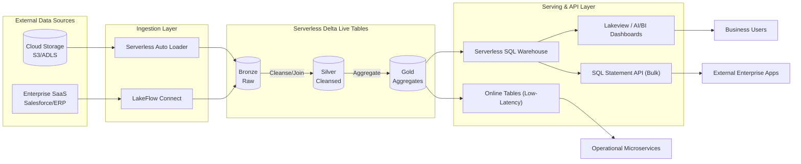

# Serverless Data Warehouse Architecture (Native Databricks)

## 1. Architectural Principles

To ensure simplicity, low operational overhead, and robust observability, this architecture strictly adheres to the following principles:
* **Databricks-Native Ecosystem**: Eliminates third-party tool complexity (e.g., dbt, Airflow) by utilizing native Databricks solutions for orchestration, transformation, and BI.
* **100% Serverless Compute**: All compute resources (Ingestion, Transformation, Warehousing, and Orchestration) utilize Databricks Serverless, eliminating infrastructure management, cluster tuning, and reducing idle costs.
* **Medallion Architecture**: Data is logically curated through Bronze (Raw), Silver (Filtered/Cleansed), and Gold (Business-level aggregates) layers.
* **FinOps & Observability by Design**: Cost and utilization metrics are inherently built into the platform via Unity Catalog system tables.

---

## 2. Component Architecture Design

### 2.1 Ingestion Layer (Sources to Bronze)
* **Databricks Auto Loader (Serverless)**: Incrementally and efficiently processes new files as they arrive in cloud storage (S3/ADLS/GCS). It infers schema and handles schema evolution automatically.
* **LakeFlow Connect**: Native managed connectors to ingest data from enterprise applications (e.g., Salesforce, ServiceNow) and databases directly into the Bronze layer.

### 2.2 Transformation Layer (Bronze to Gold)
* **Serverless Delta Live Tables (DLT)**: Provides declarative ETL using SQL or Python. DLT automatically manages task dependencies, quality expectations (data contracts), and underlying serverless infrastructure.
  * **Bronze Tables**: Raw ingested data, appended continuously.
  * **Silver Tables**: Cleansed, deduplicated, and enriched data (usable for Data Science and ML).
  * **Gold Tables**: Highly curated, aggregated data models designed specifically for business reporting and the Warehouse API.

### 2.3 Orchestration
* **Serverless Databricks Workflows (Jobs)**: Acts as the central orchestrator, triggering DLT pipelines, executing data quality checks, and managing alerting.

### 2.4 BI & Serving Layer
* **Serverless SQL Warehouses**: Provide instant, elastic compute specifically optimized for low-latency SQL queries. They scale up instantly to handle high concurrency and scale down to zero when idle.
* **Databricks Lakeview Dashboards / AI/BI**: Native visualization tools embedded within the Databricks UI. They query the Gold tables directly via Serverless SQL Warehouses, eliminating the need to extract data into external BI tools.

### 2.5 Warehouse API Layer
* **Databricks SQL Statement Execution API**: Provides a REST API interface for external applications and programmatic clients to execute SQL queries directly against the Gold tables via Serverless SQL Warehouses. This allows seamless data extraction and integration with enterprise apps without setting up custom microservices.

### 2.6 Architectural Decision: BI Serving vs. API Serving Workloads
When designing the serving layer, it is critical to differentiate between BI workloads and API workloads, as they have vastly different compute profiles. We use different Databricks-native serverless tools to ensure optimal cost and performance for each:

#### Workload Characteristics Comparison

| Characteristic | BI Workloads (Dashboards & Reporting) | API Workloads (Operational / Transactional) |
| :--- | :--- | :--- |
| **Primary Goal** | Analytical discovery, reporting, and aggregating macro-level trends. | Fetching specific, pre-calculated data points instantly to power an application. |
| **Query Pattern** | **OLAP** (Online Analytical Processing). Complex `GROUP BY`, `JOIN`, and `SUM` across millions of rows. | **OLTP** (Online Transaction Processing) or Key-Value lookups. E.g., `SELECT * WHERE user_id = 123`. |
| **Latency Tolerance** | **Seconds to Minutes**. Users expect dashboards to take a moment to load and calculate data. | **Strictly Sub-second (Milliseconds)**. Microservices and UI components will time out if data isn't instant. |
| **Concurrency** | **Low to Medium** (10s to 100s of concurrent queries). | **Extremely High** (1,000s to 100,000s of concurrent requests per second). |
| **Data Volume per Query**| Scans **massive** amounts of data (GBs or TBs), returning a small aggregate result. | Scans almost **no data** (uses an index), returning exactly one or a few rows. |

#### Architectural Handling Strategy

* **BI Workloads (Analytical & Dashboards)**:
  * **Profile**: Complex aggregations, large data scans, lower concurrency, acceptable latency in seconds.
  * **Decision**: Use **Serverless SQL Warehouses**. They are heavily optimized for throughput and complex query planning (Photon engine), making them perfect for connecting to native Lakeview Dashboards. They scale up instantly for spikes and scale down to zero when idle.
* **API Workloads (Programmatic Data Extraction)**:
  * **Profile**: Automated systems querying bulk datasets or submitting analytical queries via REST, typically run on a schedule or triggered by events.
  * **Decision**: Use **Databricks SQL Statement Execution API** backed by Serverless SQL Warehouses. It provides a simple REST interface to execute SQL, monitor status, and fetch large result sets asynchronously without keeping HTTP connections open.
* **API Workloads (Operational / Low-Latency Lookups)**:
  * **Profile**: High concurrency (thousands of requests per second), strictly sub-second latency, point-lookups (e.g., fetching a specific user profile, customer 360 view, or fraud score).
  * **Decision**: **Avoid SQL Warehouses** for this profile, as they are not optimized for high-concurrency, single-record OLTP-style queries. Instead, use **Databricks Model Serving with Online Tables**. This synchronizes your Gold tables to a low-latency state store and provides a fully serverless, highly-concurrent REST endpoint optimized specifically for operational lookups.

---

## 3. Architecture Diagram

---

## 4. Cost Management & Observability

With a Serverless-first architecture, tracking exact resource consumption is critical. This design leverages native Databricks observability tools:

### 4.1 Unity Catalog System Tables
Databricks provides system tables out-of-the-box that capture comprehensive operational metadata:
* **`system.billing.usage`**: Captures highly granular billing metrics, detailing Serverless DBU consumption by workspace, user, and tag.
* **`system.compute.clusters` & `system.compute.warehouses`**: Tracks the exact uptime, scaling events, and lifecycle of Serverless SQL Warehouses.
* **`system.query.history`**: Logs every SQL query executed against the warehouse, including execution time, user, and bytes processed.

### 4.2 Native FinOps Dashboards
By utilizing Lakeview Dashboards connected to the `system` catalog, architects and platform admins can deploy real-time FinOps dashboards.
* **Cost by Pipeline**: Track the exact DBU cost of running specific Serverless DLT pipelines.
* **Warehouse Utilization**: Identify idle time, peak concurrency, and inefficient queries draining Serverless SQL budgets.
* **Departmental Chargeback**: Group costs by custom tags (e.g., `cost_center`) assigned to Workflows and SQL Warehouses.

### 4.3 Automated Budgets & Alerting
* **Databricks SQL Alerts**: Set custom threshold alerts on queries running against the billing system tables. For instance, trigger an email or Slack notification if the daily serverless spend exceeds the predefined budget.
