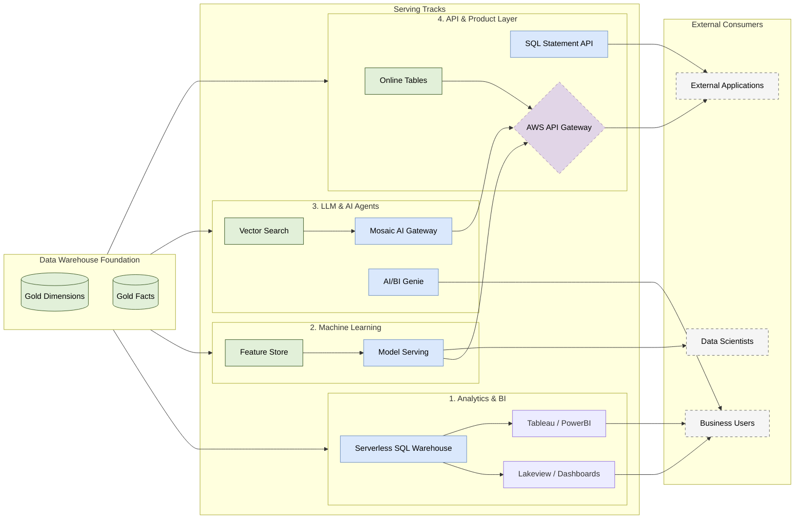

# Databricks Serving Layer Architecture

## 1. Executive Summary

This architecture defines the **Serving Layer** built on top of the
Databricks Data Warehouse. It provides a unified, governed, and highly
performant interface for four primary consumer patterns:

1.  **Analytics & BI:** Dashboards, reporting, and ad-hoc SQL.
2.  **Machine Learning:** Feature serving and traditional model inference.
3.  **LLM & AI Agents:** Generative AI, RAG, and natural language interfaces.
4.  **API & Product Layer:** Programmatic data access for external applications.

**Core Principle:** All serving tracks source their data from the **Gold Layer**
(Star Schema) managed within Unity Catalog, ensuring a single source of truth,
consistent RBAC, and centralized observability.

---

## 2. Architecture Diagram

---

## 3. Serving Tracks

### 3.1 Track 1: Analytics & BI Serving

Optimized for **OLAP** workloads involving complex aggregations, large data
scans, and ad-hoc analytical queries.

*   **Compute Engine:** Serverless Databricks SQL Warehouses. They provide
    instant compute scaling and employ the Photon engine for high throughput.
*   **Visualization:** Native Databricks Lakeview (AI/BI Dashboards) for
    internal reporting, reducing data extraction overhead.
*   **External BI:** External tools (Tableau, PowerBI) connect via JDBC/ODBC
    using OAuth or Personal Access Tokens (PAT) scoped to the SQL Warehouse.
*   **Performance:** Heavily relies on **Liquid Clustering** applied to the
    underlying Gold tables and native Result Caching in the SQL Warehouse.

### 3.2 Track 2: Machine Learning Serving

Optimized for serving curated features and traditional ML model predictions
(e.g., fraud detection, recommendation scores) with low latency.

*   **Feature Store:** Gold tables are registered in the Databricks Feature
    Store. Offline features are used for training; Online Store synchronization
    provides low-latency feature lookups for real-time inference.
*   **Model Serving:** MLflow registered models are deployed to Databricks
    Serverless Model Serving endpoints. These endpoints auto-scale based on
    request volume and scale to zero when idle.

### 3.3 Track 3: LLM & AI Agent Serving

Designed to power Generative AI, Retrieval-Augmented Generation (RAG), and
autonomous agents using Databricks Mosaic AI.

*   **Mosaic AI Gateway:** Acts as the unified control plane for LLMs, providing
    rate limiting, credential management, and payload logging for security.
*   **Vector Search:** Text data embedded from the Gold Layer is synced to
    Databricks Vector Search indexes. This provides the retrieval mechanism for
    RAG applications.
*   **AI/BI Genie:** Provides a natural language interface over the Gold Star
    Schema. Business users can ask questions in plain English, and Genie
    translates them into optimized SQL queries executed on SQL Warehouses.

### 3.4 Track 4: API & Product Layer

Designed to serve data programmatically to external enterprise applications and
microservices. This track utilizes **AWS API Gateway** as the unified front door.

*   **Low-Latency OLTP Lookups:**
    *   **Online Tables:** Gold tables are synchronized to Databricks Online
        Tables, providing sub-millisecond, highly concurrent key-value lookups.
    *   **Integration:** AWS API Gateway routes incoming operational requests
        to Databricks Model Serving endpoints (which wrap the Online Table
        lookups), providing secure, low-latency REST access.
*   **Bulk / Asynchronous Data Access:**
    *   **SQL Statement API:** For external systems needing to extract larger
        datasets or run complex queries, AWS API Gateway can proxy requests to
        the Databricks SQL Statement Execution API. This handles async execution
        and pagination.
*   **Security & Rate Limiting:** AWS API Gateway manages API keys, client
    authentication (Cognito/IAM), rate limiting (Throttling), and WAF protection
    before any traffic hits the Databricks Lakehouse.

---

## 4. Access Control (Unity Catalog)

Security is enforced at the metadata layer via **Unity Catalog**, ensuring
permissions remain consistent regardless of how the data is served.

| Persona / System | Required Grants | Enforcement Point |
| :--- | :--- | :--- |
| **BI Consumer** | `GRANT SELECT ON CATALOG curated` | Unity Catalog (RBAC) |
| **Ext. App (API)**| Service Principal PAT / OAuth | AWS API GW + UC |
| **AI/BI Genie** | `GRANT USE SCHEMA` on Gold | Unity Catalog |
| **Mosaic AI** | Provisioned via MLflow Registry | Unity Catalog / MLflow |

*   **Row-Level Security & Column Masking:** Any RLS or masking policies defined
    on the Gold tables automatically apply to SQL Warehouses, Lakeview, and
    API queries, preventing accidental data exposure.

---

## 5. Observability & FinOps

With a heavily serverless architecture, comprehensive observability is required
to monitor performance and manage costs.

*   **System Tables:** All serving layer activity is automatically logged to
    Unity Catalog system tables (e.g., `system.query.history`,
    `system.serving.endpoint_payloads`).
*   **API Gateway Metrics:** AWS API Gateway provides CloudWatch metrics for
    external API latency, error rates (4xx/5xx), and throttle counts.
*   **FinOps Dashboards:** A dedicated Databricks dashboard queries the
    `system.billing.usage` table to track DBU consumption across SQL Warehouses,
    Model Serving, and Vector Search, breaking down costs by workspace and tag.
*   **Alerting:** Databricks SQL Alerts trigger notifications if serverless
    spend exceeds daily budgets or if serving endpoint latency spikes.
