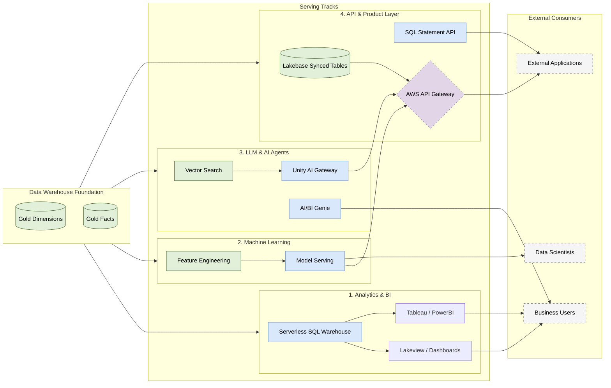

# Databricks Serving Layer Architecture

## 1. Executive Summary

This architecture defines the **Serving Layer** built on top of the
Databricks Data Warehouse. It provides a unified, governed, and highly
performant interface for four primary consumer patterns:

1.  **Analytics & BI:** Dashboards, reporting, and ad-hoc SQL.
2.  **Machine Learning:** Feature serving and traditional model inference.
3.  **LLM & AI Agents:** Generative AI, RAG, and natural language interfaces.
4.  **API & Product Layer:** Programmatic data access for external applications.

**Core Principle:** All serving tracks source their data from the **Gold Layer**
(Star Schema) managed within Unity Catalog, ensuring a single source of truth,
consistent RBAC, and centralized observability.

---

## 2. Architecture Diagram

---

## 3. Serving Tracks

### 3.1 Track 1: Analytics & BI Serving

Optimized for **OLAP** workloads involving complex aggregations, large data
scans, and ad-hoc analytical queries.

*   **Compute Engine:** Serverless Databricks SQL Warehouses. They provide
    instant compute scaling and employ the Photon engine for high throughput.
*   **Visualization:** Native Databricks Lakeview (AI/BI Dashboards) for
    internal reporting, reducing data extraction overhead.
*   **External BI:** External tools (Tableau, PowerBI) connect via JDBC/ODBC
    using OAuth or Personal Access Tokens (PAT) scoped to the SQL Warehouse.
*   **Performance:** Heavily relies on **Liquid Clustering** applied to the
    underlying Gold tables and native Result Caching in the SQL Warehouse.

### 3.2 Track 2: Machine Learning Serving

Optimized for serving curated features and traditional ML model predictions
(e.g., fraud detection, recommendation scores) with low latency.

*   **Feature Engineering:** Gold tables are registered as Feature Tables in
    Unity Catalog. Offline features are used for training. For online serving,
    features are published to the Online Store (Lakebase / Online Tables) to
    support point lookups.
*   **Feature Spec (`FeatureSpec`):** Reusable logical sets of features and
    functions are registered in Unity Catalog. These specify the lookups and
    computations needed for serving.
*   **Automatic Feature Lookup:** MLflow models logged with feature metadata
    automatically perform point-in-time lookups from the Online Store using
    request entity IDs (e.g., `customer_id`), eliminating training-serving
    skew and client-side feature retrieval logic.
*   **Model Serving:** MLflow registered models are deployed to Databricks
    Serverless Model Serving endpoints. These endpoints automatically scale
    based on request volume and handle the automatic feature lookups.

### 3.3 Track 3: LLM & AI Agent Serving

Designed to power Generative AI, Retrieval-Augmented Generation (RAG), and
autonomous agents using Databricks Mosaic AI.

*   **Unity AI Gateway:** Acts as the unified control plane for LLMs. It manages
    external credentials, rate limits, and caching. Gateway policies apply
    guardrails including PII redacting and content safety at the edge.
*   **Vector Search:** Text data embedded from the Gold Layer is synced to
    Databricks Vector Search indexes. Delta Sync indexes auto-replicate changes
    from the source Delta table, acting as the retrieval engine for RAG.
*   **AI/BI Genie:** Provides a natural language interface over the Gold Star
    Schema. Curated via custom instructions and example SQL queries, Genie
    translates questions into SQL queries executed on SQL Warehouses.

### 3.4 Track 4: API & Product Layer

Designed to serve data programmatically to external enterprise applications and
microservices. This track utilizes **AWS API Gateway** as the unified front door.

*   **Low-Latency OLTP Serving (Lakebase):**
    *   **Lakebase Synced Tables:** Gold tables are replicated to Lakebase
        (managed serverless PostgreSQL) using Lakeflow pipelines, providing
        sub-10ms, high-concurrency read access via standard Postgres.
    *   **Legacy Online Tables:** Standard Delta tables can also sync to
        Online Tables for key-value lookups when Postgres features are
        not required.
    *   **Integration:** AWS API Gateway queries Lakebase via standard JDBC,
        or routes requests to Model Serving endpoints wrapping the synced data.
*   **Bulk / Asynchronous Data Access:**
    *   **SQL Statement API:** For external systems needing to extract larger
        datasets or run complex queries, AWS API Gateway proxies requests
        to the SQL Statement Execution API (handling async pagination).
*   **Security & Rate Limiting:** AWS API Gateway manages client API keys,
    authentication (Cognito/IAM), rate limiting, and WAF protection before
    routing operational queries to the Databricks serving layer.

---

## 4. Access Control (Unity Catalog)

Security is enforced at the metadata layer via **Unity Catalog**, ensuring
permissions remain consistent regardless of how the data is served.

| Persona / System | Required Grants | Enforcement Point |
| :--- | :--- | :--- |
| **BI Consumer** | `GRANT SELECT ON CATALOG curated` | Unity Catalog (RBAC) |
| **Ext. App (API)**| Service Principal PAT / OAuth | AWS API GW + UC |
| **AI/BI Genie** | `GRANT USE SCHEMA` on Gold | Unity Catalog |
| **Unity AI Gateway**| Provisioned via MLflow Registry | Unity Catalog / MLflow |

*   **Row-Level Security & Column Masking:** Any RLS or masking policies defined
    on the Gold tables automatically apply to SQL Warehouses, Lakeview, and
    API queries, preventing accidental data exposure.

---

## 5. Observability & FinOps

With a heavily serverless architecture, comprehensive observability is required
to monitor performance and manage costs.

*   **Inference Tables:** Model serving and Unity AI Gateway endpoints log
    request and response payloads automatically to UC Inference Tables. These
    support schema evolution, request tracing, and compliance auditing.
*   **System Tables:** Analytical activities are logged to Unity Catalog
    system tables (e.g., `system.query.history` for SQL Warehouses and
    `system.billing.usage` for serverless spend tracking).
*   **API Gateway Metrics:** AWS API Gateway provides CloudWatch metrics for
    latency, error rates (4xx/5xx), and client throttling counts.
*   **FinOps & Spend Alerts:** A Databricks dashboard queries billing
    system tables to track DBU consumption across warehouses and endpoints,
    triggering alerts if daily spend targets are exceeded.
