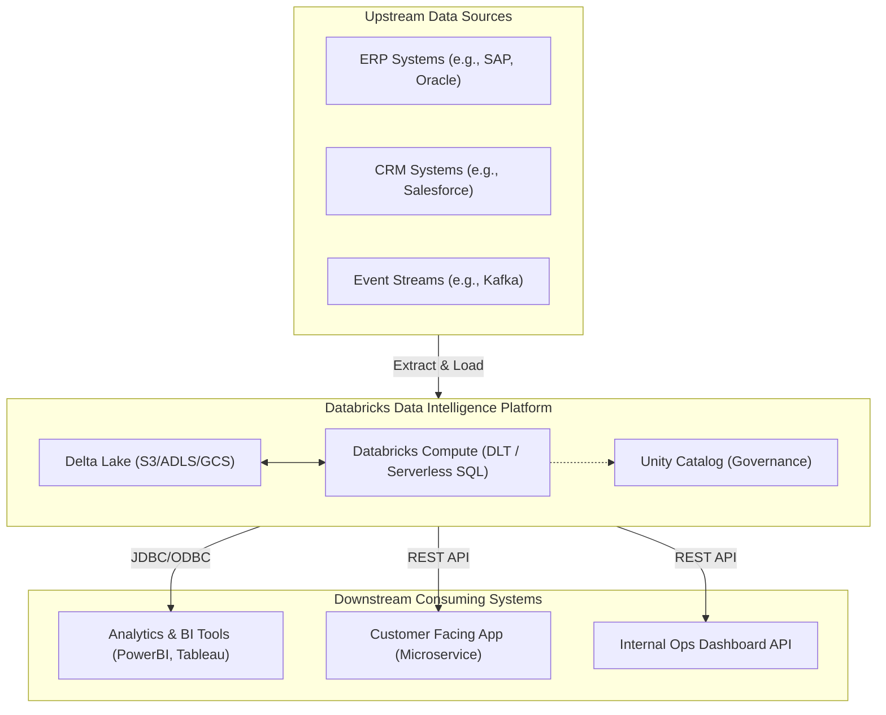
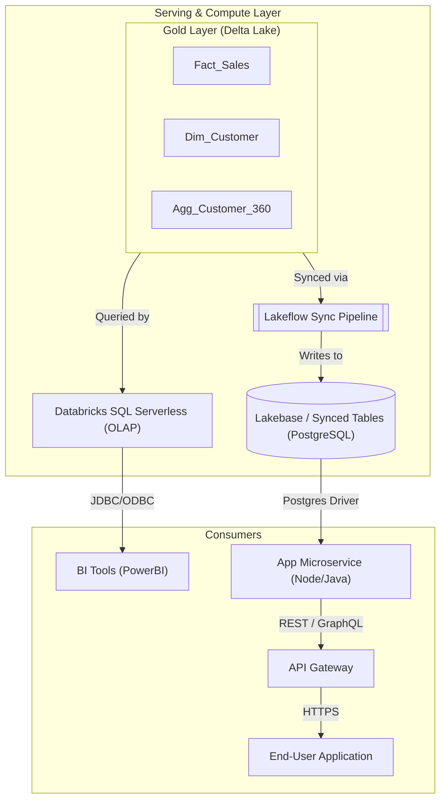

# Solution Architecture Document: Enterprise Databricks Data Warehouse

## 1. Document Control
*   **Target Audience:** Enterprise Architecture Board, Data Engineers, Software Engineers, Data Analysts, Security Officers.
*   **Version:** 1.0
*   **Status:** Approved Draft

---

## 2. Executive Summary
This document outlines the Solution Architecture for the Enterprise Data Warehouse built on the Databricks Data Intelligence Platform. The primary objective of this architecture is to provide a single, governed source of truth that concurrently serves two distinct access patterns:
1.  **High-throughput Analytics:** Empowering Business Intelligence (BI) tools and data scientists with fast, scalable SQL compute over massive datasets.
2.  **Low-latency Operational APIs:** Enabling downstream microservices and applications to fetch enriched operational data with sub-second latency at high concurrency.

By decoupling storage from compute and leveraging Databricks' unified ecosystem (Delta Lake, Unity Catalog, Databricks SQL, and Lakebase), this design eliminates data silos, ensures consistent governance, and optimizes infrastructure costs.

---

## 3. Architectural Principles
1.  **Single Source of Truth:** All organizational data is mastered in Delta Lake and governed centrally via Unity Catalog.
2.  **Decoupled Compute and Storage:** Cloud object storage is used for persistent data, while compute clusters are provisioned dynamically based on workload demands.
3.  **Pattern-Specific Serving:** We do not force analytics tools and operational APIs to share the same compute endpoint. We route analytics to Serverless SQL and sync operational data to a managed RDBMS (Lakebase) for APIs.
4.  **Security by Design:** Fine-grained access controls (RBAC/ABAC) are enforced at the Catalog, Schema, Table, Row, and Column levels.
5.  **Declarative Engineering:** Data pipelines and synchronization jobs are defined declaratively using Delta Live Tables (DLT) and Lakeflow, minimizing imperative code maintenance.

---

## 4. System Context Diagram

The following diagram illustrates how the Data Warehouse sits between upstream source systems and downstream consuming systems.

---

## 5. Data Architecture (Medallion Pattern)

The core data processing utilizes the Medallion Architecture pattern, implemented via **Delta Live Tables (DLT)** to ensure data quality and lineage tracking.

*   **Bronze Layer (Raw):** Ingests raw data directly from source systems using Databricks Auto Loader (for files) or structured streaming (for Kafka/EventHubs). Data is stored in its original format (e.g., JSON, Parquet) with metadata columns appended (load timestamp, source file).
*   **Silver Layer (Cleansed & Conformed):** Data is deduplicated, cleaned, parsed, and joined to create an enterprise-conformed view. Data quality expectations (using DLT `EXPECT` statements) quarantine or drop bad records here.
*   **Gold Layer (Curated for Consumption):** Highly refined, business-level aggregates and dimensional models (Star Schema). This layer is optimized for direct querying by BI tools and synchronization to operational data stores.

---

## 6. Serving Layer Architecture

A critical requirement is serving data to both Analytics users and operational APIs efficiently. The architecture solves this by bifurcating the serving layer based on the access pattern.

### 6.1 Analytics Pattern: Databricks SQL Serverless
For Business Intelligence, reporting, and ad-hoc analysis:
*   **Compute:** Databricks SQL Serverless warehouses are provisioned. These provide instant startup times and automatic scaling based on query concurrency.
*   **Access:** BI tools (e.g., PowerBI, Tableau) connect via standard Databricks JDBC/ODBC drivers.
*   **Target:** Queries hit the Gold layer Delta tables directly. Unity Catalog enforces Row/Column level security based on the BI user's identity.

### 6.2 API Pattern: Synced Tables (Lakebase)
For downstream applications requiring low-latency (e.g., < 50ms) point lookups or high-concurrency operational reads:
*   **Compute/Storage:** We utilize **Lakebase** (Databricks' managed PostgreSQL offering).
*   **Synchronization:** **Lakeflow Declarative Pipelines** are configured to continuously sync specific Gold tier Delta tables (or materialized views) into Lakebase as "Synced Tables".
*   **API Gateway:** An enterprise API Gateway (e.g., Apigee, Kong) sits in front of custom microservices (e.g., Spring Boot, Node.js). These microservices query Lakebase using standard, highly optimized PostgreSQL drivers, ensuring millisecond response times.
*   **Why not query Databricks SQL directly?** While Databricks SQL is fast for analytics, an OLAP engine is not designed for the extreme concurrency and sub-second latency requirements of operational REST APIs. Moving to a synced operational database (PostgreSQL) is the Databricks recommended best practice.

### Serving Architecture Diagram

---

## 7. Enterprise Data Governance & Security

**Unity Catalog** is the centerpiece of the security architecture.
*   **Unified Access Control:** Rather than managing permissions in IAM, PostgreSQL, and BI tools separately, all access grants are managed centrally in Unity Catalog.
*   **Federation:** Access rules defined on Gold Delta tables are respected by Databricks SQL. For Synced Tables, Unity Catalog manages the credentials to access the Lakebase instances securely.
*   **Lineage:** Unity Catalog automatically captures data lineage from the Bronze source tables all the way down to the Gold tables and downstream dashboards.
*   **Network Security:** The Databricks workspace is deployed within a customer-managed VPC/VNet. Secure Cluster Connectivity (No Public IPs) is enforced. API microservices reside in a peered VPC/VNet to ensure database traffic does not traverse the public internet.

---

## 8. Non-Functional Requirements (NFRs)

*   **Scalability:** Databricks SQL Serverless handles spiky analytics workloads by automatically scaling out clusters. Lakebase (PostgreSQL) provides predictable, high-concurrency read throughput for APIs.
*   **Latency:** Analytics queries typically return in seconds. API endpoint calls hitting Lakebase are expected to return in under 50 milliseconds (p95).
*   **Availability:** Data is stored in highly durable cloud object storage across multiple availability zones. Serverless SQL and Lakebase are managed services with built-in high availability and automated failover.
*   **Cost Optimization (FinOps):** Serverless compute is only billed when queries are running. DLT pipelines are configured to run periodically (e.g., hourly) rather than continuously where latency permits, minimizing DBU consumption.
