# Databricks Transformation Architecture: Continuous Streaming with DLT

## 1. Executive Summary
This document outlines the architecture for real-time, continuous data transformation using **Delta Live Tables (DLT)** within Databricks. 

Assuming data is continuously streaming into the Bronze layer via Kafka or Auto Loader, this architecture focuses strictly on a **streaming-first pipeline**. It leverages declarative SQL to construct an end-to-end streaming DAG (Directed Acyclic Graph) capable of sub-minute latency without managing Spark checkpoints manually.

---

## 2. Transformation Workflow (The Medallion Pipeline)

Databricks DLT automatically resolves dependencies and orchestrates the transformation DAG (Directed Acyclic Graph).

```mermaid
flowchart TD
    IngestionStream(Continuous Stream <br>&#40;Kafka / Auto Loader&#41;)

    subgraph Bronze [Bronze Layer - Raw]
        BronzeTable[(Bronze Streaming Table <br>&#40;Append-Only Log&#41;)]
    end

    subgraph Silver [Silver Layer - Cleansed & Conformed]
        SilverTable[(Silver Streaming Table <br>&#40;SCD Type 1/2 Upserts&#41;)]
        
        BronzeTable -->|READ AS STREAM + <br> APPLY CHANGES INTO <br> + DLT Expectations &#40;WARN&#41;| SilverTable
    end

    subgraph Gold [Gold Layer - Business Ready]
        GoldDim[(Gold Dimension MV <br>&#40;Incremental Aggregation&#41;)]
        GoldFact[(Gold Fact MV <br>&#40;Incremental Aggregation&#41;)]
        
        SilverTable -->|Stream to MV <br> + DLT Expectations &#40;WARN&#41;| GoldDim
        SilverTable -->|Stream to MV <br> + DLT Expectations &#40;WARN&#41;| GoldFact
    end

    subgraph ControlPlane [Databricks Control Plane]
        DLT[DLT Pipeline <br>&#40;Orchestration & Checkpoints&#41;]
        EventLog[DLT Event Log <br>&#40;System Tables&#41;]
        SQLAlert[Databricks SQL Alerts]
    end
    
    Notification[Slack / PagerDuty]

    %% Data Flow
    IngestionStream -->|Real-Time Append| BronzeTable

    %% DLT Orchestrates the full DAG
    DLT -..->|Manages| BronzeTable
    DLT -..->|Manages| SilverTable
    DLT -..->|Manages| GoldDim
    DLT -..->|Manages| GoldFact

    %% Observability Flow
    SilverTable -.->|DQ Constraint Warnings| EventLog
    GoldDim -.->|DQ Constraint Warnings| EventLog
    GoldFact -.->|DQ Constraint Warnings| EventLog
    EventLog -.->|Queries on FAILED State & DQ Warnings| SQLAlert
    SQLAlert -->|Webhook| Notification

    %% Style classes
    classDef storage fill:#e2f0d9,stroke:#385723,stroke-width:1px,color:#000;
    classDef process fill:#dae8fc,stroke:#6c8ebf,stroke-width:1px,color:#000;
    classDef source fill:#fff2cc,stroke:#d6b656,stroke-width:1px,color:#000;
    classDef monitor fill:#f5f5f5,stroke:#666,stroke-width:1px,color:#000,stroke-dasharray: 5 5;
    classDef alert fill:#ffe6cc,stroke:#d79b00,stroke-width:1px,color:#000;
    
    class BronzeTable,SilverTable,GoldDim,GoldFact storage;
    class DLT process;
    class IngestionStream source;
    class EventLog,SQLAlert monitor;
    class Notification alert;
```



---

## 3. The Bronze Layer: Raw Ingestion

Bronze is the immutable, append-only landing zone for all raw streaming events. The design principle is **zero transformation, zero data loss**.

### 3.1 Bronze Data Quality (Structural Only)
*   **Design Rule:** Apply only lightweight structural constraints at Bronze. Never apply business rules here.
*   **Implementation:** Use `ON VIOLATION WARN` to verify ingestion metadata completeness, not business validity.
    *   *Example:*
        ```sql
        CONSTRAINT valid_kafka_offset
          EXPECT (_kafka_offset IS NOT NULL)
          ON VIOLATION WARN
        ```

---

## 4. The Silver Layer: Cleansing & Conformance

The primary goal of the Silver layer is to take raw, unbounded event streams from Bronze and process them strictly as **Streaming Tables**. This ensures every record is evaluated exactly once in real-time, producing pristine, normalized representations of business entities.

### 3.1 Incremental Deduplication (`APPLY CHANGES INTO`)
Bronze tables contain every event (inserts, updates, deletes) appended sequentially. Silver must resolve these into the *current state*.

*   **Design Rule:** Never use batch aggregations (like `SELECT DISTINCT` or unbounded `GROUP BY`) on a stream. Use the DLT `APPLY CHANGES INTO` engine for stateful stream deduplication.
*   **How it Works:** It reads the Bronze stream, groups records by a defined Primary Key (`KEYS`), and determines the newest record using a timestamp (`SEQUENCE BY`). Databricks handles the underlying RocksDB state store automatically to perform real-time upserts.
*   **Example (SQL):**
    ```sql
    -- 1. Declare the target Streaming Table
    CREATE OR REFRESH STREAMING TABLE silver_customers;

    -- 2. Stream changes into the table continuously
    APPLY CHANGES INTO LIVE.silver_customers
    FROM STREAM(LIVE.bronze_customers)
    KEYS (customer_id)
    SEQUENCE BY updated_at
    STORED AS SCD TYPE 1;
    ```

### 3.2 Data Quality Enforcement
*   **Design Rule:** Retain all data to prevent silent data loss, but rigorously log violations for downstream filtering and alerting.
*   **Implementation:** Attach SQL-native `CONSTRAINT ... ON VIOLATION WARN` clauses to Silver tables. 
    *   This ensures the record lands in Silver (so no data is lost), but the violation is permanently recorded in the DLT Event Log.
    *   *Example:*
        ```sql
        CONSTRAINT valid_customer_id
          EXPECT (customer_id IS NOT NULL)
          ON VIOLATION WARN
        ```

---

## 4. The Gold Layer: Business Logic & Aggregation

The Gold layer transforms the normalized Silver data into a highly denormalized **Star Schema** (Facts and Dimensions) optimized for BI tools and ad-hoc analytics.

### 4.1 Streaming Aggregations via Materialized Views
*   **Design Rule:** While Silver relies on append-only streams, Gold layer aggregations (like `GROUP BY` or window functions) require recomputing state. In DLT, you do not write complex stateful streaming logic manually.
*   **Implementation:** Use **Materialized Views (MVs)**. Databricks automatically optimizes MVs to act as streaming aggregators where mathematically possible (calculating incremental updates based on the Silver stream) without writing complex structured streaming watermarks.
*   **Example (SQL):**
    ```sql
    CREATE OR REFRESH MATERIALIZED VIEW gold_sales_summary
    COMMENT "Daily aggregated sales for dashboarding."
    AS SELECT 
        date_trunc('day', order_date) as sales_date,
        region,
        SUM(total_amount) as total_revenue
    FROM LIVE.silver_sales_orders
    GROUP BY 1, 2;
    ```

### 4.2 Gold Layer Performance Optimization
*   **Liquid Clustering:** Cluster Gold tables by the columns most frequently used in BI dashboard filters (e.g., `CLUSTER BY (sales_date, region)`).
*   **Serverless SQL:** BI tools reading Gold tables should connect via **Serverless Databricks SQL Warehouses** to leverage Predictive I/O and result caching.

### 4.3 Data Quality in Gold (Business Rules)
DLT Expectations are equally powerful on Materialized Views. While Silver validates structural entity data, Gold layer expectations validate **semantic business logic and aggregations**.
*   **Design Rule:** Apply `ON VIOLATION WARN` expectations to Materialized Views to catch flawed logic without crashing executive dashboards. 
*   **Example (SQL):**
    ```sql
    CONSTRAINT valid_revenue EXPECT (total_revenue >= 0) ON VIOLATION WARN
    ```
    If a source system bug causes negative order values to stream into Silver, the Gold MV will still build, but the warning will instantly trigger a Databricks SQL Alert to the Analytics Engineering team.

---

## 5. Observability, Monitoring & Data Quality Checks

To maintain trust in the transformation pipeline, observability is baked directly into the Databricks architecture using native telemetry and alerting.

### 5.1 DLT Event Log (System Tables)
Every DLT pipeline automatically writes operational telemetry to the **DLT Event Log** (stored as a Delta table in the `/system/events` path). This acts as a centralized ledger for:
*   **Pipeline State:** Capturing transitions (`STARTING`, `RUNNING`, `FAILED`).
*   **Data Quality Metrics:** Counting exactly how many records passed or failed each specific `CONSTRAINT`.
*   **Performance Metrics:** Logging processing rates, backlogs, and cluster utilization.

### 5.2 Databricks SQL Alerts
We deploy **Databricks SQL Alerts** to continuously monitor the Event Log and trigger Webhooks (to Slack or PagerDuty) when anomalies occur.
*   **Pipeline Failures:** Alerts trigger instantly if the pipeline state changes to `FAILED`.
*   **Validation Warning Ratios:** Instead of routing to a physical Dead Letter Queue, an alert queries the Event Log. If the ratio of warnings (failed expectations) to total processed rows exceeds a given threshold (e.g., 1%), engineers are notified to investigate upstream data sources.

---

## 6. Continuous Pipeline Execution
Because this architecture is heavily focused on streaming processing, we abandon traditional cron-based orchestrators (like Airflow DAGs) for pipeline execution.

*   **Always-On Streaming:** The DLT pipeline is configured in **Continuous Mode**. Databricks provisions an always-on cluster that keeps persistent connections open to the underlying message queues or auto-loader event grids.
*   **Automatic Checkpointing:** Engineers do not manage Spark checkpoint directories. DLT automatically manages state, meaning if the pipeline is restarted or scales down, it will resume exactly from the last processed offset in the stream without duplication.
*   **Enhanced Autoscaling:** We enable Enhanced Autoscaling on the DLT cluster. As stream volume spikes, Databricks automatically adds nodes to maintain sub-second latency, and scales down during quiet periods to optimize cost while the stream remains alive.
