# Databricks Transformation Architecture: Bronze to Gold

## 1. Executive Summary
This document outlines the architecture for transforming raw data into business-ready assets using **Delta Live Tables (DLT)** within Databricks. 

Assuming data has successfully landed in the Bronze layer via ingestion (e.g., Auto Loader), this architecture focuses on the declarative, incremental, and automated transformation pipeline required to build the Silver and Gold layers.

---

## 2. Transformation Workflow (The Medallion Pipeline)

Databricks DLT automatically resolves dependencies and orchestrates the transformation DAG (Directed Acyclic Graph).

```mermaid
flowchart TD
    subgraph Bronze [Bronze Layer - Raw]
        BronzeTable[("Bronze Delta Table <br>&#40;Append-Only Stream&#41;")]
    end

    subgraph Silver [Silver Layer - Cleansed & Conformed]
        SilverTable[("Silver Delta Table <br>&#40;SCD Type 1/2 Upserts&#41;")]
        DLQ[("Quarantine Table <br>&#40;DLQ&#41;")]
        
        BronzeTable -->|APPLY CHANGES INTO <br> + Expectations| SilverTable
        BronzeTable -.->|Fails Expectation| DLQ
    end

    subgraph Gold [Gold Layer - Business Ready]
        GoldDim[("Gold Dimension MV <br>&#40;Customers/Products&#41;")]
        GoldFact[("Gold Fact MV <br>&#40;Sales/Events&#41;")]
        
        SilverTable -->|Incremental Materialized View| GoldDim
        SilverTable -->|Incremental Materialized View| GoldFact
    end

    %% Style classes
    classDef storage fill:#e2f0d9,stroke:#385723,stroke-width:1px,color:#000;
    classDef process fill:#dae8fc,stroke:#6c8ebf,stroke-width:1px,color:#000;
    classDef bad fill:#f8cecc,stroke:#b85450,stroke-width:1px,color:#000;
    
    class BronzeTable,SilverTable,GoldDim,GoldFact storage;
    class DLQ bad;
```



---

## 3. The Silver Layer: Cleansing & Conformance

The primary goal of the Silver layer is to take raw, messy, and potentially duplicated event streams from Bronze and turn them into pristine, normalized representations of business entities.

### 3.1 Incremental Deduplication (`APPLY CHANGES INTO`)
Bronze tables contain every event (inserts, updates, deletes) appended sequentially. Silver must resolve these into the *current state*.

*   **Design Rule:** Never use `SELECT DISTINCT` on a stream. Use the DLT `APPLY CHANGES INTO` engine.
*   **How it Works:** It reads the Bronze stream, groups records by a defined Primary Key (`KEYS`), and determines the newest record using a timestamp (`SEQUENCE BY`). It incrementally upserts the target table.
*   **Example (SQL):**
    ```sql
    APPLY CHANGES INTO LIVE.silver_customers
    FROM STREAM(LIVE.bronze_customers)
    KEYS (customer_id)
    SEQUENCE BY updated_at
    STORED AS SCD TYPE 1; -- Overwrites old records with the latest state
    ```

### 3.2 Data Quality & Quarantine (DLQ)
*   **Design Rule:** Do not let bad data pollute Silver, but do not drop it silently.
*   **Implementation:** Attach DLT Expectations to Silver tables. 
    *   Use `@expect_or_drop` for critical constraints (e.g., `customer_id IS NOT NULL`).
    *   Configure a parallel downstream **Quarantine Table (DLQ)** that captures the inverse of those rules to store malformed records for engineering triage.

---

## 4. The Gold Layer: Business Logic & Aggregation

The Gold layer transforms the normalized Silver data into a highly denormalized **Star Schema** (Facts and Dimensions) optimized for BI tools and ad-hoc analytics.

### 4.1 Transitioning to Materialized Views
*   **Design Rule:** Stop using Streaming Tables (`STREAM`) in the Gold layer if you require complex joins, aggregations, or groupings. 
*   **Implementation:** Use **Materialized Views (MVs)**. MVs in DLT automatically compute *incrementally* where mathematically possible, but fall back to full recomputation if the query logic demands it.
*   **Example (SQL):**
    ```sql
    CREATE OR REFRESH MATERIALIZED VIEW gold_sales_summary
    COMMENT "Daily aggregated sales for dashboarding."
    AS SELECT 
        date_trunc('day', order_date) as sales_date,
        region,
        SUM(total_amount) as total_revenue
    FROM LIVE.silver_sales_orders
    GROUP BY 1, 2;
    ```

### 4.2 Gold Layer Performance Optimization
*   **Liquid Clustering:** Cluster Gold tables by the columns most frequently used in BI dashboard filters (e.g., `CLUSTER BY (sales_date, region)`).
*   **Serverless SQL:** BI tools reading Gold tables should connect via **Serverless Databricks SQL Warehouses** to leverage Predictive I/O and result caching.

---

## 5. Operational Orchestration & Deployment

*   **Declarative Dependency Management:** Engineers do not manually schedule tasks (e.g., "Run Bronze, then wait 5 mins, then run Silver"). By using the `LIVE.` schema prefix in queries, DLT automatically infers the dependency graph and executes tables in the correct order concurrently.
*   **Execution Modes:**
    *   *Real-Time:* Run the pipeline in **Continuous** mode if sub-minute latency is required.
    *   *Cost-Optimized:* Run the pipeline in **Triggered** mode (e.g., hourly). DLT will spin up the cluster, incrementally process all layers (Bronze -> Silver -> Gold) from the last checkpoint, and immediately shut down.
