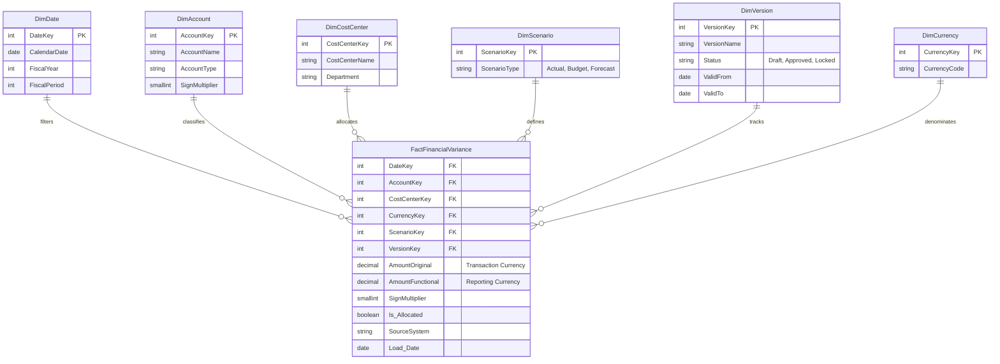

# Modeling Actuals vs. Budget vs. Forecast (Variance Analysis)

One of the most common and critical reporting requirements in a finance data warehouse is variance analysis: comparing **Actuals** (what actually happened) against **Budgets** (the original financial plan) and **Forecasts** (the updated financial projection).

Modeling this correctly is challenging primarily due to the **granularity mismatch** between these datasets and the asynchronous update schedules of transactional vs. planning systems.

---

## 1. The Core Challenge: Granularity Mismatch

The primary difficulty in variance analysis modeling is that Actuals and Planning data are almost never created at the same level of detail.

| Dimension | Actuals (ERP Data) | Budget / Forecast (EPM Data) |
| :--- | :--- | :--- |
| **Time Grain** | Exact Date / Timestamp | Monthly, Quarterly, or Annual |
| **Account Grain** | Lowest leaf-level account (e.g., "Software Subscription Expense - Vendor X") | Higher-level rollup (e.g., "Total Software Expense") |
| **Entity/Cost Center** | Specific Employee / Cost Center | Department Level or Regional Level |

If you try to join these directly without addressing the grain difference, you will generate massive data duplication (Cartesian products) or drop data entirely. 

**Kimball's Cardinal Rule:** Never mix different levels of granularity in a single fact table.

---

## 2. Modeling Strategies

There are two primary architectural patterns to solve this, both adhering to Kimball dimensional modeling standards.

### Approach A: The Drill-Across Pattern (Separate Fact Tables)
*Best for: Environments where Actuals and Budgets must remain at their original, differing grains.*

In this approach, you keep the data in separate fact tables but link them together in the BI/Semantic layer using Conformed Dimensions. This is the safest Kimball-compliant choice when grains don't match.

1. **`FactActuals`**: Grain is `Date` + `Leaf Account` + `Cost Center`
2. **`FactBudget`**: Grain is `Month` + `Rollup Account` + `Department`
3. **The BI Layer (Drill-Across):** You create relationships from both fact tables to your conformed `DimDate` and `DimAccount` tables. The Semantic Layer or BI tool issues separate queries against each fact table and outer-joins the aggregated results on the conformed dimension keys.

### Approach B: The Unified Fact Table (Conditional Recommendation)
*Best for: Cleaner, more performant reporting—but ONLY IF data is aggregated to a shared grain first.*

In this approach, you merge Actuals, Budgets, and Forecasts into a single, unified `FactFinancialVariance` table. However, you must align the grain *before* loading. 

**How to handle the Time Grain mismatch:**
* **Option 1 (Push Down / Allocation):** Take the monthly budget of $30k and divide it by the days in the month, inserting 30 daily records of $1k into the unified fact table. *(Warning: Finance often dislikes fabricated daily budgets).*
* **Option 2 (Pull Up / Dummy Dates):** Aggregate Actuals to the Monthly level, or assign the Budget/Forecast records to a specific "dummy" date in the month (e.g., the last day of the month). 

**The Unified Table Schema Pattern:**
```sql
CREATE TABLE FactFinancialVariance (
    -- Dimensions
    DateKey INT,               
    AccountKey INT,            
    CostCenterKey INT,         
    CurrencyKey INT,           -- Ensure currency is explicitly tracked
    ScenarioKey INT,           -- e.g., 'Budget', 'Actual'
    VersionKey INT,            -- e.g., 'V1', 'Final Board Approved'
    
    -- Measures
    AmountOriginal DECIMAL(19,4),   -- Amount in transaction currency
    AmountFunctional DECIMAL(19,4), -- Amount in standard reporting currency
    
    -- Metadata & Auditing
    SignMultiplier SMALLINT,   -- +1 or -1 (See Sign Convention section)
    Is_Allocated BOOLEAN,      -- Was this derived by a bridge table?
    SourceSystem VARCHAR(50),  -- e.g., 'Oracle ERP' vs 'Oracle EPM'
    Load_Date DATE             -- Crucial for bi-temporal auditing
);
```

---

## 3. The Crucial "Sign Convention" Problem

This is one of the most common and painful mistakes in financial data modeling.

**The Problem:**
* In accounting, Revenue is credited (often stored as positive in P&L reporting but negative in the raw GL). Expenses are debited (often stored as positive in the GL).
* If you simply calculate `Variance = Actual - Budget`:
  * A `+$100k` variance on Revenue is **favorable**.
  * A `+$100k` variance on Expense is **unfavorable**.
  
**The Solution:** Add a `Sign_Multiplier` attribute (value: `+1` or `-1`) to the `DimAccount` dimension. 

Apply this multiplier in the semantic layer when computing variances so that:
* **Favorable variances always display as positive.**
* **Unfavorable variances always display as negative.**

---

## 4. The Variance Calculation Layer

Where should the `Actual - Budget` calculation happen?

* **Do NOT store variances in the Fact Table:** Hardcoding derived variances in the database leads to data integrity issues if underlying actuals or budgets are restated.
* **Calculate in the Semantic Layer:** The calculation (`SUM(Actual) - SUM(Budget) * SignMultiplier`) must be defined in the Semantic Layer (e.g., dbt Semantic Layer, AtScale, or the BI tool's DAX/LookML). This ensures dynamic calculation at query time regardless of how the user groups or filters the data.

---

## 5. Modeling the `DimScenario` and `DimVersion` (Governance)

Planning data is highly iterative. Finance teams run multiple versions of budgets and forecasts throughout the year. You must track these versions meticulously.

### The Dimension Schema
Separate the concepts of **Scenario** (the type of data) and **Version** (the iteration of that data).

* **Scenario:** `Actual`, `Budget`, `Forecast`, `What-If`
* **Version Attributes:**
  * `Version_Name` (e.g., 'FY24 Q2 3+9 Forecast')
  * `Status` (e.g., 'Draft', 'Under Review', 'Approved', 'Locked'). *Crucial for governance: Approved plans must be immutable.*
  * `Valid_From` / `Valid_To`: The time horizon this specific forecast is active for.

### Handling Rolling Forecasts
Finance often uses "Rolling Forecasts" (e.g., a "3+9 Forecast" means 3 months of Actuals + 9 months of Forecast). 
* Store the 9 months of forecast data explicitly tagged as `Version_Name = '3+9 Forecast'`. 
* Let the Semantic Layer write the logic that dynamically stitches together the Actuals for the first 3 months and the Forecast for the remaining 9 months. Do not blend them permanently in the database layer.

---

## 6. The Allocation / Bridge Table Pattern

If your finance team insists on comparing Actuals to Budgets at the lowest possible grain (e.g., "Software Subscription Expense"), but the EPM system only holds the budget at "Total Software Expense", you must use an **Allocation** or **Bridge** table.

1. Create a `BridgeAccountAllocation` table.
2. Define the rules and **store the allocation metadata**: 
   * Ratio: e.g., Subscriptions = 60%, Licenses = 40%.
   * `Based_On`: Document how the ratio was derived (e.g., 'Based on FY23 Actuals Ratio').
3. During ETL, split the high-level budget using the bridge table into granular records in the unified fact table.
4. Flag these records with `Is_Allocated = True` so auditors know they were mathematically derived, not explicitly budgeted.
5. Implement a process for **Periodic Rebalancing** (e.g., recalculating the bridge table weights annually).

---

## 7. Schema Entity-Relationship Diagram

The following Mermaid diagram visualizes the **Unified Fact Table (Approach B)** star schema, demonstrating how the core fact table relates to the various scenario and version dimensions necessary for multi-scenario financial reporting.


