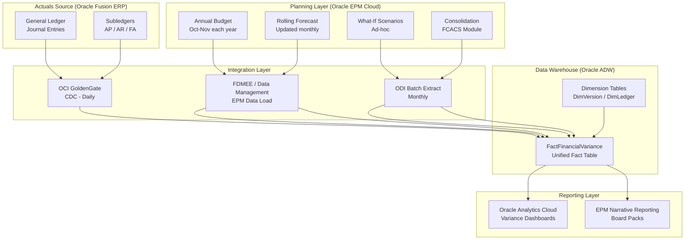
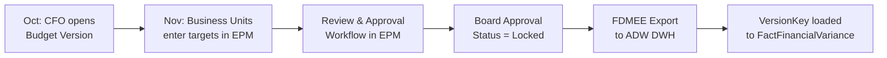
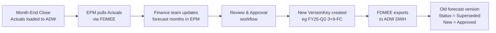
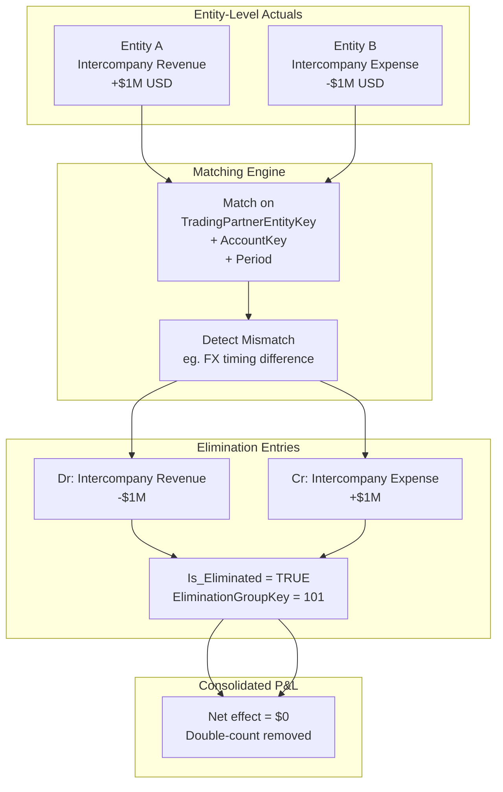
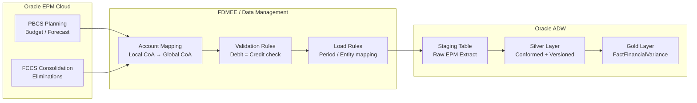
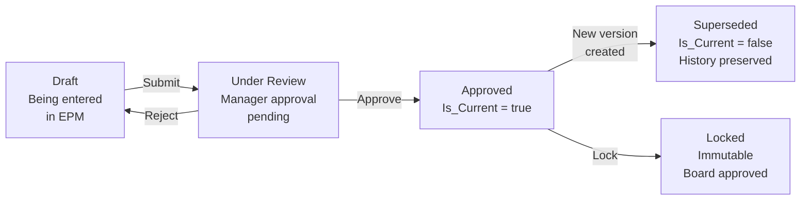

# EPM Architecture: Actual vs. Budget vs. Forecast

## 1. Overview

Enterprise Performance Management (EPM) is the process layer
that sits between the ERP (source of Actuals) and the Data
Warehouse (reporting layer). It is responsible for:

- **Budgeting:** Annual financial plan submitted by
  business owners.
- **Forecasting:** In-year rolling updates to the plan.
- **Consolidation:** Aggregating entity results, applying
  intercompany eliminations, and producing Group financials.
- **Variance Analysis:** Comparing Actuals to Budget and
  Forecast to drive management decisions.

The architecture uses **Oracle EPM Cloud** as the planning
engine, **Oracle Fusion ERP Cloud** as the source of Actuals,
and **Oracle ADW** as the analytical data warehouse.

---

## 2. Planning Cycle Architecture



---

## 3. The Three-Scenario Data Model

All three scenarios land in `FactFinancialVariance`,
distinguished by `DimVersion.ScenarioType`.

### 3.1 DimVersion — Scenario Reference Data

| VersionKey | ScenarioType | VersionName | Status |
|:---:|:---|:---|:---|
| 1 | `Actual` | FY25 Actuals | Open |
| 2 | `Budget` | FY25 Board Approved | Locked |
| 3 | `Forecast` | FY25 Q1 3+9 FC | Superseded |
| 4 | `Forecast` | FY25 Q2 3+9 FC | Approved |
| 5 | `What-If` | FY25 Downturn -10% | Draft |

### 3.2 Grain Alignment Rule

| Scenario | Source Grain | Load Strategy |
|:---|:---|:---|
| Actual | Daily journal entry line | Load as-is; aggregate to month in Gold layer |
| Budget | Monthly by account + entity | Load directly; one row per period |
| Forecast | Monthly by account + entity | Load directly; one row per period |
| What-If | Monthly derived | Derived from Budget × adjustment factor |

---

## 4. EPM Planning Processes

### 4.1 Annual Budget Process



**Key Rules:**
- Budget is opened **once per year** in Oracle EPM PBCS.
- Once approved, `DimVersion.Status = 'Locked'`.
  Locked versions are **immutable** in the DWH.
- Business unit managers enter drivers
  (headcount, volume, price) not raw amounts.
  EPM calculates amounts from drivers.
- Budget is loaded at **Monthly + Account + Entity** grain.

### 4.2 Rolling Forecast Process

The most common MNC pattern is **3+9, 6+6, 9+3 Forecasts**:

```
3+9 = 3 months Actual + 9 months Forecast
6+6 = 6 months Actual + 6 months Forecast
9+3 = 9 months Actual + 3 months Forecast
```



**Governance Pattern in DWH:**
```sql
-- Query: Get current approved forecast only
SELECT *
FROM FactFinancialVariance f
JOIN DimVersion v ON f.VersionKey = v.VersionKey
WHERE v.ScenarioType = 'Forecast'
  AND v.Status       = 'Approved'
  AND v.Is_Current   = true;
```

### 4.3 What-If Scenario Analysis

Finance teams run sensitivity analysis for risk scenarios
(e.g., FX rate shock, volume decline, cost increase).

**EPM Process:**
1. Copy the current Forecast version in EPM.
2. Apply adjustment rules (e.g., Revenue × 0.90).
3. Load to ADW with `ScenarioType = 'What-If'`
   and `Status = 'Draft'` — never `Locked`.
4. What-If scenarios are **never included** in
   board reporting; used for management sensitivity only.

---

## 5. Variance Report Query Patterns

All variance calculations happen in the
**Semantic Layer** (OAC / dbt). Variances are
never stored as physical columns in the fact table.

### 5.1 Actual vs. Budget
```sql
SELECT
    d.FiscalPeriodName,
    a.L1_Category,
    a.L2_Category,
    SUM(CASE WHEN v.ScenarioType = 'Actual'
        THEN f.AmountFunctional
             * a.Sign_Multiplier END)     AS Actual,
    SUM(CASE WHEN v.ScenarioType = 'Budget'
        THEN f.AmountFunctional
             * a.Sign_Multiplier END)     AS Budget,
    SUM(CASE WHEN v.ScenarioType = 'Actual'
        THEN f.AmountFunctional
             * a.Sign_Multiplier END) -
    SUM(CASE WHEN v.ScenarioType = 'Budget'
        THEN f.AmountFunctional
             * a.Sign_Multiplier END)     AS Var_vs_Budget,
    ROUND(
      (SUM(CASE WHEN v.ScenarioType = 'Actual'
           THEN f.AmountFunctional END) /
       NULLIF(SUM(CASE WHEN v.ScenarioType = 'Budget'
                  THEN f.AmountFunctional END), 0) - 1)
      * 100, 1)                           AS Var_Pct
FROM FactFinancialVariance f
JOIN DimDate    d ON f.DateKey    = d.DateKey
JOIN DimAccount a ON f.AccountKey = a.AccountKey
JOIN DimVersion v ON f.VersionKey = v.VersionKey
WHERE v.ScenarioType IN ('Actual', 'Budget')
  AND v.Is_Current   = true
GROUP BY
    d.FiscalPeriodName,
    a.L1_Category,
    a.L2_Category;
```

### 5.2 Full Variance — Actual vs Budget vs Forecast
```sql
SELECT
    d.FiscalPeriodName,
    e.L1_Entity_Group,
    a.L1_Category,
    SUM(CASE WHEN v.ScenarioType = 'Actual'
        THEN f.AmountFunctional
             * a.Sign_Multiplier END)     AS Actual,
    SUM(CASE WHEN v.ScenarioType = 'Budget'
        THEN f.AmountFunctional
             * a.Sign_Multiplier END)     AS Budget,
    SUM(CASE WHEN v.ScenarioType = 'Forecast'
        THEN f.AmountFunctional
             * a.Sign_Multiplier END)     AS Forecast,
    SUM(CASE WHEN v.ScenarioType = 'Actual'
        THEN f.AmountFunctional
             * a.Sign_Multiplier END) -
    SUM(CASE WHEN v.ScenarioType = 'Budget'
        THEN f.AmountFunctional
             * a.Sign_Multiplier END)     AS Var_Budget,
    SUM(CASE WHEN v.ScenarioType = 'Actual'
        THEN f.AmountFunctional
             * a.Sign_Multiplier END) -
    SUM(CASE WHEN v.ScenarioType = 'Forecast'
        THEN f.AmountFunctional
             * a.Sign_Multiplier END)     AS Var_Forecast
FROM FactFinancialVariance f
JOIN DimDate    d ON f.DateKey    = d.DateKey
JOIN DimAccount a ON f.AccountKey = a.AccountKey
JOIN DimEntity  e ON f.EntityKey  = e.EntityKey
JOIN DimVersion v ON f.VersionKey = v.VersionKey
WHERE v.Is_Current = true
GROUP BY
    d.FiscalPeriodName,
    e.L1_Entity_Group,
    a.L1_Category;
```

---

## 6. Intercompany Elimination Process



**DWH Implementation:**
- Original entity rows: `Is_Eliminated = FALSE`
- Elimination rows: `Is_Eliminated = TRUE`,
  `EliminationGroupKey` links matching pair.
- Consolidated reports filter:
  `WHERE Is_Eliminated = FALSE`
- Elimination audit reports filter:
  `WHERE Is_Eliminated = TRUE`

---

## 7. EPM Data Load — FDMEE Integration

Oracle FDMEE (Financial Data Management, Enterprise Edition)
is the integration hub between Oracle EPM and Oracle ADW.



**FDMEE Mapping Rules:**
1. **Account Mapping:** EPM accounts map to
   `Global_AccountCode` in `DimAccount`.
2. **Period Mapping:** EPM `Jan-2025` maps to
   `FiscalCalendarKey` in `DimFiscalCalendar`.
3. **Entity Mapping:** EPM entity codes map to
   `EntityCode` in `DimEntity`.
4. **Version Mapping:** EPM scenario + version
   map to `VersionKey` in `DimVersion`.

---

## 8. DimVersion Lifecycle State Machine



**Status Transition Rules in DWH:**
- Only **one** `Is_Current = true` per
  `ScenarioType` per fiscal year.
- Setting a new version to `Approved` automatically
  sets the previous version to `Superseded`.
- `Locked` versions can never be modified.
  Any restatement requires a new version.

---

## 9. Reporting Layer — Oracle Analytics Cloud

OAC consumes `FactFinancialVariance` through
a semantic model that pre-defines all measures.

### Key OAC Measures (Semantic Layer Definitions)

| Measure | Formula |
|:---|:---|
| `Actual Amount` | `SUM(AmountFunctional WHERE ScenarioType='Actual') × Sign_Multiplier` |
| `Budget Amount` | `SUM(AmountFunctional WHERE ScenarioType='Budget') × Sign_Multiplier` |
| `Forecast Amount` | `SUM(AmountFunctional WHERE ScenarioType='Forecast') × Sign_Multiplier` |
| `Variance vs Budget` | `Actual Amount - Budget Amount` |
| `Variance vs Forecast` | `Actual Amount - Forecast Amount` |
| `Budget Achievement %` | `Actual Amount / Budget Amount × 100` |

### Standard Finance Reports

| Report | Scenarios Used | Primary Dimensions |
|:---|:---|:---|
| Monthly P&L | Actual, Budget, Forecast | Entity, Account, Period |
| Rolling Forecast | Actual + Forecast | Account, Period |
| Budget vs Actual | Actual, Budget | CostCenter, Account |
| Entity Scorecard | All | Entity, Segment |
| Cash Flow Statement | Actual | Account (CashFlow_Category) |
