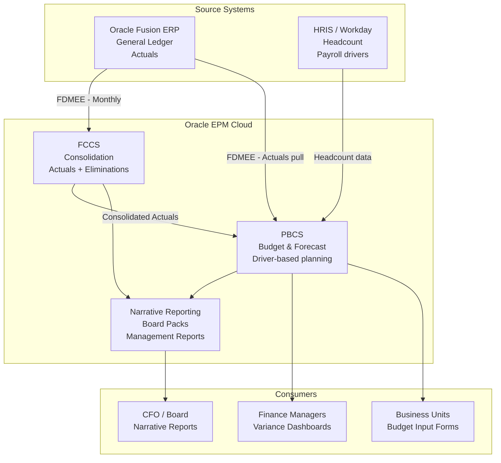
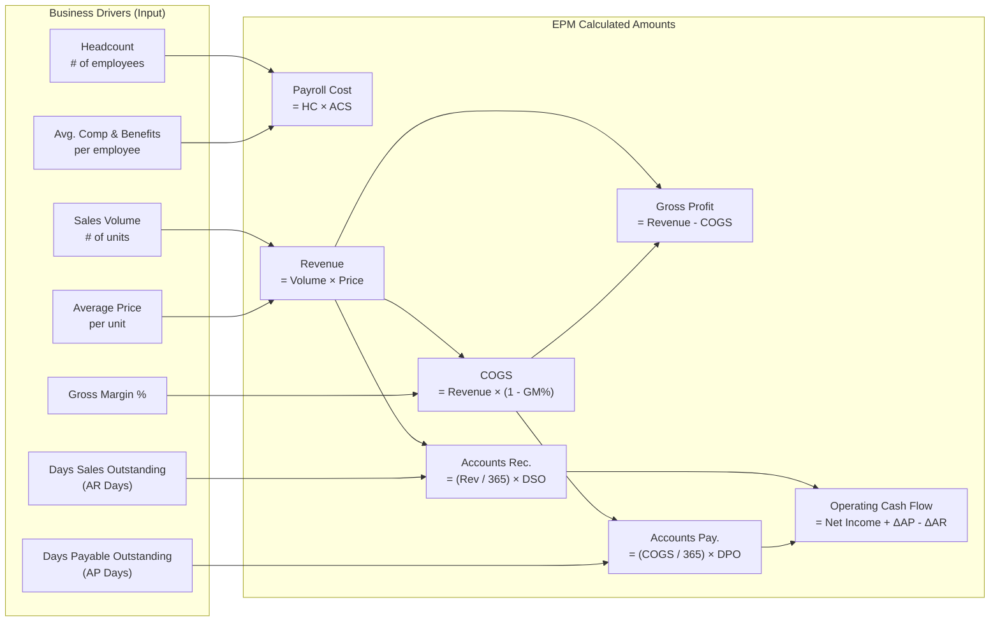
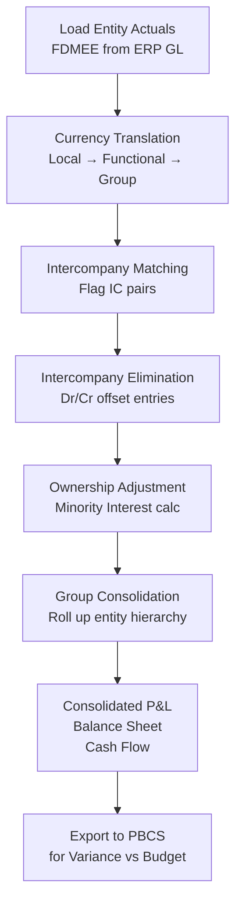
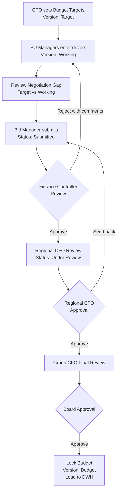
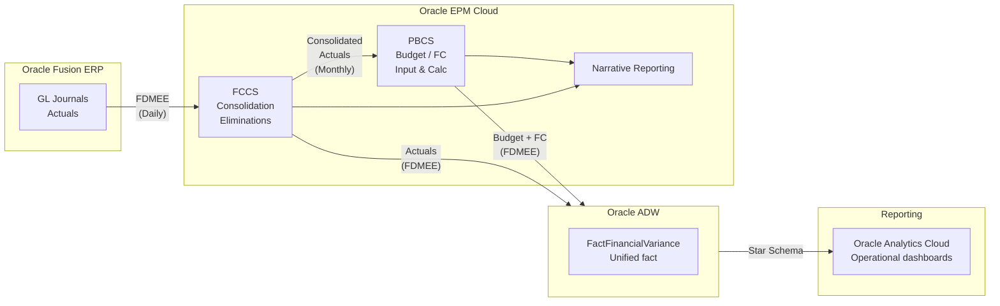

# EPM Solution Design
## Finance & Accounting — Actual vs Budget vs Forecast

---

## 1. Platform Selection

Oracle EPM Cloud is composed of distinct modules.
This design uses three:

| Module | Purpose | Scenario |
|:---|:---|:---|
| **PBCS** (Planning & Budgeting) | Driver-based planning | Budget, Forecast, What-If |
| **FCCS** (Financial Consolidation) | Legal consolidation | Actual (consolidated) |
| **Narrative Reporting** | Board packs | All scenarios |



---

## 2. EPM Dimension Design

EPM uses a multi-dimensional cube (Essbase) model.
Every dimension maps directly to the DWH schema.

### 2.1 Dimension Inventory

| EPM Dimension | DWH Mapping | Type |
|:---|:---|:---|
| `Account` | `DimAccount` | Dense |
| `Period` | `DimFiscalCalendar` | Dense |
| `Entity` | `DimEntity` | Sparse |
| `Scenario` | `DimVersion.ScenarioType` | Sparse |
| `Version` | `DimVersion.VersionName` | Sparse |
| `Currency` | `DimCurrency` | Sparse |
| `CostCenter` | `DimCostCenter` | Sparse |
| `ProfitCenter` | `DimProfitCenter` | Sparse |

### 2.2 Scenario Dimension

The Scenario dimension controls which data type is
being viewed or entered:

```
Scenario
├── Actual
│   └── [Read-only. Loaded from ERP via FDMEE]
├── Budget
│   ├── FY2025_Target         [Top-down guidance locked by CFO]
│   ├── FY2025_Working        [Bottom-up input from BUs]
│   └── FY2025_Budget         [Locked after board approval]
├── Forecast
│   ├── FY2025_Q1_3x9         [Superseded]
│   ├── FY2025_Q2_6x6         [Superseded]
│   ├── FY2025_Q3_9x3         [Current - Approved]
│   └── FY2025_Latest         [Smart alias → current FC]
└── What-If
    ├── Downturn_10pct        [Draft]
    └── FX_Shock_USD_5pct     [Draft]
```

### 2.3 Account Dimension Hierarchy

```
Account (P&L)
├── Revenue                          [Sign: +]
│   ├── Product Revenue
│   │   ├── Software Revenue
│   │   └── Hardware Revenue
│   └── Service Revenue
│       ├── Professional Services
│       └── Maintenance & Support
├── Cost of Revenue                  [Sign: -]
│   ├── COGS - Product
│   └── COGS - Services
├── Gross Profit                     [Calculated]
├── Operating Expenses               [Sign: -]
│   ├── Sales & Marketing
│   │   ├── Headcount Costs
│   │   └── Marketing Spend
│   ├── General & Administrative
│   │   ├── Headcount Costs
│   │   └── Office & Facilities
│   └── Research & Development
│       ├── Headcount Costs
│       └── R&D Materials
├── EBITDA                           [Calculated]
├── D&A                              [Sign: -]
├── EBIT                             [Calculated]
├── Finance Costs                    [Sign: -]
│   ├── Interest Expense
│   └── FX Loss / Gain
└── Net Profit Before Tax            [Calculated]

Account (Balance Sheet)
├── Assets
│   ├── Current Assets
│   │   ├── Cash & Equivalents
│   │   ├── Accounts Receivable
│   │   └── Inventory
│   └── Non-Current Assets
│       ├── PP&E
│       └── Intangible Assets
├── Liabilities
│   ├── Current Liabilities
│   │   ├── Accounts Payable
│   │   └── Accrued Expenses
│   └── Non-Current Liabilities
│       └── Long-term Debt
└── Equity
    ├── Share Capital
    ├── Retained Earnings
    └── Current Year Profit
```

### 2.4 Entity Dimension Hierarchy

```
Global Group (Total)
├── AMERICAS
│   ├── USA_Holding
│   │   ├── USA_Operations      [100% owned]
│   │   └── USA_Sales           [100% owned]
│   └── LATAM_Holding
│       └── Brazil_Operations   [80% owned]
├── APAC
│   ├── Singapore_HQ            [100% owned]
│   ├── Vietnam_Operations      [100% owned]
│   ├── Japan_Holding
│   │   └── Japan_Operations    [100% owned]
│   └── Australia_Operations    [100% owned]
└── EMEA
    ├── UK_Holding              [100% owned]
    │   └── UK_Operations       [100% owned]
    └── Germany_Operations      [100% owned]
```

**Intercompany Elimination Entities:**
```
Eliminations              [System-generated]
├── ELIM_AMERICAS
├── ELIM_APAC
└── ELIM_EMEA
```

---

## 3. PBCS Planning Application Design

### 3.1 Driver-Based Planning Model

Finance does not enter raw amounts directly.
They enter **business drivers** — EPM calculates amounts.



### 3.2 Data Entry Forms Design

#### Budget Input Form — P&L by Cost Center

| | Jan | Feb | Mar | Q1 Total |
|:---|---:|---:|---:|---:|
| **Headcount (FTE)** | 50 | 52 | 55 | — |
| Avg Salary/month ($) | 5,000 | 5,000 | 5,200 | — |
| *Payroll Cost* | 250K | 260K | 286K | 796K |
| **Revenue Drivers** | | | | |
| Volume (units) | 1,000 | 1,200 | 1,300 | 3,500 |
| Avg Price ($) | 500 | 500 | 500 | — |
| *Revenue* | 500K | 600K | 650K | 1,750K |
| Gross Margin % | 65% | 65% | 65% | — |
| *COGS* | 175K | 210K | 228K | 613K |
| *Gross Profit* | 325K | 390K | 422K | 1,137K |

**Form Properties:**
- Rows: Account hierarchy (L1–L3)
- Columns: Monthly periods
- POV (Point of View): Entity, Version, Currency
- Drivers: Editable (white cells)
- Calculated: Read-only (yellow cells)

### 3.3 Planning Calculation Scripts (Groovy / Calc Scripts)

```groovy
// PBCS Business Rule: Calculate P&L & Cash Flow from Drivers
// Runs after any driver input is saved

FIX("Budget", "Working", @CUR("FY2025"))
    // 1. P&L Calculations
    "Payroll_Cost" (
        "Payroll_Cost" = "Headcount_FTE" * "Avg_Comp_Per_HC";
    )
    "Revenue" (
        "Revenue" = "Sales_Volume" * "Avg_Selling_Price";
    )
    "COGS" (
        "COGS" = "Revenue" * (1 - "Gross_Margin_Pct" / 100);
    )
    "Gross_Profit" (
        "Gross_Profit" = "Revenue" - "COGS";
    )
    "EBITDA" (
        "EBITDA" = "Gross_Profit" - "Sales_Marketing_Opex" - "GA_Opex" - "RD_Opex";
    )

    // 2. Balance Sheet & Cash Flow Calculations
    "Accounts_Receivable" (
        "Accounts_Receivable" = ("Revenue" / 30) * "Days_Sales_Outstanding";
    )
    "Accounts_Payable" (
        "Accounts_Payable" = ("COGS" / 30) * "Days_Payable_Outstanding";
    )
    "Operating_Cash_Flow" (
        // Simplified indirect cash flow method
        "Operating_Cash_Flow" = "Net_Income" 
            - ("Accounts_Receivable" - @PRIOR("Accounts_Receivable")) 
            + ("Accounts_Payable" - @PRIOR("Accounts_Payable"));
    )
ENDFIX
```

### 3.4 Corporate Overhead Allocation Logic

To determine true profitability per business unit, Corporate IT
and HR expenses are allocated downwards before the final budget
is locked.

**Trigger rule:** This allocation is configured as a
**scheduled business rule** that fires automatically whenever
`Headcount_FTE` is saved for any entity. This ensures
allocation amounts never go stale if headcount is revised
after an initial run.

```groovy
// PBCS Allocation Rule: Allocate Corporate IT Cost to BUs
// Trigger: Auto-run on Headcount_FTE change (any entity)
// Driver: Headcount ratio per entity

FIX("Budget", "Working", @CUR("FY2025"))
    "IT_Allocated_In" (
        // Calculate entity's share of total headcount
        var HC_Ratio = "Headcount_FTE" / "Headcount_FTE"->"Global_Group";

        // Allocate Corporate IT expense down
        "IT_Allocated_In" = "IT_Opex"->"Corporate_HQ" * HC_Ratio;
    )

    // Offset entry in Corporate HQ so group total is unchanged
    "IT_Allocated_Out"->"Corporate_HQ" (
        "IT_Allocated_Out" = -"IT_Opex"->"Corporate_HQ";
    )
ENDFIX
```

**Allocation Cost Centers in scope:**

| Corporate Pool | Allocation Driver | Target |
|:---|:---|:---|
| Corporate IT | Headcount FTE | All BU entities |
| Corporate HR | Headcount FTE | All BU entities |
| Office & Facilities | Headcount FTE | All BU entities |
| Legal & Compliance | Revenue % | Revenue entities only |

---

## 4. FCCS Consolidation Design

### 4.1 Consolidation Process Flow



### 4.2 Currency Translation Rules (IAS 21)

| Account Type | Translation Rate | Rule |
|:---|:---|:---|
| P&L (Revenue, Expense) | Average Rate | Monthly average |
| Balance Sheet (Assets, Liabilities) | Closing Rate | Period-end spot |
| Equity | Historical Rate | Rate at transaction date |
| Translation Difference | Calculated | OCI — not P&L |

**FCCS Translation Rule Configuration:**
```
Account: Revenue
  Translation Method: Period Average Rate
  Rate Type:          AVG
  Source Currency:    VND (Vietnam entity)
  Target Currency:    USD (Functional)

Account: Cash & Equivalents
  Translation Method: End of Period Rate
  Rate Type:          CLO
  Source Currency:    VND
  Target Currency:    USD

Account: Share Capital
  Translation Method: Historical Rate
  Rate Type:          HIST
  Source Currency:    VND
  Target Currency:    USD
```

### 4.3 Intercompany Elimination Rules

```
Rule Set: IC_ELIMINATION_01
  Trigger: Is_Intercompany = Y
  Match Keys:
    - TradingPartner Entity
    - IC Account pair (Revenue ↔ Expense)
    - Period
  Action:
    - If matched: Post Dr/Cr elimination at Group level
    - If mismatch > $1,000: Alert + post difference
      to IC Mismatch account
    - If mismatch < $1,000: Auto-adjust FX diff account
```

### 4.4 Minority Interest Calculation

```
Brazil_Operations: 80% owned by LATAM_Holding
→ Minority Interest = 20%

FCCS Posts:
  Dr: Net Profit         = Brazil NP × 20%
  Cr: Minority Interest  = Brazil NP × 20%
  (Reduces Group P&L to reflect only 80% share)
```

---

## 5. Variance Report Design

### 5.1 Monthly Management Report Structure

```
MONTHLY FINANCE REPORT — [Month] [Year]
━━━━━━━━━━━━━━━━━━━━━━━━━━━━━━━━━━━━

1. EXECUTIVE SUMMARY (1 page)
   ├── Revenue: Actual vs Budget vs Forecast
   ├── EBITDA: Actual vs Budget
   ├── Key Variances (Top 5)
   └── Full Year Forecast vs Budget

2. P&L WATERFALL (1 page)
   └── YTD Actual vs YTD Budget bridge chart

3. ENTITY SCORECARD (1 page per region)
   ├── APAC: Actual vs Budget vs FC
   ├── AMERICAS: Actual vs Budget vs FC
   └── EMEA: Actual vs Budget vs FC

4. COST CENTER DETAIL (on request)
   └── Actual vs Budget by Department

5. CASH FLOW SUMMARY (1 page)
   └── Operating / Investing / Financing
```

### 5.2 Key Variance Report EPM Formula

```
// PBCS Report member formula
// Variance = Actual - Budget (with sign logic)

"Var_vs_Budget" =
    IIF(
        "Account".Attribute("Account_Type") = "Revenue",
        "Actual" - "Budget",      -- Revenue: +ve = good
        "Budget" - "Actual"       -- Expense: +ve = good (under budget)
    );

"Var_vs_Budget_Pct" =
    IIF(
        @ISMBR("Budget") AND "Budget" <> 0,
        ("Var_vs_Budget" / @ABS("Budget")) * 100,
        #MISSING
    );

"Full_Year_FC" =
    @SUM(@RELATIVE("YTD", 0), "Actual")   -- YTD Actuals
    +
    @SUM(@RELATIVE("Remaining", 0), "Forecast");  -- Remaining FC
```

---

## 6. Approval Workflow Design



**Workflow Status in DimVersion:**

| Stage | DimVersion.Status | Is_Current | Editable |
|:---|:---|:---:|:---:|
| Being entered | `Draft` | N | ✅ |
| Submitted by BU | `Submitted` | N | ❌ |
| Under review | `Under_Review` | N | ❌ |
| Finance approved | `Approved` | Y | ❌ |
| Board locked | `Locked` | Y | ❌ |
| Replaced by new FC | `Superseded` | N | ❌ |

---

## 7. Rolling Forecast Cadence

| Month | Forecast Version | Pattern | Horizon |
|:---|:---|:---|:---|
| Jan (close) | FY25_Q1_3x9 | 3 Actual + 9 FC | Mar → Dec |
| Apr (close) | FY25_Q2_6x6 | 6 Actual + 6 FC | Jun → Dec |
| Jul (close) | FY25_Q3_9x3 | 9 Actual + 3 FC | Sep → Dec |
| Oct (close) | FY25_Q4_12x0 | 12 Actual | Final outturn |

**Key Rule:** Each new FC version supersedes the previous.
Only the **current** approved FC is used in variance reports.

---

## 8. System Integration Summary



---

## 9. Security & Access Control

EPM systems contain highly sensitive data (payroll rates, M&A models). Access must be strictly governed using **Entity-level and Cost Center-level security filters**.

### 9.1 Group-Based Security Model

| User Group | Entity Access | Cost Center Access | Permissions |
|:---|:---|:---|:---|
| **Global Finance (CFO)** | `@IDESCENDANTS("Global_Group")` (All) | All | Read / Write |
| **APAC Controller** | `@IDESCENDANTS("APAC")` | All APAC CCs | Read / Write / Approve |
| **Japan BU Manager** | `Japan_Operations` | `CC_Sales_Japan` | Write (Drivers only) |
| **External Auditors** | All | All | Read-Only |

### 9.2 Cell-Level Security Rules

Even if a BU Manager has Write access to their Cost Center,
they cannot edit everything:
1. **Actuals Scenario:** All users are strictly `Read-Only`.
2. **Calculated Cells:** Users cannot overwrite formula-derived
   cells (e.g., they can edit `Headcount` and `Avg Salary`,
   but the resulting `Payroll_Cost` cell is locked).
3. **Locked Versions:** Once the CFO approves a forecast and
   sets it to `Status = Locked`, Write access is universally
   revoked across all user groups.

### 9.3 Working Version — Cost Center Ownership Lock

During the budget submission window, multiple BU Managers
may share access to the same entity. Without locking,
two managers could overwrite each other's inputs
simultaneously.

**Rule:** Each Cost Center is owned by exactly one user
during the active submission window. Only the **designated
CC Owner** has Write access to that cost center's data in
the `Working` version. All other users are `Read-Only`
for that CC until the owner submits.

```
Cost Center Ownership Rules:

  CC_Sales_Japan
    Owner:     Japan BU Manager
    Status:    Open → Submitted
    Write:     Japan BU Manager only
    Read:      APAC Controller, Group Finance

  CC_Marketing_APAC
    Owner:     APAC Marketing Head
    Status:    Open → Submitted
    Write:     APAC Marketing Head only
    Read:      APAC Controller, Group Finance
```

**Submission Window States:**

| CC Status | Owner Access | Controller Access |
|:---|:---:|:---:|
| `Open` | Read / Write | Read-Only |
| `Submitted` | Read-Only | Read / Approve |
| `Approved` | Read-Only | Read-Only |

