# DWH Schema: Unified Fact Table
## Flexible Variance Analysis — Actuals / Budget / Forecast

All scenarios land in a single `FactFinancialVariance` table.
Report flexibility is driven entirely by filtering on `DimVersion`
— which carries denormalized `ScenarioType` for a pure Star Schema.
No dimension-to-dimension joins (no snowflake). No schema changes needed.

---

## What Was Improved (vs. Original Schema)

Cross-validated against `dwh_design_challenges.md` and
`data_modeling_best_practices.md`. The following gaps were
found and fixed in the schema below:

| # | Gap | Fix Applied |
|:---:|:---|:---|
| 1 | Generic `decimal` type | Changed to `DECIMAL(19,4)` for exact precision |
| 2 | No bi-temporal tracking | Added `Transaction_Date` + `Load_Date` to fact |
| 3 | No entry type tracking | Added `Transaction_Type` for accruals vs. standard |
| 4 | No SOX lineage key | Added `Source_Record_Id` for drill-through to ERP |
| 5 | No intercompany fields | Added `Is_Intercompany` + `TradingPartnerEntityKey` |
| 6 | `DimAccount` not versioned | Added SCD Type 2 fields: `Valid_From`, `Valid_To`, `Is_Current` |
| 7 | `DimDate` missing biz flags | Added `Is_Holiday`, `Is_Weekend`, `Is_Business_Day` |
| 8 | No exchange rate dimension | Added `DimExchangeRate` for multi-currency support |

---

## Star Schema
### Multinational — Three-Currency Model (IAS 21 / ASC 830)

Key design decisions for multinational complexity:

| Pattern | Implementation |
|:---|:---|
| **Three-Currency Model** | Separate measures for Transaction, Functional, Presentation |
| **Role-playing DimCurrency** | One table, 3 FK aliases (`Txn`, `Functional`, `Presentation`) |
| **Role-playing DimExchangeRate** | One table, 2 FK aliases (`Txn→Func`, `Func→Present`) |
| **Multi-country reporting** | `DimCountry` + `DimTaxJurisdiction` direct to fact |
| **Multi-GAAP / Parallel Ledgers** | `DimLedger` — IFRS vs. Local Statutory per entity |
| **Matrix org reporting** | `DimProfitCenter` for Segment / Product Line reporting |
| **Intercompany detail** | `TradingPartnerCostCenterKey` for elimination matching |
| **Hierarchy flattening** | `L1/L2/L3` on Entity, CostCenter, Account |
| **Star Schema compliance** | Zero Dim→Dim joins. All dims connect only to fact |

```mermaid
erDiagram
    FactFinancialVariance {
        int DateKey FK
        int AccountKey FK
        int CostCenterKey FK
        int EntityKey FK
        int TradingPartnerEntityKey FK
        int TradingPartnerCostCenterKey FK
        int CountryKey FK
        int TaxJurisdictionKey FK
        int LedgerKey FK
        int ProfitCenterKey FK
        int VersionKey FK
        int TxnCurrencyKey FK
        int FunctionalCurrencyKey FK
        int PresentationCurrencyKey FK
        int FxRateKey_TxnToFunc FK
        int FxRateKey_FuncToPresent FK
        DECIMAL_19_4 AmountTransaction
        DECIMAL_19_4 AmountFunctional
        DECIMAL_19_4 AmountPresentation
        date Transaction_Date
        date Load_Date
        string Transaction_Type
        string Source_Record_Id
        boolean Is_Intercompany
        boolean Is_Allocated
        string SourceSystem
    }

    DimDate {
        int DateKey PK
        date CalendarDate
        int FiscalYear
        int FiscalQuarter
        int FiscalPeriod
        string FiscalPeriodName
        string FiscalYearPeriod
        boolean Is_Period_End
        boolean Is_Current_Period
        boolean Is_Holiday
        boolean Is_Weekend
        boolean Is_Business_Day
    }

    DimAccount {
        int AccountKey PK
        string Global_AccountCode
        string Local_AccountCode
        string AccountName
        string AccountType
        string StatementLine
        string L1_Category
        string L2_Category
        string L3_Category
        smallint Sign_Multiplier
        date Valid_From
        date Valid_To
        boolean Is_Current
    }

    DimCostCenter {
        int CostCenterKey PK
        string CostCenterCode
        string CostCenterName
        string L1_CostCenter_Group
        string L2_CostCenter_Group
        string Department
        string CountryCode
        string Region
    }

    DimEntity {
        int EntityKey PK
        string EntityCode
        string EntityName
        string L1_Entity_Group
        string L2_Entity_Group
        string L3_Entity_Group
        string ConsolidationLevel
        string CountryCode
        string FunctionalCurrencyCode
        string PresentationCurrencyCode
        string Tax_Jurisdiction_Code
        boolean Is_Intercompany
        boolean Is_Active
    }

    DimCountry {
        int CountryKey PK
        string ISO_CountryCode
        string CountryName
        string Region
        string Continent
        string Tax_Regime
        string Default_CurrencyCode
    }

    DimTaxJurisdiction {
        int TaxJurisdictionKey PK
        string JurisdictionCode
        string JurisdictionName
        string CountryCode
        string Tax_Type
        DECIMAL_19_4 Standard_Rate
        date Effective_From
        date Effective_To
    }

    DimCurrency {
        int CurrencyKey PK
        string CurrencyCode
        string CurrencyName
        string CurrencySymbol
        int Decimal_Precision
    }

    DimExchangeRate {
        int ExchangeRateKey PK
        string From_CurrencyCode
        string To_CurrencyCode
        string Rate_Type
        date Effective_Date
        DECIMAL_19_6 Rate_Value
    }

    DimLedger {
        int LedgerKey PK
        string LedgerCode
        string LedgerName
        string LedgerType
        string AccountingStandard
        string PresentationCurrencyCode
    }

    DimProfitCenter {
        int ProfitCenterKey PK
        string ProfitCenterCode
        string ProfitCenterName
        string L1_Segment
        string L2_Segment
        string ProductLine
        string CountryCode
    }

    DimVersion {
        int VersionKey PK
        string VersionName
        string ScenarioType
        string ScenarioLabel
        string DataSource
        string UpdateFrequency
        string Status
        date ValidFrom
        date ValidTo
        boolean Is_Current
        string Approved_By
        date Approved_Date
    }

    BridgeAccountAlloc {
        int BridgeKey PK
        int ParentAccountKey FK
        int ChildAccountKey FK
        DECIMAL_19_4 AllocationRatio
        string BasedOn
        date EffectiveFrom
    }

    %% --- Core Fact → Dimension (Star) ---
    FactFinancialVariance ||--|| DimDate            : "DateKey"
    FactFinancialVariance ||--|| DimAccount         : "AccountKey"
    FactFinancialVariance ||--|| DimCostCenter      : "CostCenterKey"
    FactFinancialVariance ||--|| DimEntity          : "EntityKey"
    FactFinancialVariance ||--|| DimCountry         : "CountryKey"
    FactFinancialVariance ||--|| DimTaxJurisdiction : "TaxJurisdictionKey"
    FactFinancialVariance ||--|| DimLedger          : "LedgerKey"
    FactFinancialVariance ||--|| DimProfitCenter    : "ProfitCenterKey"
    FactFinancialVariance ||--|| DimVersion         : "VersionKey"

    %% --- Role-playing DimEntity (2 roles) ---
    FactFinancialVariance ||--o| DimEntity    : "TradingPartnerEntityKey"
    FactFinancialVariance ||--o| DimCostCenter: "TradingPartnerCostCenterKey"

    %% --- Role-playing DimCurrency (3 roles) ---
    FactFinancialVariance ||--|| DimCurrency : "TxnCurrencyKey"
    FactFinancialVariance ||--|| DimCurrency : "FunctionalCurrencyKey"
    FactFinancialVariance ||--|| DimCurrency : "PresentationCurrencyKey"

    %% --- Role-playing DimExchangeRate (2 roles) ---
    FactFinancialVariance ||--|| DimExchangeRate : "FxRateKey_TxnToFunc"
    FactFinancialVariance ||--|| DimExchangeRate : "FxRateKey_FuncToPresent"

    %% --- Bridge Table ---
    DimAccount ||--o{ BridgeAccountAlloc : "parent"
    DimAccount ||--o{ BridgeAccountAlloc : "child"
```



---

## Report Flexibility via DimVersion

All report types are served by filtering the same fact table.
`ScenarioType` is denormalized into `DimVersion` — no separate
`DimScenario` table and no dimension-to-dimension joins.

### DimVersion — Reference Data

| VersionKey | VersionName | ScenarioType | DataSource | UpdateFrequency | Status | ValidFrom | ValidTo | Is_Current |
|:---:|:---|:---|:---|:---|:---|:---|:---|:---:|
| 1 | FY25 Board Approved Budget | `Budget` | Oracle EPM | Annual | Locked | 2025-01-01 | 2025-12-31 | true |
| 2 | FY25 Q2 3+9 Forecast | `Forecast` | Oracle EPM | Monthly | Approved | 2025-04-01 | 2025-12-31 | true |
| 3 | FY25 Q1 3+9 Forecast | `Forecast` | Oracle EPM | Monthly | Superseded | 2025-01-01 | 2025-03-31 | false |
| 4 | FY25 Actuals | `Actual` | Oracle ERP | Daily | Open | 2025-01-01 | 2025-12-31 | true |

---

## Report Type Query Patterns

### Report Type 1: Actuals Only
Filter: `v.ScenarioType = 'Actual'` and `v.Is_Current = true`

```sql
SELECT
    d.FiscalPeriodName,
    a.L1_Category,
    SUM(f.AmountFunctional * a.Sign_Multiplier) AS Actual_Amount
FROM FactFinancialVariance f
JOIN DimDate    d ON f.DateKey    = d.DateKey
JOIN DimAccount a ON f.AccountKey = a.AccountKey
JOIN DimVersion v ON f.VersionKey = v.VersionKey
WHERE v.ScenarioType = 'Actual'
  AND v.Is_Current   = true
GROUP BY d.FiscalPeriodName, a.L1_Category;
```

---

### Report Type 2: Actuals vs. Budget (Variance)
Filter: `v.ScenarioType IN ('Actual', 'Budget')`

```sql
SELECT
    d.FiscalPeriodName,
    a.L1_Category,
    SUM(CASE WHEN v.ScenarioType = 'Actual'
        THEN f.AmountFunctional * a.Sign_Multiplier END) AS Actual,
    SUM(CASE WHEN v.ScenarioType = 'Budget'
        THEN f.AmountFunctional * a.Sign_Multiplier END) AS Budget,
    SUM(CASE WHEN v.ScenarioType = 'Actual'
        THEN f.AmountFunctional * a.Sign_Multiplier END) -
    SUM(CASE WHEN v.ScenarioType = 'Budget'
        THEN f.AmountFunctional * a.Sign_Multiplier END) AS Variance_vs_Budget
FROM FactFinancialVariance f
JOIN DimDate    d ON f.DateKey    = d.DateKey
JOIN DimAccount a ON f.AccountKey = a.AccountKey
JOIN DimVersion v ON f.VersionKey = v.VersionKey
WHERE v.ScenarioType IN ('Actual', 'Budget')
  AND v.Is_Current   = true
GROUP BY d.FiscalPeriodName, a.L1_Category;
```

---

### Report Type 3: Actuals vs. Forecast (Variance)
Filter: `v.ScenarioType IN ('Actual', 'Forecast')`

```sql
SELECT
    d.FiscalPeriodName,
    a.L1_Category,
    SUM(CASE WHEN v.ScenarioType = 'Actual'
        THEN f.AmountFunctional * a.Sign_Multiplier END) AS Actual,
    SUM(CASE WHEN v.ScenarioType = 'Forecast'
        THEN f.AmountFunctional * a.Sign_Multiplier END) AS Forecast,
    SUM(CASE WHEN v.ScenarioType = 'Actual'
        THEN f.AmountFunctional * a.Sign_Multiplier END) -
    SUM(CASE WHEN v.ScenarioType = 'Forecast'
        THEN f.AmountFunctional * a.Sign_Multiplier END) AS Variance_vs_Forecast
FROM FactFinancialVariance f
JOIN DimDate    d ON f.DateKey    = d.DateKey
JOIN DimAccount a ON f.AccountKey = a.AccountKey
JOIN DimVersion v ON f.VersionKey = v.VersionKey
WHERE v.ScenarioType IN ('Actual', 'Forecast')
  AND v.Is_Current   = true
GROUP BY d.FiscalPeriodName, a.L1_Category;
```

---

### Report Type 4: Full Variance — Actual vs Budget vs Forecast
All three scenarios pivoted in a single query.

```sql
SELECT
    d.FiscalPeriodName,
    a.L1_Category,
    a.L2_Category,
    SUM(CASE WHEN v.ScenarioType = 'Actual'
        THEN f.AmountFunctional * a.Sign_Multiplier END)   AS Actual,
    SUM(CASE WHEN v.ScenarioType = 'Budget'
        THEN f.AmountFunctional * a.Sign_Multiplier END)   AS Budget,
    SUM(CASE WHEN v.ScenarioType = 'Forecast'
        THEN f.AmountFunctional * a.Sign_Multiplier END)   AS Forecast,
    SUM(CASE WHEN v.ScenarioType = 'Actual'
        THEN f.AmountFunctional * a.Sign_Multiplier END) -
    SUM(CASE WHEN v.ScenarioType = 'Budget'
        THEN f.AmountFunctional * a.Sign_Multiplier END)   AS Var_vs_Budget,
    SUM(CASE WHEN v.ScenarioType = 'Actual'
        THEN f.AmountFunctional * a.Sign_Multiplier END) -
    SUM(CASE WHEN v.ScenarioType = 'Forecast'
        THEN f.AmountFunctional * a.Sign_Multiplier END)   AS Var_vs_Forecast
FROM FactFinancialVariance f
JOIN DimDate    d ON f.DateKey    = d.DateKey
JOIN DimAccount a ON f.AccountKey = a.AccountKey
JOIN DimVersion v ON f.VersionKey = v.VersionKey
WHERE v.Is_Current = true
GROUP BY d.FiscalPeriodName, a.L1_Category, a.L2_Category;
```

---

## Data Flow to the Fact Table

```mermaid
flowchart TD
    subgraph Sources ["Source Systems"]
        ERP["Oracle ERP\n&#40;Actuals&#41;"]
        EPM_B["Oracle EPM\n&#40;Budget&#41;"]
        EPM_F["Oracle EPM\n&#40;Forecast&#41;"]
    end

    subgraph ETL ["ELT / Transformation Layer"]
        GG["GoldenGate / CDC\nDaily"]
        BATCH["Batch Extract\nMonthly"]
        ALLOC["BridgeAccountAlloc\n&#40;grain alignment&#41;"]
    end

    subgraph DWH ["FactFinancialVariance"]
        S1["ScenarioType = Actual\nVersionKey = FY25 Actuals"]
        S2["ScenarioType = Budget\nVersionKey = FY25 Board Budget"]
        S3["ScenarioType = Forecast\nVersionKey = FY25 Q2 3+9 Forecast"]
    end

    subgraph Reports ["Report Types"]
        R1["Actuals Only"]
        R2["Actual vs Budget"]
        R3["Actual vs Forecast"]
        R4["Full: A vs B vs F"]
    end

    ERP   --> GG    --> S1
    EPM_B --> BATCH --> ALLOC --> S2
    EPM_F --> BATCH --> ALLOC --> S3

    S1 --> R1
    S1 & S2 --> R2
    S1 & S3 --> R3
    S1 & S2 & S3 --> R4
```


