# Data Ingestion Architecture: BigQuery Native Platform

## 1. Executive Summary

This document outlines the Enterprise Data Ingestion Architecture designed specifically for **Google Cloud Platform (GCP) and BigQuery**. Our primary objective is to establish a **simple, robust, and low-maintenance** pipeline that moves data from external source systems into BigQuery.

By aggressively leveraging GCP's native, serverless capabilities—such as the **BigQuery Storage Write API**, **BigQuery Data Transfer Service**, and direct **Pub/Sub subscriptions**—this architecture avoids the complexity and operational overhead of maintaining third-party ETL orchestrators for standard ingestion workloads.

---

## 2. Ingestion Architectural Principles

1.  **ELT over ETL:** Data is ingested into BigQuery in its raw, native format (JSON, Avro, Parquet, CSV). All transformations occur *after* loading, utilizing BigQuery's highly scalable, serverless compute.
2.  **Serverless & Native First:** We prioritize fully managed GCP services. We avoid running custom compute (like GKE or Compute Engine) purely for data movement when native APIs or transfer services exist.
3.  **Event-Driven & Continuous:** Instead of rigid daily batch schedules, ingestion is triggered by events (e.g., Cloud Storage file creation) or streamed continuously to ensure data freshness.
4.  **Idempotency & Simplification:** Ingestion pipelines are designed to be idempotent. We rely on BigQuery's native merge capabilities or append-only logs to handle duplicate data effortlessly.

---

## 3. System Context Diagram

The following diagram illustrates the high-level flow of data from source systems through GCP's ingestion layers and into BigQuery.

```mermaid
flowchart TD
    subgraph Sources [Upstream Data Sources]
        DB[Operational Databases]
        App[Application Logs]
        SaaS[External APIs / SaaS]
    end

    subgraph Ingestion [Google Cloud Ingestion Layer]
        GCS[Cloud Storage &#40;GCS&#41;]
        PubSub[Cloud Pub/Sub]
        DTS[Data Transfer Service]
    end

    subgraph BQ [BigQuery Data Warehouse]
        WriteAPI[Storage Write API]
        Raw[Raw / Bronze Tables]
        
        WriteAPI --> Raw
        DTS --> Raw
        PubSub -->|Direct Subscription| Raw
        GCS -->|Load Job / External Table| Raw
        Datastream -->|Direct CDC Stream| Raw
    end

    DB -->|Batch Extract| GCS
    DB -->|CDC via Datastream| Datastream
    App -->|Stream| PubSub
    App -->|Direct RPC| WriteAPI
    SaaS --> DTS
```

---

## 4. Core Ingestion Patterns

### 4.1 Pattern 1: High-Throughput Streaming (Storage Write API)
For low-latency, high-volume streaming, we bypass intermediary storage and write directly to BigQuery.

*   **How it Works:** Applications or microservices use the BigQuery Storage Write API via gRPC to stream records directly into BigQuery tables.
*   **When to Use:** Use this pattern when you require sub-second latency for real-time analytics, when processing high-velocity event streams, or when capturing continuous application telemetry where batch delays are unacceptable.
*   **Stream Types & Delivery Semantics:**
    *   **Default stream:** At-least-once semantics. Simpler to implement but
        may produce duplicates under retry; deduplication is required downstream.
    *   **Committed stream:** Exactly-once semantics. Requires the client to
        manage stream offsets and explicitly call `finalizeWriteStream`. This
        is the recommended type for financial or critical event data.
    *   **Buffered stream:** Exactly-once with application-controlled commit
        points, useful when batching rows before flushing.
*   **Pros:**
    *   Delivers ultra-low latency (near real-time).
    *   Committed stream eliminates the need for complex downstream deduplication.
    *   Simplifies architecture by removing the need for intermediary queues.
*   **Cons:**
    *   Requires writing custom application code (SDKs) via gRPC.
    *   Higher cost per GB compared to standard batch loading from GCS.

### 4.2 Pattern 2: Event-Driven File Loading (Cloud Storage)
For batch exports or file drops, we use Cloud Storage coupled with native BigQuery load jobs.

*   **How it Works:** A source system drops a file (Parquet, CSV, JSON) into a GCS bucket. For simple cases, we define the GCS bucket as an **External Table** in BigQuery, making the data instantly queryable. For better performance, an Eventarc trigger calls a lightweight Cloud Function to submit a native BigQuery Load Job.
*   **When to Use:** Use this pattern for daily or hourly batch exports from operational databases, bulk historical data migrations, or when upstream systems naturally output large data files.
*   **Pros:**
    *   No permanent infrastructure; highly cost-effective for massive datasets.
    *   Provides a durable, low-cost raw file archive in GCS (useful for data lakes or disaster recovery).
    *   Load jobs (unlike streaming) do not incur extra data ingestion charges.
*   **Cons:**
    *   Higher latency (batch-oriented) compared to direct streaming.
    *   Requires strict governance of file formats (e.g., Parquet is strongly preferred over CSV to avoid schema errors).

### 4.3 Pattern 3: Zero-ETL / Direct Integrations
GCP provides several "zero-ETL" paths that require merely configuration, no code.

*   **Pub/Sub Direct to BigQuery:** For message queues, configure a Pub/Sub subscription to write directly to a BigQuery table. No Dataflow or Cloud Functions are needed for raw ingestion.
*   **BigQuery Data Transfer Service (DTS):** Used for SaaS applications (e.g., Google Ads, Salesforce) or automated scheduled transfers from GCS or Amazon S3.
*   **When to Use:** Use this pattern whenever connecting to supported Google or third-party SaaS products, or when streaming simple messages directly from a Pub/Sub topic without needing prior transformation.
*   **Pros:**
    *   Fully managed and requires zero code to implement.
    *   DTS handles scheduling, retries, and API rate limits automatically.
    *   Extremely fast time-to-value for supported native integrations.
*   **Cons:**
    *   Limited strictly to the pre-built connectors and features provided by Google.
    *   Provides zero flexibility for pre-processing, filtering, or complex transformations before the data lands in BigQuery.

### 4.4 Pattern 4: Change Data Capture (Datastream)
For operational databases (MySQL, PostgreSQL, Oracle, SQL Server) that require
near-real-time replication into BigQuery, we use **Datastream**, GCP's native
CDC service.

*   **How it Works:** Datastream connects to the source database's transaction
    log (e.g., MySQL binlog, PostgreSQL logical replication). It continuously
    captures row-level `INSERT`, `UPDATE`, and `DELETE` events and streams them
    **directly into BigQuery** (no GCS staging required), maintaining a
    continuously updated replica of the source table.
*   **When to Use:** Use this pattern when you need near-real-time replication
    of an entire operational database schema, or when you require full CDC
    history (inserts, updates, deletes) rather than simple append-only snapshots.
*   **Pros:**
    *   Native GCP service — no custom Debezium connectors or Kafka clusters
        to operate.
    *   Writes directly to BigQuery, minimising latency and infrastructure.
    *   Automatically handles schema evolution from the source.
*   **Cons:**
    *   Requires network access to the source database and proper IAM/VPC
        configuration.
    *   The BigQuery destination table is append-only (CDC log format);
        a downstream Dataform model is needed to materialise the latest
        state of each row.

---

## 5. State Management & Idempotency

Maintaining state natively reduces pipeline fragility.

*   **Exactly-Once Streaming:** Exactly-once guarantees require the Storage
    Write API **Committed stream** type. The Default stream is at-least-once
    and may produce duplicates on retry. See Pattern 1 for stream type details.
*   **Append-Only Raw Tables:** For file loads, Pub/Sub, and Datastream
    ingestion, the Raw (Bronze) tables are append-only. No updates or deletes
    are performed during ingestion — the raw layer is an immutable audit log.
*   **Deduplication via SQL:** For non-Committed streams, idempotency is
    enforced in the downstream transformation layer. The Dataform Silver models
    use `QUALIFY ROW_NUMBER() OVER (PARTITION BY pk ORDER BY _ingested_at DESC)
    = 1` or a `MERGE` statement to deduplicate before writing to Silver tables.

---

## 6. Downstream Transformation

This document covers ingestion only — data is landed in the **Bronze (Raw)**
layer and is not modified further here. All Bronze → Silver → Gold
transformation logic is defined in the companion document:
**`bigquery_transformation_architecture.md`**.

---

## 7. Operational Excellence & Monitoring

*   **Cloud Monitoring & Logging:** All BigQuery API calls and Data Transfer Service runs natively emit logs to Cloud Logging. Alerts are configured for failed load jobs or delayed DTS runs.
*   **Information Schema:** Engineers use BigQuery's `INFORMATION_SCHEMA.JOBS` to monitor load performance, bytes billed, and query execution times, providing deep visibility without external monitoring tools.
*   **Error Records:** When loading files, use the `max_bad_records` configuration to allow jobs to succeed even if a few rows are malformed, capturing errors later for investigation rather than failing the entire pipeline.

---

## 8. Security & Governance

*   **IAM & Service Accounts:** Access is strictly managed via Google Cloud IAM. Source systems use dedicated Service Accounts with only the specific roles needed (e.g., `roles/bigquery.dataEditor` on a specific dataset).
*   **VPC Service Controls:** For enterprise security, BigQuery is placed within a VPC Service Control perimeter to mitigate data exfiltration risks.
*   **Data Catalog:** GCP Dataplex / Data Catalog natively indexes BigQuery datasets, ensuring all raw and clean tables are automatically discoverable and governable.
