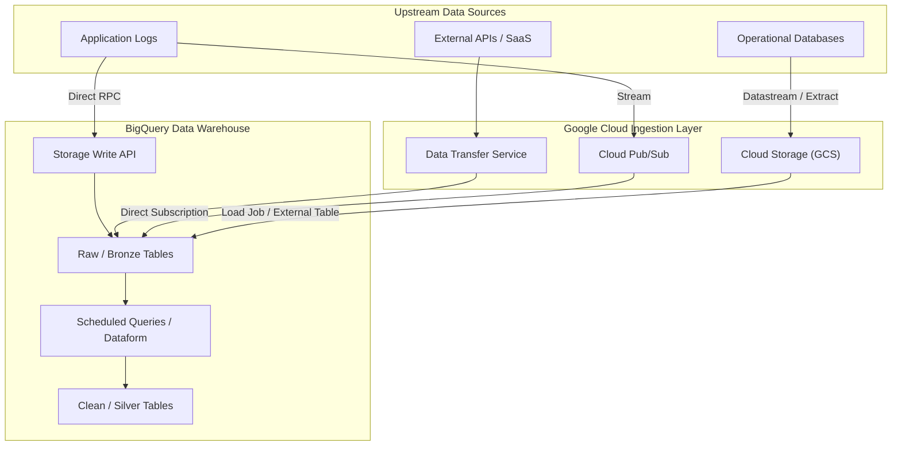

# Data Ingestion Architecture: BigQuery Native Platform

## 1. Executive Summary

This document outlines the Enterprise Data Ingestion Architecture designed specifically for **Google Cloud Platform (GCP) and BigQuery**. Our primary objective is to establish a **simple, robust, and low-maintenance** pipeline that moves data from external source systems into BigQuery.

By aggressively leveraging GCP's native, serverless capabilities—such as the **BigQuery Storage Write API**, **BigQuery Data Transfer Service**, and direct **Pub/Sub subscriptions**—this architecture avoids the complexity and operational overhead of maintaining third-party ETL orchestrators for standard ingestion workloads.

---

## 2. Ingestion Architectural Principles

1.  **ELT over ETL:** Data is ingested into BigQuery in its raw, native format (JSON, Avro, Parquet, CSV). All transformations occur *after* loading, utilizing BigQuery's highly scalable, serverless compute.
2.  **Serverless & Native First:** We prioritize fully managed GCP services. We avoid running custom compute (like GKE or Compute Engine) purely for data movement when native APIs or transfer services exist.
3.  **Event-Driven & Continuous:** Instead of rigid daily batch schedules, ingestion is triggered by events (e.g., Cloud Storage file creation) or streamed continuously to ensure data freshness.
4.  **Idempotency & Simplification:** Ingestion pipelines are designed to be idempotent. We rely on BigQuery's native merge capabilities or append-only logs to handle duplicate data effortlessly.

---

## 3. System Context Diagram

The following diagram illustrates the high-level flow of data from source systems through GCP's ingestion layers and into BigQuery.

---

## 4. Core Ingestion Patterns

### 4.1 Pattern 1: High-Throughput Streaming (Storage Write API)
For low-latency, high-volume streaming, we bypass intermediary storage and write directly to BigQuery.

*   **How it Works:** Applications or microservices use the BigQuery Storage Write API via gRPC to stream records directly into BigQuery tables.
*   **When to Use:** Use this pattern when you require sub-second latency for real-time analytics, when processing high-velocity event streams, or when capturing continuous application telemetry where batch delays are unacceptable.
*   **Pros:**
    *   Delivers ultra-low latency (near real-time).
    *   The default stream provides exactly-once delivery semantics, automatically handling retries.
    *   Simplifies client-side logic by removing the need for intermediary message queues.
*   **Cons:**
    *   Requires writing custom application code (SDKs) to interface with the gRPC API.
    *   Higher cost per GB compared to standard batch loading from Cloud Storage.

### 4.2 Pattern 2: Event-Driven File Loading (Cloud Storage)
For batch exports or file drops, we use Cloud Storage coupled with native BigQuery load jobs.

*   **How it Works:** A source system drops a file (Parquet, CSV, JSON) into a GCS bucket. For simple cases, we define the GCS bucket as an **External Table** in BigQuery, making the data instantly queryable. For better performance, an Eventarc trigger calls a lightweight Cloud Function to submit a native BigQuery Load Job.
*   **When to Use:** Use this pattern for daily or hourly batch exports from operational databases, bulk historical data migrations, or when upstream systems naturally output large data files.
*   **Pros:**
    *   No permanent infrastructure; highly cost-effective for massive datasets.
    *   Provides a durable, low-cost raw file archive in GCS (useful for data lakes or disaster recovery).
    *   Load jobs (unlike streaming) do not incur extra data ingestion charges.
*   **Cons:**
    *   Higher latency (batch-oriented) compared to direct streaming.
    *   Requires strict governance of file formats (e.g., Parquet is strongly preferred over CSV to avoid schema errors).

### 4.3 Pattern 3: Zero-ETL / Direct Integrations
GCP provides several "zero-ETL" paths that require merely configuration, no code.

*   **Pub/Sub Direct to BigQuery:** For message queues, configure a Pub/Sub subscription to write directly to a BigQuery table. No Dataflow or Cloud Functions are needed for raw ingestion.
*   **BigQuery Data Transfer Service (DTS):** Used for SaaS applications (e.g., Google Ads, Salesforce) or automated scheduled transfers from GCS or Amazon S3.
*   **When to Use:** Use this pattern whenever connecting to supported Google or third-party SaaS products, or when streaming simple messages directly from a Pub/Sub topic without needing prior transformation.
*   **Pros:**
    *   Completely fully managed and requires zero code to implement.
    *   DTS handles scheduling, retries, and API rate limits automatically.
    *   Extremely fast time-to-value for supported native integrations.
*   **Cons:**
    *   Limited strictly to the pre-built connectors and features provided by Google.
    *   Provides zero flexibility for pre-processing, filtering, or complex transformations before the data lands in BigQuery.

---

## 5. State Management & Idempotency

Maintaining state natively reduces pipeline fragility.

*   **Exactly-Once Streaming:** When using the Storage Write API's default stream, GCP guarantees exactly-once semantics, eliminating the need for complex deduplication logic in the raw layer.
*   **Append-Only Raw Tables:** For file loads or direct Pub/Sub ingestion, the Raw tables are append-only. We intentionally do not perform updates or deletes during ingestion.
*   **Deduplication via SQL:** Idempotency is enforced downstream. If duplicate records arrive in the Raw table, the subsequent transformation step uses a `MERGE` statement or a `QUALIFY ROW_NUMBER() OVER (...) = 1` query to filter them out before writing to the Clean/Silver tables.

---

## 6. Data Transformation & Orchestration (Native)

Once data lands in the Raw layer, we utilize native tools for transformations.

### 6.1 Scheduled Queries (Simple Workloads)
For straightforward data models, we use BigQuery Scheduled Queries. These are standard SQL scripts that run on a cron schedule natively within BigQuery. They are perfect for simple `MERGE` statements moving data from Raw to Clean.

### 6.2 Dataform (Complex Workloads)
For complex, multi-step dependency graphs, we utilize **Dataform** (now natively integrated into GCP). Dataform allows data engineers to write SQLX to manage dependencies, assertions, and environments, all executed serverlessly within BigQuery.

---

## 7. Operational Excellence & Monitoring

*   **Cloud Monitoring & Logging:** All BigQuery API calls and Data Transfer Service runs natively emit logs to Cloud Logging. Alerts are configured for failed load jobs or delayed DTS runs.
*   **Information Schema:** Engineers use BigQuery's `INFORMATION_SCHEMA.JOBS` to monitor load performance, bytes billed, and query execution times, providing deep visibility without external monitoring tools.
*   **Error Records:** When loading files, use the `max_bad_records` configuration to allow jobs to succeed even if a few rows are malformed, capturing errors later for investigation rather than failing the entire pipeline.

---

## 8. Security & Governance

*   **IAM & Service Accounts:** Access is strictly managed via Google Cloud IAM. Source systems use dedicated Service Accounts with only the specific roles needed (e.g., `roles/bigquery.dataEditor` on a specific dataset).
*   **VPC Service Controls:** For enterprise security, BigQuery is placed within a VPC Service Control perimeter to mitigate data exfiltration risks.
*   **Data Catalog:** GCP Dataplex / Data Catalog natively indexes BigQuery datasets, ensuring all raw and clean tables are automatically discoverable and governable.
