# Data Serving Architecture: BigQuery Native Platform

## 1. Executive Summary

This document outlines the Enterprise Data Serving Architecture for **Google Cloud Platform (GCP) and BigQuery**. Once data is ingested and transformed into the Gold layer (Kimball Dimensional Models), it must be securely and efficiently served to various business consumers.

This architecture specifically tailors serving patterns to the workload: Business Intelligence (BI), Machine Learning (ML), Generative AI, and high-concurrency Application APIs. By leveraging native GCP capabilities, we ensure low latency where needed, zero-data-movement where possible, and strict security governance across all access points.

---

## 2. Serving Architectural Principles

1.  **Right Tool for the Workload:** BigQuery is an analytical engine (OLAP), not a transactional database (OLTP). We do not use BigQuery to directly serve high-concurrency, low-latency API requests.
2.  **Zero Data Movement (When Possible):** For ML, AI, and BI, we prioritize bringing the compute to the data natively within BigQuery rather than exporting massive datasets to external systems.
3.  **Principle of Least Privilege:** Consumers never access raw or staging tables. Access is granted exclusively to specific Gold layer views or aggregated tables via strictly managed IAM roles.
4.  **Decoupling via Reverse-ETL:** When data must leave the warehouse (e.g., for application databases or marketing SaaS), we use orchestrated "Reverse-ETL" syncs rather than custom point-to-point scripts.

---

## 3. System Context Diagram

The following diagram maps how the Gold layer in BigQuery is distributed to different consumption layers.

```mermaid
flowchart TD
    subgraph BQ [BigQuery Data Warehouse]
        Gold[Gold Layer<br>&#40;Dimensional Models / Facts &#38; Dims&#41;]
        BI_Engine[BI Engine <br>&#40;In-Memory Cache&#41;]
        AuthViews[Authorized Views]
        
        Gold --> AuthViews
        AuthViews -.-> BI_Engine
    end

    subgraph BILayer [BI &#38; Analytics]
        Looker[Looker <br>&#40;Enterprise Semantic Layer&#41;]
        LookerStudio[Looker Studio <br>&#40;Self-Service&#41;]
        Sheets[Connected Sheets]
        BI_Engine -->|Sub-second SQL| Looker
        BI_Engine -->|Sub-second SQL| LookerStudio
        AuthViews --> Sheets
    end

    subgraph AILayer [AI &#38; Machine Learning]
        BQML[BigQuery ML <br>&#40;In-DB Training/Inference&#41;]
        Vertex[Vertex AI <br>&#40;Feature Store / LLMs&#41;]
        
        AuthViews --> BQML
        AuthViews <-->|Direct SQL Integration| Vertex
    end

    subgraph AppLayer [Application &#38; API Serving]
        direction TB
        Dataflow[Reverse-ETL <br>&#40;Dataflow / Cloud Run&#41;]
        CloudSQL[Cloud SQL <br>&#40;Relational&#41;]
        AlloyDB[AlloyDB <br>&#40;High-Perf Relational&#41;]
        Firestore[Firestore <br>&#40;NoSQL/Document&#41;]
        StorageReadAPI[Storage Read API <br>&#40;High-Throughput gRPC&#41;]
        API[Customer Facing APIs / Microservices]
        
        AuthViews --> Dataflow
        AuthViews -->|High-Throughput Stream| StorageReadAPI
        Dataflow -->|Syncs Aggregates| CloudSQL
        Dataflow -->|Syncs Aggregates| AlloyDB
        Dataflow -->|Syncs Documents| Firestore
        CloudSQL --> API
        AlloyDB --> API
        Firestore --> API
        StorageReadAPI -->|Direct gRPC Stream| API
    end

    %% Styling
    classDef storage fill:#e2f0d9,stroke:#385723,stroke-width:1px,color:#000;
    classDef process fill:#dae8fc,stroke:#6c8ebf,stroke-width:1px,color:#000;
    classDef bus fill:#fff2cc,stroke:#d6b656,stroke-width:2px,color:#000;
    classDef monitor fill:#f5f5f5,stroke:#666,stroke-width:1px,color:#000,stroke-dasharray: 5 5;
    classDef alert fill:#ffe6cc,stroke:#d79b00,stroke-width:1px,color:#000;
    classDef security fill:#e1d5e7,stroke:#9673a6,stroke-width:1px,color:#000,stroke-dasharray: 5 5;
    classDef bad fill:#f8cecc,stroke:#b85450,stroke-width:1px,color:#000;

    class Gold,CloudSQL,AlloyDB,Firestore storage;
    class BI_Engine,Looker,LookerStudio,Sheets,BQML,Vertex,Dataflow,StorageReadAPI process;
    class AuthViews security;
    class API alert;
```

---

## 4. Serving Patterns

### 4.1 Pattern 1: Business Intelligence (BI) & Reporting
This pattern serves dashboards, automated reports, and self-service analytics
for business users. GCP provides two distinct native BI tools — choose based
on the user persona and governance requirements.

#### Looker (Enterprise Governed Reporting)
*   **Use Case:** Executive reporting, governed company-wide KPIs, embedded
    analytics. Requires a Looker license.
*   **How it Works:** Looker connects to BigQuery and uses **LookML** to define
    a semantic layer (metrics, joins, access filters) on top of the Kimball
    Gold layer. This prevents analysts from writing ad-hoc SQL that bypasses
    business logic or incurs unexpected costs.

#### Looker Studio (Self-Service Exploration)
*   **Use Case:** Ad-hoc dashboards, quick visualisations, free self-service
    exploration for non-technical business users.
*   **How it Works:** Looker Studio connects directly to BigQuery with no
    semantic layer. There is no LookML — users write custom SQL or use the
    drag-and-drop interface.
*   **Governance Note:** Because there is no semantic layer, Looker Studio
    access should be restricted to pre-built Authorized Views to prevent
    expensive, unguarded full-table queries.

#### BigQuery BI Engine
*   **Performance Acceleration:** BI Engine caches frequently accessed Gold layer data in-memory to deliver sub-second query responses for Looker and Looker Studio.
*   **Cost Note:** BI Engine is **not free**. It requires purchasing a **slot reservation** (billed in GB of RAM per hour). Reservations must be sized dynamically based on the hot data footprint being cached.
*   **Limitations:** BI Engine is highly optimized for scan-and-filter aggregation queries. However, complex query shapes—such as deep custom JavaScript User Defined Functions (UDFs), non-equi-joins, or complex window functions—will bypass the BI Engine cache and fall back to standard BigQuery slots, incurring standard scan charges. The maximum reservation size is also limited per project/region (up to 250 GB of RAM).

*   **When to Use:** Use Looker for all governed, business-critical dashboards. Use Looker Studio for analyst self-service. Enable BI Engine for frequently executed dashboard queries.
*   **Cons:**
    *   Looker requires LookML expertise and licensing investment.
    *   Looker Studio has no guardrails; unmanaged access can generate unexpected query costs.

### 4.2 Pattern 2: Machine Learning (Predictive Analytics)
This pattern serves Data Scientists building predictive models (churn, LTV, recommendations).

*   **In-Warehouse ML:** We utilize **BigQuery ML (BQML)**. Data Scientists write standard SQL to train models (XGBoost, Logistic Regression, K-Means) directly over the Gold layer.
*   **Advanced ML:** For deep learning or custom frameworks (PyTorch, TensorFlow), we integrate natively with **Vertex AI**. BigQuery acts as the native data source for the Vertex AI Feature Store.
*   **When to Use:** Use this pattern whenever training models on structured tabular data, forecasting, or segmenting users.
*   **Pros:**
    *   Zero data movement for BQML drastically increases security and reduces pipeline complexity.
    *   Models can be invoked for batch inference using simple SQL `ML.PREDICT` commands during standard Dataform transformations.
*   **Cons:**
    *   BQML is not suited for complex computer vision or unstructured audio processing.

### 4.3 Pattern 3: Generative AI (LLMs & Vector Search)
This pattern brings GenAI capabilities directly to the warehouse data.

*   **Integration:** BigQuery natively integrates with Vertex AI Foundation
    Models (e.g., Gemini) via the `ML.GENERATE_TEXT` SQL function. This lets
    you run LLM inference directly over BigQuery rows without exporting data.
*   **RAG Pipeline (Vector Search):** To build a Retrieval-Augmented Generation
    (RAG) architecture natively within BigQuery:
    1.  **Generate Embeddings:** A Dataform script calls
        `ML.GENERATE_EMBEDDING` (using a Vertex AI embedding model) over the
        source text column (e.g., product descriptions in a Silver table).
        The resulting embedding vectors are stored in a dedicated
        `embeddings` table in the Gold layer.
    2.  **Create Vector Index:** A `CREATE VECTOR INDEX` is defined on the
        embedding column of that table.
    3.  **Retrieve at Query Time:** The application passes a user query
        through `ML.GENERATE_EMBEDDING`, then calls `VECTOR_SEARCH` to find
        the top-K semantically similar records. These records are passed as
        context to `ML.GENERATE_TEXT` to produce a grounded LLM response.
*   **When to Use:** Use this for sentiment analysis on text columns,
    extracting entities from free-form text, or building semantic search
    over structured product/content catalogs.
*   **Pros:** Avoids external vector databases (e.g., Pinecone, Weaviate)
    and complex orchestration — the entire RAG pipeline runs in SQL.

### 4.4 Pattern 4: Application & API Serving
This pattern serves user-facing applications and microservices. Depending on concurrency and throughput requirements, we select between two architectures:

#### Option A: Reverse-ETL (For High Concurrency & Low Latency)
*   **Mechanism:** BigQuery is **not** used to serve the API directly. A scheduled Dataflow job or Cloud Run service queries the aggregated Gold layer and syncs the results into a high-performance operational database.
*   **Native Targets:**
    *   **Firestore:** For serving JSON documents to web/mobile apps.
    *   **Cloud SQL:** For standard relational serving (PostgreSQL-compatible).
    *   **AlloyDB:** For high-performance relational serving requiring significantly higher throughput or analytical SQL alongside OLTP queries (PostgreSQL-compatible, columnar engine built-in).
    *   **Bigtable:** For ultra-high throughput, single-digit millisecond reads (e.g., ad-tech, personalization engines, IoT time-series).
*   **When to Use:** Use for customer-facing applications, microservices, or APIs requiring thousands of queries per second (QPS) at sub-second latency.
*   **Pros:** Decouples the analytical engine from the operational application, preventing heavy analytical queries from impacting application uptime.
*   **Cons:** Introduces data latency (data is only as fresh as the last sync) and requires managing an additional database system.

#### Option B: BigQuery Storage Read API (For High-Throughput Bulk Data Retrieval)
*   **Mechanism:** When applications need to retrieve millions of rows of raw or aggregated analytical data (e.g., massive financial audit exports or machine learning inference payloads), they bypass the standard SQL execution engine and call the **BigQuery Storage Read API** directly.
*   **How it Works:** The client application uses a gRPC-based stream to read data directly from BigQuery storage (Capacitor format) in parallel. It leverages multiple streams to download blocks of columns simultaneously, completely bypassing the shared SQL parser and execution engine.
*   **When to Use:** Use for internal or data-intensive applications that need to scan and extract massive datasets (e.g., > 100k rows) with extremely high throughput, where sub-second start latency is not required but transfer bandwidth is critical.
*   **Pros:** Delivers incredibly high read throughput (Gbps) directly from BigQuery storage, eliminating standard query compute slots for large exports.
*   **Cons:** Not suited for low-latency, point-lookups (e.g., single row reads by primary key) where Firestore or Cloud SQL should be used.

### 4.5 Pattern 5: Self-Service via Connected Sheets
For business analysts who work primarily in Google Sheets, **BigQuery
Connected Sheets** provides a zero-infrastructure native serving pattern.

*   **How it Works:** Users connect a Google Sheet directly to a BigQuery
    table or Authorized View. They can then pivot, filter, and chart up to
    10 billion rows of BigQuery data without writing SQL or exporting CSVs.
    All queries execute serverlessly against BigQuery; no data is permanently
    copied into the Sheet.
*   **When to Use:** Use for operations teams, finance analysts, or business
    stakeholders who need BigQuery data in a familiar spreadsheet interface
    without requiring BI tool access or SQL knowledge.
*   **Pros:**
    *   Completely native GCP — no additional tools or licenses required.
    *   Data stays in BigQuery; IAM controls still apply.
*   **Cons:**
    *   Not suitable for real-time dashboards or high-frequency refreshes.
    *   Best for exploratory analysis rather than production reporting.

---

## 5. Security & Governance

Serving data securely is critical to prevent exfiltration or unauthorized access.

### 5.1 Access Control (Authorized Views)
*   Consumers are rarely granted direct access to base tables. Instead, we use **Authorized Views**. 
*   An Authorized View allows a user or service account to query the view's results without needing read permissions on the underlying Gold layer tables. This encapsulates logic and prevents direct data scraping.

### 5.2 Row and Column-Level Security
*   **Row-Level Security:** We apply native BigQuery row-level access policies. For example, a regional manager querying a centralized Sales Fact table will only see rows where `region = 'EU'`, enforced dynamically at query time based on their IAM identity.
*   **Column-Level Security:** Using **GCP Data Catalog / Dataplex**, we apply policy tags (e.g., `High Security - PII`) to specific columns like `email` or `phone_number`. Only users with the specific `Fine-Grained Reader` IAM role can view the plaintext data; others will see masked data or receive an access denied error.

### 5.3 External Data Sharing
*   When sharing data with external partners or vendors, we utilize **BigQuery Analytics Hub**.
*   This allows us to publish specific datasets securely. The external partner queries the data directly from our storage, entirely eliminating the risk and overhead of exporting CSVs or managing FTP servers.

---

## 6. Cost Analysis & Financial Governance

To guarantee fiscal predictability, we analyze the architectural cost drivers across BI acceleration, machine learning, application integration, and self-service consumption.

### 6.1 Serving Cost Allocation Structure

| Architectural Layer | Native GCP Service | Primary Cost Driver | Financial Characteristic |
| :--- | :--- | :--- | :--- |
| **BI Acceleration** | BI Engine | Allocated memory size in GB (slot reservation). | **Fixed Capacity Model:** Billed hourly per GB of RAM reserved (varies by region, approx. $0.044 per GB/hour). |
| **Enterprise BI** | Looker | Developer/User licenses + underlying query scans. | Combined license fees (fixed) + BQ compute query costs (variable based on slots or on-demand data scanned). |
| **Machine Learning** | BigQuery ML (BQML) | Compute resources used during model training/inference. | Model training is billed based on bytes processed during query execution (or reservation slots). Inference (`ML.PREDICT`) is charged as a standard query scan. |
| **Generative AI** | Vertex AI API Integration | Input and output tokens/characters processed by foundation models. | Directly integrated into SQL; billed per 1,000 characters/tokens sent to and received from Vertex AI Gemini models. |
| **External Sharing** | Analytics Hub (Data Clean Rooms) | BQ storage (Publisher) + BQ compute (Subscriber). | **Decoupled Model:** Publisher pays exclusively for active storage at rest ($0.020/GB/mo). Subscribers pay for their own query execution scans. |
| **Connected Sheets** | Google Sheets Integration | Standard analytical queries executed serverlessly. | Billed under standard BQ compute ($6.25/TB scanned on-demand) when data is refreshed in the sheet. |

### 6.2 Serving Financial Governance
*   **Dynamically Sized BI Engine Reservations:** We do not size BI Engine capacity arbitrarily. Instead, we query `INFORMATION_SCHEMA.BI_CAPACITIES` to monitor memory usage and adjust reservation sizes to match active dashboard requirements.
*   **Decoupled External Sharing Cost:** Utilizing Analytics Hub ensures our enterprise is never billed for compute cycles executed by third-party vendor partners, eliminating the financial risk of external users executing inefficient queries on our data.

---

## 7. Cost Optimization Strategies

We enforce five native, structural cost optimization strategies across all serving pipelines:

### 7.1 Looker Aggregate Awareness & Automatic Rewrites
To prevent high-volume business dashboards from executing expensive scans over heavy factual tables:
*   **Strategy:** Configure **Aggregate Awareness** within Looker's LookML models. 
*   **Mechanism:** Define pre-computed aggregate tables (e.g., daily or monthly sales summaries in the Gold layer). Looker will automatically rewrite incoming SQL queries to query these smaller aggregate tables instead of scanning raw transaction-grain fact tables, lowering costs by up to **90%**.

### 7.2 Enforce Mandatory Dashboard Filters
Self-service visualisations can easily trigger runaway costs if users execute unconstrained queries across years of history.
*   **Strategy:** Enforce **Mandatory Filter Fields** in both Looker and Looker Studio.
*   **Mechanism:** Configure dashboards to require a date range filter (e.g., `last_30_days`) or business dimensions (e.g., `customer_id`) before rendering. This forces BigQuery to prune partitions and clusters, avoiding full-table scans.

### 7.3 Leverage BigQuery Materialized Views on Serving Gold Layers
Common serving aggregations must be pre-calculated and cached at the warehouse level.
*   **Strategy:** Deploy **Materialized Views** on top of frequently queried Gold fact tables.
*   **Mechanism:** Create materialized views using date partitions and clusters. BigQuery automatically intercepts queries targeting base tables and redirects them to the materialized view if it contains the pre-calculated answers, ensuring sub-second response times and zero scan compute charges.

### 7.4 Decouple Vector Embedding Generation in GenAI Pipelines
Generating embeddings via LLMs in real-time inside downstream serving queries is highly inefficient and expensive.
*   **Strategy:** Pre-compute and store vector embeddings incrementally.
*   **Mechanism:** Create a scheduled Dataform script that incrementally runs `ML.GENERATE_EMBEDDING` on newly landed rows in the Silver/Gold layer and writes them to a persistent `embeddings` table. Serving queries must only call `VECTOR_SEARCH` against the pre-calculated table, bypassing real-time Vertex AI API costs.

### 7.5 BI Engine Cache Capacity Right-Sizing
Allocating excess RAM to BI Engine without high cache utilization is financially wasteful.
*   **Strategy:** Periodically query `INFORMATION_SCHEMA.BI_QUERIES` to monitor cache utilization.
*   **Mechanism:** If `cache_bypass_reason` shows high fallback rates due to unsupported query patterns (e.g., complex window functions), rewrite the underlying Gold views to simplify the SQL structure or reduce the BI Engine reservation to reclaim unused budget.

