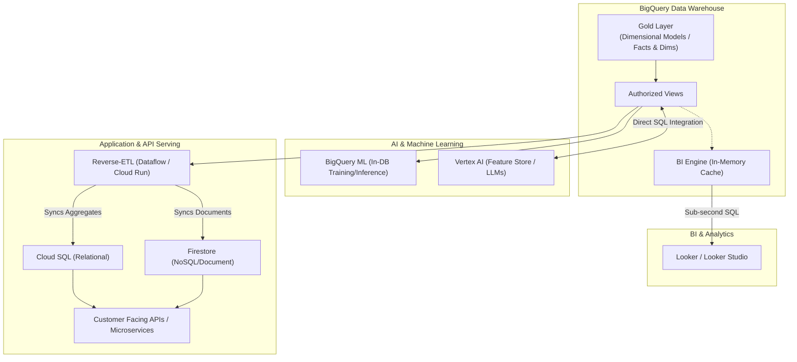

# Data Serving Architecture: BigQuery Native Platform

## 1. Executive Summary

This document outlines the Enterprise Data Serving Architecture for **Google Cloud Platform (GCP) and BigQuery**. Once data is ingested and transformed into the Gold layer (Kimball Dimensional Models), it must be securely and efficiently served to various business consumers.

This architecture specifically tailors serving patterns to the workload: Business Intelligence (BI), Machine Learning (ML), Generative AI, and high-concurrency Application APIs. By leveraging native GCP capabilities, we ensure low latency where needed, zero-data-movement where possible, and strict security governance across all access points.

---

## 2. Serving Architectural Principles

1.  **Right Tool for the Workload:** BigQuery is an analytical engine (OLAP), not a transactional database (OLTP). We do not use BigQuery to directly serve high-concurrency, low-latency API requests.
2.  **Zero Data Movement (When Possible):** For ML, AI, and BI, we prioritize bringing the compute to the data natively within BigQuery rather than exporting massive datasets to external systems.
3.  **Principle of Least Privilege:** Consumers never access raw or staging tables. Access is granted exclusively to specific Gold layer views or aggregated tables via strictly managed IAM roles.
4.  **Decoupling via Reverse-ETL:** When data must leave the warehouse (e.g., for application databases or marketing SaaS), we use orchestrated "Reverse-ETL" syncs rather than custom point-to-point scripts.

---

## 3. System Context Diagram

The following diagram maps how the Gold layer in BigQuery is distributed to different consumption layers.

---

## 4. Serving Patterns

### 4.1 Pattern 1: Business Intelligence (BI) & Reporting
This pattern serves dashboards, automated reports, and self-service analytics for business users.

*   **Native Integration:** **Looker** or **Looker Studio** connects directly to the BigQuery Gold layer. LookML is used to define the semantic layer on top of our Kimball dimensions and facts.
*   **Performance Acceleration:** We enable **BigQuery BI Engine**. This natively caches frequently accessed data in-memory within BigQuery's infrastructure.
*   **When to Use:** Use this pattern for all internal dashboards, executive reporting, and self-service data exploration.
*   **Pros:** 
    *   No data extraction required; data remains secure in BigQuery.
    *   BI Engine provides sub-second query response times without manually building aggregate tables.
*   **Cons:** 
    *   Requires careful LookML modeling to prevent analysts from accidentally running excessively expensive unstructured queries.

### 4.2 Pattern 2: Machine Learning (Predictive Analytics)
This pattern serves Data Scientists building predictive models (churn, LTV, recommendations).

*   **In-Warehouse ML:** We utilize **BigQuery ML (BQML)**. Data Scientists write standard SQL to train models (XGBoost, Logistic Regression, K-Means) directly over the Gold layer.
*   **Advanced ML:** For deep learning or custom frameworks (PyTorch, TensorFlow), we integrate natively with **Vertex AI**. BigQuery acts as the native data source for the Vertex AI Feature Store.
*   **When to Use:** Use this pattern whenever training models on structured tabular data, forecasting, or segmenting users.
*   **Pros:**
    *   Zero data movement for BQML drastically increases security and reduces pipeline complexity.
    *   Models can be invoked for batch inference using simple SQL `ML.PREDICT` commands during standard Dataform transformations.
*   **Cons:**
    *   BQML is not suited for complex computer vision or unstructured audio processing.

### 4.3 Pattern 3: Generative AI (LLMs)
This pattern brings GenAI capabilities directly to the warehouse data.

*   **Integration:** BigQuery natively integrates with Vertex AI Foundation Models (e.g., Gemini). Using the `ML.GENERATE_TEXT` SQL function, we can pass BigQuery data as context to an LLM without writing external Python scripts.
*   **Vector Search:** BigQuery supports native vector indexes and `VECTOR_SEARCH` functions, allowing us to build Retrieval-Augmented Generation (RAG) architectures entirely within the warehouse using SQL.
*   **When to Use:** Use this for sentiment analysis on text columns, extracting entities from free-form text, or building semantic search over structured catalogs.
*   **Pros:** Massive simplification of GenAI architectures by avoiding external vector databases and complex orchestration.

### 4.4 Pattern 4: Application & API Serving
This pattern serves high-concurrency, user-facing applications (e.g., displaying a user's purchase history on a mobile app).

*   **The Architecture:** BigQuery is **not** used to serve the API directly. Instead, we use a "Reverse-ETL" pattern. A scheduled Dataflow job or Cloud Run service queries the aggregated Gold layer and syncs the results into a high-performance operational database.
*   **Native Targets:**
    *   **Firestore:** For serving JSON documents to web/mobile apps.
    *   **Cloud SQL / AlloyDB:** For relational serving.
    *   **Bigtable:** For ultra-high throughput, single-digit millisecond reads (e.g., ad-tech, personalization engines).
*   **When to Use:** Use this pattern for any customer-facing application, microservice, or API that requires thousands of queries per second (QPS) at low latency.
*   **Pros:** Decouples the analytical engine from the operational application, preventing analytical queries from impacting application uptime.
*   **Cons:** Introduces data latency (data in the app is only as fresh as the last sync) and requires managing an additional database system.

---

## 5. Security & Governance

Serving data securely is critical to prevent exfiltration or unauthorized access.

### 5.1 Access Control (Authorized Views)
*   Consumers are rarely granted direct access to base tables. Instead, we use **Authorized Views**. 
*   An Authorized View allows a user or service account to query the view's results without needing read permissions on the underlying Gold layer tables. This encapsulates logic and prevents direct data scraping.

### 5.2 Row and Column-Level Security
*   **Row-Level Security:** We apply native BigQuery row-level access policies. For example, a regional manager querying a centralized Sales Fact table will only see rows where `region = 'EU'`, enforced dynamically at query time based on their IAM identity.
*   **Column-Level Security:** Using **GCP Data Catalog / Dataplex**, we apply policy tags (e.g., `High Security - PII`) to specific columns like `email` or `phone_number`. Only users with the specific `Fine-Grained Reader` IAM role can view the plaintext data; others will see masked data or receive an access denied error.

### 5.3 External Data Sharing
*   When sharing data with external partners or vendors, we utilize **BigQuery Analytics Hub**.
*   This allows us to publish specific datasets securely. The external partner queries the data directly from our storage, entirely eliminating the risk and overhead of exporting CSVs or managing FTP servers.
