# Data Transformation Architecture: BigQuery Native Platform

## 1. Executive Summary

This document details the Enterprise Data Transformation Architecture for **Google Cloud Platform (GCP) and BigQuery**. Following the ingestion layer, this architecture defines how raw data is cleaned, modeled, and governed to provide high-quality, analytics-ready datasets.

In strict adherence to our architectural guidelines, this design relies exclusively on **native GCP solutions**—specifically **Dataform** running directly within BigQuery. By combining the Medallion Architecture (Bronze, Silver, Gold) with Kimball Dimensional Modeling, we establish a scalable, robust, and highly observable transformation pipeline.

---

## 2. Transformation Architectural Principles

1.  **Native Orchestration:** We strictly use **Dataform** (integrated natively into BigQuery) for defining, managing, and executing SQL-based transformations. No third-party orchestrators or external compute are used for standard in-warehouse data movement.
2.  **Declarative Engineering:** Transformations are written declaratively in SQLX. Dataform automatically infers the dependency graph (DAG) and executes it efficiently using BigQuery's serverless compute.
3.  **Shift-Left Data Quality:** Data quality is not an afterthought. Assertions (uniqueness, null checks, referential integrity) are baked directly into the Dataform models and run concurrently with pipeline execution.
4.  **Idempotent Operations:** All transformation scripts (whether tables or incremental updates) must be idempotent. Re-running a pipeline should safely overwrite or gracefully merge data without creating duplicates.

---

## 3. System Context Diagram

The following diagram illustrates the flow of data through the transformation layers, orchestrated by Dataform, with integrated Data Quality and Observability.

```mermaid
flowchart TD
    subgraph DataformOrch [Dataform Orchestration Layer]
        DF[Dataform &#40;SQLX DAG&#41;]
        Git[Cloud Source Repositories / GitHub]
        
        Git -->|CI/CD| DF
    end

    subgraph BQ [BigQuery Data Warehouse]
        Raw[Bronze Layer<br>&#40;Raw / Append-Only&#41;]
        Silver[Silver Layer<br>&#40;Cleansed / Standardized&#41;]
        Gold[Gold Layer<br>&#40;Kimball Dimensional Models&#41;]
        DeadLetter[Dead-Letter Tables<br>&#40;Failed DQ Checks&#41;]
        
        Raw -->|Dataform execution| Silver
        Silver -->|Dataform execution| Gold
        
        Silver -.->|DQ Assertion Failures| DeadLetter
    end

    subgraph Ops [Operations & Observability]
        Logs[Cloud Logging]
        Monitor[Cloud Monitoring & Alerts]
        IS[INFORMATION_SCHEMA]
        
        DF -->|Execution Logs| Logs
        Logs --> Monitor
        Gold -->|Billing/Perf Metrics| IS
    end

    DF -.->|Orchestrates| BQ
```

---

## 4. Data Modeling Strategy: Medallion & Kimball

We hybridize the Medallion architecture with Kimball Dimensional modeling to provide clear boundaries between raw ingestion and business-ready analytics.

### 4.1 Bronze Layer (Raw)
*   **Purpose:** The landing zone for ingested data.
*   **Structure:** Mirrors the source systems exactly. Append-only tables with no updates or deletes. Includes metadata columns like `_ingested_at` and `_source_file`.
*   **Data Quality:** Minimal. We accept all data to ensure we never lose source records due to strict initial schema validations.

### 4.2 Silver Layer (Cleansed & Standardized)
*   **Purpose:** The enterprise source of truth. Data is cleansed, typed, and deduplicated.
*   **Structure:** Highly normalized, typically mirroring the source structure but resolving historical slowly changing dimensions (SCDs) and standardizing naming conventions (e.g., `snake_case` for all columns).
*   **Transformation:** We use Dataform `incremental` tables here with robust
    `MERGE` logic to handle deduplication from the append-only Bronze layer.
*   **Partitioning:** Silver tables are partitioned on `_ingested_at` or the
    source event timestamp. This ensures that incremental Dataform `MERGE`
    jobs use partition pruning and avoid full table scans, directly reducing
    compute costs.

### 4.3 Gold Layer (Kimball Dimensional Models)
*   **Purpose:** Optimized for business intelligence (BI), reporting, and ad-hoc analytics.
*   **Structure:** Strict **Kimball Dimensional Modeling**. The data is denormalized into **Fact tables** (business events, metrics) and **Dimension tables** (context, attributes).
*   **Transformation:**
    *   **Dimensions:** Managed as Type 1 (overwrite) or Type 2 (historical
        tracking) Slowly Changing Dimensions using Dataform.
        *   **SCD Type 1** uses a Dataform `table` with a simple `SELECT`
            ordered by the latest timestamp — Dataform fully replaces the
            table on each run.
        *   **SCD Type 2** requires a Dataform `incremental` table. The SQLX
            logic compares incoming Silver rows against the current dimension
            using a hash of the tracked attributes. When a change is detected,
            a new row is inserted with a new `valid_from` timestamp and the
            previous row's `valid_to` is updated via a `post_operations` MERGE
            block. An `is_current` boolean flag marks the active record.
    *   **Facts:** Highly aggregated or grain-specific tables joining multiple
        Silver tables to answer specific business questions.
    *   BigQuery native features like **Clustering** and **Partitioning** are
        heavily applied here based on common query filters (e.g., partitioned
        by `transaction_date`, clustered by `customer_id`).

---

## 5. Data Quality (DQ) Strategy

Ensuring trust in the data is paramount. We handle Data Quality natively within the transformation execution.

### 5.1 Dataform Assertions
Dataform provides native assertion capabilities. For every critical table in the Silver and Gold layers, we define:
*   **Uniqueness Checks:** Asserting that Primary Keys are strictly unique.
*   **Null Checks:** Ensuring critical fields (like foreign keys or financial amounts) are never null.
*   **Custom SQL Assertions:** Business logic checks (e.g., `order_total_amount >= 0`).

*If an assertion fails, the Dataform pipeline will halt downstream execution, preventing bad data from reaching the Gold layer.*

### 5.2 Dead-Letter Tables
When utilizing complex transformations or incremental merges, records that
fail logical validation (but shouldn't halt the entire pipeline) are routed
to Dead-Letter Tables.
*   **Implementation:** A Dataform SQLX script attempts to cast and transform
    data. Records that would fail type casting are handled using BigQuery's
    **`SAFE_CAST`** function (which returns `NULL` on failure instead of
    raising an error). These `NULL` sentinel rows are then filtered and
    `INSERT`ed into a dedicated `_dead_letter` table for data engineering
    review, while the healthy records proceed to the main Silver or Gold table.

### 5.3 BigQuery Table Constraints
While BigQuery does not actively enforce constraints during DML operations like traditional RDBMS, we utilize BigQuery's **Primary Key and Foreign Key constraints**.
*   **Benefit:** The BigQuery query optimizer uses these constraints to improve join performance and eliminate redundant execution paths, saving compute costs on heavy Gold layer queries.

---

## 6. Observability & Operations

Operating the pipeline natively means leveraging GCP's integrated observability stack.

### 6.1 Execution Monitoring (Cloud Logging)
Dataform natively integrates with Google Cloud Logging. Every pipeline run, SQL statement executed, and assertion checked is logged.
*   **Alerting:** We configure **Cloud Monitoring Log-Based Alerts**. If a Dataform execution emits a severity of `ERROR` (e.g., an assertion fails or a query timeouts), an alert is immediately routed via PagerDuty or Slack to the data engineering team.

### 6.2 Cost & Performance Tracking (`INFORMATION_SCHEMA`)
We do not use external tools to monitor warehouse performance. BigQuery's native `INFORMATION_SCHEMA` provides deep operational insights.
*   **`INFORMATION_SCHEMA.JOBS`:** Used to monitor the `total_bytes_billed` and `slot_ms` of every Dataform transformation. This helps us identify poorly optimized queries (e.g., missing partition filters) that are driving up costs.
*   **`INFORMATION_SCHEMA.TABLE_STORAGE`:** Used to monitor the physical footprint of the Bronze, Silver, and Gold layers, ensuring lifecycle policies are aggressively archiving old raw data.

### 6.3 CI/CD and Lifecycle Operations
*   **Environments:** Dataform handles environment isolation natively via
    **Workspaces**. Data Engineers develop in their own isolated workspace
    (querying a `dev` dataset).
*   **Deployment:** Dataform connects directly to our Git repository. Pushing
    to the `main` branch triggers a release configuration that compiles the
    SQLX into standard SQL and executes it against the production `prod`
    datasets.

### 6.4 Pipeline Scheduling & Triggering
Dataform pipelines must be scheduled to run automatically. We use two
approaches based on the use case:
*   **Dataform Release Schedules (Primary):** A Dataform Release Configuration
    defines a cron-based schedule (e.g., every 15 minutes, hourly). This is
    the simplest native option and requires no external infrastructure.
*   **Cloud Scheduler → Dataform API (Advanced):** For event-driven or
    dynamically parameterised runs, Cloud Scheduler calls the Dataform REST
    API (`projects.locations.repositories.workflowInvocations.create`) to
    trigger a specific compilation result. This allows passing runtime
    variables (e.g., a specific date range to backfill).

---

## 7. Security & Governance

The transformation layer must enforce strict access controls — it is the
only layer where data is actively read from Bronze and written to Gold.

*   **Service Account Scoping:** Dataform executes using a dedicated
    **Dataform Service Account**. This account is granted:
    *   `roles/bigquery.dataViewer` on the Bronze dataset (read-only)
    *   `roles/bigquery.dataEditor` on the Silver and Gold datasets (write)
    *   No access to any serving or consumer-facing datasets.
*   **Transform Role:** A `TRANSFORM_ROLE` IAM group is defined for data
    engineers who manage Dataform workspaces. This role grants Dataform
    workspace access but does NOT grant direct BigQuery table access —
    all writes go through the Dataform Service Account.
*   **Data Catalog Tag Propagation:** Policy tags (e.g., `PII`) applied to
    Bronze columns in Data Catalog are automatically inherited by downstream
    Silver and Gold columns created from those same fields. Engineers must
    not strip tags during transformation without explicit governance approval.
