# Data Transformation Architecture: BigQuery Native Platform

## 1. Executive Summary

This document details the Enterprise Data Transformation Architecture for **Google Cloud Platform (GCP) and BigQuery**. Following the ingestion layer, this architecture defines how raw data is cleaned, modeled, and governed to provide high-quality, analytics-ready datasets.

In strict adherence to our architectural guidelines, this design relies exclusively on **native GCP solutions**—specifically **Dataform** running directly within BigQuery. By combining the Medallion Architecture (Bronze, Silver, Gold) with Kimball Dimensional Modeling, we establish a scalable, robust, and highly observable transformation pipeline.

---

## 2. Transformation Architectural Principles

To ensure long-term maintainability and enterprise scale, this architecture strictly adheres to the following principles:

1.  **Native Orchestration:** We strictly use **Dataform** (integrated natively into BigQuery) for defining, managing, and executing SQL-based transformations. No third-party orchestrators or external compute are used for standard in-warehouse data movement.
2.  **Declarative Engineering:** Transformations are written declaratively in SQLX. Dataform automatically infers the dependency graph (DAG) and executes it efficiently using BigQuery's serverless compute.
3.  **Shift-Left Data Quality:** Data quality is not an afterthought. Assertions (uniqueness, null checks, referential integrity) are baked directly into the Dataform models and run concurrently with pipeline execution.
4.  **Idempotent Operations:** All transformation scripts (whether tables or incremental updates) must be idempotent. Re-running a pipeline should safely overwrite or gracefully merge data without creating duplicates.
5.  **Recovery & Resilience:** Every production model must be recoverable without data loss or manual SQL surgery. Three mechanisms enforce this:
    *   **Protected Tables:** All Silver and Gold Dataform models are declared with `protected: true`, preventing accidental schema drops during CI/CD deployments or hotfix runs.
    *   **Controlled Full-Refresh Backfill:** When a table requires a full historical recompute (e.g., due to logic corrections), the recovery is executed via the Dataform API with a scoped full-refresh invocation — never by manually truncating production tables.
    *   **DQ-Gated Re-enablement:** After any recovery run, the affected table must pass a Dataplex DQ scan before downstream consumers (Gold queries, BI tools) are re-enabled, preventing cascading corruption into serving layers.

---

## 3. System Context Diagram

The following diagram illustrates the flow of data through the transformation layers, orchestrated by Dataform, with integrated Data Quality and Observability.

```mermaid
flowchart TD
    subgraph DataformOrch [Dataform Orchestration Layer]
        DF[Dataform &#40;SQLX DAG&#41;]
        Git[Cloud Source Repositories / GitHub]
        
        Git -->|CI/CD| DF
    end

    subgraph BQ [BigQuery Data Warehouse]
        Raw[Bronze Layer<br>&#40;Raw / Append-Only&#41;]
        Silver[Silver Layer<br>&#40;Cleansed / Standardized&#41;]
        Gold[Gold Layer<br>&#40;Kimball Dimensional Models&#41;]
        DeadLetter[Dead-Letter Tables<br>&#40;Failed DQ Checks&#41;]
        
        Raw -->|Dataform execution| Silver
        Silver -->|Dataform execution| Gold
        
        Silver -.->|DQ Assertion Failures| DeadLetter
    end

    subgraph Ops [Operations & Observability]
        Logs[Cloud Logging]
        Monitor[Cloud Monitoring & Alerts]
        IS[INFORMATION_SCHEMA <br>&#40;BQ-wide Jobs, Storage, Buffer&#41;]
        AuditLogs[BigQuery Audit Logs <br>&#40;Job & Query Telemetry&#41;]
        Dataplex[Dataplex Auto DQ <br>&#40;Serverless DQ Scans&#41;]
        
        DF -->|Execution Logs| Logs
        DF -.->|BQ-wide Job Telemetry| AuditLogs
        DF -.->|BQ-wide Job Metrics| IS
        Silver -.->|Auto DQ rules| Dataplex
        Gold -.->|Auto DQ rules| Dataplex
        
        Dataplex -.->|DQ violations| Logs
        AuditLogs -.->|Query failures| Logs
        DeadLetter -.->|P2: Dead-Letter insert| Logs
        Logs --> Monitor
    end

    DF -.->|Orchestrates| BQ

    %% Styling
    classDef storage fill:#e2f0d9,stroke:#385723,stroke-width:1px,color:#000;
    classDef process fill:#dae8fc,stroke:#6c8ebf,stroke-width:1px,color:#000;
    classDef bad fill:#f8cecc,stroke:#b85450,stroke-width:1px,color:#000;
    classDef monitor fill:#f5f5f5,stroke:#666,stroke-width:1px,color:#000,stroke-dasharray: 5 5;
    classDef alert fill:#ffe6cc,stroke:#d79b00,stroke-width:1px,color:#000;

    class Raw,Silver,Gold storage;
    class DF,Git process;
    class DeadLetter bad;
    class Logs,IS,AuditLogs,Dataplex monitor;
    class Monitor alert;
```



---

## 4. Data Modeling Strategy: Medallion & Kimball

We hybridize the Medallion architecture with Kimball Dimensional modeling to provide clear boundaries between raw ingestion and business-ready analytics.

### 4.1 Bronze Layer (Raw)
*   **Purpose:** The landing zone for ingested data.
*   **Structure:** Mirrors the source systems exactly. Append-only tables with no updates or deletes. Includes metadata columns like `_ingested_at` and `_source_file`.
*   **Data Quality:** Minimal. We accept all data to ensure we never lose source records due to strict initial schema validations.

### 4.2 Silver Layer (Cleansed & Standardized)
*   **Purpose:** The enterprise source of truth. Data is cleansed, typed, and deduplicated.
*   **Structure:** Highly normalized, typically mirroring the source structure but resolving historical slowly changing dimensions (SCDs) and standardizing naming conventions (e.g., `snake_case` for all columns).
*   **Transformation:** We use Dataform `incremental` tables here with robust
    `MERGE` logic to handle deduplication from the append-only Bronze layer.
*   **Partitioning:** Silver tables are partitioned on `_ingested_at` or the
    source event timestamp. This ensures that incremental Dataform `MERGE`
    jobs use partition pruning and avoid full table scans, directly reducing
    compute costs.

### 4.3 Gold Layer (Kimball Dimensional Models)
*   **Purpose:** Optimized for business intelligence (BI), reporting, and ad-hoc analytics.
*   **Structure:** Strict **Kimball Dimensional Modeling**. The data is denormalized into **Fact tables** (business events, metrics) and **Dimension tables** (context, attributes).
*   **Transformation:**
    *   **Dimensions:** Managed as Type 1 (overwrite) or Type 2 (historical
        tracking) Slowly Changing Dimensions using Dataform.
        *   **SCD Type 1** uses a Dataform `table` with a simple `SELECT`
            ordered by the latest timestamp — Dataform fully replaces the
            table on each run.
        *   **SCD Type 2** requires a Dataform `incremental` table. The SQLX
            logic compares incoming Silver rows against the current dimension
            using a hash of the tracked attributes. When a change is detected,
            a new row is inserted with a new `valid_from` timestamp and the
            previous row's `valid_to` is updated via a `post_operations` MERGE
            block. An `is_current` boolean flag marks the active record.
            > **Race Condition Risk:** If a Dataform run is interrupted between
            > the `INSERT` and the `post_operations` MERGE, two rows with
            > `is_current = TRUE` may exist for the same entity. Mitigate this
            > by adding a safety guard in all downstream Gold queries:
            > `QUALIFY ROW_NUMBER() OVER (PARTITION BY entity_id ORDER BY valid_from DESC) = 1`
    *   **Facts:** Highly aggregated or grain-specific tables joining multiple
        Silver tables to answer specific business questions.
    *   BigQuery native features like **Clustering** and **Partitioning** are
        heavily applied here based on common query filters (e.g., partitioned
        by `transaction_date`, clustered by `customer_id`).

---

## 5. Data Quality (DQ) Strategy

Ensuring trust in the data is paramount. We handle Data Quality natively within the transformation execution.

### 5.1 Dataform Assertions
Dataform provides native assertion capabilities. For every critical table in the Silver and Gold layers, we define:
*   **Uniqueness Checks:** Asserting that Primary Keys are strictly unique.
*   **Null Checks:** Ensuring critical fields (like foreign keys or financial amounts) are never null.
*   **Custom SQL Assertions:** Business logic checks (e.g., `order_total_amount >= 0`).

*If an assertion fails, the Dataform pipeline will halt downstream execution, preventing bad data from reaching the Gold layer.*

### 5.2 Dead-Letter Tables
When utilizing complex transformations or incremental merges, records that fail logical validation (but shouldn't halt the entire pipeline) are routed to Dead-Letter Tables.
*   **Implementation:** A Dataform SQLX script attempts to cast and transform data. Records that would fail type casting are handled using BigQuery's **`SAFE_CAST`** function (which returns `NULL` on failure instead of raising an error). These `NULL` sentinel rows are then filtered and `INSERT`ed into a dedicated `_dead_letter` table for data engineering review, while the healthy records proceed to the main Silver or Gold table.

### 5.3 BigQuery Table Constraints
While BigQuery does not actively enforce constraints during DML operations like traditional RDBMS, we utilize BigQuery's **Primary Key and Foreign Key constraints**.
*   **Benefit:** The BigQuery query optimizer uses these constraints to improve join performance and eliminate redundant execution paths, saving compute costs on heavy Gold layer queries.

### 5.4 Dataplex Auto-DQ Scans (BigQuery Native Serverless DQ)
For continuous semantic data quality checks at rest, we use **Dataplex Auto-DQ** running natively on BigQuery serverless compute.
*   **Mechanism:** Dataplex executes serverless profiling and rule-based scans (e.g., verifying value ranges, email format regex, or cross-table referential integrity) directly against BigQuery Silver and Gold tables.
*   **Zero-ETL Orchestration:** Rules are defined declaratively in YAML or through the GCP console, eliminating the need to write custom testing scripts or schedule external compute jobs.

---

## 6. Observability & Operations

Operating the pipeline natively means leveraging GCP's integrated observability stack.

### 6.1 Execution Monitoring (Cloud Logging & BigQuery Audit Logs)
We capture both orchestrator and database telemetry natively:
*   **Dataform Execution Logs:** Dataform natively integrates with Google Cloud Logging. Every pipeline run, SQL statement executed, and assertion checked is logged.
*   **BigQuery Audit Logs:** Google Cloud automatically records data access and admin activity logs. We monitor `google.cloud.bigquery.v2.JobService.InsertJob` for transformation queries and schema alterations to capture query failures or unauthorized access attempts.

### 6.2 Cost & Performance Tracking (BigQuery `INFORMATION_SCHEMA`)
We do not use external profiling tools to monitor warehouse performance. BigQuery's native `INFORMATION_SCHEMA` tables provide deep operational insights:
*   **`INFORMATION_SCHEMA.JOBS`:** Used to monitor the `total_bytes_billed` and `slot_ms` of every Dataform transformation. This helps us identify poorly optimized queries (e.g., missing partition/cluster filters) that are driving up costs.
*   **`INFORMATION_SCHEMA.TABLE_STORAGE`:** Used to monitor the physical footprint of the Bronze, Silver, and Gold layers, ensuring lifecycle policies are aggressively archiving old raw data.
*   **`INFORMATION_SCHEMA.STREAMING_TIMELINE`:** Used to monitor real-time ingestion buffer age, helping us track delays before the Bronze-to-Silver transformation runs.

### 6.3 CI/CD and Lifecycle Operations
*   **Environments:** Dataform handles environment isolation natively via **Workspaces**. Data Engineers develop in their own isolated workspace (querying a `dev` dataset).
*   **Deployment:** Dataform connects directly to our Git repository. Pushing to the `main` branch triggers a release configuration that compiles the SQLX into standard SQL and executes it against the production `prod` datasets.
*   **Backfill & Recovery Procedure:** If a Silver or Gold table becomes corrupted and requires a full historical recompute:
    1.  Temporarily set `protected: false` on the target Dataform model.
    2.  Trigger a full-refresh run via Cloud Scheduler → Dataform API (`workflowInvocations.create`) passing the target model tags.
    3.  Re-enable `protected: true` after the run completes successfully.
    4.  Re-run the Dataplex DQ scan to validate the recovered table before re-enabling downstream consumers.

### 6.4 Pipeline Scheduling & Triggering
Dataform pipelines must be scheduled to run automatically. We use two approaches based on the use case:
*   **Dataform Release Schedules (Primary):** A Dataform Release Configuration defines a cron-based schedule (e.g., every 15 minutes, hourly). This is the simplest native option and requires no external infrastructure.
*   **Cloud Scheduler → Dataform API (Advanced):** For event-driven or dynamically parameterised runs, Cloud Scheduler calls the Dataform REST API (`projects.locations.repositories.workflowInvocations.create`) to trigger a specific compilation result. This allows passing runtime variables (e.g., a specific date range to backfill).

### 6.5 BigQuery-Native Alerting & Monitoring Policies
Using **Cloud Monitoring**, we deploy native Alert Policies scoped directly to the BigQuery resource:
1.  **Query Execution Time Alert:** Alerts if a transformation query takes `> 30 minutes`, identifying slot starvation or infinite joins.
2.  **Failed Jobs Count Alert:** Scans BigQuery Audit Logs and triggers a **P2 Alert** if query failure events exceed 0 within a 5-minute rolling window.
3.  **Dataform Compilation/Run Failure:** A **Cloud Monitoring Log-Based Alert** triggers a **P1 Alert** if Dataform logs show execution state as `FAILED`, immediately pushing notifications to Slack/PagerDuty with the failing model name and stack trace.
4.  **Dataplex DQ Violation Alert:** Fires a **P2 Alert** if a scheduled Dataplex data quality scan reports rule violations.

---

## 7. Security & Governance

The transformation layer must enforce strict access controls — it is the
only layer where data is actively read from Bronze and written to Gold.

*   **Service Account Scoping:** Dataform executes using a dedicated
    **Dataform Service Account**. This account is granted:
    *   `roles/bigquery.dataViewer` on the Bronze dataset (read-only)
    *   `roles/bigquery.dataEditor` on the Silver and Gold datasets (write)
    *   No access to any serving or consumer-facing datasets.
*   **Transform Role:** A `TRANSFORM_ROLE` IAM group is defined for data
    engineers who manage Dataform workspaces. This role grants Dataform
    workspace access but does NOT grant direct BigQuery table access —
    all writes go through the Dataform Service Account.
*   **Data Catalog Tag Propagation:** Policy tags (e.g., `PII`) applied to
    Bronze columns in Data Catalog are automatically inherited by downstream
    Silver and Gold columns created from those same fields. Engineers must
    not strip tags during transformation without explicit governance approval.
*   **Dataplex Data Lineage:** Enable automatic lineage tracking via the
    Dataplex Lineage API on all Dataform execution jobs. This records
    column-level `Bronze → Silver → Gold` data flows automatically without
    additional code, supporting GDPR/CCPA audit requirements and downstream
    impact analysis when source schemas change.

---

## 8. Cost Analysis & Financial Governance

To guarantee fiscal predictability, we analyze the architectural cost drivers across compute, storage, and orchestration.

### 8.1 Cost Allocation Structure

| Architectural Layer | Native GCP Service | Primary Cost Driver | Financial Characteristic |
| :--- | :--- | :--- | :--- |
| **Orchestration Layer** | Dataform | Free (Zero service cost) | Natively integrated; pay only for compiled query execution. |
| **Compute Layer** | BigQuery Compute | Slots consumed by SQL queries (Dataform compiles SQLX to BigQuery SQL). | **Capacity Model:** Scaled via BigQuery Editions (Standard/Enterprise) or billed via **On-Demand** ($6.25/TB scanned). |
| **Storage Layer** | BigQuery Storage | Data footprint at rest (Physical vs. Logical models). | **Active Storage:** $0.020/GB/mo.<br>**Long-Term Storage (90+ days untouched):** $0.010/GB/mo. |
| **Data Quality Scans** | Dataplex DQ | Serverless DQ compute slots. | Directly tied to rule complexity and scan frequency. Estimated: a 100 GB Silver table with 10 rules at 4 scans/day ≈ 1 TB scanned/day. Apply table targeting and the 90-day TTL &#40;Section 9.3&#41; to limit scan surface area. |

### 8.2 Financial Governance Metrics
*   **Logical vs. Physical Storage:** We charge-back storage using **Physical Storage Billing** for highly compressed tables (SCD Type 2 history and Fact tables) where BigQuery’s columnar compression ratios exceed `5:1`, saving up to 50% compared to standard logical storage billing.
*   **Operational Telemetry Costs:** Cloud Logging and Cloud Monitoring are highly optimized, filtering logs to keep telemetry ingest charges below 1% of total warehouse costs.

---

## 9. Cost Optimization Strategies

We enforce five native, structural cost optimization strategies across the transformation pipelines:

### 9.1 Incremental Dataform DAGs (Partition Pruning)
Dataform pipelines must never execute full table scans during routine runs.
*   **Implementation:** All heavy Silver and Gold datasets are modeled as **`incremental`** tables in Dataform.
*   **SQLX Pattern:**
    ```sql
    config {
      type: "incremental",
      protected: true
    }
    SELECT
      transaction_id,
      customer_id,
      amount,
      event_timestamp
    FROM ${ref("bronze_transactions")}
    ${when(incremental(), `WHERE event_timestamp > (SELECT MAX(event_timestamp) FROM ${self()})` )}
    ```
*   **Impact:** Prunes scanning boundaries, reducing raw query scan sizes by up to **95%** on subsequent runs.

### 9.2 Aggressive Partitioning & Clustering
Tables are systematically optimized based on query filter and join patterns.
*   **Partitioning:** Tables in the Silver and Gold layers must be partitioned on date or timestamp columns (e.g., `transaction_date`).
*   **Clustering:** Fact and Dimension tables are clustered on high-cardinality join keys (e.g., `customer_id`, `product_id`).
*   **Impact:** Ensures BigQuery’s query engine only reads block addresses matching specific query predicates, drastically lowering Slot-second usage and query pricing.

### 9.3 Bronze Ingestion Storage TTL
Bronze tables act as raw, append-only staging zones and must not accumulate indefinite storage costs.
*   **Strategy:** Enforce a **partition expiration** policy of **90 days** on all raw Bronze tables. 
*   **Impact:** Old partition files automatically graduate and are deleted by BigQuery, keeping storage costs flat while preserving long-term historic states exclusively in highly compressed Silver and Gold tables.

### 9.4 BigQuery Edition Auto-Scaling & Reservations
To prevent runaway billing under On-Demand models during complex, slot-heavy Dataform `MERGE` statements:
*   **Strategy:** Map the Dataform Service Account to a dedicated **Enterprise Edition Reservation** utilizing **Autoscale Slots**.
*   **Constraint:** Set a strict **max reservoir boundary** (e.g., max 100 slots). If a complex execution runs, it auto-scales up to the cap without crossing budget thresholds.

### 9.5 Decoupled Data Quality (DQ) Execution Frequencies
Running full Dataplex DQ scans or deep assertions on every micro-batch is financially inefficient.
*   **Strategy:** Group DQ checks by severity:
    *   **Dataform Inline Assertions (P1):** Uniqueness and nullness checks run inline with the DAG to block downstream corruption.
    *   **Scheduled Dataplex DQ Scans (P2):** Broad semantic scans (referential checks, regex validity) are scheduled once every **12 or 24 hours** during off-peak windows rather than on every incremental execution.

