# Real-Time Ingestion Architecture: Google Cloud (BigQuery)

## 1. Executive Summary
This document outlines the Enterprise **Real-Time Data Ingestion Architecture** designed specifically for **Google Cloud Platform (GCP)** and **BigQuery**. 

The objective is to establish a unified, serverless streaming pipeline capable of ingesting data from multiple sources with sub-second latency. By leveraging GCP-native continuous ingestion services, we eliminate the need for complex, third-party ETL orchestrators or batch staging areas while maintaining strict Data Quality and Observability controls.

## 2. Design Principles
To ensure long-term maintainability and enterprise scale, this architecture strictly adheres to the following principles:
*   **Connector-First Integration:** We prioritize GCP managed connectors (Native Pub/Sub Subscriptions, Dataflow Templates, and Datastream) over custom Python/Java code. This dramatically reduces technical debt and maintenance overhead.
*   **Shift-Left Data Quality:** We intercept malformed payloads at the ingestion boundary (using Dead Letter Topics) before they can pollute the Data Warehouse, ensuring BigQuery remains pristine.
*   **Secure by Default:** All data movement is locked down using VPC Service Controls, Customer-Managed Encryption Keys (CMEK), and Private Service Connect, ensuring zero exposure to the public internet.

---

## 3. Real-Time Streaming Flow

The following diagram illustrates how continuous data streams flow from upstream sources directly into BigQuery Bronze tables, governed by Dataflow Connectors and strict observability paths.

```mermaid
flowchart TD
    subgraph Sources [Upstream Data Sources]
        direction TB
        App[Application Microservices]
        PubSubSrc[Cloud Pub/Sub Topic <br>&#40;Webhooks / Events&#41;]
        Kafka[External Kafka]
        DB[(Operational Databases)]
    end

    subgraph VPCSC [VPC Service Control Perimeter]
        direction TB
        
        subgraph GCP_Ingestion [GCP Real-Time Ingestion Layer]
            direction TB
            API[BigQuery Storage Write API <br>&#40;gRPC / PSC&#41;]
            PubSubSub[Pub/Sub BigQuery Subscription <br>&#40;Zero-ETL&#41;]
            Dataflow[Cloud Dataflow <br>&#40;Google Connector Templates&#41;]
            Datastream[Datastream <br>&#40;CDC Service&#41;]
            DLQ[(Pub/Sub DLQ <br>&#40;Dead Letter Topic&#41;)]
        end

        subgraph BigQuery [BigQuery Data Warehouse]
            Bronze[(Bronze Tables <br>&#40;CMEK Encrypted&#41;)]
        end

        subgraph ControlPlane [GCP Observability & Security]
            CloudLogging[Cloud Logging]
            CloudMonitoring[Cloud Monitoring <br>&#40;Alert Policies&#41;]
            Dataplex[Dataplex <br>&#40;Automated DQ Testing&#41;]
        end
    end
    
    Notification[Slack / PagerDuty]
    IAMNote[Cloud IAM & CMEK <br>&#40;Governs all resources in perimeter&#41;]

    %% Network & Data Flow
    App -->|PSC Endpoint| API
    PubSubSrc -->|Direct Subscription| PubSubSub
    Kafka -->|Serverless VPC Access| Dataflow
    DB -->|Transaction Log| Datastream

    API -->|Direct Stream| Bronze
    PubSubSub -->|Continuous Insert| Bronze
    Dataflow -->|Continuous Insert| Bronze
    Datastream -->|Continuous Replication| Bronze

    %% Data Quality & Error Flow
    PubSubSub -.->|Schema Mismatch| DLQ
    Dataflow -.->|Unparseable Record| DLQ
    Datastream -.->|Replication Error| CloudLogging

    %% Observability & DQ Flow
    API -.->|Ingestion Metrics| CloudLogging
    Dataflow -.->|System Lag| CloudMonitoring
    DLQ -.->|DLQ Message Count > 0| CloudMonitoring
    CloudLogging -.->|Error Logs| CloudMonitoring
    
    Bronze -.->|Scheduled DQ Rules| Dataplex
    Dataplex -.->|Data Anomaly Alert| CloudMonitoring
    CloudMonitoring -->|Webhook| Notification

    %% Governance note
    IAMNote -..-> VPCSC

    %% Styling
    classDef storage fill:#e2f0d9,stroke:#385723,stroke-width:1px,color:#000;
    classDef process fill:#dae8fc,stroke:#6c8ebf,stroke-width:1px,color:#000;
    classDef bad fill:#f8cecc,stroke:#b85450,stroke-width:1px,color:#000;
    classDef monitor fill:#f5f5f5,stroke:#666,stroke-width:1px,color:#000,stroke-dasharray: 5 5;
    classDef alert fill:#ffe6cc,stroke:#d79b00,stroke-width:1px,color:#000;
    classDef security fill:#e1d5e7,stroke:#9673a6,stroke-width:1px,color:#000,stroke-dasharray: 5 5;
    
    class Bronze storage;
    class DB storage;
    class API,PubSubSub,Dataflow,Datastream process;
    class DLQ bad;
    class CloudLogging,CloudMonitoring monitor;
    class Dataplex,IAMNote security;
    class Notification alert;
```

---

## 4. Serverless Ingestion Patterns (Connector-First)

### 4.1 Pattern 1: Pub/Sub BigQuery Subscription (Zero-ETL)
For webhooks, application events, and IoT telemetry published to Cloud Pub/Sub, we use native **BigQuery Subscriptions** — no Dataflow or custom code required.
*   **Mechanism:** A Pub/Sub subscription is configured to write directly to a BigQuery Bronze table using the BigQuery Subscription type. Messages are auto-serialized from JSON.
*   **Dead Lettering:** All subscriptions must configure a **Dead Letter Topic** to capture malformed payloads without blocking the main pipeline.

### 4.2 Pattern 2: Cloud Dataflow Connectors (Managed Templates)
For complex integrations like third-party Kafka clusters, external message buses, or multi-topic fan-out, we utilize **Cloud Dataflow Streaming Templates**.
*   **Mechanism:** We deploy Google-provided templates (e.g., `Kafka to BigQuery`) via Serverless VPC Access, avoiding custom Apache Beam code.
*   **Efficiency:** Dataflow handles stream windowing, backpressure, and network retries automatically at scale.

### 4.3 Pattern 3: Storage Write API (Custom Microservices)
For internally developed microservices requiring ultra-low latency and massive throughput, applications bypass middleware and write directly using the **BigQuery Storage Write API**.
*   **Exactly-Once Semantics:** We mandate the use of **Committed Streams**. This pushes exactly-once deduplication to the BigQuery API itself, preventing duplicate records during network retries.
*   **Network Path:** All Storage Write API traffic from internal apps is routed through **Private Service Connect (PSC)** endpoints, keeping traffic off the public internet.

### 4.4 Pattern 4: Datastream (Change Data Capture)
For operational databases (PostgreSQL, MySQL, Oracle, SQL Server), we use **Datastream** to maintain a continuous, real-time replication stream.
*   **Schema Evolution:** Datastream securely reads the source database's transaction log and automatically handles upstream schema changes (e.g., adding new columns), seamlessly altering the destination BigQuery tables without dropping the stream.
*   **Error Handling:** Datastream logs replication errors (e.g., unsupported data types) to Cloud Logging. Cloud Monitoring alerts fire if the error rate exceeds zero.

---

## 5. Data Quality Testing & Dead Lettering

### 5.1 Inline Validation (The Pub/Sub DLQ Pattern)
When using Dataflow Connectors or Pub/Sub Subscriptions, malformed JSON payloads (e.g., passing a String into an Integer field) will fail insertion.
*   **Implementation:** We configure all connectors with a **Dead Letter Topic (DLT)** in Pub/Sub.
*   **Workflow:** Unparseable messages bypass BigQuery entirely and route immediately to the DLT (e.g., `events-dlq-topic`). This ensures the main pipeline never blocks on poison pills, securing the malformed payload for engineering analysis.

### 5.2 Post-Ingestion Testing (Dataplex)
To ensure the logical integrity of the streaming data once it lands, we utilize **Dataplex Data Quality**.
*   **Automated Rules:** Dataplex runs scheduled, serverless checks against the Bronze tables (e.g., verifying nullness, uniqueness, or referential integrity).
*   **Alerting:** If anomalies are detected (e.g., a sudden spike in null IDs), Dataplex triggers an alert in Cloud Monitoring without interrupting the live stream.

---

## 6. Observability & Monitoring

Telemetry is managed entirely through **Google Cloud's Operations Suite**.

### 6.1 Connector & Pipeline Telemetry
*   **Dataflow System Lag:** We closely monitor Dataflow's `System Lag` and `Data Watermark Age`. If lag exceeds 2 minutes, it indicates the connector is struggling to keep up with upstream throughput.
*   **BigQuery `INFORMATION_SCHEMA`:** Engineers utilize `INFORMATION_SCHEMA.STREAMING_TIMELINE_BY_PROJECT` to monitor streaming buffer sizes and throughput in real-time.

### 6.2 Cloud Monitoring (Alert Policies)
We deploy Alert Policies to trigger Webhooks (routing to Slack/PagerDuty) under the following conditions:
1.  **DLQ Spike Alert:** Triggers if the `PubSubDLQ` message count `> 0`. This indicates an upstream system is actively violating the data contract.
2.  **Datastream Replication Lag:** Monitors the CDC stream and alerts if the total replication latency from source to BigQuery exceeds an acceptable SLA.

---

## 7. Networking, Security & Governance

### 7.1 Enterprise Network Isolation
*   **VPC Service Controls:** BigQuery, Dataflow, and Datastream reside within a VPC Service Control perimeter, strictly preventing data exfiltration to unauthorized GCP projects or the public internet.
*   **Serverless VPC Access:** Dataflow Connectors are deployed with Serverless VPC Access connectors, ensuring they can securely reach internal databases or private Kafka clusters without requiring public IP addresses.
*   **Private Service Connect (PSC):** Internal applications utilizing the Storage Write API connect to BigQuery via PSC endpoints, keeping all data plane traffic on the Google Cloud backbone.

### 7.2 Security & Encryption
*   **Customer-Managed Encryption Keys (CMEK):** All data at rest in BigQuery Bronze tables and Pub/Sub topics is encrypted using Cloud KMS CMEK, ensuring the enterprise retains full control over cryptographic keys.
*   **Identity and Access Management (IAM):** Ingestion streams authenticate via dedicated Service Accounts. The principle of least privilege is enforced: Service Accounts are granted the `roles/bigquery.dataEditor` role *only* on the specific Bronze dataset, preventing unauthorized read access.
