# Real-Time Ingestion Architecture: Google Cloud (BigQuery)

## 1. Executive Summary
This document outlines the Enterprise **Real-Time Data Ingestion Architecture** designed specifically for **Google Cloud Platform (GCP)** and **BigQuery**. 

The objective is to establish a unified, serverless streaming pipeline capable of ingesting data from multiple sources with sub-second latency. By leveraging GCP-native continuous ingestion services (specifically **Pub/Sub** and **Datastream**), we eliminate the need for complex, third-party ETL orchestrators or batch staging areas while maintaining strict Data Quality and Observability controls.

## 2. Design Principles
To ensure long-term maintainability and enterprise scale, this architecture strictly adheres to the following principles:
*   **Connector-First Integration:** We prioritize native connectors (Pub/Sub Subscriptions and Datastream) over custom code. This dramatically reduces technical debt and eliminates the need to write custom ingestion applications.
*   **Shift-Left Data Quality:** We intercept malformed payloads at the ingestion boundary (using Dead Letter Topics) before they can pollute the Data Warehouse, ensuring BigQuery remains pristine.
*   **Secure by Default:** All data movement is locked down using VPC Service Controls and Customer-Managed Encryption Keys (CMEK), ensuring zero exposure to the public internet.

---

## 3. Real-Time Streaming Flow

The following diagram illustrates how continuous data streams flow from upstream sources directly into BigQuery Bronze tables, via Pub/Sub and Datastream connectors, with strict observability and security controls.

```mermaid
flowchart TD
    subgraph Sources [Upstream Data Sources]
        direction TB
        App[Application Microservices]
        SaaS[SaaS / CRM / Webhooks]
        DB[(Operational DB <br>&#40;PostgreSQL / MySQL / Oracle&#41;)]
    end

    subgraph VPCSC [VPC Service Control Perimeter]
        direction TB

        subgraph MessageBus [Central Message Bus]
            PubSubTopic[Cloud Pub/Sub Topic <br>&#40;Event Hub&#41;]
            DLQ[(Pub/Sub DLQ <br>&#40;Dead Letter Topic&#41;)]
        end

        subgraph GCP_Connectors [Connector Layer]
            direction TB
            IntConnectors[Integration Connectors <br>&#40;SaaS / App Ingress&#41;]
            PubSubSub[Pub/Sub BigQuery Subscription <br>&#40;Zero-ETL&#41;]
            Datastream[Datastream <br>&#40;CDC via WAL / binlog&#41;]
        end

        subgraph BigQuery [BigQuery Data Warehouse]
            Bronze[(Bronze Tables <br>&#40;CMEK Encrypted&#41;)]
            InfoSchema[INFORMATION_SCHEMA <br>&#40;Streaming Timeline&#41;]
            AuditLog[BigQuery Audit Logs]
        end

        subgraph Observability [Observability, Monitoring & Data Quality]
            direction TB
            CloudLog[Cloud Logging <br>&#40;Stream State & Error Logs&#41;]
            Dataplex[Dataplex DQ <br>&#40;Completeness / Validity / Uniqueness&#41;]
            CloudMonitoring[Cloud Monitoring <br>&#40;Alert Policies&#41;]
        end
    end

    Notification[Slack / PagerDuty <br>&#40;P1: 15 min &#124; P2: 1 hr&#41;]
    IAMNote[Cloud IAM & CMEK <br>&#40;Governs all resources&#41;]

    %% Data ingestion paths
    App -->|Native Pub/Sub Client| PubSubTopic
    SaaS -->|Enterprise Event| IntConnectors
    IntConnectors -->|Config-Based Ingress| PubSubTopic
    DB -->|WAL / binlog CDC| Datastream

    %% Connector → BigQuery
    PubSubTopic -->|Direct Subscription| PubSubSub
    PubSubSub -->|Continuous Insert| Bronze
    Datastream -->|Continuous CDC Merge| Bronze

    %% Dead Lettering — Pub/Sub path
    PubSubSub -.->|Schema Mismatch| DLQ
    DLQ -.->|P2: DLQ Count > 0| CloudMonitoring

    %% Layer 1: Datastream → Cloud Logging
    Datastream -.->|Stream state & errors <br>&#40;FAILED / unsupportedEvents&#41;| CloudLog
    CloudLog -.->|Log-based metrics| CloudMonitoring

    %% Layer 2: Datastream → Monitoring &#40;time-series metrics&#41;
    Datastream -.->|P1: replication_latency > 15 min <br>P2: bytes_written drop > 50%| CloudMonitoring

    %% Layer 3: BigQuery Destination Integrity
    Bronze -.->|Buffer age metrics| InfoSchema
    Bronze -.->|Merge events & errors| AuditLog
    InfoSchema -.->|P3: Buffer age > 5 min| CloudMonitoring
    AuditLog -.->|P2: Merge error detected| CloudMonitoring

    %% Layer 4: Dataplex DQ Scans &#40;semantic quality&#41;
    Bronze -.->|Scheduled scans every 15 min| Dataplex
    Dataplex -.->|P2: Null PK / Invalid value <br>P3: Row count mismatch| CloudMonitoring

    %% Alerting output
    CloudMonitoring -->|Webhook with root cause context| Notification

    %% Governance overlay
    IAMNote -.-> VPCSC

    %% Styling
    classDef storage fill:#e2f0d9,stroke:#385723,stroke-width:1px,color:#000;
    classDef process fill:#dae8fc,stroke:#6c8ebf,stroke-width:1px,color:#000;
    classDef bad fill:#f8cecc,stroke:#b85450,stroke-width:1px,color:#000;
    classDef monitor fill:#f5f5f5,stroke:#666,stroke-width:1px,color:#000,stroke-dasharray: 5 5;
    classDef alert fill:#ffe6cc,stroke:#d79b00,stroke-width:1px,color:#000;
    classDef security fill:#e1d5e7,stroke:#9673a6,stroke-width:1px,color:#000,stroke-dasharray: 5 5;
    classDef bus fill:#fff2cc,stroke:#d6b656,stroke-width:2px,color:#000;

    class Bronze,DB storage;
    class PubSubSub,Datastream,IntConnectors process;
    class PubSubTopic bus;
    class DLQ bad;
    class CloudLog,InfoSchema,AuditLog,CloudMonitoring,Dataplex monitor;
    class IAMNote security;
    class Notification alert;
```

---

## 4. Serverless Ingestion Patterns (Connector-First)

### 4.1 Pattern 1: Pub/Sub BigQuery Subscription (Zero-ETL)
For internally developed microservices, webhooks, application events, and IoT telemetry published to Cloud Pub/Sub, we use native **BigQuery Subscriptions** — no custom code required.
*   **Mechanism:** A Pub/Sub subscription is configured to write directly to a BigQuery Bronze table using the BigQuery Subscription type. Messages are auto-serialized from JSON.
*   **Dead Lettering:** All subscriptions must configure a **Dead Letter Topic** to capture malformed payloads without blocking the main pipeline.

### 4.2 Pattern 2: Datastream (Change Data Capture)
For operational databases (PostgreSQL, MySQL, Oracle, SQL Server), we use **Datastream** to maintain a continuous, real-time replication stream.
*   **Schema Evolution:** Datastream securely reads the source database's transaction log and automatically handles upstream schema changes (e.g., adding new columns), seamlessly altering the destination BigQuery tables without dropping the stream.
*   **Error Handling:** Datastream logs replication errors (e.g., unsupported data types) to **Cloud Logging** (`datastream.googleapis.com`). Cloud Monitoring reads these log-based metrics and fires an alert if the error rate exceeds zero.

### 4.3 Pattern 3: Integration Connectors (Config-Based Source Ingress)
For enterprise applications (SaaS, Salesforce, SAP) and third-party webhooks, we use **GCP Integration Connectors** to establish secure, zero-code ingress into Cloud Pub/Sub.
*   **Mechanism:** The Integration Connector connects to the source platform using enterprise connection profiles and automatically publishes event payloads directly to the central Pub/Sub Topic upon specific trigger conditions.
*   **Benefits:** Completely serverless, config-driven, and managed natively in the GCP Console, eliminating the need to host custom webhook listener APIs.

---

## 5. Data Quality Testing & Dead Lettering

### 5.1 Inline Validation (The Pub/Sub DLQ Pattern)
When using Pub/Sub Subscriptions, malformed JSON payloads (e.g., passing a String into an Integer field) will fail insertion.
*   **Implementation:** We configure all subscriptions with a **Dead Letter Topic (DLT)** in Pub/Sub.
*   **Workflow:** Unparseable messages bypass BigQuery entirely and route immediately to the DLT (e.g., `events-dlq-topic`). This ensures the main pipeline never blocks on poison pills, securing the malformed payload for engineering analysis.

### 5.2 Post-Ingestion Testing (Dataplex)
To ensure the logical integrity of the streaming data once it lands, we utilize **Dataplex Data Quality**.
*   **Automated Rules:** Dataplex runs scheduled, serverless checks against the Bronze tables (e.g., verifying nullness, uniqueness, or referential integrity).
*   **Alerting:** If anomalies are detected (e.g., a sudden spike in null IDs), Dataplex triggers an alert in Cloud Monitoring without interrupting the live stream.

---

## 6. Observability & Monitoring

Telemetry is managed entirely through **Google Cloud's Operations Suite**.

### 6.1 Connector & Pipeline Telemetry
*   **BigQuery `INFORMATION_SCHEMA`:** Engineers utilize `INFORMATION_SCHEMA.STREAMING_TIMELINE_BY_PROJECT` to monitor streaming buffer sizes and throughput in real-time.
*   **Pub/Sub Metrics:** We monitor `subscription/oldest_unacked_message_age` to detect if the BigQuery stream is being throttled.

### 6.2 Cloud Monitoring (Alert Policies)
We deploy Alert Policies to trigger Webhooks (routing to Slack/PagerDuty) under the following conditions:
1.  **DLQ Spike Alert:** Triggers if the `PubSubDLQ` message count `> 0`. This indicates an upstream system is actively violating the data contract.
2.  **Datastream Replication Lag:** Monitors the CDC stream and alerts if the total replication latency from source to BigQuery exceeds an acceptable SLA.

---

## 7. Networking, Security & Governance

### 7.1 Enterprise Network Isolation
*   **VPC Service Controls (VPC SC):** BigQuery, Pub/Sub, and Datastream reside within a strict VPC SC perimeter. This prevents data exfiltration by blocking API requests originating outside the trusted perimeter or targeting unauthorized external projects.
*   **Private Google Access (PGA):** Internal microservices pushing events to Pub/Sub do so via PGA, ensuring all traffic routes through the Google Cloud internal backbone and never traverses the public internet.

### 7.2 Identity & Credential Management
*   **Workload Identity Federation:** For external SaaS or third-party webhooks pushing to Pub/Sub, we strictly prohibit long-lived Service Account JSON keys. Instead, we use Workload Identity Federation to exchange external tokens (e.g., AWS IAM, GitHub OIDC) for short-lived GCP credentials.
*   **Secret Manager:** Datastream authenticates to upstream operational databases using credentials stored securely in GCP Secret Manager, preventing hardcoded passwords in configuration files.

### 7.3 Data Security & Encryption
*   **Customer-Managed Encryption Keys (CMEK):** All data at rest in BigQuery Bronze tables and Pub/Sub topics is encrypted using Cloud KMS CMEK, ensuring the enterprise retains full control over cryptographic keys (including key rotation and immediate revocation).
*   **Identity and Access Management (IAM):** The principle of least privilege is strictly enforced: Pub/Sub BigQuery subscriptions are granted the `roles/bigquery.dataEditor` role *only* on the specific Bronze dataset, preventing any unauthorized cross-dataset read or write access.

