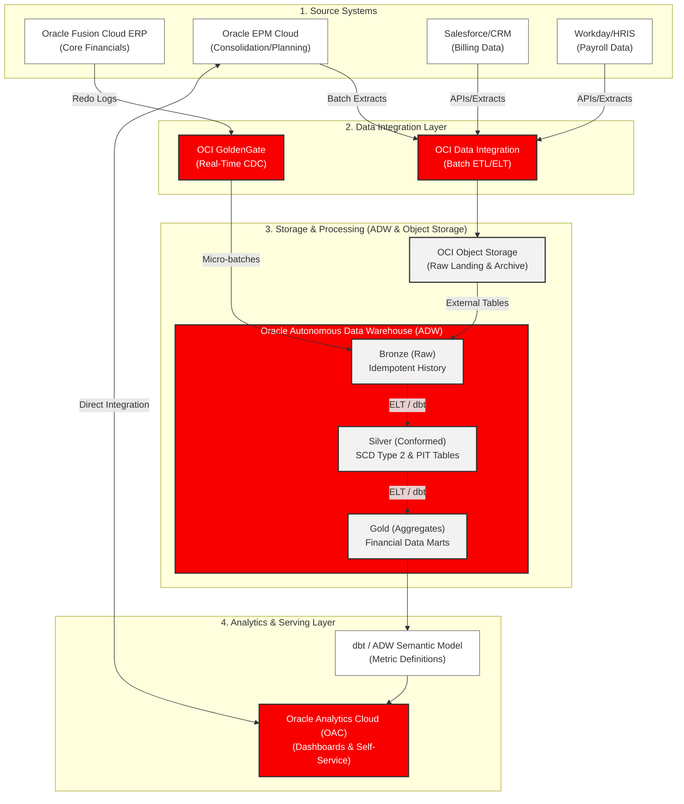

# Solution Architecture Document: Oracle Finance Data Warehouse

## 1. Executive Summary

This document outlines the Solution Architecture for a modern Finance & Accounting Data Warehouse built exclusively on Oracle Cloud Infrastructure (OCI) and Oracle Enterprise applications. 

The primary objective is to deliver a highly secure, audit-ready, and performant data platform that addresses the unique challenges of financial reporting—specifically, absolute data accuracy (double-entry balancing), strict regulatory compliance (SOX), complex temporal modeling (As-Was reporting), and the extreme performance demands of the month-end close cycle.

By leveraging an Oracle-native stack—centered around **Oracle Autonomous Data Warehouse (ADW)**, **Oracle Cloud Infrastructure (OCI) GoldenGate**, and **Oracle Analytics Cloud (OAC)**—this architecture provides a "single source of truth" that integrates seamlessly with Oracle Fusion Cloud ERP while minimizing operational overhead through autonomous database management.

---

## 2. Conceptual Architecture

The architecture follows a Medallion Lakehouse pattern, utilizing OCI Object Storage for raw data landing and archiving, while ADW serves as the primary analytical engine.

---

## 3. Component Deep-Dive

### 3.1 Data Ingestion Layer
* **OCI GoldenGate:** Serves as the backbone for integrating Oracle Fusion Cloud ERP. GoldenGate reads the database redo logs, enabling non-intrusive, real-time Change Data Capture (CDC). This ensures financial data is replicated to the warehouse with sub-second latency, avoiding the need for heavy batch extracts during the business day.
* **OCI Data Integration:** Used for orchestrating batch loads from non-Oracle auxiliary systems (e.g., Salesforce, Workday). It handles complex orchestrations and provides a visual interface for data flow design.

### 3.2 Storage & Processing Layer
* **OCI Object Storage:** Acts as the landing zone for external feeds, flat files, and historical archives. By leveraging OCI Object Storage Lifecycle Policies, we can retain immutable raw data for 7+ years to satisfy SOX requirements cost-effectively, while keeping ADW storage focused on active querying.
* **Oracle Autonomous Data Warehouse (ADW):** The core engine of the architecture. ADW automatically tunes itself, manages indexing, and scales compute dynamically. We implement a Medallion architecture inside ADW:
    * **Bronze:** Raw data ingestion tables. CDC pipelines are designed to be idempotent here, gracefully handling duplicate events.
    * **Silver:** The conformed layer where data is cleansed, standardized, and historical context is maintained (SCD Type 2).
    * **Gold:** Highly aggregated tables tailored for specific business domains (e.g., Monthly Trial Balance, AP Aging Summary).

### 3.3 Analytics and Serving Layer
* **Oracle Analytics Cloud (OAC):** Connects natively to ADW. OAC serves as the enterprise BI portal, providing self-service data visualization, AI-powered insights, and pixel-perfect operational reporting for finance users.
* **Oracle Enterprise Performance Management (EPM) Cloud:** While not technically part of the data warehouse compute, EPM is a critical architectural peer. Complex intercompany eliminations, financial close consolidation, and budgeting logic reside here. OAC connects directly to both ADW and EPM to provide unified reporting across transactional actuals and consolidated plans.

---

## 4. Addressing Finance-Specific Challenges

This Oracle-native architecture specifically mitigates the key challenges of financial data warehousing:

### 4.1 Precision and Single Source of Truth
* **Data Types:** Financial metrics in ADW strictly utilize the Oracle `NUMBER` data type (e.g., `NUMBER(19,4)`). Unlike floating-point types (`FLOAT`/`REAL`) which introduce rounding errors, the `NUMBER` type guarantees absolute arithmetic precision, crucial for double-entry balancing.
* **Exchange Rate Modeling:** Currency exchange rates are modeled in a dedicated `DimExchangeRate` table within the Silver layer, rather than embedded in fact tables. This allows OAC to dynamically calculate spot, average, and historical conversions on the fly.

### 4.2 Complex Temporal Modeling
* **Bi-Temporal Integrity:** The ADW data model supports bi-temporal tracking by default. Every record includes `Transaction_Date` (when the event occurred in the ERP) and `Load_Date` (when it arrived in ADW). This allows auditors to run precise "As-Of" and "As-Known-At" queries.
* **As-Was Reporting:** To support historical reporting structures (e.g., reporting previous quarter revenue using the previous quarter's Chart of Accounts hierarchy), the Silver layer relies heavily on **Slowly Changing Dimensions (SCD) Type 2** combined with Point-in-Time (PIT) tables to prevent query complexity for end-users.

---

## 5. Security, Governance, and Auditability

Financial systems require the highest levels of security and compliance.

### 5.1 SOX Compliance and IT General Controls (ITGC)
* **Segregation of Duties (SoD):** OCI Identity and Access Management (IAM) is used to strictly separate development and production roles. Developers cannot deploy code to the production ADW environment. Deployments are handled entirely by automated CI/CD pipelines (e.g., OCI DevOps) using restricted service principals.
* **Data Lineage:** Oracle Data Integrator and ADW maintain detailed metadata repositories. This allows auditors to trace a metric in an OAC dashboard all the way back to the originating ERP transaction.

### 5.2 Granular Access Control
* **Virtual Private Database (VPD) / Oracle Label Security (OLS):** ADW leverages Oracle's native security features to implement robust Row-Level Security (RLS) and Column-Level Security (CLS). Finance users will only see data corresponding to their assigned cost centers, legal entities, or regions.
* **Oracle Data Safe:** Deployed to continuously evaluate the security posture of the ADW, audit user activity, and optionally mask sensitive data (like payroll/HRIS feeds) in non-production environments.

---

## 6. Operational Best Practices: The Financial Close

The month-end close cycle creates massive spikes in query volume and concurrency.

* **Autonomous Auto-Scaling:** ADW is configured to automatically scale its OCPUs (Oracle Compute Units) up to 3x its base capacity during periods of high demand (the first 5 days of the month) and scale down afterward. This guarantees low latency for the finance team without paying for peak capacity 24/7.
* **Oracle Database Resource Manager (DBRM):** We utilize DBRM within ADW to implement strict Workload Management (WLM) queues. Scheduled close-cycle ELT jobs and EPM consolidation extracts are assigned to the `HIGH` consumer group, ensuring they are never starved of resources by ad-hoc analyst queries running in the `LOW` or `MEDIUM` groups.
* **Materialized Views:** To ensure OAC dashboards load instantly during the close, complex aggregations (e.g., Monthly P&L by Region) are pre-computed using ADW Materialized Views that are configured to refresh fast on commit or via scheduled jobs.
