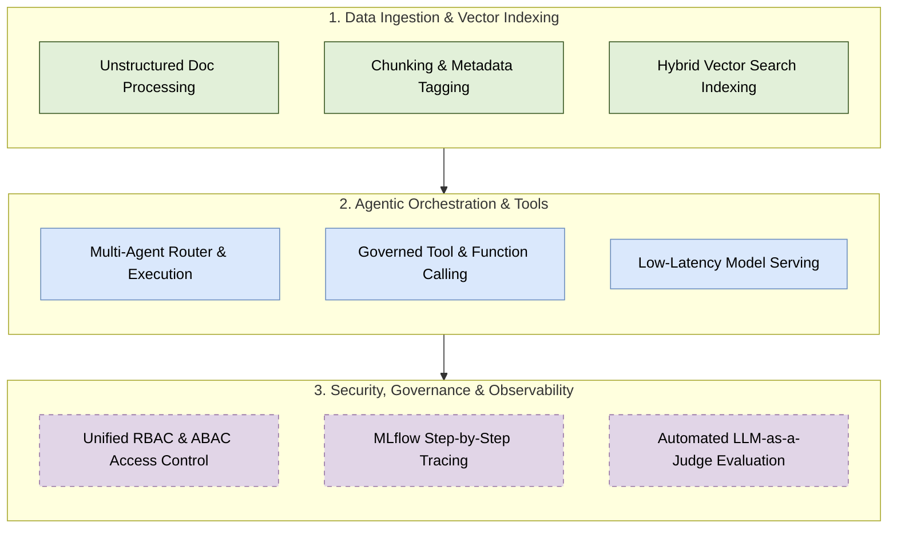

# Retrieval-Augmented Generation (RAG) & AI Agents Architecture

Welcome to the **RAG & AI Agents Architecture** module. This directory contains production-grade architecture blueprints, design patterns, and engineering guidelines for building scalable, secure, and observable RAG systems and autonomous AI Agents.

---

## 📚 Document Index

| Blueprint / Document | Primary Focus | Key Platform & Components |
| :--- | :--- | :--- |
| [Databricks Enterprise RAG & AI Agents](file:///Users/toanbui/dev/data_architect/rag/databricks_enterprise_rag_and_ai_agents.md) | End-to-End Enterprise Architecture | Databricks, Unity Catalog, Delta Live Tables, Databricks AI Search, Model Serving, MLflow 3.0, DABs |
| [Databricks Vector Search Architecture](file:///Users/toanbui/dev/data_architect/rag/databricks_vector_search_architecture.md) | Vector Search Engine Deep Dive | Databricks AI Search, Delta Sync Index, Managed Embeddings, Hybrid Search (HNSW + BM25) |
| [Data Engineering RAG Patterns](file:///Users/toanbui/dev/data_architect/rag/data_engineering_rag_patterns.md) | Data Engineer Perspective & DE Patterns | Auto Loader, DLT Parsing/Chunking, Delta CDF, Unity Catalog Functions (Data-as-a-Tool) |

---

## 🏗️ High-Level RAG & AI Agent Capability Map

> [!NOTE]
> All architectural documents in this directory are optimized for standard displays and small-screen e-ink readers (e.g., 7 to 8-inch BOOX Tab Mini devices).
