# Enterprise RAG & AI Agents: Data Engineer Perspective & Patterns

For **Data Engineers (DEs)**, building an Enterprise Retrieval-Augmented Generation (RAG) and AI Agent system shifts the focus from traditional tabular ETL to **Unstructured Data Pipeline Engineering**, **Semantic Data Modeling**, and **Data-as-a-Tool** engineering.

---

## 1. End-to-End Data Pipeline Architecture (Medallion RAG Pattern)

Data Engineers build RAG pipelines following an adapted **Medallion Architecture (Bronze -> Silver -> Gold)** on Delta Lake.

```mermaid
flowchart LR
    subgraph RawSources ["Landing Zone"]
        Files["Unstructured Docs <br>&#40;PDF, DOCX, HTML, JSON&#41;"]
    end

    subgraph BronzeLayer ["Bronze Layer"]
        AL["Auto Loader"] --> Vol["UC Volume: raw_docs"]
        Vol --> B_Tab["Bronze Delta: raw_text_stg <br>&#40;Raw Binary & File Path&#41;"]
    end

    subgraph SilverLayer ["Silver Layer"]
        B_Tab --> DLT_Parse["DLT Parsing & Chunking <br>&#40;Unstructured.io / PySpark UDF&#41;"]
        DLT_Parse --> S_Tab["Silver Delta: parsed_chunks <br>&#40;Chunk, Metadata, CDF Enabled&#41;"]
    end

    subgraph GoldLayer ["Gold Layer & Tools"]
        S_Tab --> VIdx["Databricks AI Search <br>&#40;Delta Sync Index&#41;"]
        S_Tab --> G_Tab["Gold Delta: feature_store_embeddings"]
        SQL_Tab["Structured Enterprise Tables"] --> UCFn["Unity Catalog Functions <br>&#40;Agent SQL Tools&#41;"]
    end

    Files --> AL

    classDef rawStyle fill:#f5f5f5,stroke:#666,stroke-width:1px,color:#000;
    classDef bronzeStyle fill:#ffe6cc,stroke:#d79b00,stroke-width:1px,color:#000;
    classDef silverStyle fill:#dae8fc,stroke:#6c8ebf,stroke-width:1px,color:#000;
    classDef goldStyle fill:#e2f0d9,stroke:#385723,stroke-width:1px,color:#000;
    class Files rawStyle;
    class AL,Vol,B_Tab bronzeStyle;
    class DLT_Parse,S_Tab silverStyle;
    class VIdx,G_Tab,SQL_Tab,UCFn goldStyle;
```



---

## 2. Core Responsibilities of the Data Engineer in RAG

| Phase | Data Engineering Responsibility | Primary Databricks Tools |
| :--- | :--- | :--- |
| **1. Ingestion** | Ingest unstructured files incrementally with schema evolution & checkpointing. | Auto Loader, Unity Catalog Volumes |
| **2. Parsing & Extraction** | Extract clean text, headers, images, and tables from complex documents. | PySpark UDFs, `unstructured`, `pdfplumber` |
| **3. Chunking & Enrichment** | Split text into optimal chunks; attach security & lineage metadata. | Delta Live Tables (DLT), LangChain splitters |
| **4. Vector Sync** | Expose Silver Delta tables to Vector Search engine via Change Data Feed (CDF). | Databricks AI Search (Delta Sync Index) |
| **5. Data-as-a-Tool** | Package structured SQL queries as governed functions for AI Agents. | Unity Catalog SQL & Python Functions |
| **6. Quality & Operations** | Enforce data quality expectations, prevent stale indexes, and audit telemetry. | DLT Expectations, Lakehouse Monitoring |

---

## 3. Detailed Data Pipeline Pattern (Step-by-Step)

### Step 1: Incremental Ingestion with Auto Loader
Data Engineers use Auto Loader to continuously ingest new files arriving in S3/ADLS into governed **Unity Catalog Volumes**.

```python
# Bronze DLT Pipeline: Ingest Raw Files
import dlt
from pyspark.sql.functions import input_file_name, current_timestamp()

@dlt.table(
    name="bronze_raw_documents",
    comment="Incremental raw file ingestion checkpointed by Auto Loader"
)
def bronze_raw_documents():
    return (
        spark.readStream
        .format("cloudFiles")
        .option("cloudFiles.format", "binaryFile")
        .load("/Volumes/main/rag_stage/raw_landing/")
        .select(
            input_file_name().alias("file_path"),
            "content",
            current_timestamp().alias("ingested_at")
        )
    )
```

---

### Step 2: Parsing & Chunking in Silver DLT
Extract text paragraphs and attach critical metadata (`document_id`, `page_number`, `tenant_id`, `access_group`).

```python
# Silver DLT Pipeline: Parse, Chunk, and Enforce Data Quality
from langchain_text_splitters import RecursiveCharacterTextSplitter
from pyspark.sql.functions import udf, col, explode
from pyspark.sql.types import ArrayType, StringType

@udf(returnType=ArrayType(StringType()))
def chunk_text_udf(text_content):
    if not text_content:
        return []
    splitter = RecursiveCharacterTextSplitter(chunk_size=500, chunk_overlap=50)
    return splitter.split_text(text_content)

@dlt.table(
    name="silver_parsed_chunks",
    comment="Parsed chunks with CDF enabled for Vector Search auto-sync"
)
@dlt.expect_or_drop("valid_chunk", "chunk_text IS NOT NULL AND length(chunk_text) > 10")
def silver_parsed_chunks():
    return (
        dlt.read_stream("bronze_raw_documents")
        # Extract text via PySpark UDF or parsing engine
        .withColumn("chunks", chunk_text_udf(col("content").cast("string")))
        .select(
            col("file_path").alias("document_id"),
            explode(col("chunks")).alias("chunk_text"),
            col("ingested_at")
        )
    )
```

---

### Step 3: Delta Change Data Feed (CDF) & Vector Index Sync
Data Engineers enable **Change Data Feed (CDF)** on the Silver Delta table so **Databricks AI Search** can listen for incremental changes:

```sql
-- Enable Change Data Feed on Silver Table
ALTER TABLE main.rag_db.silver_parsed_chunks 
SET TBLPROPERTIES (delta.enableChangeDataFeed = true);
```

Then create the **Delta Sync Index** using `VectorSearchClient`:
```python
from databricks.vector_search.client import VectorSearchClient

client = VectorSearchClient()

client.create_delta_sync_index(
    endpoint_name="prod_search_endpoint",
    index_name="main.rag_db.parsed_chunks_index",
    source_table_name="main.rag_db.silver_parsed_chunks",
    pipeline_type="TRIGGERED",
    primary_key="chunk_id",
    embedding_source_column="chunk_text",
    embedding_model_endpoint_name="databricks-bge-large-en"
)
```

---

## 4. "Data-as-a-Tool" Pattern for AI Agents

AI Agents do not just search vector databases; they also query structured analytical databases (Text-to-SQL / SQL Analyst Agent).

Data Engineers create **Unity Catalog Functions** that encapsulate SQL queries, aggregations, and business logic into safe, governed tools for AI Agents:

```sql
-- Unity Catalog Function: Governed Data Tool for AI Agents
CREATE OR REPLACE FUNCTION main.sales_analytics.get_customer_metrics(
  customer_id STRING,
  start_date DATE
)
RETURNS TABLE (
  total_spend DOUBLE,
  transaction_count INT,
  risk_score STRING
)
COMMENT 'Retrieves calculated financial metrics for a customer. Used by AI Agents.'
RETURN 
  SELECT 
    SUM(amount) AS total_spend,
    COUNT(1) AS transaction_count,
    MAX(risk_flag) AS risk_score
  FROM main.sales_analytics.fact_transactions
  WHERE cust_id = customer_id AND tx_date >= start_date;
```

```sql
-- Grant execute permission to the Agent Service Principal
GRANT EXECUTE ON FUNCTION main.sales_analytics.get_customer_metrics TO `agent_service_principal`;
```

---

## 5. Summary Checklist for Data Engineers

1. **Ingest Incrementally**: Always use Auto Loader + Unity Catalog Volumes for unstructured file intake.
2. **Chunk Smartly**: Use Recursive or Semantic chunking; preserve section headings and table structures.
3. **Tag Metadata**: Include security attributes (`tenant_id`, `user_group`) in Silver chunk tables for vector metadata payload filtering.
4. **Enable Delta CDF**: Enable `delta.enableChangeDataFeed = true` on chunk tables to drive Databricks AI Search auto-sync.
5. **Build UC Tool Functions**: Convert complex analytical SQL queries into Unity Catalog Functions so AI Agents can securely query Gold data.
6. **Automate via DABs**: Package DLT pipelines, Vector Search indexes, and UC Functions into **Databricks Asset Bundles (DABs)** for CI/CD deployment.
