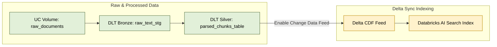
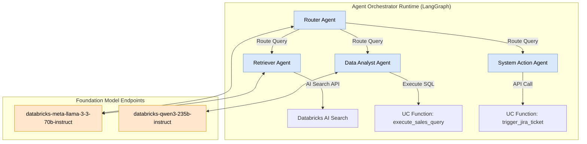

# Enterprise RAG & AI Agents Architecture on Databricks

This design document outlines the end-to-end production architecture for **Enterprise Retrieval-Augmented Generation (RAG)** and **Autonomous AI Agents** leveraging the **Databricks Data Intelligence Platform**.

---

## 1. Executive Summary & Architecture Overview

The enterprise AI stack on Databricks unifies unstructured data ingestion, vector indexing, foundation model serving, agentic orchestration, security governance, and operational observability into a single platform.

```mermaid
flowchart TD
    subgraph DataPlane ["Data Ingestion & Indexing Plane"]
        direction TB
        Docs["Unstructured Docs <br>&#40;PDF, DOCX, HTML&#41;"] --> AL["Auto Loader <br>&#40;UC Volumes&#41;"]
        AL --> DLT["Delta Live Tables <br>&#40;Parse & Chunking&#41;"]
        DLT --> Delta["Delta Lake Table <br>&#40;Chunks & Embeddings&#41;"]
        Delta --> VS["Databricks AI Search <br>&#40;Delta Sync Index&#41;"]
    end

    subgraph AgentPlane ["Agent Execution & Serving Plane"]
        direction TB
        Client["Client Applications <br>&#40;Chat UI, APIs&#41;"] --> Guard["Unity AI Gateway <br>&#40;AI Guardrails&#41;"]
        Guard --> Serv["Databricks Model Serving <br>&#40;Serverless Agent Runtime&#41;"]
        Serv <--> Agent["LangGraph / Multi-Agent Engine"]
        Agent <--> Tools["Unity Catalog Functions <br>&#40;SQL, Python Tools&#41;"]
        Agent <--> VS
        Serv <--> LLM["Foundation Model APIs <br>&#40;Pay-per-token / Provisioned&#41;"]
    end

    subgraph GovPlane ["Governance & Observability Plane"]
        direction TB
        UC["Unity Catalog <br>&#40;Unified RBAC/ABAC&#41;"]
        MLF["MLflow 3.0 Tracing"]
        Eval["Mosaic AI Agent Evaluation"]
        LM["Lakehouse Monitoring <br>&#40;Inference Tables&#41;"]
    end

    DataPlane --> UC
    AgentPlane --> UC
    AgentPlane --> MLF
    MLF --> Eval
    Serv --> LM

    classDef dataStyle fill:#e2f0d9,stroke:#385723,stroke-width:1px,color:#000;
    classDef agentStyle fill:#dae8fc,stroke:#6c8ebf,stroke-width:1px,color:#000;
    classDef govStyle fill:#e1d5e7,stroke:#9673a6,stroke-width:1px,color:#000,stroke-dasharray: 5 5;
    class Docs,AL,DLT,Delta,VS dataStyle;
    class Client,Guard,Serv,Agent,Tools,LLM agentStyle;
    class UC,MLF,Eval,LM govStyle;
```

---

## 2. Ingestion & Vector Indexing Architecture

Data preparation for enterprise RAG relies on **Delta Live Tables (DLT)** for scalable parsing and **Databricks AI Search** (formerly Mosaic AI Vector Search) for real-time vector indexing.

### Key Components:

1. **Auto Loader & UC Volumes**:
   - Ingests raw unstructured files (PDFs, Office docs, JSON, images) from S3/ADLS landing zones into governed **Unity Catalog Volumes**.
2. **Chunking & Parsing via DLT**:
   - DLT pipelines execute PySpark jobs using parsing libraries (e.g., `unstructured`, `pdfplumber`, or PySpark UDFs).
   - Generates chunked paragraphs with metadata (`document_id`, `page_number`, `access_group_id`, `updated_timestamp`).
3. **Databricks AI Search (Delta Sync Index)**:
   - Synchronizes automatically with the underlying Delta table using Delta Lake's **Change Data Feed (CDF)**.
   - Supports **Managed Embeddings** (Databricks automatically calls embedding endpoints such as `databricks-bge-large-en` or custom models on table updates) or **Self-Managed Embeddings**.
4. **Hybrid Search Index**:
   - Vector indexes are configured with **Hybrid Search** combining dense vector similarity (HNSW) with sparse full-text keyword matching (BM25) for high precision retrieval.

---

## 3. Agentic Orchestration & Tool Calling Architecture

Complex enterprise workflows require multi-agent orchestration (e.g., LangGraph, AutoGen, or CrewAI) integrated directly with Databricks Model Serving.

### Agentic Patterns & UC Functions:

- **Unity Catalog Functions as AI Tools**:
  - Python and SQL functions registered in Unity Catalog (`main.ai_tools.execute_sales_query`) serve as governed tools that agents can inspect and invoke dynamically via function calling.
  - UC controls execute privileges (`GRANT EXECUTE ON FUNCTION ...`).
  - Use the `UCFunctionToolkit` from the `databricks-langchain` package to wrap UC functions into LangGraph-compatible tools.
- **Model Context Protocol (MCP) Servers**:
  - For complex, dynamic, or highly flexible external integrations (e.g., third-party APIs, browser tools), agents can connect to **MCP servers** as an alternative tooling pattern.
  - **Guideline**: Use UC Functions for structured data retrieval with well-defined parameters; use MCP for dynamic or exploratory tool interactions.
- **Deploying Agents to Model Serving**:
  - Agents are wrapped using the **`mlflow.pyfunc.ResponsesAgent`** interface — the recommended production standard for 2026. This provides built-in multi-turn state management, OpenAI Responses API compatibility, and deep integration with AI Playground, Agent Evaluation, and Databricks Apps.
  - Legacy `pyfunc` and `langchain` MLflow flavors are still supported but lack automatic observability and governance integration.
  - Deployed to **Databricks Serverless Model Serving** with automatic scaling, secret management (Databricks Secrets), and environment isolation.

---

## 4. Enterprise Governance & Security Architecture

Security across data, models, and tools is enforced centrally through **Unity Catalog**.

```mermaid
flowchart TD
    subgraph Governance ["Unity Catalog Security Boundary"]
        direction TB
        UC_Vol["UC Volumes <br>&#40;Unstructured Files&#41;"]
        UC_Tab["Delta Tables <br>&#40;Chunks & Metadata&#41;"]
        UC_Idx["Vector Search Index"]
        UC_Fn["UC Functions <br>&#40;Agent Tools&#41;"]
        UC_Mod["MLflow Models <br>&#40;Agent Artifacts&#41;"]
    end

    subgraph SecurityMechanisms ["Fine-Grained Access Control"]
        ABAC["Attribute-Based Access Control <br>&#40;Tags & ABAC Policies&#41;"]
        RLS["Row-Level Security <br>&#40;Filter by user_group&#41;"]
        Mask["Column Masking <br>&#40;Mask PII / SSN&#41;"]
    end

    Governance --- SecurityMechanisms

    classDef ucStyle fill:#e1d5e7,stroke:#9673a6,stroke-width:1px,color:#000,stroke-dasharray: 5 5;
    class UC_Vol,UC_Tab,UC_Idx,UC_Fn,UC_Mod,ABAC,RLS,Mask ucStyle;
```

### Security Controls:

1. **End-to-End Governance**:
   - Unity Catalog governs access to Delta tables, raw volumes, vector search endpoints, registered models, and UC tool functions using unified `GRANT` statements.
2. **Metadata Payload Filtering & Row-Level Security**:
   - Vector queries respect security attributes. Filters like `tenant_id = 'acme'` or `user_group IN ('finance')` are passed during vector search queries to restrict retrieval strictly to authorized data.
3. **Unity AI Gateway & AI Guardrails**:
   - The **Unity AI Gateway** (formerly Mosaic AI Gateway) acts as a centralized governance and routing layer for all AI model traffic, providing access control, rate limiting, payload logging, and cost monitoring.
   - **AI Guardrails** are enforcement rules configured **per Model Serving endpoint** within the Gateway. They inspect request/response payloads in real-time to sanitize input prompts, detect prompt injection attacks (e.g., via Llama Guard), filter PII, and block toxic outputs.
   - Note: Enabling AI Guardrails consumes additional Model Serving DBUs, as each payload is processed by a secondary scanner model.

---

## 5. Observability, Tracing & Continuous Evaluation

Production GenAI systems require continuous observability and evaluation to measure retrieval relevance, generation quality, and system latency.

```mermaid
flowchart LR
    subgraph Execution ["Model Serving Runtime"]
        Req[User Request] --> AgentServ[Agent Endpoint]
        AgentServ --> Resp[Response]
    end

    subgraph Telemetry ["Observability Pipeline"]
        AgentServ -->|Log Spans| Tracing[MLflow 3.0 Tracing]
        AgentServ -->|Auto Capture| InfTable[Inference Tables]
    end

    subgraph Evaluation ["Evaluation & Monitoring"]
        Tracing --> Eval[Mosaic AI Agent Evaluation <br>&#40;LLM-as-a-Judge&#41;]
        InfTable --> LM[Lakehouse Monitoring <br>&#40;Latency, Drift, Cost&#41;]
    end

    classDef execStyle fill:#dae8fc,stroke:#6c8ebf,stroke-width:1px,color:#000;
    classDef telemStyle fill:#fff2cc,stroke:#d6b656,stroke-width:2px,color:#000;
    classDef evalStyle fill:#f5f5f5,stroke:#666,stroke-width:1px,color:#000,stroke-dasharray: 5 5;
    class Req,AgentServ,Resp execStyle;
    class Tracing,InfTable telemStyle;
    class Eval,LM evalStyle;
```

### Tracing & Metrics:

- **MLflow 3.0 Tracing**:
  - Automatically captures spans for nested multi-agent steps, prompt templates, vector search query latencies, model calls, and tool execution parameters.
- **Mosaic AI Agent Evaluation (CLEARS Rubric)**:
  - Evaluates performance using automated **LLM-as-a-Judge** models across the **CLEARS** production rubric:
    - **Correctness**: Is the answer factually accurate?
    - **Latency**: Does the agent respond within SLA thresholds?
    - **Execution**: Did tool calls and retrieval steps execute successfully?
    - **Adherence**: Is the response grounded strictly in retrieved context (faithfulness)?
    - **Relevance**: Did the agent directly address the user's prompt?
    - **Safety**: Is the output free from toxic, harmful, or PII-leaking content?
  - Supports customizable judges via **Agent-as-a-Judge**, **Tunable Judges**, and **Judge Builder** for business-specific evaluation criteria.
  - Engineers can build evaluation datasets directly from production traces for continuous improvement loops.
- **Inference Tables & Lakehouse Monitoring**:
  - Every payload sent to Model Serving endpoints is logged to a managed Delta **Inference Table**.
  - **Lakehouse Monitoring** monitors inference tables for cost/token consumption, request drift, error rates, and response latency SLAs.

---

## 6. Production LLMOps & CI/CD Deployment Strategy

Deploying Enterprise RAG and AI Agents across environments (Dev, Staging, Prod) uses **Databricks Asset Bundles (DABs)**.

```mermaid
flowchart TD
    subgraph Repo ["Git Repository"]
        DAB["databricks.yml <br>&#40;Databricks Asset Bundle&#41;"]
        Code["Agent Code & DLT Pipelines"]
    end

    subgraph Pipeline ["CI/CD Automation (GitHub Actions / Azure DevOps)"]
        Validate["dab validate"]
        DeployStg["dab deploy -e staging"]
        Test["Run Agent Evaluation Suite"]
        DeployProd["dab deploy -e prod"]
    end

    DAB --> Validate --> DeployStg --> Test --> DeployProd

    classDef ciStyle fill:#e2f0d9,stroke:#385723,stroke-width:1px,color:#000;
    class DAB,Code,Validate,DeployStg,Test,DeployProd ciStyle;
```

### CI/CD Workflow:

1. **Declarative Configuration**:
   - `databricks.yml` defines all pipeline resources: DLT pipelines, Vector Search indexes, UC Functions, MLflow Experiments, and Model Serving endpoints.
2. **Automated Testing & Promotion**:
   - Pull requests trigger automated unit tests and agent quality checks against benchmark evaluation datasets.
   - Upon merge, DABs deploy updated pipelines and serving endpoints to Production zero-downtime endpoints.
